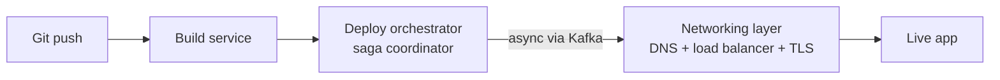
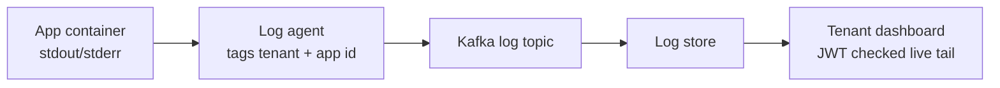

# Pallet, project brief (v0.1)

A self built platform as a service, used as a learning vehicle for distributed systems patterns. Built in public, one service at a time.

Status: design stage, no code written yet. This document is the starting point for the detailed system design that follows it.

## Contents

- [What this is](#what-this-is)
- [Why this project](#why-this-project)
- [Core concepts and where they live](#core-concepts-and-where-they-live)
- [Architecture overview](#architecture-overview)
- [Tech stack](#tech-stack)
- [Microservices catalog](#microservices-catalog)
- [Events and messaging](#events-and-messaging)
- [Multi-tenancy, identity and security](#multi-tenancy-identity-and-security)
- [Tenant-facing features](#tenant-facing-features)
- [Repository and environment structure](#repository-and-environment-structure)
- [Local development](#local-development)
- [CI/CD](#cicd)
- [Build roadmap](#build-roadmap)
- [Open source and licensing](#open-source-and-licensing)
- [Open questions and next steps](#open-questions-and-next-steps)

## What this is

Pallet is a smaller version of what Render, Fly.io, or Vercel do: a developer connects a Git repository, pushes code, and the platform builds it, deploys it, and hands back a live URL with TLS already configured. Underneath that pitch, it's a testbed for distributed systems patterns. The deployment pipeline runs on the saga pattern. Services talk to each other through an event backbone built on Kafka. Every call to something outside Pallet's control (GitHub, a DNS provider, Paystack, an ACME server) goes through retries, timeouts, and a circuit breaker. Keycloak handles identity across every tenant. Every request gets traced end to end. Prometheus and Grafana watch the whole thing, and Paystack handles real subscription billing.

## Why this project

Two things mattered when picking what to build: proving out these patterns in something real, and having a reason for each pattern to exist instead of bolting it on for show. An e-commerce clone was the obvious first idea and got dropped for exactly that reason. Carts and checkouts don't need deep networking work, and the internet already has hundreds of e-commerce microservice demos. A PaaS does the opposite. Reverse proxying, DNS automation, and certificate issuance aren't side features here, they're the product. The saga pattern isn't a toy example either, it's how a deployment actually has to work once six separate services each own one step of it and any step can fail.

## Core concepts and where they live

| Concept | Where it lives | Technology |
|---|---|---|
| Saga pattern | `deploy-orchestrator-service` runs the deployment saga; `billing-service` runs a payment and provisioning saga | Hand rolled state machine over Kafka commands and events |
| Event backbone | Every service that produces or reacts to a platform event | Apache Kafka, `spring-kafka` |
| Edge routing and config | `api-gateway`, `config-server` | Spring Cloud Gateway, Spring Cloud Config Server |
| Retries, timeouts, circuit breakers | Calls to GitHub, the container registry, ACME, the DNS provider, Paystack | Resilience4j |
| Identity and multi-tenancy | `identity-service`, `org-team-service`, and every service that checks the org claim on a token | Keycloak, Spring Security OAuth2 |
| Distributed tracing | Every service | Micrometer Tracing, OpenTelemetry, Jaeger or Grafana Tempo |
| Payments | `billing-service` | Paystack |
| Metrics and dashboards | `metrics-service`, plus an Actuator endpoint on every service | Prometheus, Grafana, Micrometer |
| Deep networking | `ingress-config-service`, `dns-service`, `tls-service`, `traffic-routing-service` | Traefik or Contour, cert-manager, Argo Rollouts, DNS provider APIs, SNI based routing |
| DevOps and platform engineering | The `platform-infra` repository and the deploy pipeline itself | Terraform, Helm, ArgoCD, GitHub Actions |

## Architecture overview

A deployment moves through two phases. The first is synchronous: a push arrives, gets built, and hands off to the orchestrator. The second is asynchronous, driven by Kafka: the orchestrator configures DNS, the load balancer, and TLS, checks health, and only then marks the app live. If any step in the second phase fails, the orchestrator issues compensating commands instead of leaving the deployment half finished, deregistering a load balancer target, rolling back a DNS record, or tearing down a container that never passed its health check.



Logs work similarly, and it's the same event backbone doing the work. A log agent on each node tags every line with the tenant and app it belongs to, publishes it to Kafka, and a log service persists it and streams it live to the tenant's dashboard, but only after checking that the requester's token actually belongs to that tenant.



## Tech stack

On the language and build side: Java 21, Spring Boot 4.1, and a Maven multi-module reactor tying all 24 services together under one parent POM. The parent POM is what keeps Spring Boot, Spring Cloud, Resilience4j, and Micrometer versions in sync across every service instead of drifting apart one dependency bump at a time. Spring Boot 4.1 pairs with Spring Cloud 2025.1.2 (Oakwood); earlier Spring Cloud releases don't run against it. Boot 4's modular starters mean several dependency names differ from the 3.x examples most of the internet is still written against, `spring-boot-starter-webmvc` rather than `-web`, `spring-boot-starter-security-oauth2-resource-server` rather than `-oauth2-resource-server`, `spring-boot-starter-aspectj` rather than `-aop`, and Jackson 3 moves databind types to `tools.jackson.*` while leaving annotations under `com.fasterxml.jackson.annotation`. `docs/adr/0005-java-21-spring-boot-4.md` has the full list.

For networking and resilience: `spring-cloud-gateway` at the edge, `spring-boot-starter-kafka` (Boot's managed wrapper over `spring-kafka`) for the event backbone, and Resilience4j for circuit breakers, retries, and timeouts. Resilience4j is the right pick here over Netflix's Hystrix, which stopped receiving updates a few years ago.

For identity: `spring-boot-starter-security-oauth2-resource-server` and its client counterpart against Keycloak, plus the Keycloak Admin Client for provisioning tenants programmatically instead of by hand. The resource-server baseline (a secure-by-default filter chain, Keycloak realm-role mapping, and an `OrgContext` helper for the `org_id` claim check) lives in `platform-common-security` so every service gets it by depending on one module.

For observability: Micrometer Tracing, the Spring Boot 3 replacement for Sleuth, exporting spans via OTLP to an OpenTelemetry Collector, which forwards them to Jaeger or Grafana Tempo. Metrics come from Micrometer plus `micrometer-registry-prometheus`, exposed through Actuator and visualized in Grafana.

For configuration and secrets: Spring Cloud Config Server early on, moving to Kubernetes ConfigMaps and Secrets once the platform actually runs on Kubernetes, and Spring Cloud Vault for anything genuinely sensitive along the way.

For service discovery: DNS based discovery throughout, Docker Compose's built in DNS by service name during local development, then Kubernetes DNS once the platform runs on a cluster. No Eureka or other registry service in between.

For testing: Testcontainers (2.x, whose module artifact ids now all carry a `testcontainers-` prefix) wherever integration tests touch Kafka, Postgres, ClickHouse, or Keycloak, since mocking those away would hide the exact failure modes this project is meant to explore. Unit tests are named `*Test` and run under Surefire; integration tests are `*IntegrationTest` and run under Failsafe at the `verify` phase.

For infrastructure: Docker, Kubernetes, Helm, Terraform, and ArgoCD for the GitOps handoff described later in this document. Kubernetes doubles as the orchestration layer for tenant workloads themselves, not just the platform's own services, running each tenant app as a namespaced `Deployment`. `cert-manager` handles ACME and Let's Encrypt certificate issuance and renewal in-cluster, and Argo Rollouts drives blue/green and canary rollouts as a native controller instead of a hand rolled traffic shifter. Tenant workloads can land on either of two registered clusters, an EKS cluster in AWS or a GKE cluster in GCP, with a tenant picking which cloud their app runs in at creation time; Pallet's own control-plane services run in a single place regardless of that choice.

## Microservices catalog

Twenty four services, grouped by what part of the system they own.

### Platform infrastructure

`api-gateway` is the single entry point for tenant-facing API and dashboard traffic, built on `spring-cloud-gateway`. It validates tokens at the edge, routes requests to the right backend service, and is the first natural home for per-org rate limiting once a tenant's plan needs enforcing. Routing to backend services relies on DNS based discovery, Docker Compose service names locally and Kubernetes DNS in the cluster, so there's no registry service to keep in sync.

`config-server` is the Spring Cloud Config Server, centralizing configuration for every service in the reactor. Per the tech stack notes above, this is a starting point, not the end state, it's meant to be replaced by Kubernetes ConfigMaps and Secrets once the platform runs on Kubernetes, with Spring Cloud Vault covering anything sensitive along the way.

### Identity and tenancy

`identity-service` wraps Keycloak. It issues and validates tokens for the dashboard and the API, and provisions a tenant's identity when an organization signs up.

`org-team-service` owns organizations, teams, projects, and membership, and maps Keycloak roles (owner, admin, developer, viewer) to what a user can actually do inside a given org. It also stores which cloud provider and region an app is deployed to, a choice made once at app creation, which flows into the deploy saga as an input `scheduler-service` resolves against the cluster registry.

`audit-log-service` consumes an `audit.event.recorded` stream from every other service and keeps an immutable record of who did what, stored in ClickHouse rather than Postgres from the start, since the workload is append-only, write-heavy, and almost always queried over a time range. Useful for compliance, and just as useful for answering "who changed this deployment" during debugging.

### Source and build pipeline

`git-integration-service` handles the GitHub or GitLab OAuth app, receives push webhooks, and talks to the provider's API for repo metadata. This is the first place retries and a circuit breaker matter, since GitHub's API has rate limits and the occasional outage that has nothing to do with Pallet.

`build-queue-service` consumes `git.push.received` events and decides build priority and concurrency per org before handing jobs to `build-service`. This is where backpressure gets handled instead of every push landing straight in a build queue with no limit.

`build-service` runs the actual build, using Cloud Native Buildpacks or a Dockerfile, tags the resulting image, and pushes it to the registry. It publishes `build.started`, `build.succeeded`, and `build.failed` events, and streams build output live for the tenant-facing logs.

`registry-service` owns image metadata: tags, digests, size, and a hook point for vulnerability scanning later. The image bytes themselves live in a registry like Docker's own or Harbor; this service is the metadata and policy layer sitting on top.

### Deployment and networking

`deploy-orchestrator-service` is the saga coordinator. It owns the state machine for a deployment (queued, building, pushing, provisioning, routing, health checking, live, failed, rolled back) and issues the compensating commands described in the architecture section above when a downstream step fails. Each saga step acts through the Kubernetes API of whichever cluster `scheduler-service` resolved for that deployment, AWS or GCP, creating or patching a `Deployment`, `Service`, and `Ingress` for the tenant app; compensating actions are the same API calls in reverse, deleting or reverting whatever resource a failed step created. Talking to more than one cluster means holding a Fabric8 client per registered cluster instead of a single hardcoded one, and treating a cloud provider's API, same as GitHub's or ACME's, as a call that goes through Resilience4j's retries and circuit breaker. This is the piece that would graduate from a plain API client into a proper Kubernetes controller, with a `PalletApp` CRD and a reconciliation loop, if the operator pattern is worth demonstrating on its own later.

`scheduler-service` no longer places workloads itself, since Kubernetes' own scheduler handles bin packing and node placement. What's left is translating a tenant's resource plan into `resources.requests` and `limits` on the pod spec, and optionally into node selectors or taints so higher tiers land on dedicated node pools. It also owns the cluster registry, cloud provider, region, API endpoint, and credential reference for each registered cluster, and resolves which cluster a given deployment targets from the tenant's chosen cloud provider or a plan tier default.

`ingress-config-service` creates the Kubernetes `Ingress` (or Gateway API `HTTPRoute`) object for a new deployment, which an in-cluster ingress controller, Traefik or Contour, picks up to configure the virtual host and SNI based TLS termination. No config files get pushed by hand; the ingress controller reconciles off the Kubernetes API the same way any other controller does. The load balancer backing that ingress differs by cloud, an AWS NLB or ALB on the EKS cluster, a Cloud Load Balancer on the GKE cluster, but this service only ever talks to the `Ingress` object; the cloud specific provisioning is the ingress controller's problem, not this one's.

`dns-service` automates DNS records, both for the platform's own wildcard subdomains and for any custom domain a tenant attaches, against a provider API. It triggers off the `Ingress` or `Service` for a deployment receiving an external address from the cluster's load balancer, AWS or GCP, whichever cloud that deployment landed on, rather than being told the address directly by the orchestrator.

`tls-service` delegates the actual ACME workflow to `cert-manager` running in-cluster, which issues a `Certificate` resource per domain and handles the retry and backoff logic that ACME's rate limits make necessary. This service's own job narrows to requesting a certificate for a custom domain a tenant attaches and watching that `Certificate`'s status, rather than driving ACME directly.

`traffic-routing-service` is built on Argo Rollouts, a Kubernetes native progressive delivery controller, rather than a hand rolled weight shifter. It defines the rollout strategy, blue/green or canary, and feeds `metrics-service`'s Prometheus data into an Argo Rollouts `AnalysisRun` so promotion or automatic rollback between deployment versions is driven by real request latency and error rate instead of a fixed timer.

`health-check-service` no longer needs to run pod level liveness probes itself, since Kubernetes already restarts unhealthy pods on its own. Its job is aggregating that signal up to deployment level health, whether a new version's replicas ever collectively became Ready, and combining it with passive signals from `metrics-service` to feed the orchestrator's rollback decisions and the platform's own circuit breakers. It plays the same role Argo Rollouts' analysis step plays for a single rollout, but at the scope of the whole deployment.

`autoscaler-service` is implemented as a Kubernetes `HorizontalPodAutoscaler` per tenant deployment, driven by custom metrics served through the Prometheus Adapter off `metrics-service`'s data, scaling replica counts within the tenant's plan limits instead of a hand rolled polling loop.

### Observability

`log-service` consumes tagged container output off Kafka, writes it to a log store, and exposes a live tail endpoint that checks the caller's token against the org that owns the log line before streaming anything.

`metrics-service` aggregates and exposes Prometheus metrics, both platform wide (deploy latency, build success rate) and per tenant (request latency and error rate for their own app).

`tracing-collector` is the OpenTelemetry Collector, receiving spans from every service and forwarding them to Jaeger or Tempo. It's not custom code, but it earns a place in this list because the whole point of tracing is watching one request cross a dozen service boundaries, and this is the piece that makes that possible.

### Billing and platform operations

`billing-service` integrates with Paystack for subscription checkout and webhook handling. Every webhook gets processed idempotently, since Paystack, like most payment providers, will retry a webhook delivery, and double charging or double provisioning on a retry is exactly the kind of bug this project exists to catch before it happens for real.

`usage-metering-service` meters compute time, bandwidth, and log retention per org, and periodically emits `usage.recorded` events that `billing-service` turns into invoices. Like `audit-log-service`, it stores its raw metering data in ClickHouse from the start, since per-org usage is high-cardinality time-series data that Postgres would only handle with heavy partitioning and rollup tables.

`secrets-service` stores environment variables and secrets per app, backed by Vault, and injects them into containers at deploy time instead of baking them into images. It also stores the credentials for each registered cluster, an AWS IAM role for EKS or a GCP service account key for GKE, the same way it stores a tenant's own secrets, so `deploy-orchestrator-service` never holds cloud credentials directly.

`notification-service` consumes events from across the platform (build failures, deploy state changes, billing events) and routes them to email, Slack, or a webhook the tenant configured.

## Events and messaging

Topic names follow `domain.fact`, written in the past tense: something that already happened, not an instruction. A rollback trigger still gets modeled as an event with one intended consumer rather than a synchronous request, so the orchestrator never blocks waiting on an answer.

| Topic | Producer | Key consumers | Payload highlights |
|---|---|---|---|
| `git.push.received` | git-integration-service | build-queue-service | repo, branch, commit sha, org id |
| `build.started` | build-service | deploy-orchestrator-service, log-service, notification-service | build id, app id |
| `build.succeeded` | build-service | deploy-orchestrator-service, registry-service | build id, image tag, digest |
| `build.failed` | build-service | deploy-orchestrator-service, notification-service | build id, error message |
| `deploy.step.completed` | deploy-orchestrator-service | log-service, metrics-service | deployment id, step name, duration |
| `deploy.state.changed` | deploy-orchestrator-service | notification-service, log-service | deployment id, from state, to state |
| `deploy.rollback.triggered` | deploy-orchestrator-service | dns-service, traffic-routing-service | deployment id, reason |
| `dns.record.updated` | dns-service | deploy-orchestrator-service | domain, record type |
| `tls.cert.issued` | tls-service | ingress-config-service | domain, expiry |
| `health.check.failed` | health-check-service | deploy-orchestrator-service, autoscaler-service | deployment id, endpoint |
| `usage.recorded` | usage-metering-service | billing-service | org id, resource type, amount |
| `billing.payment.received` | billing-service | usage-metering-service, notification-service | org id, plan tier |
| `audit.event.recorded` | most services | audit-log-service | actor, action, resource |

An example of what one of these looks like on the wire:

```json
{
  "eventId": "b4b6c2b0-6d90-4f7e-9c3a-4a2f9b8e11d0",
  "eventType": "deploy.state.changed",
  "orgId": "org_9k2j7f",
  "deploymentId": "dep_4f8a21",
  "fromState": "BUILDING",
  "toState": "ROUTING",
  "occurredAt": "2026-09-04T10:15:30Z"
}
```

## Multi-tenancy, identity and security

Rather than a Keycloak realm per organization, which gets unwieldy past a few hundred tenants, Pallet uses one realm for the whole platform, with an org id claim baked into every access token. Every service that touches tenant data checks that claim against the resource being requested, and that check is also what makes the tenant log isolation described below possible. Realm per org stays on the table as a heavier isolation option if a customer ever needs it contractually.

At the infrastructure level, that same org boundary maps to one Kubernetes namespace per organization, which gives each tenant a `ResourceQuota` and RBAC boundary for free, and is the natural place to attach the `NetworkPolicy` rules that the network isolation open question below still needs to settle.

Roles inside an org (owner, admin, developer, viewer) map to Keycloak client roles. Service to service calls use the client credentials grant, with a dedicated Keycloak client per service, so `identity-service` can tell "the billing service asked for this" apart from "a tenant asked for this."

## Tenant-facing features

Live logs work the way they do on Vercel or Render, and it's really just the log pipeline described in the architecture section applied to a UI. Build logs stream live while a build is running, keyed by build id and short lived. Runtime logs are continuous, keyed by deployment id, and stay queryable for however long the tenant's plan allows. That retention window is a natural place for `usage-metering-service` and `billing-service` to meet: longer retention becomes a paid tier attribute instead of new infrastructure.

## Repository and environment structure

Everything lives in one repository, `github.com/Wamitinewton/Pallet.io`, under the personal account rather than an organization, since this is a personal build in public project rather than a team effort.

```
pallet/
├── pom.xml                            # parent POM, pins Spring Boot, Spring Cloud,
│                                       # Resilience4j, Micrometer, plugin versions
├── mvnw / .mvn/                       # Maven wrapper (no local Maven needed)
├── Makefile                          # make up / build / verify / obs / kind-up ...
├── platform-common/
│   ├── platform-common-events/        # Kafka event contracts + the topic catalog
│   ├── platform-common-security/      # OAuth2 resource server baseline + org_id check
│   └── platform-common-observability/ # metrics / tracing / logging deps every service pulls in
├── services/
│   ├── config-server/                 # built first; the only service scaffolded so far
│   ├── api-gateway/
│   ├── identity-service/
│   ├── org-team-service/
│   ├── audit-log-service/
│   ├── git-integration-service/
│   ├── build-queue-service/
│   ├── build-service/
│   ├── registry-service/
│   ├── deploy-orchestrator-service/
│   ├── scheduler-service/
│   ├── ingress-config-service/
│   ├── dns-service/
│   ├── tls-service/
│   ├── traffic-routing-service/
│   ├── health-check-service/
│   ├── autoscaler-service/
│   ├── log-service/
│   ├── metrics-service/
│   ├── billing-service/
│   ├── usage-metering-service/
│   ├── secrets-service/
│   └── notification-service/
├── config-repo/                      # config config-server serves (git-backed later)
├── deploy/local/                     # prometheus, otel-collector, grafana, kind cluster
├── infra/keycloak/                   # realm export: clients, roles, org_id mapper
├── docker-compose.yml                # local infra, behind compose profiles
├── .github/workflows/
└── docs/adr/                         # architecture decision records
```

`tracing-collector` doesn't appear in that tree since it runs as the standard OpenTelemetry Collector rather than custom code, configured through `docker-compose.yml` and later through Helm.

Once ArgoCD or Flux enters the picture, `platform-infra` becomes a second, sibling repository on the same account: Terraform, Helm charts, and ArgoCD application manifests, kept apart from the app code so a deploy manifest change goes through a different review path than an app change does. Its Terraform now covers both clouds a tenant can choose, an EKS module and a GKE module standing up the two workload clusters `scheduler-service` registers against, alongside whatever cluster runs the platform's own control-plane services. A third repository, `platform-docs`, is worth considering later if the build log outgrows a folder of markdown files inside `pallet` itself.

## Local development

Running all 24 services at once eats memory fast; a JVM under docker-compose easily takes a few hundred megabytes just sitting idle. Two practical fixes: use docker-compose profiles so a working session only starts what it needs, and treat Spring Boot's GraalVM native image support as a later optimization once the reactor build is stable. The backing infrastructure is already split this way, `core` (postgres, redis, kafka, keycloak, clickhouse), `observability` (otel-collector, prometheus, grafana, jaeger, loki), `data` (minio, vault), and `ui`, wrapped by `make up` / `make obs` / `make data` / `make up-all`. The same discipline applies to the services themselves as they get grouped (the build pipeline on its own, or `deploy-orchestrator-service` plus its direct dependencies). Native compiled services start in milliseconds instead of seconds and use a fraction of the memory, which matters for local development now and will matter again once Pallet is running actual tenant workloads.

Testing the tenant deploy path itself needs an actual Kubernetes API to talk to, not just docker-compose. A local `kind` cluster running alongside the compose stack covers this without needing a cloud cluster for every iteration (`deploy/local/kind-cluster.yaml`, `make kind-up`); `deploy-orchestrator-service` and friends point at it exactly the way they'd point at a real cluster later.

## CI/CD

The end state: each service gets its own GitHub Actions job, triggered only when its folder, or a shared `platform-common` module it depends on, changes, so a path filter keeps a change to one service from rebuilding all 24. While the reactor is still small, CI builds and tests it whole on every PR (`.github/workflows/build.yml`), with a separate job for the security scans; the paths-filter-plus-matrix split happens once the build time makes it worth it. Integration tests run against real Kafka, Postgres, ClickHouse, and Keycloak containers through Testcontainers instead of mocks, since the point of this project is seeing how these pieces behave together, not testing against a mock that hides the interesting failure modes.

Once `platform-infra` exists as its own repository, deployment follows GitOps: a merge to its main branch is what ArgoCD actually watches and applies, not a direct push from CI.

## Build roadmap

1. Identity and access. `config-server` stood up first as the reactor's spine, then Keycloak, `identity-service`, `org-team-service`, and `api-gateway` working end to end, with a working login before anything else exists.
2. The build pipeline. `git-integration-service`, `build-queue-service`, `build-service`, and `registry-service`. Done when a git push produces a tagged image sitting in a registry.
3. A naive deploy path. A first pass of `deploy-orchestrator-service`, without saga rollback yet, plus enough of the networking layer to get one app live at a real URL.
4. The event backbone. Move the pipeline onto Kafka, add the saga's compensating actions, and wrap every external call in retries and a circuit breaker.
5. Observability. `log-service`, `metrics-service`, tracing, and Grafana dashboards. This is the phase where the system becomes something worth screenshotting for a build in public post.
6. Billing. `billing-service` and `usage-metering-service`, tied to Paystack.
7. Hardening. Autoscaling, canary deploys, `secrets-service`, and whatever GraalVM native image or service mesh work is left on the table.

## Open source and licensing

Apache-2.0, now in place (`LICENSE`, `NOTICE`). It gives explicit patent grant language, which matters more for infrastructure code than for most side projects, and it's still permissive enough that anyone following along can fork it and run their own copy without friction. MIT stays a reasonable fallback if the patent clause ever feels heavier than the project needs.

`CONTRIBUTING.md` explains how the reactor build works, the Spring Boot 4 starter and Jackson 3 gotchas, which services need which local dependencies, and how CI is set up. This matters more here than in most solo projects, since the whole premise is other people following along and possibly sending pull requests once a particular service gets interesting enough to attract attention.

## Open questions and next steps

These are the decisions this brief deliberately leaves open, since they're exactly what the next round of system design needs to settle. One that was open here, the orchestration layer, is now settled on Kubernetes; that decision is reflected in the tech stack and microservices sections above instead of repeated here.

Runtime isolation for tenant workloads. Orchestration is settled on Kubernetes, but the pod level isolation it gives by default, namespaces and cgroups sharing a kernel, still isn't a strong enough boundary for arbitrary tenant code. The remaining decision is which sandboxed `RuntimeClass` to run tenant pods under: gVisor, lighter weight and simpler to operate, or Kata Containers, which wraps a real microVM and costs more per pod to start.

Cluster provisioning model. A static, Terraform-provisioned pair of clusters, one EKS, one GKE, is enough while there are only two clouds and a fixed set of clusters, but Cluster API (CAPI), with its AWS and GCP providers, is the Kubernetes native way to manage clusters as custom resources if the platform ever needs to provision clusters on demand rather than against a fixed pair.

Log store. Loki, cheap and label based, against ClickHouse, more powerful queries and more operational weight to run. Since `audit-log-service` and `usage-metering-service` already put ClickHouse in the stack, the operational-weight argument against using it here too is weaker than it first looks.

First DNS provider integration. Cloudflare's API is the friendlier one to start with.

Database strategy. This concerns the Postgres-backed services only; `audit-log-service` and `usage-metering-service` are on ClickHouse from the start, given their append-only, time-series workloads. For the rest: one Postgres instance per service for true isolation, against a shared cluster with a schema per service, simpler to run alone but weaker isolation.

Event schema format. Plain JSON to start, or Avro or Protobuf with a schema registry once the event catalog above needs real versioning.

Network isolation between tenant workloads, and between tenants and the control plane. Kubernetes gives a natural attachment point, `NetworkPolicy` rules scoped to each tenant's namespace, but the actual rule set, and whether `NetworkPolicy` alone is enough versus needing a service mesh with mTLS, is still the hardest problem in the whole project and deserves its own design pass before any code gets written.
