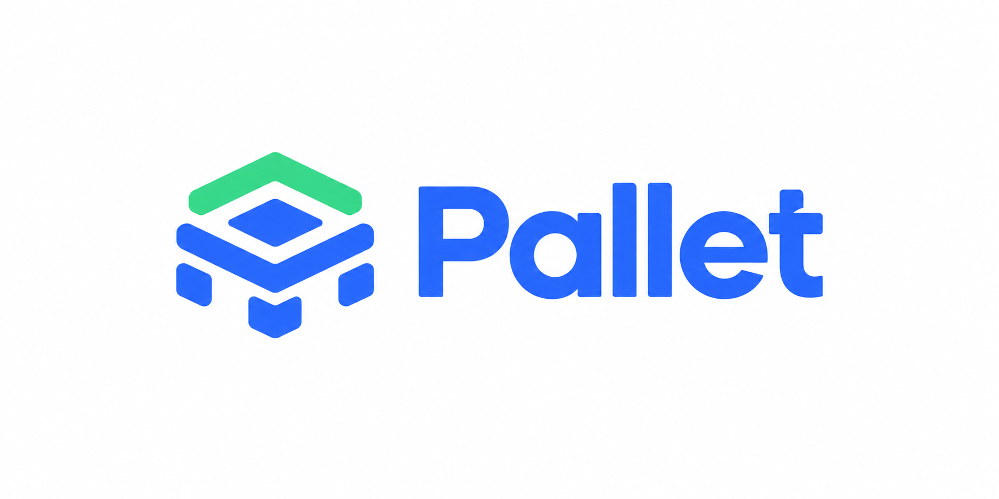

<p align="center">
  
</p>

<p align="center">
  A self-built platform as a service. Connect a Git repo, push code, and get back a live URL with TLS.
</p>

<p align="center">
  <a href="LICENSE"></a>
  
  
</p>

## About

Pallet is a smaller Render, Fly.io, or Vercel, built in public one service at a time as a way to
learn distributed systems patterns. A developer connects a Git repository and pushes code. Pallet
builds it, deploys it, and returns a live URL.

Underneath, Pallet is event-driven. Services do not make blocking calls to each other: the only
synchronous edges are inbound webhooks and dashboard requests, and calls to third parties. The
deploy and billing pipelines run as Temporal sagas, and every external call goes through retries,
timeouts, and circuit breakers.

The full design brief is [`PROJECT.md`](PROJECT.md). Decisions and their rationale are recorded in
[`docs/adr/`](docs/adr/README.md).

## Status

Pallet is under active development. `platform-common/*`, `config-server`, and `notification-service`
(the reference event consumer) exist, and `identity-service` is being scaffolded. Most of the
24-service catalog in `PROJECT.md` is design only, so check `services/` and `docs/<service-name>/`
before assuming a service exists in code.

## Tech stack

- Java 21 and Spring Boot 4.1. `platform-common/` is one self-contained Maven
  multi-module reactor (own POM, own Maven wrapper). Every service under
  `services/<name>/` is its own fully independent Maven project (own POM, own
  Maven wrapper) that consumes `platform-common-*` as a published dependency.
  See [`CONTRIBUTING.md`](CONTRIBUTING.md) and [`PACKAGES.md`](PACKAGES.md).
- Apache Kafka as the event backbone (`spring-boot-starter-kafka`).
- Temporal (Java SDK) for the deploy and billing sagas, providing durable workflow execution and
  compensation. It is embedded as a worker in `deploy-orchestrator-service` and `billing-service`
  only (see [ADR-0009](docs/adr/0009-temporal-for-saga-orchestration.md)).
- Keycloak for identity, with one realm and an `org_id` claim on every token.
- PostgreSQL for most services, ClickHouse for `audit-log-service` and
  `usage-metering-service`, and Redis and Vault alongside.
- Micrometer and OpenTelemetry, exporting to Prometheus, Grafana, and Jaeger.
- Kubernetes for tenant workloads and the control plane, and Resilience4j for every
  external call.

See [ADR-0005](docs/adr/0005-java-21-spring-boot-4.md) for the Spring Boot 4
conventions (modular starters, Jackson 3, Testcontainers 2).

## Prerequisites

- JDK 21 or newer (the repo builds a Java 21 release; JDK 25 works too)
- Docker and Docker Compose
- `kind` and `kubectl` for the deploy path (later phases)

Maven is not required. Every buildable directory (`platform-common/` and
each `services/<name>/`) bundles its own `./mvnw`.

## Getting started

```bash
# 1. Start core infra (postgres, redis, kafka, keycloak, clickhouse)
make up

# 2. Run config-server — each service builds and runs independently, from its own directory
cd services/config-server
./mvnw spring-boot:run     # or: make run
# → http://localhost:8888/actuator/health
# → http://localhost:8888/config-server/default   (config it serves for itself)

# Optional: observability stack (prometheus :9090, grafana :3000, jaeger :16686)
make obs   # from the repo root
```

`make help` at the repo root lists infra targets only (docker-compose, kind, repo-wide format
check). Running `make help` inside `platform-common/` or any `services/<name>/` directory lists
that project's own build targets, each independent of the others.

## Local endpoints

| Service | URL |
|---|---|
| api-gateway | http://localhost:8083 |
| config-server | http://localhost:8888 |
| Keycloak | http://localhost:8080 (admin / admin; realm `pallet`) |
| Postgres | localhost:5432 (pallet / pallet) |
| ClickHouse | http://localhost:8123 (pallet / pallet) |
| Kafka | localhost:29092 |
| Kafka UI | http://localhost:8090 (`make up-all` or `--profile ui`) |
| Prometheus / Grafana / Jaeger | :9090 / :3000 / :16686 (`make obs`) |
| Vault | :8200 (`make data`) |

These credentials only unlock the local stack.

## API documentation

Every service that has adopted `platform-common-openapi` publishes a live OpenAPI spec under its
own `/api/v1/<service>/v3/api-docs`. `api-gateway` aggregates them into one page. Start
`api-gateway` and whichever backends you want to browse, then open
**http://localhost:8083/docs**. The page has a tab for each service registered in
`pallet.gateway.routes` in `config-repo/api-gateway.yml`. There is no separate docs registry, and a
new service that adopts `platform-common-openapi` needs no gateway change. See
[ADR-0014](docs/adr/0014-openapi-docs-aggregation.md) for the design.

## Repository layout

```
Makefile                    infra only: docker-compose, kind, repo-wide format check
platform-common/            self-contained Maven reactor — own pom.xml, own mvnw, own Makefile
  pom.xml                          pins Spring Boot, Spring Cloud, plugin versions for this reactor
  platform-common-events/          Kafka event contracts + topic catalog
  platform-common-security/        OAuth2 resource-server baseline + org_id check
  platform-common-observability/   metrics / tracing / logging deps every service pulls in
  ...                               (api, exception, messaging, resilience, test)
services/
  config-server/             Spring Cloud Config Server — own pom.xml, own mvnw, own Makefile
  notification-service/      reference event consumer — same: fully independent build
config-repo/                config config-server serves (git-backed later)
deploy/local/                prometheus, otel-collector, grafana, kind cluster
infra/keycloak/               realm export (clients, roles, org_id mapper)
docs/adr/                     architecture decision records
```

Every service under `services/` is a standalone Maven project. It shares no parent POM with
`platform-common` or with any other service. See [`CONTRIBUTING.md`](CONTRIBUTING.md).

## Contributing

Contributions are welcome. Read [`CONTRIBUTING.md`](CONTRIBUTING.md) before opening a pull request.
For security scanning and how to report a vulnerability, see [`SECURITY.md`](SECURITY.md).

## License

Pallet is released under the [Apache-2.0 license](LICENSE).
