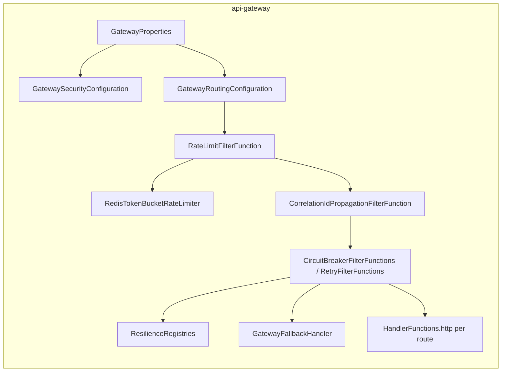

# api-gateway — Architecture

Status: proposed (pre-implementation design). Extends the one-paragraph sketch in `PROJECT.md`
("`api-gateway` is the single entry point for tenant-facing API and dashboard traffic... It
validates tokens at the edge, routes requests to the right backend service, and is the first
natural home for per-org rate limiting") into a full design, the same way
`docs/identity-service/ARCHITECTURE.md` extended identity-service's sketch. The four load-bearing
decisions this design rests on — Gateway Server MVC over the reactive gateway, additive (not
authoritative) edge auth, env-var-driven route targets, and edge rate limiting that coexists with
rather than replaces `identity-service`'s own — are recorded with their full reasoning in
[ADR-0012](../adr/0012-api-gateway-edge-architecture.md). A fifth decision — every backend mounts
its whole API under one fixed `/api/v1/<service>` namespace segment, so this gateway routes each
backend with a single path pattern instead of enumerating its endpoint groups — is
[ADR-0013](../adr/0013-per-service-api-path-namespace.md). This document builds the design on top
of both without re-arguing them, and resolves the four items ADR-0012's design left open in
[Hardening decisions](#hardening-decisions-resolved) below.

## Contents

- [Purpose](#purpose)
- [Position in the system](#position-in-the-system)
- [Design goals and non-goals](#design-goals-and-non-goals)
- [Routing model](#routing-model)
- [Coarse authorization: method allowlist](#coarse-authorization-method-allowlist)
- [Edge authentication](#edge-authentication)
- [Resilience per route](#resilience-per-route)
- [Rate limiting](#rate-limiting)
- [Observability](#observability)
- [Failure modes](#failure-modes)
- [Component view](#component-view)
- [Deployment and scaling view](#deployment-and-scaling-view)
- [Package layout and dependencies](#package-layout-and-dependencies)
- [Extension points](#extension-points)
- [Hardening decisions (resolved)](#hardening-decisions-resolved)
- [Open questions / deferred](#open-questions--deferred)
- [Relationship to existing planning docs](#relationship-to-existing-planning-docs)

## Purpose

`api-gateway` is the single HTTP entry point the tenant dashboard and CLI ever call directly.
Concretely, it:

- Routes every inbound request to the right backend service by path, resolving that backend's
  address the same env-var-driven way every service already resolves its own dependencies (no
  service registry — `docs/PROJECT.md`'s DNS-based-discovery commitment).
- Rejects a request carrying no, or an invalid/expired, Keycloak-issued JWT on any route that
  isn't explicitly public — before it ever reaches a backend — while leaving each backend's own
  independent check in place (see [Edge authentication](#edge-authentication)).
- Applies a circuit breaker, bounded retry, and a response timeout to every route, so one slow or
  down backend degrades that route's traffic, never the gateway process or an unrelated route.
- Applies a coarse, Redis-backed rate limit at the edge — the first line of defense against generic
  abuse across every route, and the eventual home for per-org, plan-based limits once
  `org-team-service` and billing exist.
- Is, deliberately, the platform's first fully stateless service: no Postgres schema, no Kafka
  consumer group, no domain aggregate of its own — see [Non-goals](#design-goals-and-non-goals).

## Position in the system


`api-gateway` is the platform's first service that is purely an HTTP edge component: it never
publishes or consumes a Kafka event, and it owns no aggregate of its own — every arrow into a
backend on the right is a proxied HTTP call, and the only state `api-gateway` itself holds is the
ephemeral rate-limit counters in Redis.

## Design goals and non-goals

**Goals**

- One URL for every tenant-facing API call, resolved to the right backend by path, with the target
  address changing in one config value (not one line of routing code) as the local topology
  evolves from bare processes on `localhost` today, to `docker-compose.yml` containers, to
  Kubernetes DNS — see [Routing model](#routing-model).
- A request that fails auth, is rate-limited, or hits a backend whose circuit is open never reaches
  application code on the far side, and always gets back the same `ErrorResponse` shape every other
  Pallet endpoint already returns for the equivalent failure — a caller can't tell, from the
  response shape alone, whether a 401 came from the gateway or from `identity-service` itself.
- Edge auth is genuinely additive: removing the gateway from the request path (any local workflow
  that calls a backend directly) changes nothing about whether that backend accepts the request —
  see [Edge authentication](#edge-authentication) and ADR-0012 decision 2.
- Every route gets a circuit breaker, retry, and timeout by default from the moment it's added to
  config — a new route is never accidentally unprotected because someone forgot a filter.
- Reuse `platform-common-security`/`-observability`/`-resilience`/`-exception` exactly as every
  other service does, per ADR-0012's Gateway Server MVC choice — no reactive-stack fork of any
  shared module, ever, for this service to exist.

**Non-goals (this design)**

- **Owning any domain data or publishing any domain event.** A stateless edge proxy has no
  aggregate and no fact of its own to assert — audit trail for authentication and account actions
  stays entirely `identity-service`'s job, unchanged by this design.
- **Replacing `identity-service`'s own JWT validation, or any other backend's.** See ADR-0012
  decision 2 and [Edge authentication](#edge-authentication).
- **Replacing `identity-service`'s `AuthRateLimiter`.** See ADR-0012 decision 4 and
  [Rate limiting](#rate-limiting).
- **Per-org, plan-based rate limiting.** Named in `docs/PROJECT.md` as this service's eventual
  home for it, but it depends on `org-team-service` (membership/plan data) and billing existing
  first — see [Extension points](#extension-points).
- **A service registry or client-side load balancer (Eureka, Ribbon, etc.)** — ruled out by
  `docs/PROJECT.md` itself; DNS is the whole mechanism, at every stage of the topology.
- **Request/response transformation, response caching, or a GraphQL/BFF layer** — this gateway
  proxies and protects, it doesn't reshape payloads. A future need for that is a new, deliberate
  layer, not grown into this one.
- **WebSocket or gRPC/streaming routing** — every backend today is plain HTTP/JSON;
  `build-service`/`log-service`'s eventual log-streaming needs are a later, explicit addition (see
  [Extension points](#extension-points)), not designed here.

## Routing model

Every service's API is mounted under one fixed namespace segment —
`/api/v1/<service>` — per [ADR-0013](../adr/0013-per-service-api-path-namespace.md):
`identity-service`'s whole API lives under `/api/v1/identity/**`,
`notification-service`'s under `/api/v1/notification/**`. This means **routing** collapses to one
path pattern per backend, regardless of how many endpoint groups that backend exposes — the thing
`ARCHITECTURE.md`'s first draft got wrong by enumerating `/signup`, `/invites/**`, `/auth/**`,
`/users/**` as four separate path entries for `identity-service` alone. **Authorization** (which of
those paths need a token) is a separate question and stays its own, still-enumerated list — see
[Edge authentication](#edge-authentication) — routing and auth don't collapse to the same one-entry
shape for the same reason ADR-0013 itself gives: they answer different questions.

Each route is one entry under `pallet.gateway.routes.<name>` in `config-repo/api-gateway.yml`,
resolved by `GatewayProperties` (`@ConfigurationProperties("pallet.gateway")`):

```yaml
pallet:
  gateway:
    routes:
      identity-service:
        uri: ${IDENTITY_SERVICE_URI:http://localhost:8082}
        path: /api/v1/identity/**
        allowed-methods: [GET, POST, PATCH, DELETE]
        public-paths:
          - /api/v1/identity/signup
          - /api/v1/identity/invites/*/accept
          - /api/v1/identity/auth/login
          - /api/v1/identity/auth/refresh
          - /api/v1/identity/auth/email/verify
          - /api/v1/identity/auth/email/resend-verification
          - /api/v1/identity/auth/password/forgot
          - /api/v1/identity/auth/password/reset
          - /api/v1/identity/signup/slugs/*/availability
          - /api/v1/identity/v3/api-docs
        resilience-policy: identity-service
```

`public-paths` here mirrors the permitAll list `identity-service`'s own `SecurityConfiguration`
codes (plus its OpenAPI docs path): signup, slug availability, invite-accept, login, refresh, the
two email-verification actions, and the two password-reset actions. `/auth/logout` is deliberately
absent: it revokes the caller's own session, so it stays behind both the edge check and
`identity-service`'s own `anyRequest().authenticated()`. The two lists must move together —
adding a path to one and not the other yields a 401 at whichever layer was missed, which is exactly
how password reset was unreachable until both were reconciled.

`GatewayRoutingConfiguration` turns each entry into one `RouterFunction<ServerResponse>` bean via
Gateway Server MVC's functional `GatewayRouterFunctions.route(name)`, matching on `path` **and**
`allowed-methods` together (`RequestPredicates.path(route.path()).and(RequestPredicates.methods(...))`
— see [Coarse authorization](#coarse-authorization-method-allowlist)), composing (outermost to
innermost) the rate-limit filter, the named circuit breaker/retry pair
([below](#resilience-per-route)), then `HandlerFunctions.http(uri)` — the actual proxy call.
**No path rewrite, ever**: every backend already mounts its own API under `/api/v1/<service>` via
`platform-common-api`'s shared prefix ([ADR-0010](../adr/0010-shared-api-version-prefix.md)) plus
its own `@RequestMapping("/<service>")` ([ADR-0013](../adr/0013-per-service-api-path-namespace.md)),
and the gateway is the *only* thing exposed to a caller, so the external path and the path a
backend receives are identical — `GET /api/v1/identity/users/me` at the gateway becomes `GET
http://localhost:8082/api/v1/identity/users/me` verbatim, host swapped, nothing else. This is
deliberately simpler than the common gateway pattern of stripping a prefix and re-adding a
different one: there is only one prefix (plus namespace segment) in this system, and both sides of
the proxy already agree on it.

**Why a typed `pallet.gateway.*` property instead of Gateway Server MVC's own declarative
`spring.cloud.gateway.mvc.routes` YAML shape**: that YAML shape has no room for this service's own
`public-paths`/`allowed-methods` fields, and inventing a second, parallel place to declare which
paths are public or which methods are allowed (one for routing, one for security) is exactly the
kind of two-sources-of-truth gap this design avoids elsewhere — see
[Edge authentication](#edge-authentication) deriving its `permitAll()` matchers from this same
`GatewayProperties` bean. One property tree feeds the router, the method allowlist, and the
security filter chain.

**Target resolution today vs. later** (ADR-0012 decision 3, restated concretely): `uri` defaults to
`http://localhost:8082` because that's where `identity-service` actually runs right now — no
service currently runs inside `docker-compose.yml` (`AGENTS.md`'s own local-endpoint table lists
bare `localhost` ports). The day a service joins `docker-compose.yml` as its own container, its
route's env var default becomes that container's service name (`http://identity-service:8082`);
in the cluster it becomes Kubernetes DNS (`http://identity-service.pallet.svc.cluster.local`).
Nothing about `GatewayRoutingConfiguration` changes at either transition — only the env var value
does. `org-team-service` has its own `pallet.gateway.routes.org-team-service` entry
(`path: /api/v1/org-team/**`, per the same ADR-0013 namespace convention, added by
`docs/workflows/org-team-service/15-openapi-and-gateway.md`). Its only public paths are the invite
preview (`/api/v1/org-team/invites/*`, one path segment: the token) and its API docs; nothing under
`/api/v1/org-team/orgs/**` is public. An
endpoint `identity-service` adds *later* under its own existing `/api/v1/identity/**` namespace
needs **zero** gateway routing change — only its own `public-paths`/`allowed-methods` entries if
the new endpoint is public or introduces a new HTTP method that service didn't use before; this is
the concrete benefit ADR-0013 names.

## Coarse authorization: method allowlist

Per ADR-0012's original design, the edge check was authentication-only — *whether* a token is
valid, never *what* the request is trying to do. `allowed-methods` adds one narrow, deliberately
coarse exception: each route declares the union of HTTP methods that backend's API actually uses
anywhere (`[GET, POST, PATCH, DELETE]` for `identity-service` — it has no `PUT` endpoint), and a
request using a method outside that set never reaches the backend at all —
`405 METHOD_NOT_ALLOWED`, `ErrorResponse`-shaped, from the route's own predicate failing to match
(Gateway Server MVC falls through to a `405` handler the same way Spring MVC does for an unmatched
method on a matched path).

This is **service-level**, not **endpoint-level** — it can't tell that `DELETE` is only valid under
`/identity/users/me/sessions*` and not under `/identity/signup`, because routing collapsed to one
path pattern per service ([Routing model](#routing-model)) specifically to avoid re-enumerating
every sub-path here too. It catches obviously-wrong traffic (`TRACE`, `CONNECT`, an arbitrary or
malformed verb, a method no endpoint in that service has ever used) before it costs the backend a
request; it does **not** catch a syntactically valid but semantically wrong method against a
specific sub-path (a `DELETE /identity/signup`, say) — that still 404s or 405s inside
`identity-service`'s own routing, exactly as it would with no gateway involved. Fine-grained,
per-path method/authorization enforcement stays entirely each backend's own concern, unchanged —
this is a coarse first filter, not a second copy of routing logic.

## Edge authentication

`GatewaySecurityConfiguration` defines its own `SecurityFilterChain`, overriding
`PalletResourceServerAutoConfiguration`'s default the same way `identity-service` already overrides
it for its own public sign-up/auth endpoints (`@ConditionalOnMissingBean(SecurityFilterChain.class)`
backs off the moment a service defines one). Unlike a typical resource server, the gateway doesn't
need role-based authorization — no `keycloakRoleConverter`, no `hasRole(...)` — because it never
executes business logic itself; it only needs to know *whether* a valid, unexpired,
correctly-issued JWT is present:

```java
@Bean
SecurityFilterChain gatewaySecurityFilterChain(HttpSecurity http, GatewayProperties properties) throws Exception {
    String[] publicPaths = properties.allPublicPaths(); // flattened across every configured route
    http.csrf(AbstractHttpConfigurer::disable)
            .sessionManagement(session -> session.sessionCreationPolicy(SessionCreationPolicy.STATELESS))
            .authorizeHttpRequests(auth -> auth.requestMatchers(publicPaths)
                    .permitAll()
                    .requestMatchers("/actuator/health/**", "/actuator/info", "/actuator/prometheus")
                    .permitAll()
                    .anyRequest()
                    .authenticated())
            .oauth2ResourceServer(oauth2 -> oauth2.jwt(Customizer.withDefaults()));
    return http.build();
}
```

A request that passes this check has its **original `Authorization` header forwarded unchanged** to
the backend by `HandlerFunctions.http(uri)` — the gateway never strips it, never re-signs a token,
and never stamps a substitute trust header. **This is the load-bearing property from ADR-0012
decision 2**: `identity-service`'s own `PalletResourceServerAutoConfiguration`-backed chain (or its
own overridden one, for its public endpoints) validates that same JWT again, completely
independently. A misconfigured or bypassed gateway degrades to "no edge protection," never to "a
backend now trusts requests it shouldn't" — there is no shared secret, signed header, or mTLS
client-cert convention a backend relies on *instead of* checking the bearer token itself. The cost
is one extra, cheap (JWKS-cached, no network round trip) signature verification per authenticated
request — accepted, not optimized away, because the alternative reintroduces exactly the
single-point-of-trust risk `docs/identity-service/ARCHITECTURE.md`'s signed-action-token design
went out of its way to avoid for a much narrower handoff.

A route's public-vs-protected split lives entirely in that route's own `public-paths` config
entry — there is no platform-wide "these paths are always public" list baked into gateway code,
because what's public is a fact about the backend's own API design, not something the gateway
should have an independent opinion about. Concretely, that means this list must track the
backend's actual `SecurityFilterChain`, not its architecture doc's prose — see
[Routing model](#routing-model)'s note on the one place those two have already drifted apart for
`identity-service`.

## Resilience per route

Every route gets a circuit breaker, a bounded retry, and a response timeout, reusing
`platform-common-resilience`'s existing `ResilienceRegistries` bean rather than a second,
gateway-local Resilience4j configuration — the same named-policy config surface
(`pallet.resilience.policies.<name>`) that every `ExternalCall` call site elsewhere in the platform
already uses:

```java
RouterFunction<ServerResponse> route = GatewayRouterFunctions.route(routeName)
        .route(predicate, HandlerFunctions.http(route.uri())) // predicate = path + allowed-methods, from Routing model
        .filter(CircuitBreakerFilterFunctions.circuitBreaker(
                routeName, registries.circuitBreaker(route.resiliencePolicy()), gatewayFallbackUri(routeName)))
        .filter(RetryFilterFunctions.retry(config -> config.retries(
                properties.resolve(route.resiliencePolicy()).retry().maxAttempts())))
        .build();
```

An unconfigured `resilience-policy` name falls back to `pallet.resilience.defaults`, identical to
every `ExternalCall` call site's own fallback behavior — one set of numbers, one mental model,
whether the call is `identity-service` calling Keycloak or `api-gateway` calling
`identity-service`.

**Only `GET` is ever retried.** The retry filter's method allow-list defaults to `GET`, so a `POST`,
`PATCH` or `DELETE` that fails is never re-sent by the route's retry policy. The proxy's Apache
HttpClient has its own automatic retry, which by default re-sends *any* method once after a `503`
or `429`, one second later and outside that policy. `ProxyClientConfiguration` disables it, so a
failed `POST /orgs/{orgId}/members/{userId}/transfer-ownership` reaches the backend exactly once.
`OrgTeamRouteIntegrationTest` pins both halves: a failing `GET` is retried, and a `POST`, `PATCH` or
`DELETE` answered with `503` or `429` is not.

**Timeout is the backing HTTP client's own read/connect timeout, not a `TimeLimiter` decorator.**
`ExternalCall` wraps a blocking `Supplier` in Resilience4j's `TimeLimiter`, which needs an async
boundary (a `CompletableFuture`) to actually enforce a deadline against. A gateway route's proxy
call is already synchronous on the calling servlet thread with no such boundary, so the equivalent
mechanism here is `ClientHttpRequestFactorySettings` on the `RestClient` `HandlerFunctions.http(...)`
uses internally — configured from the same `pallet.resilience.policies.<name>.time-limiter.timeout`
value, for one consistent number, but enforced by the HTTP client's socket read timeout rather than
literally routed through the `TimeLimiter` class. Named here so it isn't assumed to be the identical
mechanism `ExternalCall` uses.

**Fallback response shape**: a route whose circuit is open, or whose retries are exhausted, is
handled by `GatewayFallbackHandler` — a small `RouterFunction<ServerResponse>` bean per route
(the `gatewayFallbackUri` the circuit breaker filter redirects to on trip) that renders the same
`ErrorResponse` shape `GlobalExceptionHandler` produces elsewhere: `503 SERVICE_UNAVAILABLE` for an
open circuit, `504 GATEWAY_TIMEOUT` for an exhausted-retries/timeout case. A caller sees the
platform's one consistent error envelope regardless of which layer — gateway or backend — actually
produced it.

## Rate limiting

`RateLimitFilterFunction` runs first in every route's filter chain (before the circuit
breaker/retry pair), backed by Redis so the limit holds across however many `api-gateway` instances
are running — unlike `identity-service`'s own per-instance, in-memory `AuthRateLimiter`, this
service is horizontally scaled by design and an in-memory counter would let a caller multiply their
effective budget by the instance count.

**Key**: `org_id` from the validated JWT on an authenticated route (coarse per-tenant limiting,
the shape `docs/PROJECT.md` names as this component's eventual home for plan-based limits); client
IP on a public route, where no `org_id` exists yet — the same distinction
`identity-service`'s own `AuthRateLimiter` already draws for its unauthenticated endpoints.

**Mechanism — confirmed as the final v1 algorithm, not a placeholder** (see
[Hardening decisions](#hardening-decisions-resolved)): a fixed-window counter in Redis, one
`INCR`+conditional-`EXPIRE` Lua script per request for atomicity — `pallet.gateway.rate-limit.capacity`
requests per `pallet.gateway.rate-limit.window` per key. Deliberately the simplest correct
distributed limiter, not a true token bucket or sliding-window log: a fixed window admits a caller
up to roughly `2 × capacity` requests across a window boundary in the worst case, an accepted
tradeoff for a first cut at edge protection, the same "deliberately simple" posture
`docs/identity-service/ARCHITECTURE.md`'s checkpoint 12 took for `AuthRateLimiter`.

A rejected request never reaches the circuit breaker or the backend: `429 TOO_MANY_REQUESTS`,
`ErrorResponse`-shaped, the same `TOO_MANY_REQUESTS` code `identity-service`'s own limiter already
uses via `TooManyRequestsException` — no new error shape introduced for this layer either.

**Relationship to `identity-service`'s `AuthRateLimiter` (ADR-0012 decision 4)**: both stay. This
layer is coarse, per-(org-or-IP), spans every route, and exists to absorb generic burst/abuse
traffic before it reaches any backend at all. `AuthRateLimiter` is narrow, per-(client, endpoint),
and defends a specific threat model — OTP-guessing against `/auth/email/verify`, credential
stuffing against `/auth/login` — that a coarse edge budget sized for ordinary multi-route traffic
would either fail to bound tightly enough, or would have to be so tight it throttles unrelated
routes to compensate. A request can be turned away by either layer independently; the failure-modes
table below states which fires when.

## Observability

**Correlation ID continuity through the proxy hop is a real gap this design closes explicitly, not
an assumption.** `platform-common-observability`'s `CorrelationIdFilter` reads an inbound
`X-Correlation-Id` header into MDC and echoes it on the *response* — it never mutates the
*outbound* request `HandlerFunctions.http(...)` proxies, so a caller who sends no correlation id at
all would otherwise cause the gateway to mint one UUID for its own logs while
`identity-service` mints an unrelated second UUID for the proxied request, breaking the "one
correlation id across a request's whole path" property every other consumer/producer boundary in
this platform already preserves. `CorrelationIdPropagationFilterFunction`, added to every route's
filter chain right after the rate limiter, reads the id `CorrelationIdFilter` already resolved into
MDC for the current request and sets it as the outbound `X-Correlation-Id` request header before
the proxy call — so `identity-service`'s own `CorrelationIdFilter` sees exactly the same id whether
the original caller supplied one or not.

**Distributed tracing — confirmed composed, not assumed (checkpoint 6).** Gateway Server MVC's own
`GatewayServerMvcAutoConfiguration` builds the `RestClient` `HandlerFunctions.http(...)` proxies
through from the Spring-managed `RestClient.Builder` bean
(`restClientProxyExchange(RestClient.Builder, GatewayMvcProperties)`), not a private
`RestClient.create()` of its own; `platform-common-observability` puts the full Micrometer/OTel
tracing bridge (`micrometer-tracing-bridge-otel`) on the classpath, so Spring Boot's own
`RestClientAutoConfiguration` applies its observation-based `RestClientCustomizer` to that same
builder bean automatically. The result: the gateway's inbound request creates a server span, the
proxied outbound call through that instrumented `RestClient` creates a client span as its child,
and `identity-service`'s own inbound server span continues it — the same
trace-context-over-HTTP-headers propagation every `ExternalCall`-wrapped call already relies on, no
bean override needed at this hop. Verified by inspecting `spring-cloud-gateway-server-webmvc`'s own
autoconfiguration wiring; still worth a one-time visual confirmation in the Jaeger UI (one trace,
two spans) the first time this runs against a live `identity-service` and Jaeger, per this
checkpoint's manual verification steps — but the code path itself is no longer a guess.

**Metrics**: `gateway.ratelimit.unavailable` (from `RedisTokenBucketRateLimiter`, checkpoint 5) is
the one rate-limit-specific counter this service adds; the existing `resilienceMetricsBinder` from
`platform-common-resilience` already exports circuit-breaker state, retry counts, and call latency
per named policy with zero new wiring, exactly as it does for every `ExternalCall` policy elsewhere
— a route's circuit state is a Prometheus gauge the moment the route's policy name is configured,
nothing gateway-specific to add. Tomcat's own `tomcat.threads.busy`/`tomcat.threads.config.max`
gauges are likewise exported with zero wiring, the concrete signal named in
[Hardening decisions](#hardening-decisions-resolved) item 3.

## Failure modes

| Scenario | Behavior |
|---|---|
| No route configured for the request's path | `404`, `ErrorResponse`-shaped — the gateway has no opinion about a path it was never told about; an unrouted path such as `/api/v1/billing/**` is the current example. |
| Missing/expired/invalid JWT on a protected route | `401 AUTHENTICATION_REQUIRED`, same `ErrorResponse` shape `SecurityExceptionHandler` already renders for every other service — request never reaches a backend. |
| Valid JWT but the caller is over their rate-limit budget | `429 TOO_MANY_REQUESTS` from `RateLimitFilterFunction` — request never reaches the circuit breaker or a backend. Distinguishable from `identity-service`'s own 429 only by which layer's counter tripped; both use the same error code. |
| Backend's circuit is open for a route | `503 SERVICE_UNAVAILABLE` from `GatewayFallbackHandler` — no call attempted against the backend at all while the breaker is open, per Resilience4j's own half-open recovery behavior. |
| Backend is slow past the configured read timeout | `504 GATEWAY_TIMEOUT` after retries (if configured) are exhausted — the backend call itself may still complete server-side; the gateway has already given up waiting on it. |
| A caller bypasses the gateway and calls a backend's `localhost` port directly (local dev only) | Fully protected regardless — `identity-service`'s own resource-server chain and its own `AuthRateLimiter` never depended on the gateway being in the path. This is the entire point of ADR-0012 decision 2. |
| Redis is unreachable | `RateLimitFilterFunction` fails open (allows the request) rather than failing closed — an edge abuse-prevention layer going dark shouldn't take down every route platform-wide; logged as a metric (`gateway.ratelimit.unavailable`) so the gap is visible, not silent. Confirmed as the final posture, not a placeholder — see [Hardening decisions](#hardening-decisions-resolved). |
| A request uses an HTTP method no endpoint in the target service has ever used (`TRACE`, `CONNECT`, an arbitrary verb) | `405 METHOD_NOT_ALLOWED`, `ErrorResponse`-shaped, from the route's own predicate failing to match — see [Coarse authorization](#coarse-authorization-method-allowlist). Never reaches the backend. |
| A route's env-var-configured `uri` points at nothing (backend not started, wrong port) | Connection refused surfaces as a retried-then-circuit-breaker-tripped failure, same as any other backend outage — no special-cased "unreachable at startup" handling; the circuit breaker's own half-open probing is what recovers it once the backend comes up. |

## Component view



## Deployment and scaling view

Stateless HTTP only — no Kafka consumer group, no database connection pool, no local disk state.
Every instance is identical and interchangeable; horizontal scaling is purely "add another
instance behind whatever load-balances inbound traffic to it," with Redis as the only shared state
(rate-limit counters) that has to be reachable from every instance. This is a deliberately simpler
deployment shape than every other service built so far, precisely because it carries no aggregate
of its own — see [Non-goals](#design-goals-and-non-goals).

Being a blocking (Gateway Server MVC) rather than reactive gateway means its thread pool is the
concurrency limit that matters — see [Hardening decisions](#hardening-decisions-resolved) for the
concrete default this design settles on (Spring Boot's own embedded-Tomcat default, deliberately
not overridden) and the metric that would trigger raising it.

## Package layout and dependencies

```
services/api-gateway/
└── src/main/java/io/pallet/apigateway/
    ├── ApiGatewayApplication.java
    ├── config/            GatewayProperties (routes + rate-limit config)
    ├── routing/           GatewayRoutingConfiguration (one RouterFunction bean per configured route),
    │                     ProxyClientConfiguration (proxy HTTP client, automatic retries off)
    ├── security/          GatewaySecurityConfiguration (SecurityFilterChain, public-path allowlist
    │                     derived from GatewayProperties)
    ├── resilience/         GatewayResilienceConfiguration (circuit-breaker/retry filter wiring
    │                     over platform-common-resilience's ResilienceRegistries),
    │                     GatewayFallbackHandler (ErrorResponse-shaped 503/504)
    ├── ratelimit/         RateLimitFilterFunction, RedisTokenBucketRateLimiter,
    │                     RateLimitProperties
    └── observability/     CorrelationIdPropagationFilterFunction
```

POM: `platform-common-exception`, `-observability`, `-resilience`, `-security`;
`spring-boot-starter-webmvc`; `spring-cloud-starter-gateway-server-mvc`;
`spring-boot-starter-data-redis` (rate-limit counters — reuses
`platform-common-test`'s existing `RedisTestContainerConfiguration`/`RedisContainerHolder` for
integration tests, the same container-holder pattern `platform-common-messaging`'s
`RedisEventIdempotencyGuard` tests already use). **Deliberately absent**: `platform-common-api`
(no `@RestController`-mapped endpoint of its own to apply `pallet.api.prefix` to — routes are
`RouterFunction` beans, and the external path already equals the backend's own `/api/v1/<service>`
path, see [Routing model](#routing-model)); `-events`/`-messaging` (no Kafka producer or consumer — the
platform's first service that is neither); JPA/Postgres/Flyway (no schema — the platform's first
fully stateless service); `keycloak-admin-client` (the gateway only ever validates tokens, never
administers Keycloak). This is the leanest dependency set of any service in the reactor so far,
which is itself a consequence of this service owning no domain data.

## Extension points

- **Per-org, plan-based rate limiting**: `RateLimitFilterFunction` already keys authenticated
  requests by `org_id`; swapping the flat `capacity`/`window` config for a per-plan lookup against
  `org-team-service`'s membership/plan data (via a consumed event projecting plan tier locally,
  never a synchronous call) is additive once that data exists — `docs/PROJECT.md`'s own stated
  target for this component.
- **WebSocket/streaming routing** for `build-service`/`log-service`'s eventual log-tailing needs:
  Gateway Server MVC's functional routing model supports a streaming `HandlerFunction` distinct
  from `HandlerFunctions.http(...)`; a deliberate, separate route type when that need is real, not
  designed here.
- **A trusted-proxy / real-client-IP convention** once a cloud load balancer or ingress controller
  sits in front of `api-gateway` in production — `RateLimitFilterFunction`'s IP-keying today reads
  the direct peer address, correct for local dev's direct-connection topology, not yet forwarded-
  header-aware.
- **mTLS between gateway and backends** as an additional (not replacing) layer once the platform
  runs on Kubernetes with a service mesh — additive to, not a substitute for, the JWT check ADR-0012
  keeps independent at each hop.

## Hardening decisions (resolved)

Four items this design's first draft left as open questions, closed here — the same "decide,
don't just defer" pass `docs/identity-service/ARCHITECTURE.md`'s own checkpoint 12 ran for its
dual-write gap, rate limiting, and observability gaps. Each gets a concrete answer, a concrete
number where one applies, and a concrete, measurable trigger for revisiting it — not just "for
now."

**1. Redis-unavailable fail-open posture — confirmed as final.** [Rate limiting](#rate-limiting)
and [Failure modes](#failure-modes) already state the mechanism (fail open,
`gateway.ratelimit.unavailable` counter); this is now the accepted permanent behavior, not a
placeholder pending a future fail-closed rework. **Revisit trigger**: `gateway.ratelimit.unavailable`
firing for any sustained window in production — the same "a metric, not a feeling, decides when to
revisit" discipline `docs/identity-service/ARCHITECTURE.md`'s own
`identity.signups.compensating_delete` counter uses for its dual-write gap.

**2. Fixed-window rate limiting — confirmed as the final v1 algorithm.** Not a placeholder for a
future token-bucket/sliding-window rewrite; [Rate limiting](#rate-limiting)'s stated tradeoff (up
to `2 × capacity` admitted across a window boundary) is accepted as proportionate for v1 edge
protection. **Revisit trigger**: real traffic showing rejections or abuse concentrated at window
boundaries specifically — not "the algorithm is theoretically imprecise," which is already known
and accepted.

**3. Thread-pool sizing for the blocking proxy model — a concrete default, not an unset
question.** Because a Gateway Server MVC proxy call executes synchronously on the same
request-handling thread the servlet container already allocated it, there is no *separate*
gateway-specific thread pool to size — the number that matters is the embedded server's own
request-handling capacity, `server.tomcat.threads.max`. This design deliberately does **not**
override Spring Boot's own default (200) at launch: `api-gateway` carries no business logic per
request beyond routing/auth/rate-limit checks and one proxied HTTP call, so the default sized for
an ordinary Spring MVC app is a reasonable starting point rather than a guess needing its own new
number. Configured like every other tunable, via `config-repo/api-gateway.yml`, not hardcoded.
**Revisit trigger**: `tomcat.threads.busy` approaching `tomcat.threads.config.max` under sustained
load in Prometheus (`platform-common-observability`'s existing Micrometer/Tomcat binding — no new
metric needed) — a measurable saturation signal, not a preemptive guess at load this platform
doesn't have yet.

**4. Coarse, gateway-level authorization — built, not deferred.** Per-route `allowed-methods`
([Coarse authorization](#coarse-authorization-method-allowlist)) is exactly the "block an obviously
wrong HTTP method before it reaches a backend" protection this question asked about, built at the
one granularity ("one route per service," per ADR-0013) that doesn't reintroduce the
per-endpoint enumeration routing just got rid of. **Not** built: any authorization beyond that
(role/permission checks, resource-level rules) — those stay entirely each backend's own concern,
unchanged; this decision only closes the "coarse HTTP-method" half of the original question.

## Open questions / deferred

Nothing currently open at the design level — the four items above were this document's only
standing open questions, and each now has an accepted answer and a named revisit trigger above.
A genuinely new open question surfaces here the next time one does, rather than this section being
force-emptied to look complete.

## Relationship to existing planning docs

`docs/PROJECT.md`'s one-paragraph sketch and `docs/workflows/ROADMAP.md`'s Phase 1d note ("`api-gateway`
and `org-team-service` open Phase 2 and get their own roadmap") describe this service only in
outline. This document is that Phase 2 design for `api-gateway` specifically; `org-team-service`'s
own architecture doc and roadmap are separate, future work this document doesn't attempt.
`docs/workflows/api-gateway/00-README.md` carries this design's own build-order sequencing, the
same role `docs/workflows/identity-service/00-README.md` plays for identity-service, since a
platform-wide Phase 2 roadmap file covering both `api-gateway` and `org-team-service` together
isn't warranted until `org-team-service`'s own design exists to sequence against it.
