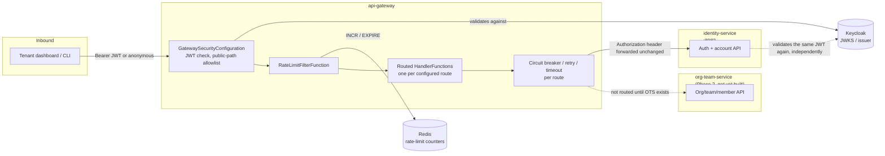
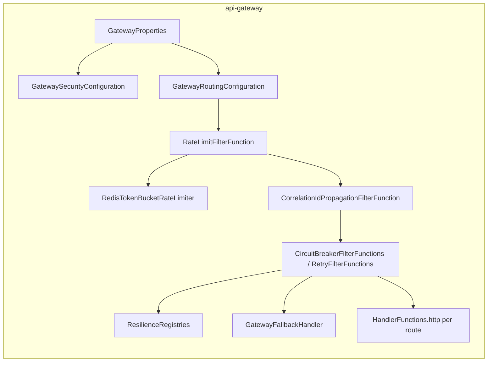

# api-gateway — Architecture

Status: proposed (pre-implementation design). Extends the one-paragraph sketch in `PROJECT.md`
("`api-gateway` is the single entry point for tenant-facing API and dashboard traffic... It
validates tokens at the edge, routes requests to the right backend service, and is the first
natural home for per-org rate limiting") into a full design, the same way
`docs/identity-service/ARCHITECTURE.md` extended identity-service's sketch. The four load-bearing
decisions this design rests on — Gateway Server MVC over the reactive gateway, additive (not
authoritative) edge auth, env-var-driven route targets, and edge rate limiting that coexists with
rather than replaces `identity-service`'s own — are recorded with their full reasoning in
[ADR-0012](../adr/0012-api-gateway-edge-architecture.md); this document builds the design on top of
those decisions without re-arguing them.

## Contents

- [Purpose](#purpose)
- [Position in the system](#position-in-the-system)
- [Design goals and non-goals](#design-goals-and-non-goals)
- [Routing model](#routing-model)
- [Edge authentication](#edge-authentication)
- [Resilience per route](#resilience-per-route)
- [Rate limiting](#rate-limiting)
- [Observability](#observability)
- [Failure modes](#failure-modes)
- [Component view](#component-view)
- [Deployment and scaling view](#deployment-and-scaling-view)
- [Package layout and dependencies](#package-layout-and-dependencies)
- [Extension points](#extension-points)
- [Open questions / deferred](#open-questions--deferred)
- [Relationship to existing planning docs](#relationship-to-existing-planning-docs)

## Purpose

`api-gateway` is the single HTTP entry point the tenant dashboard and CLI ever call directly.
Concretely, it:

- Routes every inbound request to the right backend service by path, resolving that backend's
  address the same env-var-driven way every service already resolves its own dependencies (no
  service registry — `docs/PROJECT.md`'s DNS-based-discovery commitment).
- Rejects a request carrying no, or an invalid/expired, Keycloak-issued JWT on any route that
  isn't explicitly public — before it ever reaches a backend — while leaving each backend's own
  independent check in place (see [Edge authentication](#edge-authentication)).
- Applies a circuit breaker, bounded retry, and a response timeout to every route, so one slow or
  down backend degrades that route's traffic, never the gateway process or an unrelated route.
- Applies a coarse, Redis-backed rate limit at the edge — the first line of defense against generic
  abuse across every route, and the eventual home for per-org, plan-based limits once
  `org-team-service` and billing exist.
- Is, deliberately, the platform's first fully stateless service: no Postgres schema, no Kafka
  consumer group, no domain aggregate of its own — see [Non-goals](#design-goals-and-non-goals).

## Position in the system



`api-gateway` is the platform's first service that is purely an HTTP edge component: it never
publishes or consumes a Kafka event, and it owns no aggregate of its own — every arrow into a
backend on the right is a proxied HTTP call, and the only state `api-gateway` itself holds is the
ephemeral rate-limit counters in Redis.

## Design goals and non-goals

**Goals**

- One URL for every tenant-facing API call, resolved to the right backend by path, with the target
  address changing in one config value (not one line of routing code) as the local topology
  evolves from bare processes on `localhost` today, to `docker-compose.yml` containers, to
  Kubernetes DNS — see [Routing model](#routing-model).
- A request that fails auth, is rate-limited, or hits a backend whose circuit is open never reaches
  application code on the far side, and always gets back the same `ErrorResponse` shape every other
  Pallet endpoint already returns for the equivalent failure — a caller can't tell, from the
  response shape alone, whether a 401 came from the gateway or from `identity-service` itself.
- Edge auth is genuinely additive: removing the gateway from the request path (any local workflow
  that calls a backend directly) changes nothing about whether that backend accepts the request —
  see [Edge authentication](#edge-authentication) and ADR-0012 decision 2.
- Every route gets a circuit breaker, retry, and timeout by default from the moment it's added to
  config — a new route is never accidentally unprotected because someone forgot a filter.
- Reuse `platform-common-security`/`-observability`/`-resilience`/`-exception` exactly as every
  other service does, per ADR-0012's Gateway Server MVC choice — no reactive-stack fork of any
  shared module, ever, for this service to exist.

**Non-goals (this design)**

- **Owning any domain data or publishing any domain event.** A stateless edge proxy has no
  aggregate and no fact of its own to assert — audit trail for authentication and account actions
  stays entirely `identity-service`'s job, unchanged by this design.
- **Replacing `identity-service`'s own JWT validation, or any other backend's.** See ADR-0012
  decision 2 and [Edge authentication](#edge-authentication).
- **Replacing `identity-service`'s `AuthRateLimiter`.** See ADR-0012 decision 4 and
  [Rate limiting](#rate-limiting).
- **Per-org, plan-based rate limiting.** Named in `docs/PROJECT.md` as this service's eventual
  home for it, but it depends on `org-team-service` (membership/plan data) and billing existing
  first — see [Extension points](#extension-points).
- **A service registry or client-side load balancer (Eureka, Ribbon, etc.)** — ruled out by
  `docs/PROJECT.md` itself; DNS is the whole mechanism, at every stage of the topology.
- **Request/response transformation, response caching, or a GraphQL/BFF layer** — this gateway
  proxies and protects, it doesn't reshape payloads. A future need for that is a new, deliberate
  layer, not grown into this one.
- **WebSocket or gRPC/streaming routing** — every backend today is plain HTTP/JSON;
  `build-service`/`log-service`'s eventual log-streaming needs are a later, explicit addition (see
  [Extension points](#extension-points)), not designed here.

## Routing model

Each route is one entry under `pallet.gateway.routes.<name>` in `config-repo/api-gateway.yml`,
resolved by `GatewayProperties` (`@ConfigurationProperties("pallet.gateway")`):

```yaml
pallet:
  gateway:
    routes:
      identity-service:
        uri: ${IDENTITY_SERVICE_URI:http://localhost:8082}
        paths:
          - /api/v1/signup
          - /api/v1/invites/**
          - /api/v1/auth/**
          - /api/v1/users/**
        public-paths:
          - /api/v1/signup
          - /api/v1/invites/*/accept
          - /api/v1/auth/login
          - /api/v1/auth/refresh
          - /api/v1/auth/password/forgot
          - /api/v1/auth/password/reset
          - /api/v1/auth/email/verify
          - /api/v1/auth/email/resend-verification
        resilience-policy: identity-service
```

`GatewayRoutingConfiguration` turns each entry into one `RouterFunction<ServerResponse>` bean via
Gateway Server MVC's functional `GatewayRouterFunctions.route(name)`, composing (outermost to
innermost) the rate-limit filter, the named circuit breaker/retry pair
([below](#resilience-per-route)), then `HandlerFunctions.http(uri)` — the actual proxy call.
**No path rewrite, ever**: every backend already mounts its own API under `/api/v1` via
`platform-common-api`'s shared prefix ([ADR-0010](../adr/0010-shared-api-version-prefix.md)), and
the gateway is the *only* thing exposed to a caller, so the external path and the path a backend
receives are identical — `GET /api/v1/users/me` at the gateway becomes `GET
http://localhost:8082/api/v1/users/me` verbatim, host swapped, nothing else. This is deliberately
simpler than the common gateway pattern of stripping a prefix and re-adding a different one: there
is only one prefix in this system, and both sides of the proxy already agree on it.

**Why a typed `pallet.gateway.*` property instead of Gateway Server MVC's own declarative
`spring.cloud.gateway.mvc.routes` YAML shape**: that YAML shape has no room for this service's own
`public-paths` list, and inventing a second, parallel place to declare which paths are public (one
for routing, one for security) is exactly the kind of two-sources-of-truth gap this design avoids
elsewhere — see [Edge authentication](#edge-authentication) deriving its `permitAll()` matchers
from this same `GatewayProperties` bean. One property tree feeds both the router and the security
filter chain.

**Target resolution today vs. later** (ADR-0012 decision 3, restated concretely): `uri` defaults to
`http://localhost:8082` because that's where `identity-service` actually runs right now — no
service currently runs inside `docker-compose.yml` (`AGENTS.md`'s own local-endpoint table lists
bare `localhost` ports). The day a service joins `docker-compose.yml` as its own container, its
route's env var default becomes that container's service name (`http://identity-service:8082`);
in the cluster it becomes Kubernetes DNS (`http://identity-service.pallet.svc.cluster.local`).
Nothing about `GatewayRoutingConfiguration` changes at either transition — only the env var value
does. `org-team-service` gets its own `pallet.gateway.routes.org-team-service` entry the day that
service exists; until then, any path that would belong to it (`/api/v1/orgs/**`, say) simply isn't
registered as a route and 404s at the gateway, which is the correct behavior for a route that
doesn't exist yet rather than a gap to work around.

## Edge authentication

`GatewaySecurityConfiguration` defines its own `SecurityFilterChain`, overriding
`PalletResourceServerAutoConfiguration`'s default the same way `identity-service` already overrides
it for its own public sign-up/auth endpoints (`@ConditionalOnMissingBean(SecurityFilterChain.class)`
backs off the moment a service defines one). Unlike a typical resource server, the gateway doesn't
need role-based authorization — no `keycloakRoleConverter`, no `hasRole(...)` — because it never
executes business logic itself; it only needs to know *whether* a valid, unexpired,
correctly-issued JWT is present:

```java
@Bean
SecurityFilterChain gatewaySecurityFilterChain(HttpSecurity http, GatewayProperties properties) throws Exception {
    String[] publicPaths = properties.allPublicPaths(); // flattened across every configured route
    http.csrf(AbstractHttpConfigurer::disable)
            .sessionManagement(session -> session.sessionCreationPolicy(SessionCreationPolicy.STATELESS))
            .authorizeHttpRequests(auth -> auth.requestMatchers(publicPaths)
                    .permitAll()
                    .requestMatchers("/actuator/health/**", "/actuator/info", "/actuator/prometheus")
                    .permitAll()
                    .anyRequest()
                    .authenticated())
            .oauth2ResourceServer(oauth2 -> oauth2.jwt(Customizer.withDefaults()));
    return http.build();
}
```

A request that passes this check has its **original `Authorization` header forwarded unchanged** to
the backend by `HandlerFunctions.http(uri)` — the gateway never strips it, never re-signs a token,
and never stamps a substitute trust header. **This is the load-bearing property from ADR-0012
decision 2**: `identity-service`'s own `PalletResourceServerAutoConfiguration`-backed chain (or its
own overridden one, for its public endpoints) validates that same JWT again, completely
independently. A misconfigured or bypassed gateway degrades to "no edge protection," never to "a
backend now trusts requests it shouldn't" — there is no shared secret, signed header, or mTLS
client-cert convention a backend relies on *instead of* checking the bearer token itself. The cost
is one extra, cheap (JWKS-cached, no network round trip) signature verification per authenticated
request — accepted, not optimized away, because the alternative reintroduces exactly the
single-point-of-trust risk `docs/identity-service/ARCHITECTURE.md`'s signed-action-token design
went out of its way to avoid for a much narrower handoff.

A route's public-vs-protected split lives entirely in that route's own `public-paths` config
entry — there is no platform-wide "these paths are always public" list baked into gateway code,
because what's public is a fact about the backend's own API design (`identity-service`'s
`ARCHITECTURE.md` §API already enumerates exactly these paths as public), not something the
gateway should have an independent opinion about.

## Resilience per route

Every route gets a circuit breaker, a bounded retry, and a response timeout, reusing
`platform-common-resilience`'s existing `ResilienceRegistries` bean rather than a second,
gateway-local Resilience4j configuration — the same named-policy config surface
(`pallet.resilience.policies.<name>`) that every `ExternalCall` call site elsewhere in the platform
already uses:

```java
RouterFunction<ServerResponse> route = GatewayRouterFunctions.route(routeName)
        .route(RequestPredicates.path(pathPattern), HandlerFunctions.http(route.uri()))
        .filter(CircuitBreakerFilterFunctions.circuitBreaker(
                routeName, registries.circuitBreaker(route.resiliencePolicy()), gatewayFallbackUri(routeName)))
        .filter(RetryFilterFunctions.retry(config -> config.retries(
                properties.resolve(route.resiliencePolicy()).retry().maxAttempts())))
        .build();
```

An unconfigured `resilience-policy` name falls back to `pallet.resilience.defaults`, identical to
every `ExternalCall` call site's own fallback behavior — one set of numbers, one mental model,
whether the call is `identity-service` calling Keycloak or `api-gateway` calling
`identity-service`.

**Timeout is the backing HTTP client's own read/connect timeout, not a `TimeLimiter` decorator.**
`ExternalCall` wraps a blocking `Supplier` in Resilience4j's `TimeLimiter`, which needs an async
boundary (a `CompletableFuture`) to actually enforce a deadline against. A gateway route's proxy
call is already synchronous on the calling servlet thread with no such boundary, so the equivalent
mechanism here is `ClientHttpRequestFactorySettings` on the `RestClient` `HandlerFunctions.http(...)`
uses internally — configured from the same `pallet.resilience.policies.<name>.time-limiter.timeout`
value, for one consistent number, but enforced by the HTTP client's socket read timeout rather than
literally routed through the `TimeLimiter` class. Named here so it isn't assumed to be the identical
mechanism `ExternalCall` uses.

**Fallback response shape**: a route whose circuit is open, or whose retries are exhausted, is
handled by `GatewayFallbackHandler` — a small `RouterFunction<ServerResponse>` bean per route
(the `gatewayFallbackUri` the circuit breaker filter redirects to on trip) that renders the same
`ErrorResponse` shape `GlobalExceptionHandler` produces elsewhere: `503 SERVICE_UNAVAILABLE` for an
open circuit, `504 GATEWAY_TIMEOUT` for an exhausted-retries/timeout case. A caller sees the
platform's one consistent error envelope regardless of which layer — gateway or backend — actually
produced it.

## Rate limiting

`RateLimitFilterFunction` runs first in every route's filter chain (before the circuit
breaker/retry pair), backed by Redis so the limit holds across however many `api-gateway` instances
are running — unlike `identity-service`'s own per-instance, in-memory `AuthRateLimiter`, this
service is horizontally scaled by design and an in-memory counter would let a caller multiply their
effective budget by the instance count.

**Key**: `org_id` from the validated JWT on an authenticated route (coarse per-tenant limiting,
the shape `docs/PROJECT.md` names as this component's eventual home for plan-based limits); client
IP on a public route, where no `org_id` exists yet — the same distinction
`identity-service`'s own `AuthRateLimiter` already draws for its unauthenticated endpoints.

**Mechanism**: a fixed-window counter in Redis, one `INCR`+conditional-`EXPIRE` Lua script per
request for atomicity — `pallet.gateway.rate-limit.capacity` requests per
`pallet.gateway.rate-limit.window` per key. Deliberately the simplest correct distributed limiter,
not a true token bucket or sliding-window log: a fixed window admits a caller up to roughly
`2 × capacity` requests across a window boundary in the worst case, an accepted tradeoff for a
first cut at edge protection, the same "deliberately simple" posture
`docs/identity-service/ARCHITECTURE.md`'s checkpoint 12 took for `AuthRateLimiter` — revisit only if
real traffic shows the boundary-burst gap actually matters.

A rejected request never reaches the circuit breaker or the backend: `429 TOO_MANY_REQUESTS`,
`ErrorResponse`-shaped, the same `TOO_MANY_REQUESTS` code `identity-service`'s own limiter already
uses via `TooManyRequestsException` — no new error shape introduced for this layer either.

**Relationship to `identity-service`'s `AuthRateLimiter` (ADR-0012 decision 4)**: both stay. This
layer is coarse, per-(org-or-IP), spans every route, and exists to absorb generic burst/abuse
traffic before it reaches any backend at all. `AuthRateLimiter` is narrow, per-(client, endpoint),
and defends a specific threat model — OTP-guessing against `/auth/email/verify`, credential
stuffing against `/auth/login` — that a coarse edge budget sized for ordinary multi-route traffic
would either fail to bound tightly enough, or would have to be so tight it throttles unrelated
routes to compensate. A request can be turned away by either layer independently; the failure-modes
table below states which fires when.

## Observability

**Correlation ID continuity through the proxy hop is a real gap this design closes explicitly, not
an assumption.** `platform-common-observability`'s `CorrelationIdFilter` reads an inbound
`X-Correlation-Id` header into MDC and echoes it on the *response* — it never mutates the
*outbound* request `HandlerFunctions.http(...)` proxies, so a caller who sends no correlation id at
all would otherwise cause the gateway to mint one UUID for its own logs while
`identity-service` mints an unrelated second UUID for the proxied request, breaking the "one
correlation id across a request's whole path" property every other consumer/producer boundary in
this platform already preserves. `CorrelationIdPropagationFilterFunction`, added to every route's
filter chain right after the rate limiter, reads the id `CorrelationIdFilter` already resolved into
MDC for the current request and sets it as the outbound `X-Correlation-Id` request header before
the proxy call — so `identity-service`'s own `CorrelationIdFilter` sees exactly the same id whether
the original caller supplied one or not.

**Distributed tracing** is expected to compose for free once `platform-common-observability`'s
tracing autoconfiguration is on the classpath: the gateway's inbound request creates a server span,
Gateway Server MVC's outbound proxy call goes through a `RestClient`, and Micrometer's HTTP client
instrumentation creates a client span as its child, which `identity-service`'s own inbound server
span then continues — the same trace-context-over-HTTP-headers propagation every
`ExternalCall`-wrapped call already relies on, applied to a proxy call instead of an application-level
one. This needs an explicit end-to-end check (one trace spanning gateway → identity-service in
Jaeger) rather than being assumed correct, since this is the platform's first HTTP proxy hop —
tracked as checkpoint 6's own verification step, not asserted as already working here.

**Metrics**: `gateway.requests.{allowed,rate_limited}` (tagged by route and key type — org vs. IP)
from `RateLimitFilterFunction`; the existing `resilienceMetricsBinder` from
`platform-common-resilience` already exports circuit-breaker state, retry counts, and call latency
per named policy with zero new wiring, exactly as it does for every `ExternalCall` policy elsewhere
— a route's circuit state is a Prometheus gauge the moment the route's policy name is configured,
nothing gateway-specific to add.

## Failure modes

| Scenario | Behavior |
|---|---|
| No route configured for the request's path | `404`, `ErrorResponse`-shaped — the gateway has no opinion about a path it was never told about; this is the expected state for e.g. `/api/v1/orgs/**` until `org-team-service`'s route is added. |
| Missing/expired/invalid JWT on a protected route | `401 AUTHENTICATION_REQUIRED`, same `ErrorResponse` shape `SecurityExceptionHandler` already renders for every other service — request never reaches a backend. |
| Valid JWT but the caller is over their rate-limit budget | `429 TOO_MANY_REQUESTS` from `RateLimitFilterFunction` — request never reaches the circuit breaker or a backend. Distinguishable from `identity-service`'s own 429 only by which layer's counter tripped; both use the same error code. |
| Backend's circuit is open for a route | `503 SERVICE_UNAVAILABLE` from `GatewayFallbackHandler` — no call attempted against the backend at all while the breaker is open, per Resilience4j's own half-open recovery behavior. |
| Backend is slow past the configured read timeout | `504 GATEWAY_TIMEOUT` after retries (if configured) are exhausted — the backend call itself may still complete server-side; the gateway has already given up waiting on it. |
| A caller bypasses the gateway and calls a backend's `localhost` port directly (local dev only) | Fully protected regardless — `identity-service`'s own resource-server chain and its own `AuthRateLimiter` never depended on the gateway being in the path. This is the entire point of ADR-0012 decision 2. |
| Redis is unreachable | `RateLimitFilterFunction` fails open (allows the request) rather than failing closed — an edge abuse-prevention layer going dark shouldn't take down every route platform-wide; logged as a metric (`gateway.ratelimit.unavailable`) so the gap is visible, not silent. A stricter fail-closed posture is a deliberate, revisitable choice once real traffic patterns are known — see [Open questions](#open-questions--deferred). |
| A route's env-var-configured `uri` points at nothing (backend not started, wrong port) | Connection refused surfaces as a retried-then-circuit-breaker-tripped failure, same as any other backend outage — no special-cased "unreachable at startup" handling; the circuit breaker's own half-open probing is what recovers it once the backend comes up. |

## Component view



## Deployment and scaling view

Stateless HTTP only — no Kafka consumer group, no database connection pool, no local disk state.
Every instance is identical and interchangeable; horizontal scaling is purely "add another
instance behind whatever load-balances inbound traffic to it," with Redis as the only shared state
(rate-limit counters) that has to be reachable from every instance. This is a deliberately simpler
deployment shape than every other service built so far, precisely because it carries no aggregate
of its own — see [Non-goals](#design-goals-and-non-goals).

Being a blocking (Gateway Server MVC) rather than reactive gateway means its thread pool is the
concurrency limit that matters — sized generously relative to expected concurrent in-flight
proxied requests, per ADR-0012's accepted tradeoff; revisit only if real connection volume shows
thread-pool exhaustion under load, not preemptively.

## Package layout and dependencies

```
services/api-gateway/
└── src/main/java/io/pallet/apigateway/
    ├── ApiGatewayApplication.java
    ├── config/            GatewayProperties (routes + rate-limit config)
    ├── routing/           GatewayRoutingConfiguration (one RouterFunction bean per configured route)
    ├── security/          GatewaySecurityConfiguration (SecurityFilterChain, public-path allowlist
    │                     derived from GatewayProperties)
    ├── resilience/         GatewayResilienceConfiguration (circuit-breaker/retry filter wiring
    │                     over platform-common-resilience's ResilienceRegistries),
    │                     GatewayFallbackHandler (ErrorResponse-shaped 503/504)
    ├── ratelimit/         RateLimitFilterFunction, RedisTokenBucketRateLimiter,
    │                     RateLimitProperties
    └── observability/     CorrelationIdPropagationFilterFunction
```

POM: `platform-common-exception`, `-observability`, `-resilience`, `-security`;
`spring-boot-starter-webmvc`; `spring-cloud-starter-gateway-server-mvc`;
`spring-boot-starter-data-redis` (rate-limit counters — reuses
`platform-common-test`'s existing `RedisTestContainerConfiguration`/`RedisContainerHolder` for
integration tests, the same container-holder pattern `platform-common-messaging`'s
`RedisEventIdempotencyGuard` tests already use). **Deliberately absent**: `platform-common-api`
(no `@RestController`-mapped endpoint of its own to apply `pallet.api.prefix` to — routes are
`RouterFunction` beans, and the external path already equals the backend's own `/api/v1` path, see
[Routing model](#routing-model)); `-events`/`-messaging` (no Kafka producer or consumer — the
platform's first service that is neither); JPA/Postgres/Flyway (no schema — the platform's first
fully stateless service); `keycloak-admin-client` (the gateway only ever validates tokens, never
administers Keycloak). This is the leanest dependency set of any service in the reactor so far,
which is itself a consequence of this service owning no domain data.

## Extension points

- **Per-org, plan-based rate limiting**: `RateLimitFilterFunction` already keys authenticated
  requests by `org_id`; swapping the flat `capacity`/`window` config for a per-plan lookup against
  `org-team-service`'s membership/plan data (via a consumed event projecting plan tier locally,
  never a synchronous call) is additive once that data exists — `docs/PROJECT.md`'s own stated
  target for this component.
- **A route for `org-team-service`**: one new `pallet.gateway.routes.org-team-service` entry the
  day that service ships — no code change, per [Routing model](#routing-model).
- **WebSocket/streaming routing** for `build-service`/`log-service`'s eventual log-tailing needs:
  Gateway Server MVC's functional routing model supports a streaming `HandlerFunction` distinct
  from `HandlerFunctions.http(...)`; a deliberate, separate route type when that need is real, not
  designed here.
- **A trusted-proxy / real-client-IP convention** once a cloud load balancer or ingress controller
  sits in front of `api-gateway` in production — `RateLimitFilterFunction`'s IP-keying today reads
  the direct peer address, correct for local dev's direct-connection topology, not yet forwarded-
  header-aware.
- **mTLS between gateway and backends** as an additional (not replacing) layer once the platform
  runs on Kubernetes with a service mesh — additive to, not a substitute for, the JWT check ADR-0012
  keeps independent at each hop.

## Open questions / deferred

- **Redis-unavailable fail-open posture.** Named in [Failure modes](#failure-modes) as a deliberate
  choice (protect availability over strict rate-limit enforcement); revisit if real abuse patterns
  ever exploit a Redis outage window specifically.
- **Fixed-window vs. token-bucket/sliding-window rate limiting.** Accepted simplicity for now, per
  [Rate limiting](#rate-limiting); revisit only if the boundary-burst gap shows up in real traffic.
- **Thread-pool sizing for the blocking proxy model** (ADR-0012's accepted tradeoff over a reactive
  gateway) — no concrete number is fixed here; tuned against real concurrent-connection load once
  there's traffic to measure, not guessed at design time.
- **Whether edge auth should eventually also enforce coarse, gateway-level authorization** (e.g.
  blocking an obviously-wrong HTTP method on a known route before it reaches a backend) — not
  designed here; today's edge check is authentication-only, authorization stays entirely each
  backend's own concern.

## Relationship to existing planning docs

`docs/PROJECT.md`'s one-paragraph sketch and `docs/workflows/ROADMAP.md`'s Phase 1d note ("`api-gateway`
and `org-team-service` open Phase 2 and get their own roadmap") describe this service only in
outline. This document is that Phase 2 design for `api-gateway` specifically; `org-team-service`'s
own architecture doc and roadmap are separate, future work this document doesn't attempt.
`docs/workflows/api-gateway/00-README.md` carries this design's own build-order sequencing, the
same role `docs/workflows/identity-service/00-README.md` plays for identity-service, since a
platform-wide Phase 2 roadmap file covering both `api-gateway` and `org-team-service` together
isn't warranted until `org-team-service`'s own design exists to sequence against it.
