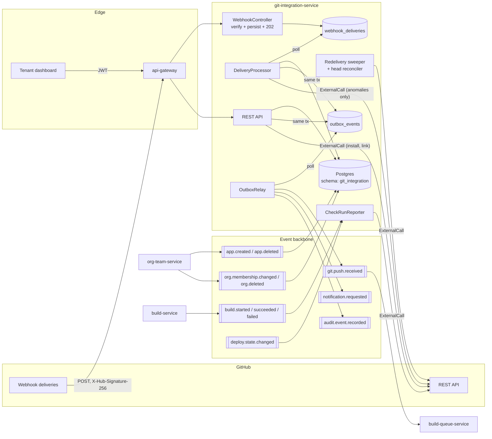
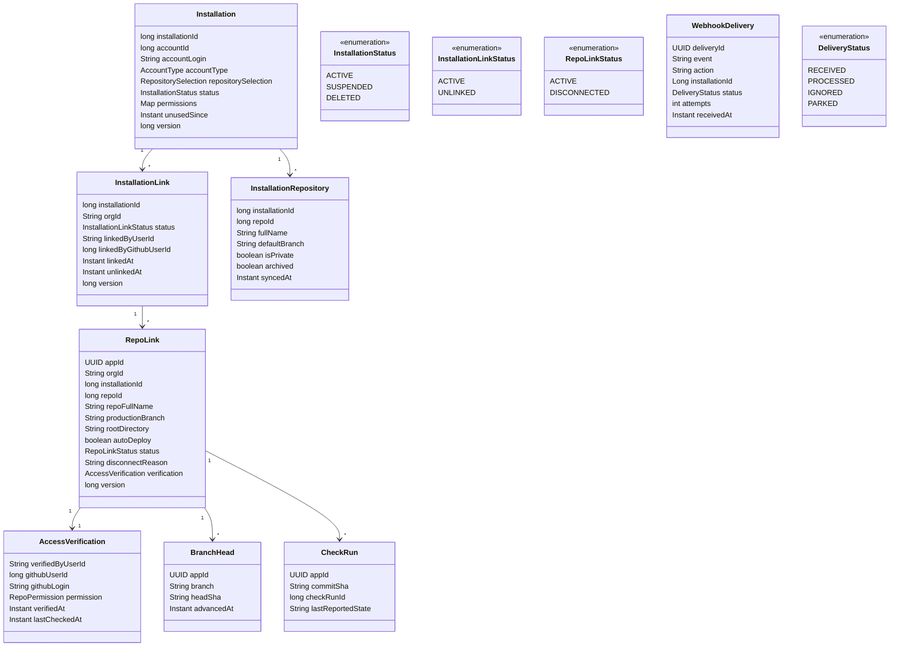
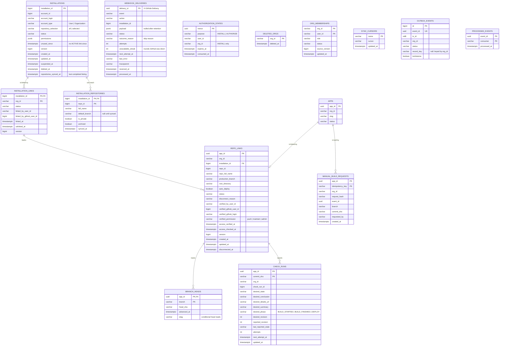
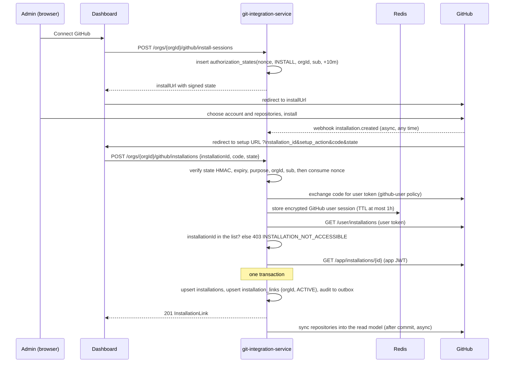
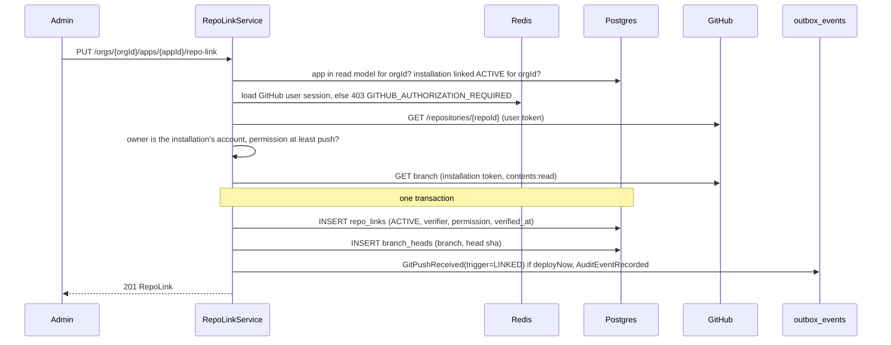
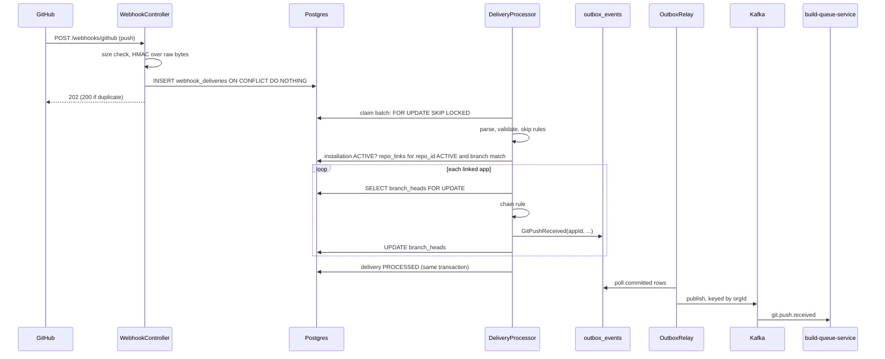
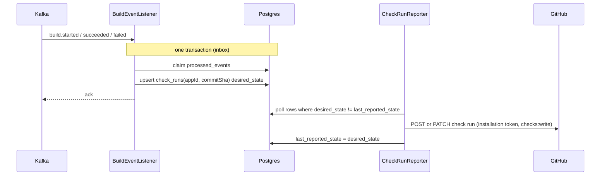

# git-integration-service: Architecture

Status: proposed design, pre-implementation. First service of `PROJECT.md` Build roadmap phase 3
(the build pipeline). Several decisions below change shared contracts or another service, and each
needs an ADR before its checkpoint starts; they are listed in
[Decisions that need an ADR](#decisions-that-need-an-adr).

`PROJECT.md` gives this service one paragraph: it "handles the GitHub or GitLab OAuth app, receives
push webhooks, and talks to the provider's API for repo metadata. This is the first place retries
and a circuit breaker matter, since GitHub's API has rate limits and the occasional outage that has
nothing to do with Pallet." It is also the first hop of the deploy path: "GitHub POSTs a push,
`git-integration-service` acknowledges it and publishes `git.push.received`." This document is the
full design.

Read these first, because this document assumes them rather than re-arguing them:
[ADR-0016](../adr/0016-org-team-service-production-design.md) and
[ADR-0017](../adr/0017-outbox-commit-order-and-relay-lock-timeout.md) (the outbox and inbox this
service reuses), [ADR-0018](../adr/0018-multi-org-per-account-and-per-request-authorization.md)
(no `org_id` on the token, authorization against a local membership read model),
[ADR-0012](../adr/0012-api-gateway-edge-architecture.md) and
[ADR-0013](../adr/0013-per-service-api-path-namespace.md) (how the webhook reaches this service),
and `docs/org-team-service/ARCHITECTURE.md` (the `App` aggregate that a repository is linked to).

## Contents

- [Purpose](#purpose)
- [Position in the system](#position-in-the-system)
- [Design goals and non-goals](#design-goals-and-non-goals)
- [GitHub App, not OAuth App](#github-app-not-oauth-app)
- [Domain model](#domain-model)
- [Data model](#data-model)
- [Event contracts](#event-contracts)
- [API](#api)
- [Authorization model](#authorization-model)
- [Shared installations](#shared-installations)
- [Processing pipelines](#processing-pipelines)
- [Webhook ingestion](#webhook-ingestion)
- [Talking to GitHub](#talking-to-github)
- [Recovering lost deliveries](#recovering-lost-deliveries)
- [Source access for the build pipeline](#source-access-for-the-build-pipeline)
- [Distributed systems mechanisms](#distributed-systems-mechanisms)
- [Consistency and failure modes](#consistency-and-failure-modes)
- [Security and threat model](#security-and-threat-model)
- [Observability and operations](#observability-and-operations)
- [Component view](#component-view)
- [Deployment and scaling view](#deployment-and-scaling-view)
- [Package layout and dependencies](#package-layout-and-dependencies)
- [Configuration](#configuration)
- [Changes this design needs elsewhere](#changes-this-design-needs-elsewhere)
- [Decisions that need an ADR](#decisions-that-need-an-adr)
- [Extension points](#extension-points)
- [Open questions / deferred](#open-questions--deferred)
- [Relationship to existing planning docs](#relationship-to-existing-planning-docs)

## Purpose

`git-integration-service` owns the connection between a Pallet organization and its source code
host. Today that host is GitHub; GitLab is a later adapter behind the same port. The service:

- Lets an org connect a GitHub account or GitHub organization to Pallet by installing the Pallet
  GitHub App, and proves that the person connecting it can see that installation. One installation
  can be connected to any number of Pallet orgs, so a person can use the same GitHub account from
  their personal org and from every team org they belong to.
- Links an app (the `App` aggregate `org-team-service` owns) to one repository, with a production
  branch, an optional root directory for monorepos, and an auto-deploy switch. Before a repository
  is linked, the service checks that the person linking it has write access to it on GitHub, and it
  keeps checking afterwards.
- Receives GitHub's webhooks, verifies them, stores them durably, and turns a push to a linked
  branch into a `git.push.received` event for every app that should build it.
- Reports build and deploy progress back to GitHub as check runs, so a developer sees Pallet's
  result next to the commit.
- Is the only Pallet service that holds the GitHub App's private key and webhook secret.

It is the platform's first service whose inbound traffic comes from a third party rather than from
a tenant with a Keycloak token. That changes the threat model: the webhook endpoint is public,
authenticated by an HMAC signature, and must answer GitHub within ten seconds whatever state the
rest of Pallet is in.

## Position in the system



Three kinds of traffic cross this service's boundary:

1. Inbound from GitHub: webhook deliveries. The only synchronous work on that request is
   signature verification and one insert. Everything else happens after the `202`.
2. Inbound from Pallet: dashboard requests through the gateway, and events from
   `org-team-service` (apps and memberships) and the build and deploy services (for check runs).
3. Outbound to GitHub: API calls, every one through `ExternalCall` under a named policy.

Nothing here calls another Pallet service synchronously. The org and app facts it needs arrive as
events and are kept in local read models, the same shape `notification-service`'s `org_members`
projection and ADR-0018 decision 4 describe.

## Design goals and non-goals

Goals:

- Never lose a push that GitHub delivered, including while Kafka, the processor, or this service's
  own later stages are down. Once a delivery is acknowledged, it is in Postgres.
- Answer GitHub fast (target p99 under 200 ms at the service) so its ten-second timeout never
  decides whether a push builds.
- Recover deliveries GitHub failed to hand over. GitHub does not redeliver failed webhooks on its
  own, so this service asks it to, and also checks branch heads directly as a last resort.
- Publish every event through the transactional outbox, so a committed state change and its event
  can't diverge.
- Consume every event through the transactional inbox, so a redelivery can't double-apply.
- Build the right commit exactly once per app per push, even when GitHub delivers pushes out of
  order or delivers the same push twice.
- Keep one tenant's GitHub trouble (an exhausted rate limit, a suspended installation) from
  delaying another tenant's builds.
- Hold GitHub credentials with the least privilege that works: short-lived installation tokens,
  scoped per call where possible, and a private key that never leaves this service.
- Treat all webhook content as untrusted input, from the headers to the commit message.
- Let an installation be shared between orgs without letting it become a way around GitHub's own
  permissions. An org only ever gets a repository that a member of it can push to on GitHub.
- Share one installation's GitHub rate limit fairly between the orgs using it.

Non-goals (this design):

- Pull request preview deployments. The data model leaves room for them
  ([Extension points](#extension-points)), but v1 builds only the production branch of a linked
  repository.
- GitLab, Bitbucket, or GitHub Enterprise Server. The provider port exists; only the GitHub adapter
  is built.
- Cloning, fetching, or storing source code. That is `build-service`'s job
  ([Source access](#source-access-for-the-build-pipeline)).
- Deciding build priority, concurrency, or coalescing of rapid pushes. That is
  `build-queue-service`'s job. This service reports each accepted push faithfully.
- Build configuration (build command, runtime, env vars). Those belong to the build and secrets
  services.
- Personal access tokens or deploy keys. The GitHub App is the only credential model.

## GitHub App, not OAuth App

`PROJECT.md` says "OAuth app". This design uses a GitHub App instead, which is what Vercel, Render,
Netlify and most current CI products use for the same job. The difference matters for a
multi-tenant platform:

| Concern | OAuth App | GitHub App |
|---|---|---|
| Whose authority | Acts as the user who authorized it, with every repo that user can reach | Acts as the app, only on repositories the installer selected |
| Permissions | Coarse scopes (`repo` grants read and write to all private repos) | Fine-grained: `contents: read`, `metadata: read`, `checks: write` and nothing else |
| Credential lifetime | Long-lived user token, stored by Pallet | Installation token valid for one hour, minted on demand, never stored |
| When the user leaves the company | Their token (and Pallet's access) goes with them | The installation belongs to the GitHub organization and keeps working |
| Webhooks | Per-repository hooks Pallet has to create and clean up | One app-level webhook URL receiving every installation's events |
| Rate limit | Shared with the user | Per installation, and it grows with the installation's size |

The permissions the Pallet GitHub App requests, and why:

| Permission | Level | Used for |
|---|---|---|
| Metadata | read | Mandatory for every app. Repository names, default branch, visibility. |
| Contents | read | Branch heads, compare API, and (for `build-service`) fetching source. Also required to receive `push` events. |
| Checks | write | Creating and updating check runs with build and deploy results. |

Webhook subscriptions: `push`, `installation`, `installation_repositories`, `repository`, and
`github_app_authorization`. `ping` arrives once when the webhook is configured. Anything else is
acknowledged and ignored.

The app also has "Request user authorization (OAuth) during installation" turned on, and the
dashboard can start GitHub's user authorization on its own at any time. The user token this
produces is used for exactly two things: proving which installations and repositories the person
can reach, and nothing else. It never acts on a repository. It is held briefly in a
[GitHub user session](#github-user-sessions) and never written to Postgres.

Installation tokens and user tokens reach different things. An installation token reaches every
repository the installer selected. A user token issued to a GitHub App reaches only repositories
that both the app's installation and that user can access. Sharing an installation between orgs is
safe only because every repository link is checked with the second kind of token, never the first
([Shared installations](#shared-installations)).

## Domain model



The aggregates, and the question each one answers:

- `Installation`: a GitHub installation of the Pallet app and its state on GitHub's side. It holds
  only GitHub facts (account, permissions, suspended or not) and belongs to no org. The row exists
  from the moment GitHub tells us about it.
- `InstallationLink`: one org's connection to one installation. An installation may have any
  number of links, one per org, each created by a member of that org who proved on GitHub that
  they can see the installation. Unlinking removes one org's access and leaves the others alone.
- `InstallationRepository`: a local copy of which repositories the installation can reach. It is
  a read model of GitHub's state, kept current by webhooks and a periodic sync. It is used
  internally (lifecycle handling, archived flags) and never shown to a user as is, because an
  installation can reach repositories that a given member of a given org can't
  ([Shared installations](#shared-installations)).
- `RepoLink`: which repository, branch and directory an app builds from, and who proved the org
  may have it. At most one per app. Several apps may link the same repository (a monorepo with a
  different `rootDirectory` per app, or the same repository used by apps in different orgs), so one
  push can fan out to several apps in several orgs.
- `AccessVerification`: part of `RepoLink`, not a separate aggregate. The GitHub user who vouched
  for the link, the permission they had on the repository when they did, and when that was last
  confirmed.
- `BranchHead`: the last commit this service accepted as the head of an app's branch. It is what
  makes duplicate and out-of-order push detection possible ([The chain rule](#the-chain-rule)).
- `WebhookDelivery`: one delivery from GitHub, stored before it is acknowledged. The durable
  inbox between GitHub and the rest of this service.
- `CheckRun`: the GitHub check run this service created for an app and commit, so later build
  and deploy events update it rather than creating a second one.

Two read models built from other services' events are not aggregates here and have no API of their
own: `apps` (from `app.created`/`app.deleted`) and `org_memberships` (from the compacted
`org.membership.changed` topic, see [Authorization model](#authorization-model)).

A GitHub user session is not an aggregate either. It lives in Redis for at most an hour and holds
a user token ([GitHub user sessions](#github-user-sessions)).

Repositories are identified by GitHub's numeric `repoId`, never by `owner/name`. A repository can
be renamed or transferred, which changes its name but not its id. `fullName` is a display
projection, refreshed from `repository` webhooks.

## Data model

One Postgres schema, `git_integration` (shared cluster, schema per service, ADR-0007). Flyway is
the only schema authority; Hibernate is `validate`-only.



`outbox_events` and `processed_events` are `platform-common-outbox`'s reference schema (ADR-0020),
qualified to `git_integration`: the same columns and semantics as in `org-team-service` (ADR-0016,
ADR-0017, including `tx_id xid8` for commit-order delivery) plus `record_key` and `tombstone`. Only
the columns this document refers to are drawn; `OutboxSchemaAssertions` keeps the copy in step with
the module.

Columns and tables beyond the domain model above, each added for a later mechanism:
`webhook_deliveries.outcome_reason` (the skip reason push processing records),
`webhook_deliveries.unavailable_streak` (the processor's backoff while GitHub is down, which must not
spend an attempt),
`branch_heads.etag` (the reconciler's conditional head reads), the `check_runs.desired_*`,
`attempts`, `next_attempt_at` and `org_id` columns (the check run reporter's intent rows), and
`check_runs.desired_revision` / `reported_revision` (a completed check can still change its conclusion,
so equal states don't mean delivered; see [Check run reporting](#check-run-reporting)),
`manual_build_requests` (manual-build idempotency and the per-app hourly limit),
`repo_links.disconnected_at` and `installations.deleted_at` (retention),
`installations.repositories_synced_at` (the periodic repository sync's oldest-first order; a `304`
counts as synced, so an unchanged installation moves to the back too), a nullable
`installation_repositories.default_branch` (`installation_repositories.added` names no branch, so an
added repository has none until the next sync), and `deleted_orgs` (the
membership gate answers `404` for an org it knows is deleted, which `org_memberships` alone can't
say without turning every member into a `403`).

Constraints and indexes:

- `installations(installation_id)` primary key: one row per GitHub installation, whoever uses it.
- `installation_links(installation_id, org_id)` primary key: an org links an installation once.
  Relinking after an unlink flips the same row back to `ACTIVE`. `installation_links(org_id) WHERE
  status = 'ACTIVE'` backs the org's installation list; `installation_links(installation_id) WHERE
  status = 'ACTIVE'` backs lifecycle fan-out (who to tell when an installation is suspended).
- `repo_links(app_id)` primary key: one repository per app. The composite foreign key
  `(org_id, app_id) → apps(org_id, app_id)` makes it impossible to link an app from another org.
- `repo_links(installation_id, org_id) → installation_links(installation_id, org_id)`: a repo link
  can only use an installation this org has linked. The database refuses a cross-tenant link even
  if the application check has a bug. Unlinking an installation disconnects its repo links in the
  same transaction, so an `ACTIVE` repo link never sits on an `UNLINKED` installation link.
- `repo_links` verification columns are `NOT NULL` when `status = 'ACTIVE'` (a check constraint):
  an active link without a recorded verifier can't exist.
- `repo_links(repo_id) WHERE status = 'ACTIVE'`: the push fan-out lookup, the hottest query in the
  service. `repo_links(access_checked_at) WHERE status = 'ACTIVE'`: the re-verification job's scan.
- `installations(unused_since) WHERE unused_since IS NOT NULL AND status IN ('ACTIVE', 'SUSPENDED')`:
  the unused installation sweep.
- `webhook_deliveries(delivery_id)` primary key: GitHub keeps the same GUID when it redelivers, so
  the insert is also the dedupe.
- `webhook_deliveries(next_attempt_at) WHERE status = 'RECEIVED'`: the processor's scan.
- `authorization_states(nonce)` primary key, consumed with
  `UPDATE ... SET consumed_at = now() WHERE nonce = ? AND consumed_at IS NULL AND expires_at > now()`,
  so a state value works once.
- `check_runs(app_id, commit_sha)` primary key: at most one check run per app and commit.
  `check_runs(next_attempt_at) WHERE reported_revision IS DISTINCT FROM desired_revision`: the
  reporter's scan. `commit_sha` must be 40 lowercase hex characters, and `desired_conclusion` is set
  exactly when `desired_state = 'completed'` (check constraints).
- `manual_build_requests(app_id, idempotency_key)` primary key: a retried `Idempotency-Key`
  returns the first result. `manual_build_requests(app_id, created_at)` backs the hourly limit.
- `branch_heads(app_id) → repo_links(app_id) ON DELETE CASCADE`: a swept link takes its heads
  with it. `head_sha` must be 40 lowercase hex characters.
- `authorization_states`: `org_id` is present exactly when `purpose = 'INSTALL'` (a check
  constraint).
- `apps` and `org_memberships` are read models. Their rows are written only by listeners, never by
  the API.
- Every tenant table has `org_id`, and every repository method on one takes it as a parameter. An
  ArchUnit rule fails the build otherwise, the same rule `org-team-service` has. `installations`,
  `installation_repositories` and `webhook_deliveries` are the exceptions: GitHub data keyed by
  GitHub ids, never returned to a caller without going through an org's `installation_links` row.

## Event contracts

### Consumed

| Event | Source | Effect here |
|---|---|---|
| `AppCreated` | org-team-service | Insert into the `apps` read model. |
| `AppDeleted` | org-team-service | Mark the app `DELETED` in the read model; if it has a repo link, set it `DISCONNECTED` (`APP_DELETED`). Pushes for it stop immediately. |
| `OrgMembershipChanged` | org-team-service | Upsert `(orgId, userId, role, status)` into `org_memberships` if `membershipVersion` is higher than the row's `source_version`. Read from the compacted `org.membership.changed` topic; see [Authorization model](#authorization-model). |
| `OrgDeleted` | org-team-service | Mark every membership `REMOVED`, set every repo link `DISCONNECTED` (`ORG_DELETED`), set every one of the org's installation links `UNLINKED`. Other orgs' links to the same installations are untouched, and the GitHub installation itself is left alone ([Unused installations](#unused-installations)). |
| `BuildStarted`, `BuildSucceeded`, `BuildFailed` | build-service | Create or update the check run for `(appId, commitSha)`. No consumer traffic until `build-service` ships. |
| `DeployStateChanged` | deploy-orchestrator-service | Update the same check run with the deploy outcome and the live URL. No traffic until phase 4. |

Every listener uses the transactional inbox, with one exception: the `OrgMembershipChanged`
listener. Its idempotency is the version check, which is stronger. A rebuild truncates
`org_memberships` and replays the compacted topic from offset zero, and an inbox would still hold
the event ids from the first pass and skip every one of them
([The membership read model](#the-membership-read-model)). The check-run listeners do their GitHub
call after the inbox transaction commits a `check_runs` intent row, not inside it
([Check run reporting](#check-run-reporting)).

`AppCreated` never changes an existing `apps` row, and `AppDeleted` for an unknown app inserts it
already `DELETED`. Kafka keeps no order across `app.created` and `app.deleted`, so a late create
then can't bring a deleted app back. An `appId` announced under a second org is dead-lettered, never
moved: an app never changes tenant.

This service does not consume `org.member.added`, `org.member.removed` or
`org.member.role.changed`. They stay as they are for their existing consumers, but a read model
built from three topics can apply a role change before the add it follows, because Kafka keeps no
order across topics. `org.membership.changed` carries the whole current state of one membership
on one topic, so the latest record always wins.

### Published

Every event is appended to the outbox in the same transaction as the state change that produced
it.

| Event | Topic | Trigger | Consumers |
|---|---|---|---|
| `GitPushReceived` | `git.push.received` | A push accepted for a linked app, a manual build request, a link created with `deployNow`, or a head the reconciler found | build-queue-service |
| `NotificationRequested` | `notification.requested` | `GIT_CONNECTION_LOST` to the admins of every affected org: installation suspended or deleted, a repository removed from the installation, or a repo link disconnected because its verifier lost access | notification-service |
| `AuditEventRecorded` | `audit.event.recorded` | Every API mutation, every installation lifecycle change, every access re-verification that disconnects a link | audit-log-service (future) |

`GitPushReceived` already exists in `platform-common-events` with `repo`, `branch`, `commitSha`.
That is not enough for the build pipeline: `build-queue-service` needs to know which app, and
`build-service` needs to know where to fetch from and which directory to build. The record gains
fields, all additive (ADR-0006), none renamed:

| Field | Type | Meaning |
|---|---|---|
| `repo` | string | Existing. The repository's `owner/name` at the time of the push. Display only. |
| `branch` | string | Existing. Short branch name, without `refs/heads/`. |
| `commitSha` | string | Existing. The commit to build (GitHub's `after`). |
| `appId` | string | New. The app this push builds. One event per linked app. |
| `provider` | string | New. `GITHUB` today. |
| `installationId` | long | New. Which installation to fetch through. |
| `repoId` | long | New. Stable repository id. |
| `rootDirectory` | string | New. The link's root directory at the time of the push, so a later change to the link can't change what an in-flight build fetches. |
| `beforeSha` | string | New. GitHub's `before`. All zeros for a new branch. |
| `forced` | boolean | New. Force push. |
| `trigger` | string | New. `WEBHOOK`, `MANUAL`, `LINKED`, or `RECONCILED`. |
| `headCommitMessage` | string | New. First line of the head commit message, at most 256 characters. Untrusted text. |
| `headCommitAuthor` | string | New. The GitHub login of the author, or the name if there is no login. Never an email address. |
| `deliveryId` | string | New. GitHub's delivery GUID, null unless `trigger = WEBHOOK`. For tracing a build back to a delivery. |

The event is keyed by `orgId`, like every event on the backbone, so all pushes for an org keep
their order in the partition. When one push fans out to apps in several orgs, each org gets its
own event on its own key; no org's event carries another org's app. The `eventId` is a UUIDv5 over
`(deliveryId or trigger nonce, appId)`, so a processing retry that got as far as writing the outbox
row cannot produce a second event with a different id.

The name `git.push.received` stays for `MANUAL`, `LINKED` and `RECONCILED` triggers even though no
`git push` happened: to the build pipeline, all four mean "this app should build this commit", and
one topic keeps `build-queue-service` a single consumer. `trigger` tells them apart.

No credential ever appears in an event. See
[Source access for the build pipeline](#source-access-for-the-build-pipeline).

Contract requirements on the build and deploy events: `BuildStarted`, `BuildSucceeded` and
`BuildFailed` must carry `appId`, `commitSha` and the originating `GitPushReceived.eventId`;
`DeployStateChanged` must carry `appId` and `commitSha` in addition to `deploymentId`. Since neither
service's design existed yet, `platform-common-events` defines the minimal records as the contract
this service consumes (`buildId`, `appId`, `commitSha`, `pushEventId`, plus `reason` on
`BuildFailed`; `appId`, `commitSha` and `url` added to `DeployStateChanged`, all nullable), and
`build-service` extends them additively. Without
them, this service would need a lookup table from build ids to commits, maintained from a stream
it doesn't own. The requirement goes into `build-service`'s and `deploy-orchestrator-service`'s
designs as an input.

## API

Base path `/api/v1/git-integration` (ADR-0010's prefix plus ADR-0013's per-service namespace).
Paths below omit it. Responses are `ApiResponse<T>`, lists are `PageResponse<T>` inside it, errors
are `ErrorResponse` through `GlobalExceptionHandler`. "Requires" means the caller's role in the
local `org_memberships` read model ([Authorization model](#authorization-model)), never a token
claim. "Session" means the endpoint also needs the caller's
[GitHub user session](#github-user-sessions); without one it answers
`403 GITHUB_AUTHORIZATION_REQUIRED` and the dashboard starts GitHub authorization, which is a
redirect with no prompt once the user has authorized the app before.

### Webhook (public)

| Method | Path | Notes |
|---|---|---|
| `POST` | `/webhooks/github` | GitHub only. Authenticated by `X-Hub-Signature-256`, not by a bearer token. `202` when stored, `200` for a duplicate or `ping`, `401` for a bad signature, `413` over the size limit, `415` for a body that isn't `application/json` and `400` for bad delivery headers or a payload that isn't JSON (both only after the signature passes), `503` when Postgres is unreachable. Needs a gateway `public-paths` entry and a rate-limit exemption, see [Webhook ingestion](#webhook-ingestion). |

### GitHub user session

Not org-scoped: a session belongs to the Pallet user (`sub`), whichever org they are working in.

| Method | Path | Requires | Notes |
|---|---|---|---|
| `POST` | `/github/authorizations` | any authenticated caller | Returns `{authorizeUrl, expiresAt}` for GitHub's user authorization page, with a signed, single-use state bound to `sub`. |
| `POST` | `/github/authorizations/complete` | any authenticated caller | `{code, state}` from GitHub's redirect. Exchanges the code, stores the session. `200` with `{githubLogin, expiresAt}`. |
| `GET` | `/github/session` | any authenticated caller | `{githubLogin, expiresAt}` or `404` when there is none. Never returns the token. |
| `DELETE` | `/github/session` | any authenticated caller | Ends the session. `204`. |
| `GET` | `/github/installations` | session | Installations the caller's GitHub user can see (`GET /user/installations`), with the account name and whether the app is suspended. What the dashboard offers when an org links an installation that already exists. |

### Installations

| Method | Path | Requires | Notes |
|---|---|---|---|
| `POST` | `/orgs/{orgId}/github/install-sessions` | ADMIN+ | Starts a fresh install on GitHub. Returns `{installUrl, expiresAt}`; `installUrl` is `https://github.com/apps/{slug}/installations/new?state={state}`. State lives ten minutes. |
| `POST` | `/orgs/{orgId}/github/installations` | ADMIN+ | Links an installation to the org. Either `{installationId, code, state}` straight from a fresh install's redirect (which also creates the session), or `{installationId}` with an existing session, for an installation another org already uses. Both verify that the caller's GitHub user can see the installation. `201` with the link, `200` if this org already had it linked. See [Connecting an installation](#connecting-an-installation). |
| `GET` | `/orgs/{orgId}/github/installations` | any member | The org's linked installations and their status. |
| `GET` | `/orgs/{orgId}/github/installations/{installationId}/repositories` | DEVELOPER+, session | Repositories in this installation that the caller can reach on GitHub (`GET /user/installations/{id}/repositories`), each with the caller's permission and whether it is linkable. Never the installation's full list. `q` filters by name prefix. |
| `DELETE` | `/orgs/{orgId}/github/installations/{installationId}` | ADMIN+ | Unlinks the installation from this org only and disconnects this org's repo links that used it. Other orgs keep theirs. Does not uninstall the app from GitHub. `204`. |

### Repository links

| Method | Path | Requires | Notes |
|---|---|---|---|
| `PUT` | `/orgs/{orgId}/apps/{appId}/repo-link` | ADMIN+, session | `{installationId, repoId, productionBranch?, rootDirectory?, autoDeploy = true, deployNow = false}`. The installation must be linked to this org, and the caller must hold at least `push` on the repository on GitHub, checked with their own token ([Shared installations](#shared-installations)). Branch defaults to the repository's default branch and must exist. Emits a `LINKED` push for the branch head only when `deployNow` is `true`. `201` on create, `409 REPO_LINK_EXISTS` if the app already has an active link. |
| `GET` | `/orgs/{orgId}/apps/{appId}/repo-link` | any member | Link, status, disconnect reason, last accepted head, who verified access and when it was last confirmed, and `warnings` (`REPOSITORY_ARCHIVED` for an active link whose repository was archived on GitHub). |
| `PATCH` | `/orgs/{orgId}/apps/{appId}/repo-link` | DEVELOPER+ | `productionBranch`, `rootDirectory`, `autoDeploy` only, plus the required `version`; any other field is a `400`. An absent field is unchanged; an empty `rootDirectory` builds from the repository root. A new branch must exist on GitHub (`422 BRANCH_NOT_FOUND`), and changing it deletes the old branch's `BranchHead`. A stale `version` is `409 CONCURRENT_MODIFICATION`. |
| `POST` | `/orgs/{orgId}/apps/{appId}/repo-link/verification` | ADMIN+, session | Makes the caller the link's verifier, after the same access check as linking. For handing over before the current verifier leaves the GitHub organization. `200`; a caller who fails the check changes nothing. `409 CONCURRENT_MODIFICATION` if the link was re-created on another repository during the check. |
| `DELETE` | `/orgs/{orgId}/apps/{appId}/repo-link` | ADMIN+ | Sets the link `DISCONNECTED` (`UNLINKED_BY_USER`). `204`. |
| `POST` | `/orgs/{orgId}/apps/{appId}/repo-link/builds` | DEVELOPER+ | `{branch?}` defaults to the production branch; a commit can't be named. Resolves the branch head on GitHub and emits a `MANUAL` push whose `beforeSha` is the branch's accepted head, or zeros. Requires the header `Idempotency-Key` (1–128 of `[A-Za-z0-9_-]`, else `400`); a retry with the same key and request returns the first result without calling GitHub or counting against the limit, and the same key with another request is `409 IDEMPOTENCY_KEY_REUSE`. The event id is derived from the key, so a retry after a crash names the same event. Limited per app (`manual-builds-per-hour`, `429` with `meta.retryAfter`) because it spends a budget other orgs share; the count is taken again under the link's row lock, so it is exact. `404 REPO_LINK_NOT_FOUND` without an active link, `409 INSTALLATION_SUSPENDED`, `422 BRANCH_NOT_FOUND`. `202` with `{eventId, commitSha, branch}`. |

A manual build never moves `branch_heads`. It asks for a build of what is there; a head only
advances on pushes and reconciliation, so the chain rule's view of what was last accepted from
GitHub's push stream is never changed by a user action.

Changing which repository an app deploys from decides what code runs under the org's name, so it
needs ADMIN in Pallet and push access on GitHub. Tuning the link (branch, directory, auto-deploy)
is day-to-day developer work and needs neither a session nor a new access check, because it can't
change which repository is built.

`autoDeploy` and `deployNow` are separate on purpose. `autoDeploy` says whether future pushes
build. `deployNow` says whether to build the current head right away. The dashboard's import flow
sends `deployNow: true`; someone linking a repository to test the connection gets no deploy.

### Error catalog

All extend `AppException`. None needs an `@ExceptionHandler`.

| Code | Status | When |
|---|---|---|
| `ORG_NOT_FOUND` | 404 | No membership row for `(sub, orgId)`, or the org is deleted. Indistinguishable on purpose (ADR-0018). |
| `NOT_A_MEMBER` | 403 | A membership row exists but is `REMOVED`. |
| `INSUFFICIENT_ROLE` | 403 | The caller's role is below the endpoint's floor. |
| `APP_NOT_FOUND` | 404 | The app is not in this org's read model, or is deleted. |
| `GITHUB_AUTHORIZATION_REQUIRED` | 403 | The endpoint needs a GitHub user session and there is none, or it expired. The dashboard starts authorization and retries. |
| `GITHUB_SESSION_NOT_FOUND` | 404 | `GET /github/session` when the caller has no session. |
| `INVALID_AUTHORIZATION_STATE` | 400 | State signature, expiry, org, user, purpose, or single-use check failed. |
| `INSTALLATION_NOT_ACCESSIBLE` | 403 | The caller's GitHub user can't see the installation they tried to link. |
| `INSTALLATION_NOT_FOUND` | 404 | Not linked to this org. |
| `INSTALLATION_SUSPENDED` | 409 | The installation is suspended on GitHub; linking or building is refused until it is unsuspended. |
| `REPOSITORY_NOT_ACCESSIBLE` | 403 | The caller can't reach the repository through this installation. One code for "the installation can't reach it" and "the caller can't", so the response never reveals which private repositories an installation holds. |
| `REPOSITORY_PERMISSION_TOO_LOW` | 403 | The caller can see the repository but has less than `push`. Safe to say, since they already see it. |
| `REPOSITORY_ARCHIVED` | 422 | Archived repositories can't be linked. |
| `BRANCH_NOT_FOUND` | 422 | The branch doesn't exist on GitHub. |
| `INVALID_ROOT_DIRECTORY` | 400 | Absolute, contains `..`, has a `.` or empty segment, a backslash or a control character, or is longer than 255 characters. A trailing `/` is dropped. |
| `REPO_LINK_EXISTS` | 409 | The app already has an active link. |
| `REPO_LINK_NOT_FOUND` | 404 | The app has no active link. |
| `TOO_MANY_REQUESTS` | 429 | Manual build limit for the app reached (the existing `TooManyRequestsException`). |
| `IDEMPOTENCY_KEY_REUSE` | 409 | A manual build's `Idempotency-Key` was already used for a different request (the existing `IdempotencyKeyReuseException`). |
| `GITHUB_RATE_LIMITED` | 503 | The installation's GitHub budget is spent. The wait is `meta.retryAfter` (seconds) in the body, the way `TOO_MANY_REQUESTS` carries it; `GlobalExceptionHandler` renders no `Retry-After` header. |
| `CONCURRENT_MODIFICATION` | 409 | Optimistic lock lost (existing mapping). |
| `WEBHOOK_SIGNATURE_INVALID` | 401 | Missing or wrong `X-Hub-Signature-256`. The body says nothing about why. |
| `PAYLOAD_TOO_LARGE` | 413 | Webhook body over `webhook.max-body`, by `Content-Length` or while reading. |
| `UNSUPPORTED_MEDIA_TYPE` | 415 | A signed webhook that isn't `application/json`. |
| `INVALID_WEBHOOK_HEADERS` | 400 | A signed webhook whose `X-GitHub-Event` or `X-GitHub-Delivery` is missing or malformed. |
| `MALFORMED_WEBHOOK_PAYLOAD` | 400 | A signed webhook body that isn't one JSON object, breaks a parser limit, or has a non-string `action` or a non-positive `installation.id`. |
| `WEBHOOK_BODY_UNREADABLE` | 400 | The connection failed while the webhook body was being read. |
| `SERVICE_UNAVAILABLE` | 503 | Postgres is unreachable (`platform-common-exception`'s mapping of `DataAccessResourceFailureException`, `CannotCreateTransactionException` and their transient kin). |
| `EXTERNAL_SERVICE_ERROR` | 502 | GitHub failed after retries, or a GitHub breaker is open (the existing `ExternalServiceException` mapping). |

## Authorization model

This is the first service built after ADR-0018, so it adopts that ADR's decision 4 from the first
commit: the path's `orgId` is checked against a local membership read model, and nothing about the
org is read from the token. Repository operations add a second, independent check on GitHub's side.

1. The resource server validates the token and the session registry (ADR-0015), exactly as in
   every other service. `spring-data-redis` is a dependency so the registry is Redis-backed.
2. The membership gate reads `org_memberships` by `(orgId, sub)`:
   - No row, or the org is known to be deleted: `404 ORG_NOT_FOUND`.
   - A `REMOVED` row: `403 NOT_A_MEMBER`.
   - Otherwise the endpoint's role floor is checked against the row's role
     (`@PreAuthorize("@access.atLeast(#orgId, 'DEVELOPER')")`, the same `AccessEvaluator` shape as
     `org-team-service`).
3. Any `appId` in the path is checked against the `apps` read model scoped to `orgId`; an app from
   another org is `404 APP_NOT_FOUND`. Any `installationId` is checked against this org's
   `ACTIVE` installation link; another org's installation is `404 INSTALLATION_NOT_FOUND`.
4. Endpoints that choose a repository also check the caller's GitHub access with their own GitHub
   token ([Shared installations](#shared-installations)). A Pallet role never grants access to a
   repository on its own.

### The membership read model

`org-team-service` publishes an `OrgMembershipChanged` record to `org.membership.changed` in the
same outbox transaction as every membership change: `orgId`, `userId`, `role` (lowercase Keycloak
name), `status` (`ACTIVE` or `REMOVED`), and `membershipVersion` (the membership row's optimistic
`version`). The topic is compacted and keyed by `orgId:userId`, so Kafka keeps the latest record
for every membership indefinitely.

That solves seeding. A service deployed after the fact, or one whose read model is rebuilt,
consumes the topic from the beginning and ends up with every current membership, without the
history the incremental `org.member.*` topics would need and no longer hold. A removed member is
published as a `REMOVED` record, not a tombstone: tombstones disappear after compaction, and a
consumer seeding later could no longer tell `403 NOT_A_MEMBER` from `404`. Tombstones are published
only when `org-team-service` purges a deleted org's data.

The consumer applies a record only if `membershipVersion` is greater than the row's
`source_version`. A replay from the start, a redelivery, or a record that arrives late can then
never move a membership backwards. The check is the `WHERE` on the upsert's conflict branch, so it
holds in the database under any concurrency, with no read-compare-write in Java. A tombstone deletes
the row. A record whose key is not exactly `orgId:userId`, whose payload disagrees with its key, or
whose role or status is not one of the known values is dead-lettered, never mapped to something
close.

`OrgDeleted` records the org in `deleted_orgs` and sets each of its memberships to `REMOVED`
**without** touching `source_version`. The state topic then delivers the authoritative `REMOVED`
records with higher versions, and they still apply. Until they arrive a state record that predates
the deletion can briefly set a membership back to `ACTIVE`, which is why the gate checks
`deleted_orgs` before it reads the membership.

This listener runs in its own consumer group, `<spring.kafka.consumer.group-id>.membership-state`
(`git-integration-service.membership-state` in every environment), and it is the one listener
without the transactional inbox (see [Consumed](#consumed)). Rebuilding the read model therefore
touches nothing else the service consumes:

1. Stop the group's consumers: scale the service to zero, or stop the `membership-state-listener`
   container.
2. `TRUNCATE git_integration.org_memberships`.
3. `kafka-consumer-groups --bootstrap-server <broker> --group git-integration-service.membership-state
   --topic org.membership.changed --reset-offsets --to-earliest --execute`.
4. Start again. The table is back once the group has no lag.

`MembershipRebuildIntegrationTest` runs exactly this procedure. `apps` and `deleted_orgs` could be
rebuilt the same way from `app.*` and `org.deleted` only while those delete-policy topics still hold
the whole history, and their listeners use the inbox, so such a rebuild would also have to delete
those consumers' `processed_events` claims. They are never truncated casually.

The read model lags `org-team-service` by the outbox poll interval plus consumer lag, normally well
under a second. A newly added member may see `404` for that window, and a removed member keeps
access for the same window. That window is the price of ADR-0018's no-synchronous-call rule and is
observable (`git.authz.projection_lag_seconds`, measured from each record's `occurredAt`).

The topic is platform-wide, not specific to this service: every future tenant-scoped service reads
it the same way.

## Shared installations

A GitHub account can install the Pallet app only once, so the same installation has to serve every
Pallet org its users want to deploy from: a person's personal org and each team org they belong to,
or several team orgs inside one company. Any org can link any installation its admin can see on
GitHub.

Sharing the installation is safe only if an org can never get more from it than its own members
could get from GitHub directly. An installation token reads every repository the installer
selected, which for a company installation can be hundreds of repositories, while any one
employee can reach only some of them. If linking checked only "can this user see the
installation", an employee with read access to one repository could link a different, private
one into their personal org and have Pallet build it. The build output contains the source, so
that is a leak of code they were never allowed to read.

Three rules close that:

1. **Every repository link is vouched for by a GitHub user with at least `push` on that
   repository**, checked with that user's own token at link time. `push` rather than read access,
   because deploying a repository from a Pallet org is a decision someone with write access
   should make, and a read-only collaborator (a contractor, an auditor) should not be able to wire
   a company repository into their own org. The floor is configurable
   (`pallet.git.link.min-repo-permission`).
2. **The check keeps happening after the link exists.** A daily job confirms each verifier still
   has that permission ([Access re-verification](#access-re-verification)). Someone who leaves the
   company, or is removed from the repository, stops being able to keep a build of it running in
   their own org.
3. **Nothing the installation can reach is shown to a user unless the user can reach it too.** The
   repository picker lists what the user's token returns, never the installation read model. Error
   codes don't distinguish "the installation can't reach it" from "you can't".

The org's other members don't each need GitHub access to the repository: once linked, the org
builds it, the same way a company's CI builds a repository for people who never cloned it. The
verifier is the person who answered for that decision, and the audit trail names them.

### GitHub user sessions

A user token is needed whenever the service must answer "what can this person reach on GitHub":
listing installations, listing repositories in the picker, linking, and taking over as verifier.
Those happen together over a few minutes of dashboard use, so the token is held for a short time:

- GitHub issues it through its user authorization flow. The flow is started by
  `POST /github/authorizations`, or comes from the install flow's redirect, which carries a `code`
  because the app requests user authorization during installation. A user who has authorized the
  app before goes through the redirect without seeing a prompt.
- The service exchanges the code (`github-user` policy), calls `GET /user` for the GitHub user id
  and login, and stores `{token, githubUserId, githubLogin, expiresAt}` in Redis under
  `git:user-session:{sub}`, encrypted with AES-GCM under `pallet.git.user-session.encryption-key`.
  The key's TTL is the shorter of one hour and the token's own lifetime.
- The refresh token GitHub returns is thrown away. When the session ends, the user authorizes again.
  That keeps Pallet from holding a credential that lasts months.
- A second index key, `git:user-session-by-github:{githubUserId}`, is the set of `sub`s whose
  session was issued to that GitHub user (one GitHub account can sign in to several Pallet
  accounts), kept for `max-ttl` after the latest save, so a `github_app_authorization.revoked`
  webhook deletes every one of them at once. A member is checked against its session before
  anything is deleted, so a stale member never ends a session issued to another GitHub user.
- The token is never logged, never put in an event, never written to Postgres, and never used for
  anything except the read-only access checks listed above. Every repository operation that acts
  (reading a branch head, creating a check run) uses an installation token.

Redis being unavailable means no sessions: linking and the repository picker return
`502 EXTERNAL_SERVICE_ERROR`, and everything else (webhooks, pushes, builds, reading links)
keeps working.

### Checking access at link time

With the caller's session, `RepoAccessVerifier` first calls `GET /repositories/{repoId}` with the
user token. GitHub answers `200` only when the user and some installation of the app can reach the
repository, and the response carries the user's own `permissions` on it. That some installation
reaches it isn't enough: the same app can have another installation that does. So a second step
proves the named one does, by minting an installation token narrowed to `repository_ids: [repoId]`
and `contents: read`, which GitHub refuses (`422`) for a repository outside the installation's
selection, and reading the branch head with it:

| GitHub result | Response |
|---|---|
| `404` | `403 REPOSITORY_NOT_ACCESSIBLE` |
| `200`, but the repository's owner is not the installation's account | `403 REPOSITORY_NOT_ACCESSIBLE` |
| `200`, archived | `422 REPOSITORY_ARCHIVED` |
| `200`, below `link.min-repo-permission` (`push` by default) | `403 REPOSITORY_PERMISSION_TOO_LOW` |
| `200`, at or above; the repository-scoped mint refused | `403 REPOSITORY_NOT_ACCESSIBLE` |
| `200`, at or above; the branch missing | `422 BRANCH_NOT_FOUND` |
| `200`, at or above; branch found | Link, recording the GitHub user and the highest permission of `admin` > `maintain` > `push` as the verification |

The second row matters because a user token also reaches repositories the user owns elsewhere; the
repository must belong to the installation the link names, or `build-service` couldn't fetch it.
Every "can't reach" row answers with the same body, so no response reveals which private
repositories an installation holds. No mint happens until the user check has passed.

### Access re-verification

Every `reverify.interval`, under an advisory lock, `AccessReverifier` takes the `ACTIVE` repo links
on `ACTIVE` installations last checked at least `reverify.min-age` ago, in turns: each org's least
recently checked link on each installation, then each one's second, oldest first within a turn, so
an org with hundreds of links can't push another org's few to the back. Installations under their
budget reserve are passed over, and a run stops at `reverify.max-per-run`. Each installation's links
are checked one after another, with one metadata-only installation token for the whole installation,
asking GitHub for the verifier's role on the repository:
`GET /repositories/{repoId}/collaborators/{githubLogin}/permission` (the id form of
`/repos/{owner}/{repo}/...`, so a renamed repository needs nothing). `role_name` is mapped
(`admin`, `maintain`, `write` → `push`, `triage`, `read`); a custom role counts as the base
`permission` GitHub reports under it.

| GitHub answer | Outcome | Effect |
|---|---|---|
| `200`, role at or above the floor, for the verifier's account id | `CONFIRMED` | `access_checked_at = now()`, `verified_permission` and `verified_github_login` updated; `version` unchanged |
| `200`, role below the floor (including `none`) | `LOST` | disconnect |
| `404`, or a `200` for another account id | follow the verifier by id: `GET /user/{githubUserId}` | login changed → ask again once with the new login; account gone (`404`) → `LOST`; same login → `UNKNOWN` (the repository is what's missing, and the repository lifecycle handles that) |
| rate limit, `5xx`, timeout, open breaker | `UNKNOWN` | leave it; a rate limit ends the installation's turn, GitHub being unavailable ends the run |

Each answer is applied in its own short transaction, with no GitHub call inside, and only if the
link still has the verifier id and `version` it was checked against, so a verifier handover or a
settings change committed during the check wins and the stale answer is dropped. `LOST` locks the
installation row and then the link, the order every teardown takes them in, and goes through
`ConnectionTeardown.verifierAccessLost`: `DISCONNECTED` (`VERIFIER_ACCESS_LOST`), branch heads
deleted, a `git.repo_link.disconnected` and a `git.repo_link.verifier_access_lost` audit record
(verifier login, previous and current role), and one `GIT_CONNECTION_LOST` to that org's admins,
deduplicated by app and link version, telling them someone with access has to link it again or take
over verification. Pushes for the app stop at once. A link is disconnected only on a definite
answer from GitHub, never because GitHub was unreachable.

The collaborator permission endpoint is listed under repository Metadata read in GitHub's
permission reference and accepts an installation token, so the app needs no permission beyond the
three it has (ADR-0021).

This leaves a window of up to a day between someone losing access on GitHub and Pallet noticing.
Subscribing to GitHub's `member` and `organization` webhooks could shorten it, but they need extra
permissions the app doesn't otherwise want; the daily check is enough to start with.

### Rate-limit fairness between orgs

One installation's rate limit is shared by every org that links it, which is why the manual build
endpoint is limited per app and why background work is shared out (see
[Rate-limit budget](#rate-limit-budget)). Webhook-driven work (pushes, check runs) grows with how
much each org pushes, which is fair by construction.

## Processing pipelines

### Connecting an installation

There are two ways an org gets an installation: installing the app fresh, or linking an
installation that already exists because another org (or the same person's other org) installed
it first.

A fresh install:



Linking an installation that already exists skips GitHub's install page. The dashboard shows
`GET /github/installations` (what the caller's GitHub user can see), the admin picks one, and
`POST /orgs/{orgId}/github/installations {installationId}` runs the same `GET /user/installations`
check with the caller's session before upserting this org's `installation_links` row.

Four details decide whether this is safe:

- **The `installation_id` in a request proves nothing.** Anyone can type `?installation_id=12345`
  into the setup URL or a request body. GitHub's own documentation says to verify it, and the way
  to verify it is the user token: `GET /user/installations` lists only the installations that user
  can access. Without this check, a member of one org could link any company's installation by
  guessing its id.
- **Seeing an installation is not the same as reaching its repositories.** Linking an installation
  to an org grants that org nothing on its own. Each repository still has to be linked by someone
  with push access to it ([Shared installations](#shared-installations)).
- **The `state` parameter binds the redirect to the request that started it.** It is an HMAC-signed
  token carrying `{nonce, purpose, orgId, sub, exp}`, and the nonce works once. This stops a CSRF
  where an attacker gets a victim admin's browser to complete the attacker's installation into the
  victim's org.
- **The webhook and the redirect race.** `installation.created` can arrive before or after the
  redirect completes. The webhook upserts the `installations` row; the redirect upserts the same
  row and this org's link. Both are idempotent on their keys, so either order gives the same
  result. An installation made straight from GitHub's marketplace page, with no state at all, has
  an `installations` row and no link until an admin links it from the dashboard.

`setup_action=request` means a GitHub organization member without admin rights asked their admin to
approve the install. Nothing is linked until the installation exists; the dashboard shows a
"waiting for your GitHub admin" state.

### Linking a repository to an app



The GitHub calls happen before the transaction opens, so no database connection or row lock is
held across a network call. Inside the transaction the org's installation link is re-read with
`FOR SHARE`, so an unlink that commits while the GitHub calls are running can't leave behind a repo
link on an installation the org no longer has.

### Push to event

This is the path `PROJECT.md` draws as the first arrow of a deployment.



Steps the processor applies to a `push` delivery, in order. The first one that matches ends
processing with the delivery marked `IGNORED` and a reason recorded (`git.pushes.skipped{reason}`):

1. The ref is not a branch (`refs/tags/...`): `NOT_A_BRANCH`. Tag-triggered builds are an
   extension, not v1.
2. `deleted: true` (the branch was deleted): `BRANCH_DELETED`.
3. The installation is not `ACTIVE`: `INSTALLATION_INACTIVE`.
4. No `ACTIVE` repo link for this `repoId` whose `productionBranch` matches and whose
   `autoDeploy` is on: `NO_LINKED_APP`.
5. The head commit message contains `[skip ci]`, `[ci skip]`, or `[pallet skip]`: `SKIP_MARKER`.
6. Per app, when the link has a `rootDirectory`: if the payload's commit list is complete and no
   added, modified, or removed file is under that directory, `PATH_UNCHANGED` for that app only.
   GitHub caps the commit list in a push payload. When it's truncated, the filter can't be sure,
   so the app builds anyway. A wasted build costs less than a missed one. A skipped app still has
   its head advanced when the chain rule's fast path accepts the push (never after a compare, which
   a skipped app doesn't ask for), so that app's next push is a fast-forward rather than a compare.
7. The [chain rule](#the-chain-rule) decides whether the commit is new, a duplicate, or stale.

### The chain rule

GitHub does not promise to deliver webhooks in order, and redeliveries can arrive days later. Two
pushes to `main` a second apart can arrive reversed; publishing both in arrival order would deploy
the older commit last. `BranchHead` prevents that. With the head row locked
(`SELECT ... FOR UPDATE` on `(app_id, branch)`), for an incoming push with `before` and `after`:

| Condition | Meaning | Action |
|---|---|---|
| No head yet | First push since linking | Accept |
| `after == head` | Duplicate of something already accepted (a redelivery with a new GUID, or a reconciler run) | Ignore, `DUPLICATE` |
| `before == head` | Normal fast-forward | Accept |
| `forced` | Force push | Accept. A force push replaces history by definition |
| Anything else | A gap or reordering | Ask GitHub (below) |

"Ask GitHub" calls the compare API with `head...after` under the `github-api` policy. The call
runs outside the transaction: the processor releases the lock, calls GitHub, then reopens the
transaction and re-reads the head. If the head moved in the meantime, the rule runs again (at most
three rounds, then the delivery is retried later).

| Compare status | Meaning | Action |
|---|---|---|
| `ahead` | `after` descends from the head: we missed an intermediate push | Accept |
| `identical` | Same commit | Ignore, `DUPLICATE` |
| `behind` | `after` is older than the head: a late delivery | Ignore, `STALE` |
| `diverged` | History was rewritten without `forced` being set (rare, for example a branch deleted and recreated) | Accept |

"Accept" means: write the `GitPushReceived` to the outbox and advance the head, in one transaction.
The compare call happens only on the anomaly path; for ordinary pushes, the chain rule is a single
indexed read.

The chain rule makes the service decide what "latest" means for each app and branch, instead of
leaving `build-queue-service` to guess from arrival order. `build-queue-service` still coalesces
rapid pushes (it may skip building commit N when N+1 is already queued), but it never has to
worry about going backwards.

### Installation and repository lifecycle

| Webhook | Action here |
|---|---|
| `installation.created` | Upsert the `installations` row (`ACTIVE`, `unused_since = now()` unless a link already exists). Sync repositories. No org is linked by this. |
| `installation.deleted` | `DELETED`. Every org's link to it becomes `UNLINKED` and every repo link using it `DISCONNECTED` (`INSTALLATION_DELETED`). Notify the admins of every org that had it linked (`GIT_CONNECTION_LOST`). Drop cached tokens. |
| `installation.suspend` | `SUSPENDED`. Links stay `ACTIVE` but pushes are ignored and no API call is made. Notify the admins of every linked org. |
| `installation.unsuspend` | Back to `ACTIVE`. The head reconciler picks up anything pushed while suspended. |
| `installation.new_permissions_accepted` | Refresh `permissions`. |
| `installation_repositories.added/removed` | Update the repository read model. A removed repository's links, in every org, become `DISCONNECTED` (`REPOSITORY_ACCESS_REMOVED`), each org's admins notified. |
| `repository.renamed/transferred` | Update `full_name` in the read model and on links. The `repoId` doesn't change, so nothing breaks. A transfer to an account outside the installation arrives as an `installation_repositories.removed` too. |
| `repository.deleted` | Remove from the read model, disconnect links. |
| `repository.archived` | Mark archived; links stay but show a warning (an archived repository can't receive pushes anyway). |
| `github_app_authorization.revoked` | A user revoked the app's user authorization. Their GitHub user session, if any, is deleted at once through the by-GitHub-user index. Repo links they verified stay, because the installation token still reaches the repository; the daily re-verification decides whether they still have access. Recorded for audit: one `AuditEventRecorded` per org each affected Pallet user is an active member of, since an audit record always belongs to an org. |

All of these run through the same processor, with the same inbox, retry and parking as pushes.

Every disconnect, whoever caused it, goes through `ConnectionTeardown`, which joins the caller's
transaction and locks rows in one order (installation, installation links, repo links by `app_id`),
so two teardowns of one installation serialize instead of deadlocking. A disconnected link loses its
branch heads and gets a `git.repo_link.disconnected` audit record; the last `ACTIVE` installation
link to end starts `unused_since`; a deleted installation's cached tokens are dropped after commit,
never before. `ConnectionLostNotifier` appends one `GIT_CONNECTION_LOST` per affected org (per
repository for repository events), addressed `ORG_ADMINS` and naming only that org's apps, with a
dedupe key built from the delivery (or sync run) and the org, so reprocessing never sends twice.
User-caused disconnects (unlink, app or org deletion) are not notified.

Lifecycle webhooks can arrive twice or out of order. Nothing moves an installation out of
`DELETED`; `suspend`/`unsuspend` for an installation never seen records it from the payload first;
`deleted` for one never seen is ignored (`UNKNOWN_INSTALLATION`), as are repository-list events for
an unknown or deleted installation.

The periodic `RepositorySyncScheduler` (every `repository-sync.interval`, one instance at a time)
syncs the `ACTIVE` installations synced longest ago, at most `repository-sync.max-per-run`, skipping
any under its budget reserve. A complete listing is a definite answer, so a linked repository
missing from it is torn down with `REPOSITORY_ACCESS_REMOVED` and notified exactly as the lost
webhook would have been.

### Unused installations

When an org is deleted or unlinks an installation, the installation stays on the customer's GitHub
account, still able to read the repositories it was given. Pallet no longer needs that access, but
removing the app from someone's GitHub account is destructive and Pallet can't undo it, so it
waits first:

1. When the last `ACTIVE` link to an installation ends, `installations.unused_since` is set in the
   same transaction. When an **unlink** ended it, that org's admins get one `GIT_INSTALLATION_UNUSED`
   email (`ORG_ADMINS`, dedupe key `git-installation-unused:{installationId}:{unusedSince}`) with
   the installation's settings page on GitHub, where they can uninstall it themselves, and the date
   Pallet will (`uninstallAfter`, `unused_since + grace`). When an **org deletion** ended it, no
   reminder is sent: the org's members are already gone from `notification-service`'s audience, so
   it would resolve to nobody. The installation follows the same grace period either way.
2. Linking it again from any org clears `unused_since`.
3. A daily `UnusedInstallationSweep` (`SchedulingLocks`) selects `ACTIVE` or `SUSPENDED`
   installations unused for `unused-installation.grace` (default 30 days, the same window
   `org-team-service` keeps a deleted org's data before purging it), longest unused first, at most
   `unused-installation.max-per-run`. Each is re-checked without a lock (still no `ACTIVE` link,
   `unused_since` unchanged) and then uninstalled with `DELETE /app/installations/{id}` (app JWT,
   `github-api`):
   - `204`: counted (`installations.uninstalled`) and audited (`git.installation.uninstalled`,
     reason `UNUSED`, days unused) in every org that ever linked it. The row is left for GitHub's
     `installation.deleted` webhook, which marks it `DELETED`.
   - `404`: GitHub has no such installation (the webhook was lost, or it was uninstalled on
     GitHub), so the sweep marks it `DELETED` itself through `ConnectionTeardown`. A lost webhook
     therefore costs one extra `DELETE`, never one a day.
   - A rate limit, a `5xx` or an open breaker ends the run; the next run retries. A failed `DELETE`
     is never retried within a run.

An installation that was installed from GitHub's own pages and never linked to any org follows the
same rule, counted from `installation.created`.

The re-check and the `DELETE` are not atomic: an org can link the installation, after 30 idle days,
between the two. If it does, GitHub's `installation.deleted` webhook tears that new link down and
notifies the org's admins (`GIT_CONNECTION_LOST`), who can install the app again. Closing the window
would mean holding a lock across a GitHub call, which the service never does.

### Check run reporting



The listener records the state it wants GitHub to show and acknowledges; a separate reporter makes
the GitHub call. The listener stays fast and GitHub trouble never builds up consumer lag. The
reporter only ever moves a check run forward (`queued → in_progress → completed`), so an
out-of-order `build.started` after `build.succeeded` can't reopen a finished check. A failure to
reach GitHub delays the check mark and nothing else; it is cosmetic for the developer and has no
effect on the build or deploy.

Each app gets its own check, named `Pallet / {appSlug}` with `external_id = appId`, so a monorepo's
apps show separately on the same commit. The desired state moves forward by state first and then by
phase (`BUILD_STARTED < BUILD_FINISHED < DEPLOY`): a finished build replaces "Building", and deploy
events replace each other, which is how a completed check changes its conclusion when a deploy fails
after its build succeeded. A build result never overwrites another build result. Until
`deploy-orchestrator-service` publishes `DeployStateChanged` with `appId` and `commitSha`,
`checks.await-deploy` stays off and a successful build completes the check; a deploy event naming no
commit is counted (`checks.dropped{reason=untracked}`) and acknowledged. The deploy state names that
end a check (`LIVE`; `FAILED`, `ROLLED_BACK`) are mapped in one enum.

Every accepted change bumps `desired_revision`; a row is pending while `reported_revision` differs.
The reporter leases due rows with `FOR UPDATE SKIP LOCKED` in one short transaction, calls GitHub with
nothing held, and writes the outcome back in another, guarded by the revision it claimed: a desire
that arrived during the call is never marked delivered and goes out on the next cycle. One instance
reports at a time (a scheduling lock), installations in parallel up to `checks.parallelism`, each
installation's check runs one after another, so no installation ever has two check-run writes in
flight ([Rate-limit budget](#rate-limit-budget)). The create is sent at most once per call, even
under the `github-api` retry: when its answer is lost the attempt fails, and the next attempt first
looks for a run with that name and `external_id` on the commit before creating one, so a retry never
leaves a second check run behind. A rate limit waits for the reset without spending an attempt;
other failures back off as delivery processing does, and after `checks.max-attempts` the row is given
up (`checks.dropped{reason=max_attempts}`). A row whose repo link, app, or installation is no longer
active is dropped without calling GitHub (`reason=disconnected`).

## Webhook ingestion

The webhook handler follows the pattern "acknowledge fast, process later": the request does the
least work that makes the delivery durable, and GitHub gets its answer in milliseconds.

What `WebhookController` does, in order:

1. **Reject oversized bodies** before reading them: `Content-Length` over
   `pallet.git.webhook.max-body` (default 25 MB, GitHub's own payload cap) is `413`. The body is
   read into a bounded byte array; no streaming parser touches it yet.
2. **Verify the signature** over the raw bytes: `HMAC-SHA256(secret, body)` compared with
   `X-Hub-Signature-256` using `MessageDigest.isEqual` (constant time). Two secrets are accepted,
   current and previous, so the secret can be rotated without dropping deliveries. A failure is
   `401` with a generic body and increments `git.webhook.signature_failures`. Nothing is parsed or
   stored before this step passes.
3. **Read the headers**: `X-GitHub-Event`, `X-GitHub-Delivery` (must be a UUID), and from the
   body only `action` and `installation.id`. Jackson runs with explicit read limits (nesting depth,
   string length, document length) so a hostile payload can't exhaust memory even after a valid
   signature.
4. **Insert** into `webhook_deliveries` with `ON CONFLICT (delivery_id) DO NOTHING`, storing the
   `traceparent` of the current span. One row inserted: `202`. Zero rows (a redelivery we already
   have): `200`.
5. `ping` is answered `200` and not stored. An event type the app isn't subscribed to is stored as
   `IGNORED`, so it shows up in metrics instead of vanishing.

Step 3's parse is also the storage copy: one streaming pass under the same limits validates the
document, picks out the envelope fields, and writes the payload with every `\u0000` escape replaced
by `\uFFFD`, which Postgres `jsonb` rejects and a commit message can legally contain
(`git.webhook.payload_sanitized`). The signature was checked over the original bytes, so this changes
nothing about authenticity.

If Postgres is down, step 4 fails and GitHub gets a `503`: the handler waits at most the Hikari
connection timeout (3 s, under GitHub's 10 s) for a connection. GitHub records that delivery as failed,
and the [redelivery sweeper](#recovering-lost-deliveries) asks for it again once the database is
back.

### Why Postgres, not Kafka, holds the delivery

The alternative is publishing the raw delivery to a Kafka topic from the controller and
letting a consumer do the processing, with `platform-common-messaging`'s retry and DLT for free. It
loses on three counts. Push payloads can be many megabytes, far over Kafka's default one-megabyte
message limit, and raising that limit platform-wide for one producer is a poor trade. Processing
needs Postgres anyway (links, heads, the outbox), so a Kafka buffer adds a second hard dependency
to the ingest path instead of replacing one. And a Kafka-held delivery can't be looked up by
delivery id, which is what both dedupe and the redelivery sweeper need.

### Route through the gateway

GitHub reaches the webhook through `api-gateway`, like every other inbound request, so there is one
edge, one TLS termination and one access log. Two gateway changes make that work (see
[Changes elsewhere](#changes-this-design-needs-elsewhere)):

- `/api/v1/git-integration/webhooks/github` is a `public-paths` entry: there is no bearer token.
  The HMAC check in this service is the authentication, and it doesn't depend on the gateway.
- The gateway's rate limiter keys public paths by client IP, 60 requests a minute. GitHub delivers
  every tenant's webhooks from a small shared set of IP ranges, so that limit would start rejecting
  legitimate deliveries as soon as a few tenants push at once. The route needs a per-route
  rate-limit override. The protection it loses is replaced by the signature check (a forged request
  costs one HMAC and no database access) and by an optional allowlist of GitHub's published hook
  IP ranges (`GET /meta`), refreshed daily, which is defense in depth and never the authority.

The gateway never retries a `POST`, so a slow insert can't turn into a duplicate delivery, and even
if it did, the primary key would absorb it.

### Processing deliveries

`DeliveryProcessor` is a `@Scheduled` poller, not a Kafka consumer:

- Each cycle claims up to `batch-size` rows with `status = 'RECEIVED' AND next_attempt_at <= now()`
  using `FOR UPDATE SKIP LOCKED`, so every instance can process in parallel without two instances
  taking the same delivery. Unlike the outbox relay, the processor doesn't need to be single-active:
  ordering is handled per app and branch by the chain rule's row lock, not by processing order.
- Each delivery is processed in its own transaction. Success commits the effects, the outbox rows,
  and `PROCESSED` together.
- A failure rolls back, then a second short transaction increments `attempts` and sets
  `next_attempt_at` with exponential backoff and jitter. After `max-attempts` the row is `PARKED`,
  which alerts. An operator fixes the cause and sets it back to `RECEIVED` (runbook step).
- A malformed payload (valid signature, but missing `repository.id` or an unparseable ref) is
  `PARKED` straight away. Retrying won't fix it.
- A GitHub rate-limit response during the chain rule's compare call sets `next_attempt_at` to the
  reset time GitHub gave (plus up to `rate-limit-jitter`), without counting as an attempt.
- GitHub being unavailable (breaker open, retries exhausted) never counts as an attempt either, so an
  outage can't park a push: `unavailable_streak` grows instead and drives the backoff, capped at
  `unavailable-backoff-max`, the same rule the outbox applies to a broker outage.
- A handler never calls GitHub inside the delivery's transaction. It throws `NeedsGitHub` with the
  lookups it needs; the processor rolls back, leases the row (`next_attempt_at = now() + lease` per
  lookup, so no other instance claims it while this one waits on GitHub, and a crash just lets the
  lease expire), answers the lookups with nothing locked, re-claims the row by id and runs the handler
  again with the answers. After `max-lookup-rounds` rounds the state is still moving, so the round is
  recorded as a failed attempt.
- The failure is recorded under `SKIP LOCKED`. If another instance has already re-claimed the row in
  the moment between the rollback and the record, the record is skipped: that instance's outcome is
  the one that counts, and an attempt is never counted twice.
- The processing span is a child of the stored `traceparent`, and outbox rows appended while it is
  current carry it on, so the webhook request, its processing and the published event are one trace.

A subscribed event with no handler yet is `IGNORED` with `NO_HANDLER`, which lets the processor ship
and be tested before its handlers. Every handler ships before real traffic reaches a deployed
environment: in production, a push marked `NO_HANDLER` would be a silently dropped deploy.

The payload is kept for `payload-retention` (7 days) for debugging and replay, then nulled. The
row itself (ids, status, timestamps) is kept for 30 days.

## Talking to GitHub

### One client, every call through `ExternalCall`

`GitHubClient` is a small typed client over Spring's `RestClient`, not a third-party GitHub SDK.
The reasons: the service needs direct control over conditional requests (`ETag`), rate-limit
headers, per-call token scoping and observation; it uses about a dozen endpoints; and the popular
Java SDKs bring their own HTTP connector, caching and retry layers that would sit underneath
`ExternalCall` and fight it.

Every method runs inside `ExternalCall.call(policy, ...)`:

| Policy | Used for | Notes |
|---|---|---|
| `github-api` | Every REST call made with an installation token or the app JWT | Timeout 10 s, 3 attempts, breaker on 5xx, timeouts, and connection failures only |
| `github-user` | Exchanging a `code` for a user token, and every call made with a user token (`GET /user`, `GET /user/installations`, `GET /user/installations/{id}/repositories`, `GET /repositories/{id}`) | Separate breaker: a problem with GitHub's OAuth endpoint or one user's token shouldn't stop pushes being processed |

Response classification happens inside the supplier, before the breaker sees the result. This
matters because `platform-common-resilience` ignores `AppException` for both breaker and retry:

| GitHub response | Mapped to | Breaker | Retry |
|---|---|---|---|
| 2xx, 304 | result | success | n/a |
| 404, 422, 410 | `AppException` subclass (`BRANCH_NOT_FOUND`, `REPOSITORY_NOT_ACCESSIBLE`, ...) | ignored | no |
| 401 on an installation token | evict the cached token, then `InstallationTokenRejected` (retried once with a fresh token) | ignored | once |
| 401 on a user token | delete the GitHub user session, then `GITHUB_AUTHORIZATION_REQUIRED` | ignored | no |
| 403 or 429 with `retry-after` or `x-ratelimit-remaining: 0`, or any 429 | `GitHubRateLimitedException` (an `AppException`) carrying the reset time; a 429 naming no time waits GitHub's documented minute | ignored | no; the caller reschedules |
| any other 403 | `GitHubForbiddenException` (an `AppException`); the caller maps it to its own code | ignored | no |
| 401 on the app JWT | runtime exception: GitHub rejecting the app itself fails every app-level call alike | counted | yes |
| any other 4xx, or an unexpected redirect (redirects are not followed) | `GitHubRequestRejectedException` (`502 GITHUB_REQUEST_REJECTED`) | ignored | no |
| 5xx, timeout, connection refused | runtime exception | counted | yes |

So one tenant's exhausted rate limit or one missing branch never opens the breaker for everyone.
The breaker opens only when GitHub itself is unhealthy, which is when stopping every call is the
right thing.

### Credentials

- **App JWT.** RS256, signed with the app's private key, `iss` = the app's client id, `iat`
  backdated 60 seconds for clock skew, `exp` 9 minutes ahead (GitHub allows at most 10). Minted per
  use and cached for its life. Used only for app-level endpoints: installation details, installation
  tokens, the delivery log.
- **Installation token.** `POST /app/installations/{id}/access_tokens`, valid one hour. Cached in
  process memory per `(installationId, permission set)` and refreshed five minutes before expiry,
  bounded by `tokens.max-cached` with least-recently-used eviction (re-minting costs nothing but a
  call). A single-flight guard per key stops a burst of work for one installation from minting ten
  tokens at once. A token GitHub rejects is dropped only if the cache still holds that same token, so
  concurrent 401s don't throw away a token another caller has just re-minted. Where the call touches one repository, the token is requested with that `repository_ids`
  and only the permissions the call needs. Tokens are never written to Postgres, Redis, logs, or
  events.
- **Private key.** A PKCS#8 PEM from `PALLET_GIT_GITHUB_PRIVATE_KEY` (Vault in deployed
  environments). Validated at startup: an RSA key of at least 2048 bits, or the service refuses to
  start. GitHub allows several active private keys per app, so rotation is: add a new key on
  GitHub, deploy it, confirm, delete the old one on GitHub.
- **User token.** Issued by GitHub's user authorization flow, held at most an hour in an
  encrypted [GitHub user session](#github-user-sessions), used only for read-only access checks.
  The refresh token is discarded.
- **Webhook secret.** At least 32 random bytes, two configured values (current and previous) for
  rotation.

### Rate-limit budget

Installation tokens get their own budget per installation (at least 5,000 requests an hour, more
for large installations), which is why the permission model uses installation tokens instead of
one shared token. `GitHubRateLimitGuard` reads `x-ratelimit-remaining` and `x-ratelimit-reset` from
every response and keeps the latest value per installation in memory. Work is split by urgency:

| Work | Priority | When the budget is low (below `reserve`, default 500) |
|---|---|---|
| Chain rule compare, branch check on link, manual build | user-facing | proceeds until the budget is 0 |
| Check run updates | developer feedback | proceeds until the budget is 0 |
| Repository sync, head reconciler, access re-verification | background | skipped for that installation until reset |

Calls made with a user token count against that user's own GitHub limit, not the installation's,
so the repository picker and access checks never compete with builds.

An installation shared by several orgs has one budget for all of them. Three rules keep one org
from spending the others' share:

- Background work for an installation is scheduled round-robin across the orgs linked to it, one
  repo link per org per turn, so an org with 400 linked apps doesn't push another org's three
  apps to the back of every reconciler run.
- Manual builds, the one user-triggered action that spends the installation budget in a loop, are
  limited per app (`manual-builds-per-hour`, default 30).
- Webhook-driven work (pushes, check runs) costs each org in proportion to how much it pushes,
  which is fair without any extra rule.

Reads that can be conditional are: the repository list and branch heads are fetched with
`If-None-Match`, and a `304` doesn't count against the budget. Secondary rate limits (GitHub's
abuse detection on bursts of writes) are respected by never issuing more than one concurrent write
per installation, which in practice means check run updates for one installation go through one at
a time.

## Recovering lost deliveries

GitHub tries each webhook once. If this service was unreachable, returned a 5xx, or timed out, the
delivery is marked failed on GitHub's side and stays that way. Two mechanisms close that gap, the
first cheap and precise, the second a backstop.

### Redelivery sweeper

Every `redelivery.interval` (default 5 minutes), under a Postgres advisory lock so only one instance
runs it:

1. Page through `GET /app/hook/deliveries` (app JWT) newest first, back to `redelivery.overlap`
   (default 10 minutes, since entries can appear slightly out of order) before the cursor stored in
   `sync_cursors`, or `redelivery.lookback` (default 24 hours), whichever is more recent, reading at
   most `redelivery.max-pages` (default 50) pages.
2. Group entries by GUID. A GUID is handled when any attempt at it is `OK`, it is in
   `webhook_deliveries`, or its event isn't one the app subscribes to. For each other GUID, oldest
   first, call `POST /app/hook/deliveries/{id}/attempts` with its newest attempt's id. GitHub
   redelivers it with the same GUID, through the normal webhook path. GUIDs requested in the last two
   intervals are skipped, so a redelivery still in flight isn't requested twice.
3. Cap redelivery requests per run (`redelivery.max-per-run`, default 100). A rate limit or GitHub
   being unavailable ends the run; a definite refusal (the delivery is too old) gives that GUID up.
4. Move the cursor to the oldest entry still unhandled, or the newest entry when every one is
   handled. A request that failed, or one the cap left out, is therefore read and tried again next
   run. A run that stopped at `max-pages` without reaching its window's start leaves the cursor alone.

GitHub only allows redelivery of deliveries from the past three days, so an outage longer than
that is beyond the sweeper's reach. That is what the reconciler is for.

### Head reconciler

Every `reconciler.interval` (default 15 minutes), also under an advisory lock, for each `ACTIVE`,
auto-deploying repo link whose installation is `ACTIVE` and has budget above `reserve`:

1. Fetch the branch head with `If-None-Match`, when every link to that branch holds the same
   `branch_heads.etag`. A `304` means nothing changed and costs nothing. A row's `etag` always
   describes its own `head_sha`: the reconciler stores it with the head it read, and a push that
   moves the head clears it.
2. If the head differs from `branch_heads`, run the chain rule with no `before` (the reconciler
   doesn't know what GitHub's head replaced), `after = GitHub's head`, `forced = false`, so only the
   compare can place it: `ahead` or `diverged` publishes a `RECONCILED` push with `beforeSha` set to
   our head, `behind` does nothing. Each app is decided in its own transaction, under its head's
   row lock, and the compare runs outside it, once per distinct head.
3. A link with no head (its branch was just changed, or it was reset) adopts GitHub's head without
   publishing: changing a branch must not deploy; the next push does.
4. Walk links round-robin across the orgs sharing each installation, with a cursor, and stop at
   `reconciler.max-per-run` (default 500) repository branches, so one run is bounded no matter how
   many links exist. The cursor records how far into an installation the run got, so an
   installation with more branches than the cap is finished over several runs.
5. Fetch each `(repoId, branch)` once per run even when apps in several orgs link it, and apply
   the result to every one of those links.

An installation under its reserve, or one that hits its rate limit mid-run, is left until the
cursor comes round again; an unavailable GitHub ends the run where it stands.

Between the two, a push GitHub knows about builds even if every webhook for it was lost. The
reconciler is also what catches up after `installation.unsuspend`.

## Source access for the build pipeline

`build-service` has to fetch the commit it builds, and a private repository needs a credential.
This service holds the only GitHub credential, but the platform rule forbids `build-service` from
calling it synchronously for one. The options:

| Option | Verdict |
|---|---|
| Put an installation token in `GitPushReceived` | Rejected. A bearer credential with `contents: read` on a tenant's private code would sit on a Kafka topic for its whole retention period, readable by any consumer and any operator with topic access. The token lives an hour; the topic keeps it for days. |
| `build-service` calls this service for a token | Rejected. A synchronous call between two Pallet services. |
| Give `build-service` its own copy of the app private key | Rejected. The key can mint a token for every installation of every tenant with every permission the app has. Two copies doubles the ways to lose it. |
| This service fetches the tarball and stores it for `build-service` | Deferred. It needs object storage the platform doesn't run yet, and makes this service carry source bytes. |
| Vault mints scoped tokens (recommended) | The app private key lives in Vault. A GitHub secrets engine for Vault mints installation tokens scoped to one repository and `contents: read`, and Vault policy allows `build-service` only that. `build-service` asks Vault (infrastructure, like Postgres) at build time using the `installationId` and `repoId` from the event. |

The recommendation keeps the event free of secrets, keeps the private key in one place, and gives
`build-service` a token that can only read the one repository it is building, for at most an hour.
It is `build-service`'s decision to make in its own design and ADR. This document fixes only what
that decision needs from here: `installationId` and `repoId` on the event, and no credential on it.
Until Vault is wired, local development can let `build-service` read public repositories only.

## Distributed systems mechanisms

| Concern | Mechanism | Where |
|---|---|---|
| Durable intake from a third party | Persist before acknowledging; GUID primary key dedupes | Webhook ingestion |
| Acknowledge fast, process later | `202` after one insert; processing on a poller | Webhook ingestion, `DeliveryProcessor` |
| Parallel work without double processing | `FOR UPDATE SKIP LOCKED` claims | `DeliveryProcessor`, `CheckRunReporter` |
| Atomic state change and event | Transactional outbox, commit-order relay (ADR-0017) | Every mutation and every processed delivery |
| Effectively-once consumption | Transactional inbox | Every Kafka listener |
| Out-of-order and duplicate deliveries | Chain rule under a per-branch row lock; compare API on anomalies | Push processing |
| Recovering what the source never re-sent | Redelivery sweeper over GitHub's delivery log | Scheduled, single-active |
| Anti-entropy | Head reconciler comparing GitHub branch heads with local heads | Scheduled, single-active |
| Deterministic event identity | UUIDv5 over delivery id and app id | `GitPushReceived` |
| Per-tenant isolation of third-party limits | Per-installation token and rate-limit budget; 4xx and rate limits kept out of the breaker | `GitHubClient` |
| Degrade on dependency failure | Breaker on 5xx and timeouts only; background work sheds first | `github-api`, `github-user` |
| Local read models instead of synchronous calls | `apps` from `app.*` events; `org_memberships` from the compacted `org.membership.changed` topic, applied only when the source version is newer | Authorization, link validation |
| Shared resource, per-tenant authorization | One installation linked by many orgs; each repository vouched for by a GitHub user with push, checked with their own token, re-checked daily | Repo links |
| Fair share of a shared third-party budget | Round-robin background work across the orgs on an installation; per-app manual build limit | `GitHubRateLimitGuard`, reconciler |
| Idempotent API | Natural keys (`app_id` for links, `installation_id`), `Idempotency-Key` for manual builds | API |
| Bounded work | Batch sizes, per-run caps, page limits, body size limit, parser limits | Everywhere |
| Single-active scheduled jobs | Postgres advisory lock: the relay's own, and `SchedulingLocks` (one `pg_try_advisory_xact_lock` key per job, held on a connection that locks no rows, so GitHub calls run outside it) | Relay, repository sync, sweeper, reconciler, re-verification, unused-installation sweep, retention |
| Short-lived credentials at rest | User token encrypted in Redis with a TTL of at most an hour, refresh token discarded | GitHub user sessions |
| Trace continuity across the async hops | `traceparent` stored on the delivery row and outbox row | Ingest → processor → Kafka → build-queue |

## Consistency and failure modes

This service is strongly consistent within itself (one Postgres, one transaction per operation) and
eventually consistent with GitHub and with other Pallet services. The lag to Kafka is the processor
interval plus the relay interval, both sub-second by default.

| Scenario | Behavior |
|---|---|
| Kafka down | Webhooks are still accepted and processed; events wait in the outbox; `outbox.oldest_pending_age` alerts; the relay drains in order when Kafka returns. No push is lost. |
| Postgres down | The webhook answers `503`; GitHub marks the delivery failed; the sweeper redelivers it after recovery. API requests fail `503`. Listeners retry, then dead-letter. |
| This service fully down for an hour | GitHub marks every delivery in that hour failed. On restart the sweeper redelivers them all (capped per run, so it may take a few runs). |
| Down for longer than three days | Deliveries older than GitHub's redelivery window are gone. The reconciler finds the current head of every linked branch and builds it. Intermediate commits are not built, which matches what a person would want. |
| GitHub API down | Ingestion is unaffected (no API call). Ordinary pushes still flow (the chain rule's fast path needs no API call). Anomalous pushes, links, manual builds and check runs retry, then wait; the breaker stops hammering GitHub. |
| GitHub webhooks delayed | Nothing to do; the reconciler notices a head change within its interval if the delay is long. |
| One installation out of rate limit | Its background work stops, its urgent work reschedules to the reset time, other installations are unaffected, the breaker stays closed. |
| Same delivery twice (GitHub retry, manual redelivery) | Same GUID: primary key conflict, `200`, no processing. |
| Same push under a new GUID | Chain rule: `after == head`, `DUPLICATE`. |
| Two pushes arrive reversed | The later-arriving older one is `behind` the head: `STALE`, not published. |
| Processor crashes mid-delivery | Transaction rolls back; the row is still `RECEIVED`; another instance or the restarted one picks it up. |
| Relay crashes after publishing, before marking | Republished with the same `eventId`; `build-queue-service`'s inbox dedupes. |
| A repo link changes while a push is being processed | The link row is read inside the delivery's transaction; `rootDirectory` in the event is the value at that moment, so the build is reproducible. |
| App deleted while its push is in the outbox | The push is published; `build-queue-service` also sees `app.deleted` and should drop it. This service doesn't try to recall events. |
| Installation suspended while pushes are queued | Deliveries processed after the suspend are ignored; ones already published stand. |
| A member removed in `org-team-service` makes a request here | Allowed until the `REMOVED` record on `org.membership.changed` reaches the read model (sub-second normally), then `403`. |
| A new member's first request before their membership record arrives | `404 ORG_NOT_FOUND` for that window; the dashboard retries. |
| This service deployed, or its read model rebuilt, long after orgs were created | Consumes `org.membership.changed` from the beginning; compaction has kept the latest record of every membership. |
| Redis down | No GitHub user sessions: linking, the repository picker and verifier handover return `503`. Webhooks, pushes, builds, check runs and reads keep working. Session revocation (ADR-0015) falls back as it does in every other service. |
| A verifier loses push access on GitHub | The next daily re-verification disconnects the link (`VERIFIER_ACCESS_LOST`) and tells the org's admins. Up to a day of builds may still happen in that window. |
| Two orgs share an installation and one unlinks it | Only that org's installation link and repo links change. The other org's pushes keep building. If no org is left, the unused-installation grace period starts. |
| One push to a repository linked by apps in three orgs | Three `GitPushReceived` events, each on its own org's key, from one delivery and one transaction. |
| Clock skew between instances | Deadlines (`expires_at`, `next_attempt_at`) compare against database `now()`. App JWT `iat` is backdated 60 s. |
| Rolling deploy with old and new code | Expand/contract migrations; additive event fields; the chain rule's lock serializes old and new processors on the same branch. |

## Security and threat model

| Threat | Mitigation |
|---|---|
| Forged webhook | HMAC-SHA256 over raw bytes, constant-time comparison, before any parsing or database access. Optional GitHub IP allowlist as a second layer. |
| Replay of a captured, validly signed webhook | GitHub signatures carry no timestamp, so replay protection comes from the delivery GUID (kept 30 days) and, beyond that, from the chain rule, which turns a replayed old push into `STALE`. Deliveries arrive over TLS, which makes capture hard in the first place. |
| Linking someone else's GitHub installation | Every link checked against `GET /user/installations` with the linking user's own token; signed, single-use, org-bound, user-bound `state` on the install redirect. |
| Using a shared installation to reach a repository the user can't | Every repo link checked with the user's own token (`GET /repositories/{id}` succeeds only where user and installation overlap), at least `push` required, re-checked daily; the picker lists only what the user's token returns; one error code for "installation can't" and "you can't". |
| Stealing a GitHub user session | Encrypted in Redis under a key from config, TTL at most an hour, never returned by the API, read-only use, deleted on `github_app_authorization.revoked`, no refresh token kept. |
| Linking a repository through an installation this org hasn't linked | The org's installation link must be `ACTIVE`; composite foreign key `(installation_id, org_id) → installation_links` enforces it in the database. |
| IDOR on org, app, installation or link ids | Membership gate with indistinguishable `404`; every query scoped by `orgId`; `appId` checked against the org's `apps` read model; ArchUnit rule on repository signatures. |
| Private key or token leak | Key in Vault or env only, never logged; tokens memory-only, short-lived and scoped per call; redaction of `Authorization` headers and `code`/`state` query values in access logs and spans. |
| Over-privileged credentials | GitHub App with three permissions; per-call `repository_ids` and permission narrowing on installation tokens; user tokens used only for read-only access checks and never persisted beyond an hour. |
| Hostile payload after a valid signature (a compromised GitHub account can push anything) | Size limit, Jackson read limits, strict field validation (ids numeric, SHAs 40 hex characters, branch names checked against Git's ref rules and a length limit). `rootDirectory` is validated on write, never taken from a payload. |
| Commit message and author as an injection vector | Truncated, carried as plain text, documented as untrusted in the event contract. The dashboard must escape it. Author email is dropped at ingestion. |
| Webhook endpoint DoS | Signature check before any I/O costs one HMAC; body cap; the gateway still applies its global protections (connection limits, timeouts). |
| SSRF | GitHub base URLs come from config only. No user-supplied URL is ever fetched. |
| Stale authorization after removal | Local read model updated from `org.membership.changed`; ADR-0015 session revocation for session kills; GitHub-side removal caught by the daily re-verification. |
| Secret rotation | Two webhook secrets accepted during rotation; several private keys active on GitHub during rotation. |
| Mass assignment | `PATCH` DTOs contain only `productionBranch`, `rootDirectory`, `autoDeploy` and reject unknown properties. |

PII held: GitHub account logins and repository names (tenant metadata, not personal data in most
cases), the GitHub login and id of each link's verifier, and user ids in the membership read
model. No emails are stored. Webhook payloads, which
contain committer emails, are nulled after seven days.

## Observability and operations

Metrics (Micrometer to Prometheus, `git.*`):

- Ingestion: `webhooks.received{event, result}` (`stored`, `duplicate`, `ignored`, `rejected`,
  `failed` for a `503`), `webhook.signature_failures`, `webhook.signature_verified{secret}` (`current`,
  `previous`: when `previous` stops counting, a rotation is finished), `webhook.payload_sanitized`,
  `webhook.ack_latency` histogram.
- Processing: `deliveries.pending`, `deliveries.oldest_pending_age_seconds`, `deliveries.parked`,
  `deliveries.processed{event}` (every delivery that completes, `PROCESSED` or `IGNORED`),
  `deliveries.failures{kind}` (`malformed`, `rate_limited`, `github_unavailable`, `error`),
  `pushes.published{trigger}`, `pushes.skipped{reason}`, `chain_rule.outcome{outcome}`.
- Recovery: `redelivery.requested`, `reconciler.checked`, `reconciler.pushes_found`.
- Check runs: `checks.desired{result}` (`applied`, `unchanged`), `checks.reported{outcome}`
  (`created`, `updated`, `recovered`), `checks.failures{kind}` (`rate_limited`, `github_unavailable`,
  `error`), `checks.dropped{reason}` (`unlinked`, `untracked`, `disconnected`, `max_attempts`).
- Access: `sessions.created`, `sessions.active`, `link.access_denied{reason}`,
  `reverify.checked{outcome}` (`confirmed`, `lost`, `unknown`), `reverify.disconnected`,
  `reverify.oldest_check_age_seconds` (the least recently checked `ACTIVE` link on an `ACTIVE`
  installation, refreshed on its own schedule so it keeps growing when the job stops),
  `reverify.run_duration`, `installations.unused`, `installations.uninstalled`.
- GitHub: `github.calls{endpoint, outcome}`, `github.ratelimit.low_installations` (count of
  installations under `reserve`, never an installation id as a label),
  `github.token_mints`, breaker state for `github-api` and `github-user` (from the existing
  resilience binder).
- Outbox and inbox: the same set `org-team-service` exports, under this service's prefix.
- Authorization: `authz.denied{reason}`, `authz.projection_lag_seconds`.

Tracing: one trace per webhook request. The processor's span links to it through the stored
`traceparent`, the outbox row carries it on to Kafka, and `build-queue-service` continues it. A
push reads in Jaeger as one causal chain from GitHub's POST to the build being queued, and later to
the deploy, which is the end-to-end trace `PROJECT.md` promises.

Logging: structured; correlation id, `orgId`, `installationId`, `deliveryId` in MDC. No payloads,
no tokens, no commit messages above DEBUG.

Alerts:

| Alert | Condition | Meaning |
|---|---|---|
| Deliveries backing up | `oldest_pending_age > 60s` warn, `> 300s` page | Pushes are not turning into builds. |
| Delivery parked | `parked > 0` | A delivery failed every retry and needs an operator. |
| Signature failures | sustained rate above baseline | Secret mismatch after a rotation, or someone probing the endpoint. |
| Outbox stalled / parked / held back | as in `org-team-service` | Events not reaching Kafka. |
| GitHub breaker open | `github-api` open more than 5 minutes | GitHub is failing; builds from anomalous pushes and check runs are delayed. |
| Reconciler finding pushes | `reconciler.pushes_found > 0` sustained | Webhooks are being lost somewhere; the backstop is doing work the primary path should have done. |
| Re-verification not running | oldest `access_checked_at` on an active link older than 48 hours | Links are no longer being checked against GitHub; someone who lost access may still be deploying. |
| Access denials spiking | `link.access_denied` well above baseline | Someone may be probing installations for repositories they can't reach. |
| DLT non-empty | any consumer DLT | An inbound event failed all retries. |

SLOs (targets, revisit with real traffic): webhook acknowledgement p99 under 200 ms and 99.95%
availability; push to `git.push.received` on Kafka p99 under 3 s; API availability 99.9%.

Health: liveness is process-only. Readiness requires Postgres. Kafka is not a readiness condition:
the webhook must keep accepting deliveries while Kafka is down, and the delivery table and the
outbox exist so that it can. GitHub is never a readiness condition either.

Runbooks (written with the observability checkpoint): re-queue a parked delivery; replay a
delivery by GUID; force a reconcile of one app; rotate the webhook secret; rotate the private key;
investigate an installation stuck `SUSPENDED`; rotate the user session encryption key (every session ends, users re-authorize without a prompt).

### Retention

| Data | Retention | Mechanism |
|---|---|---|
| `webhook_deliveries.payload` | 7 days | nulled by sweep, hourly; every status but `RECEIVED`, so a parked delivery loses its payload too |
| `webhook_deliveries` rows | 30 days | sweep; `RECEIVED` and `PARKED` rows are never deleted |
| `outbox_events` published | 7 days | sweep |
| `processed_events` | 14 days | sweep |
| `authorization_states` | 1 day after expiry | sweep |
| `manual_build_requests` | 7 days | sweep |
| `check_runs` completed with nothing left to report | 30 days | sweep |
| GitHub user sessions | at most 1 hour | Redis TTL |
| `DISCONNECTED` repo links, `UNLINKED` installation links, `DELETED` installations | 90 days | sweep, keeping an audit event; each only once nothing references it |
| `DELETED` apps in the read model | 90 days | sweep, once no repo link references them |
| `deleted_orgs` | 90 days | sweep, once no membership of the org is still `ACTIVE` |

The outbox and inbox windows are `pallet.outbox.retention` and `pallet.inbox.retention`; every other window is `pallet.git.retention.*`. Each sweep runs single-active under its own advisory lock, in transactions of at most `batch-size` rows locked `SKIP LOCKED` with the outbox's `lock-timeout`, referencing rows before the rows they reference; a row still referenced is guarded, never cascaded from its parent.

## Component view

```mermaid
flowchart TB
    subgraph GIS["git-integration-service"]
        direction TB
        subgraph Web
            WH[WebhookController]
            AuthCtl[GitHubSessionController]
            InstCtl[InstallationController]
            LinkCtl[RepoLinkController]
        end
        subgraph Sec["security"]
            Sig[WebhookSignatureVerifier]
            Gate[AccessEvaluator + membership gate]
            State[AuthorizationStateTokens]
        end
        subgraph Sess["session"]
            SessStore[GitHubUserSessionStore]
        end
        subgraph Dom["domain services"]
            InstSvc[InstallationService]
            LinkSvc[RepoLinkService]
            Access[RepoAccessVerifier]
            Push[PushProcessor + ChainRule]
            Life[LifecycleProcessor]
        end
        subgraph Deliv["delivery"]
            Store[DeliveryStore]
            Proc[DeliveryProcessor]
        end
        subgraph GH["github"]
            Client[GitHubClient]
            Jwt[AppJwtSigner]
            Tok[InstallationTokenCache]
            RL[GitHubRateLimitGuard]
        end
        subgraph Rec["recovery and upkeep"]
            Sweep[RedeliverySweeper]
            Recon[HeadReconciler]
            RepoSync[RepositorySync]
            Reverify[AccessReverifier]
            Unused[UnusedInstallationSweep]
        end
        subgraph Msg["messaging"]
            AppL[App listener]
            MemL[Membership state listener]
            BuildL[Build + deploy listeners]
            Checks[CheckRunReporter]
            Outbox[OutboxWriter + OutboxRelay]
            Inbox[TransactionalInbox]
        end
        Repos[(Repositories)]
        Redis[(Redis)]
    end
    WH --> Sig --> Store --> Repos
    Proc --> Store
    Proc --> Push & Life
    AuthCtl & InstCtl & LinkCtl --> Gate
    AuthCtl & InstCtl --> State
    AuthCtl --> SessStore --> Redis
    InstCtl --> InstSvc
    LinkCtl --> LinkSvc --> Access --> SessStore
    InstSvc --> SessStore
    InstSvc & LinkSvc & Push & Life & Reverify --> Outbox
    InstSvc & Access & LinkSvc & Push --> Client
    Checks & Sweep & Recon & RepoSync & Reverify & Unused --> Client
    Client --> Jwt & Tok & RL
    AppL & MemL & BuildL --> Inbox --> Repos
    Recon --> Push
```



## Deployment and scaling view

One deployable containing the HTTP API, the webhook endpoint, the Kafka consumer group
(`git-integration-service`), the delivery processor, the check-run reporter, the relay and the
scheduled jobs.

- Webhook and API scale horizontally. They hold no state of their own: durable state is in
  Postgres, GitHub user sessions are in Redis so any instance can serve the next request of a
  linking flow.
- The delivery processor runs on every instance and scales with them, thanks to
  `SKIP LOCKED`. Its throughput is bounded by the per-branch lock only for pushes to the same
  branch of the same app, which are rare and should serialize anyway.
- The relay, sweeper, reconciler, re-verification, unused-installation sweep and retention jobs
  are single-active by advisory lock, with standbys on the other instances.
- Installation tokens are cached per instance. With N instances an installation may mint up to
  N tokens an hour, which is negligible against GitHub's limits and avoids putting installation
  tokens in a shared store. User tokens are the exception and go to Redis, because a linking flow
  spans several requests that may land on different instances.
- Replicas at least 2 in any real environment. A webhook endpoint with one replica drops
  deliveries during every deploy; the sweeper would recover them, but it shouldn't have to.
- Graceful shutdown: stop accepting webhooks (readiness goes false first so the gateway stops
  routing), finish in-flight inserts, stop the processor after its current batch, release advisory
  locks, stop consumers, close the pool.
- Port `8085` locally (after `8084` for `org-team-service`).
- Local development: GitHub can't reach `localhost`. The workflow checkpoints cover a webhook
  forwarding tool for manual testing and a fixture-driven test suite (recorded payloads signed with
  a test secret, a WireMock GitHub API) for everything automated.
- Capacity sketch: order of 10⁴ installations, 10⁵ installation links and repo links; tens of
  thousands of pushes a day, bursty around working hours. Every hot query is a primary-key or
  partial-index lookup. The largest recurring GitHub costs are the reconciler's head checks
  (bounded per run, mostly `304`s, one per repository and branch however many orgs link it) and
  the daily re-verification (one call per active link).

## Package layout and dependencies

```
services/git-integration-service/
└── src/main/java/io/pallet/gitintegration/
    ├── GitIntegrationServiceApplication.java
    ├── config/        GitIntegrationProperties (pallet.git.*), Clock bean, SchedulingLocks
    ├── security/      AccessEvaluator (@access), AccessContext, AccessResolver (membership gate),
    │                  Role, ResourceScope,
    │                  SecurityConfiguration (public webhook path), AuthorizationStateTokens
    ├── session/       GitHubSessionController, GitHubUserSession, GitHubUserSessionStore,
    │                  SessionCipher
    ├── webhook/       WebhookController, WebhookSignatureVerifier, WebhookHeaders
    ├── delivery/      WebhookDelivery, DeliveryRepository, DeliveryStore, DeliveryProcessor,
    │                  DeliveryStatus, PayloadParser
    ├── push/          PushProcessor, ChainRule, SkipRules, BranchHead, BranchHeadRepository
    ├── installation/  InstallationController, InstallationService, Installation,
    │                  InstallationLink, InstallationRepository, InstallationLinkRepository,
    │                  InstallationRepositoryEntry, RepositorySync, RepositorySyncScheduler,
    │                  LifecycleProcessor, ConnectionTeardown, ConnectionLostNotifier,
    │                  UnusedInstallationSweep
    ├── repolink/      RepoLinkController, RepoLinkService, RepoLink, RepoLinkRepository,
    │                  ManualBuildService
    ├── access/        RepoAccessVerifier, AccessReverifier
    ├── checks/        BuildEventListener, DeployEventListener, CheckRun, CheckRunReporter
    ├── projection/    AppProjection (+ listener), MembershipProjection (+ listener)
    ├── github/        GitHubClient, AppJwtSigner, InstallationTokenCache, GitHubRateLimitGuard,
    │                  GitHubResponseClassifier, GitHubExceptions
    ├── recovery/      RedeliverySweeper, HeadReconciler
    ├── scm/           ScmProvider (port), GitHubScmProvider (adapter)
    └── retention/     RetentionSweeps
```

`ScmProvider` is the seam for GitLab: webhook verification, payload normalization into a
provider-neutral `PushEvent`, branch head lookup, compare, access checks, and status reporting.
Everything outside `github/` and `scm/GitHubScmProvider` works on the neutral types.

POM (independent project per `CONTRIBUTING.md` and `PACKAGES.md`): `platform-common-api`,
`-exception`, `-events`, `-observability`, `-messaging`, `-security`, `-resilience`, `-openapi`,
and the extracted outbox module ([Decisions that need an ADR](#decisions-that-need-an-adr));
`spring-boot-starter-webmvc`, `-validation`, `-data-jpa`, `-data-redis` (ADR-0015 and GitHub user
sessions), `-actuator`; `postgresql`, `flyway-database-postgresql`; `nimbus-jose-jwt` (already on
the classpath through Spring Security) for the app JWT. Test: `platform-common-test`,
Testcontainers Postgres, Kafka and Redis, WireMock for the GitHub API, ArchUnit.

This is the first service where `platform-common-resilience` does real work against a public
third-party API with rate limits, which is exactly what `PROJECT.md` said it would be.

## Configuration

`pallet.git.*`, bound by one `@ConfigurationProperties` record, served from
`config-repo/git-integration-service.yml`. Every secret is an environment variable.

| Key | Default | Purpose |
|---|---|---|
| `pallet.git.github.app-id` / `client-id` / `app-slug` | env | App identity; the slug builds the install URL. |
| `pallet.git.github.client-secret` | `${PALLET_GIT_GITHUB_CLIENT_SECRET}` | For exchanging user authorization codes. |
| `pallet.git.github.private-key` | `${PALLET_GIT_GITHUB_PRIVATE_KEY}` | PEM. RSA, 2048 bits or more, or startup fails. |
| `pallet.git.github.webhook-secrets` | `${PALLET_GIT_WEBHOOK_SECRET}`, `${PALLET_GIT_WEBHOOK_SECRET_PREVIOUS:}` | Current and previous. At least 32 bytes each. |
| `pallet.git.github.api-base-url` / `web-base-url` | `https://api.github.com` / `https://github.com` | Fixed; the seam for GitHub Enterprise later. Overridable with `PALLET_GIT_GITHUB_API_BASE_URL` / `PALLET_GIT_GITHUB_WEB_BASE_URL` for a local WireMock. |
| `pallet.git.github.connect-timeout` / `read-timeout` | `PT5S` / `PT10S` | Socket timeouts under the `github-*` time limiter. |
| `pallet.git.authorization.state-signing-key` / `state-ttl` | env / `PT10M` | Install and authorization state HMAC. |
| `pallet.git.user-session.encryption-key` | `${PALLET_GIT_USER_SESSION_KEY}` | AES-256-GCM key for sessions in Redis. 32 bytes or startup fails. |
| `pallet.git.user-session.max-ttl` | `PT1H` | Upper bound on a session, below the token's own lifetime. |
| `pallet.git.link.min-repo-permission` | `push` | Lowest GitHub permission that may vouch for a repo link. |
| `pallet.git.link.max-installation-pages` / `max-picker-pages` | `10` / `10` | Pages of `GET /user/installations` walked to prove a caller can see an installation; pages the repository picker scans when `q` filters by name (GitHub has no name filter there). |
| `pallet.git.repository-sync.max-pages` / `workers` / `queue-capacity` | `100` / `2` / `100` | Repository sync: pages per installation (a listing cut short upserts and deletes nothing), threads running after-commit syncs, and how many may wait; a sync that doesn't fit is dropped and the periodic sync catches up. |
| `pallet.git.repository-sync.periodic` / `interval` / `max-per-run` | `true` / `P1D` / `1000` | The periodic sync, the backstop for lost repository webhooks: whether it runs, how often, and how many installations one run syncs, least recently synced first. |
| `pallet.git.reverify.enabled` / `interval` / `max-per-run` / `min-age` / `metrics-interval` | `true` / `P1D` / `5000` / `PT12H` / `PT1M` | Access re-verification: whether it runs, how often, links checked per run, how recently checked a link may be and still wait for a later run, and how often the oldest-check gauge is refreshed. |
| `pallet.git.unused-installation.grace` | `P30D` | How long an installation with no linked org stays before it is uninstalled. |
| `pallet.git.unused-installation.enabled` / `sweep-interval` / `max-per-run` / `metrics-interval` | `true` / `P1D` / `100` / `PT1M` | The unused-installation sweep: whether it runs, how often, how many installations one run uninstalls, longest unused first, and how often the `installations.unused` gauge is refreshed. |
| `pallet.git.manual-builds-per-hour` | `30` | Per-app limit on manual builds. |
| `pallet.git.webhook.max-body` | `25MB` | Body cap; at most `100MB`, since the body is buffered whole before it is verified. |
| `pallet.git.webhook.github-ip-allowlist.enabled` | `false` | Optional second layer. |
| `pallet.git.delivery.enabled` / `poll-interval` / `batch-size` / `max-attempts` / `workers` | `true` / `PT0.25S` / `50` / `10` / `1` | Processor. `workers` threads share one cycle's batch. |
| `pallet.git.delivery.backoff-base` / `backoff-max` / `unavailable-backoff-max` / `rate-limit-jitter` | `PT1S` / `PT10M` / `PT5M` / `PT5S` | Retry backoff (full jitter), its cap while GitHub is unavailable, and the spread added to a rate-limit reset. |
| `pallet.git.delivery.lease` / `max-lookup-rounds` / `metrics-interval` | `PT30S` / `3` / `PT15S` | Row lease per GitHub lookup, lookup rounds before a failed attempt, delivery gauge refresh. |
| `pallet.git.redelivery.enabled` / `interval` / `lookback` / `overlap` / `max-per-run` / `max-pages` | `true` / `PT5M` / `PT24H` / `PT10M` / `100` / `50` | Sweeper: whether it runs, how often, how far back it reads, how far behind its cursor, redelivery requests per run, and log pages per run. |
| `pallet.git.reconciler.enabled` / `interval` / `max-per-run` | `true` / `PT15M` / `500` | Reconciler: whether it runs, how often, and how many repository branches one run fetches. |
| `pallet.git.ratelimit.reserve` | `500` | Budget below which background work stops. |
| `pallet.git.tokens.refresh-skew` | `PT5M` | Refresh installation tokens this long before expiry. |
| `pallet.git.tokens.max-cached` | `10000` | Installation token cache bound; least recently used `(installation, scope)` is dropped. |
| `pallet.git.push.skip-markers` | `[skip ci]`, `[ci skip]`, `[pallet skip]` | Skip rules. |
| `pallet.git.checks.enabled` / `poll-interval` / `batch-size` / `lease` / `parallelism` / `max-attempts` | `true` / `PT2S` / `50` / `PT2M` / `4` / `20` | Check run reporter: whether it runs, how often, rows leased per cycle and for how long, installations written in parallel, and attempts before a check run is given up. Backoff and rate-limit jitter are `delivery.*`'s. |
| `pallet.git.checks.await-deploy` | `false` | Whether a successful build waits for its deploy before completing the check. Off until `deploy-orchestrator-service` publishes `DeployStateChanged` with `appId` and `commitSha`. |
| `pallet.outbox.*`, `pallet.inbox.retention` | as in `org-team-service`; `schema: git_integration`, `metrics-prefix: git`, `advisory-lock-key: 7305121409` | `platform-common-outbox` relay and inbox (ADR-0020). |
| `pallet.git.retention.enabled` / `payload-sweep-interval` / `sweep-interval` / `batch-size` / `max-batches-per-run` | `true` / `PT1H` / `P1D` / `1000` / `1000` | Retention sweeps: whether they run, how often payloads are nulled, how often every other sweep runs, rows per transaction, and transactions per sweep run. |
| `pallet.git.retention.delivery-payload` / `deliveries` | `P7D` / `P30D` | Webhook payload nulling and delivery row retention. |
| `pallet.git.retention.authorization-states` / `manual-build-requests` / `check-runs` | `P1D` / `P7D` / `P30D` | Expired states; manual build requests; completed, fully reported check runs. |
| `pallet.git.retention.terminal-connections` / `deleted-apps` / `deleted-orgs` | `P90D` / `P90D` / `P90D` | `DISCONNECTED` links, `UNLINKED` installation links and `DELETED` installations; `DELETED` apps in the read model; `deleted_orgs`. |
| `pallet.resilience.policies.github-api` / `github-user` | see [Talking to GitHub](#talking-to-github) | Named policies. |

## Changes this design needs elsewhere

Each becomes a checkpoint in the owning service's workflow folder, as Phase 2 did.

1. `platform-common-events`: add the new fields to `GitPushReceived` (additive). Add an
   `OrgMembershipChanged` record (`orgId`, `userId`, `role`, `status`, `membershipVersion`) and its
   `Topics.ORG_MEMBERSHIP_CHANGED = "org.membership.changed"` constant. Add the
   `GIT_CONNECTION_LOST` notification type to the known types if the catalog lists them.
2. `platform-common-messaging`: a `PlatformEventPublisher.publish(event, key)` overload, since
   `org.membership.changed` is keyed by `orgId:userId`, not `orgId`; and topic creation that sets
   `cleanup.policy=compact` for topics the catalog marks as compacted.
3. Outbox and inbox extraction: move `OutboxWriter`, `OutboxRelay`, `TransactionalInbox` and
   their tables' migrations from `org-team-service` into a `platform-common` module, and move
   `org-team-service` onto it. ADR-0016 named the trigger for this ("when a second service needs
   it"); this is the second service. The relay stores and uses an explicit record key when a row
   has one.
4. `org-team-service`: append an `OrgMembershipChanged` to the outbox in every transaction that
   creates, re-roles or removes a membership (including org deletion, one `REMOVED` record per
   member, bounded by the org's member count), tombstones when an org is purged, and a one-off
   backfill job that writes the current state of every existing membership. The existing
   `org.member.*` events are unchanged.
5. `api-gateway`: a `git-integration-service` route (`/api/v1/git-integration/**`), the
   webhook as a public path, and a per-route rate-limit override so GitHub's shared source IPs are
   not throttled. Confirm the proxy passes the body through byte for byte (it must not re-encode
   JSON, or the signature breaks).
6. `notification-service`: a `GIT_CONNECTION_LOST` template (variables: `orgName`,
   `accountLogin`, `repository`, `reason`, `settingsUrl`), sent to the org's admins, and a
   `GIT_INSTALLATION_UNUSED` template for the unused-installation reminder.
7. `build-service` and `deploy-orchestrator-service` (when designed): the contract requirements
   in [Event contracts](#event-contracts) (`appId`, `commitSha`, originating push event id) and the
   source-access decision.

## Decisions that need an ADR

Per `AGENTS.md`, each of these lands as an ADR in the same PR as the code that depends on it.

| Proposed ADR | Decision |
|---|---|
| GitHub App as Pallet's source-host integration ([ADR-0021](../adr/0021-github-app-source-host-integration.md)) | GitHub App over OAuth App, the three permissions, installations shared between orgs, per-repository verification by a GitHub user with push access, daily re-verification, short-lived user sessions, uninstalling after 30 days unused. Amends `PROJECT.md`'s "OAuth app". |
| Membership state topic for local read models | `org.membership.changed`, compacted, keyed by membership, full state per record, `REMOVED` instead of tombstones, versioned. How every tenant-scoped service seeds and maintains its ADR-0018 read model. Platform-wide; it should be written before this service's code starts. |
| Extract the outbox and inbox into `platform-common` ([ADR-0020](../adr/0020-shared-transactional-outbox-and-inbox.md)) | Second consumer reached; module shape, migration ownership, explicit record keys, `org-team-service` moved onto it. |
| Durable webhook intake with active recovery ([ADR-0022](../adr/0022-durable-webhook-intake-with-active-recovery.md)) | Persist-then-acknowledge in Postgres (not Kafka), the chain rule, the redelivery sweeper and head reconciler. The pattern `billing-service`'s Paystack webhooks can reuse. |
| Source credentials for the build pipeline | Vault-minted, repository-scoped tokens. Owned by `build-service`'s design; recorded here as the input it needs. |

## Extension points

- Faster revocation: subscribe to GitHub's `member` and `organization` webhooks and re-verify the
  affected links at once instead of waiting for the daily run. Needs extra read permissions.
- An installation-level allow-list: the person who installed the app on a GitHub organization
  chooses which Pallet orgs may link it, for companies that don't want employees building company
  repositories from personal orgs even with push access.
- Preview deployments for pull requests: subscribe to `pull_request`, link previews to a PR
  number instead of a production branch, add `BranchHead` rows per PR head ref, and add a
  `previewOf` field to `GitPushReceived`. Fork PRs need a separate trust decision, since they run
  code from outside the org.
- Tag and release triggered builds: a link option selecting tags instead of a branch.
- GitLab: a second `ScmProvider` adapter (GitLab's webhook token header instead of an HMAC,
  group access tokens instead of installations, GitLab's own user token for access checks).
- GitHub Enterprise Server: base URLs per installation instead of global; an allowlist of
  permitted hosts to keep the SSRF protection.
- Deployments API: report to GitHub's Deployments and Environments API as well as check runs,
  so the repository page shows the live URL.
- Commit comments or PR comments with the preview URL.
- Monorepo path filters beyond a single root directory (include and exclude globs).
- Debezium in place of the polling relay, as for `org-team-service`.

## Open questions / deferred

- The re-verification window. Up to a day between someone losing access on GitHub and their link
  being disconnected. Acceptable to start; the webhook-driven extension shortens it if it turns out
  not to be.
- Company control over sharing. Today any member of a GitHub organization who has push access to a
  repository can link it into any Pallet org they administer, including their personal one. That
  matches what GitHub itself allows them to do with the code, but a company may want a say. The
  installation-level allow-list extension is the answer if one asks.
- Webhook payloads in cold storage for longer forensic retention: not needed until an incident asks
  for it. Payloads contain committer emails, so a longer window means holding more personal data;
  the 7-day window stays until there's a concrete reason.

## Relationship to existing planning docs

`PROJECT.md`'s paragraph on this service, the architecture overview's first arrow, and roadmap
item 3 are the parents of this document. It depends on Phase 2 being complete
(`docs/workflows/ROADMAP.md`): the `apps` it links come from `org-team-service`, and its
authorization follows ADR-0018. The build plan will be `docs/workflows/git-integration-service/`,
sequenced as the first part of Phase 3 in `docs/workflows/ROADMAP.md`, with the shared-module and
companion changes in [Changes this design needs elsewhere](#changes-this-design-needs-elsewhere)
scheduled ahead of the service scaffold, the same order Phase 2 used. The membership state topic
comes first of those, since it is a platform-wide change every later tenant-scoped service builds
on.
