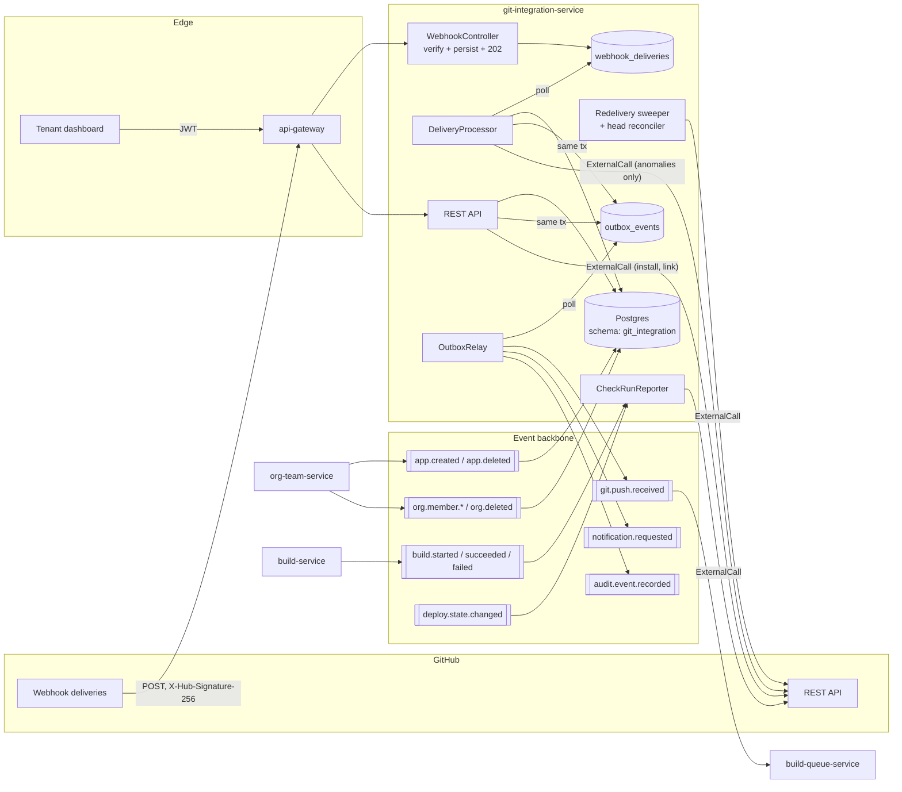
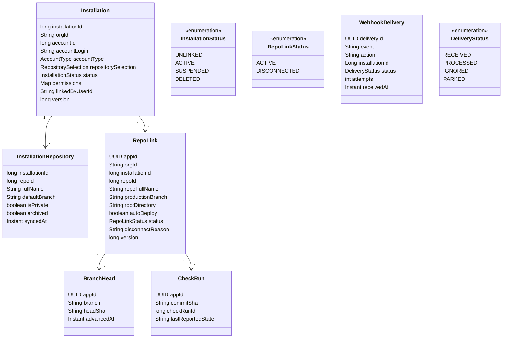
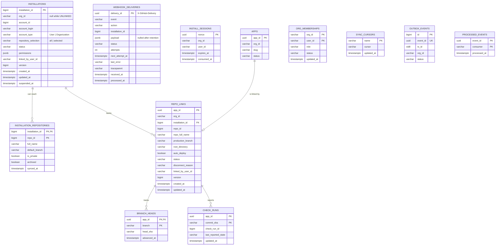
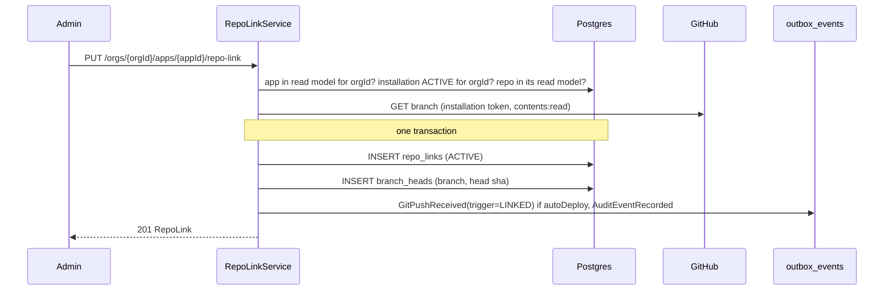
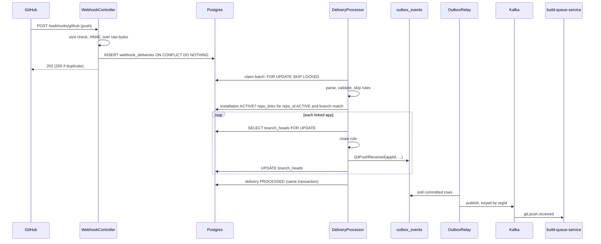
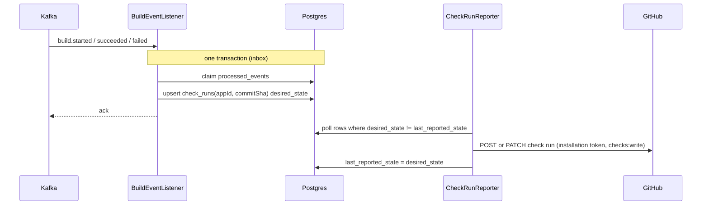
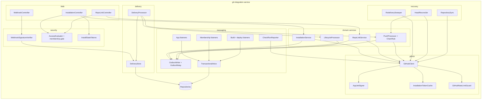

# git-integration-service: Architecture

Status: proposed design, pre-implementation. First service of `PROJECT.md` Build roadmap phase 3
(the build pipeline). Several decisions below change shared contracts or another service, and each
needs an ADR before its checkpoint starts; they are listed in
[Decisions that need an ADR](#decisions-that-need-an-adr).

`PROJECT.md` gives this service one paragraph: it "handles the GitHub or GitLab OAuth app, receives
push webhooks, and talks to the provider's API for repo metadata. This is the first place retries
and a circuit breaker matter, since GitHub's API has rate limits and the occasional outage that has
nothing to do with Pallet." It is also the first hop of the deploy path: "GitHub POSTs a push,
`git-integration-service` acknowledges it and publishes `git.push.received`." This document is the
full design.

Read these first, because this document assumes them rather than re-arguing them:
[ADR-0016](../adr/0016-org-team-service-production-design.md) and
[ADR-0017](../adr/0017-outbox-commit-order-and-relay-lock-timeout.md) (the outbox and inbox this
service reuses), [ADR-0018](../adr/0018-multi-org-per-account-and-per-request-authorization.md)
(no `org_id` on the token, authorization against a local membership read model),
[ADR-0012](../adr/0012-api-gateway-edge-architecture.md) and
[ADR-0013](../adr/0013-per-service-api-path-namespace.md) (how the webhook reaches this service),
and `docs/org-team-service/ARCHITECTURE.md` (the `App` aggregate that a repository is linked to).

## Contents

- [Purpose](#purpose)
- [Position in the system](#position-in-the-system)
- [Design goals and non-goals](#design-goals-and-non-goals)
- [GitHub App, not OAuth App](#github-app-not-oauth-app)
- [Domain model](#domain-model)
- [Data model](#data-model)
- [Event contracts](#event-contracts)
- [API](#api)
- [Authorization model](#authorization-model)
- [Processing pipelines](#processing-pipelines)
- [Webhook ingestion](#webhook-ingestion)
- [Talking to GitHub](#talking-to-github)
- [Recovering lost deliveries](#recovering-lost-deliveries)
- [Source access for the build pipeline](#source-access-for-the-build-pipeline)
- [Distributed systems mechanisms](#distributed-systems-mechanisms)
- [Consistency and failure modes](#consistency-and-failure-modes)
- [Security and threat model](#security-and-threat-model)
- [Observability and operations](#observability-and-operations)
- [Component view](#component-view)
- [Deployment and scaling view](#deployment-and-scaling-view)
- [Package layout and dependencies](#package-layout-and-dependencies)
- [Configuration](#configuration)
- [Changes this design needs elsewhere](#changes-this-design-needs-elsewhere)
- [Decisions that need an ADR](#decisions-that-need-an-adr)
- [Extension points](#extension-points)
- [Open questions / deferred](#open-questions--deferred)
- [Relationship to existing planning docs](#relationship-to-existing-planning-docs)

## Purpose

`git-integration-service` owns the connection between a Pallet organization and its source code
host. Today that host is GitHub; GitLab is a later adapter behind the same port. The service:

- Lets an org connect a GitHub account or GitHub organization to Pallet by installing the Pallet
  GitHub App, and proves that the person connecting it controls that installation.
- Links an app (the `App` aggregate `org-team-service` owns) to one repository, with a production
  branch, an optional root directory for monorepos, and an auto-deploy switch.
- Receives GitHub's webhooks, verifies them, stores them durably, and turns a push to a linked
  branch into a `git.push.received` event for every app that should build it.
- Reports build and deploy progress back to GitHub as check runs, so a developer sees Pallet's
  result next to the commit.
- Is the only Pallet service that holds the GitHub App's private key and webhook secret.

It is the platform's first service whose inbound traffic comes from a third party rather than from
a tenant with a Keycloak token. That changes the threat model: the webhook endpoint is public,
authenticated by an HMAC signature, and must answer GitHub within ten seconds whatever state the
rest of Pallet is in.

## Position in the system



Three kinds of traffic cross this service's boundary:

1. Inbound from GitHub: webhook deliveries. The only synchronous work on that request is
   signature verification and one insert. Everything else happens after the `202`.
2. Inbound from Pallet: dashboard requests through the gateway, and events from
   `org-team-service` (apps and memberships) and the build and deploy services (for check runs).
3. Outbound to GitHub: API calls, every one through `ExternalCall` under a named policy.

Nothing here calls another Pallet service synchronously. The org and app facts it needs arrive as
events and are kept in local read models, the same shape `notification-service`'s `org_members`
projection and ADR-0018 decision 4 describe.

## Design goals and non-goals

Goals:

- Never lose a push that GitHub delivered, including while Kafka, the processor, or this service's
  own later stages are down. Once a delivery is acknowledged, it is in Postgres.
- Answer GitHub fast (target p99 under 200 ms at the service) so its ten-second timeout never
  decides whether a push builds.
- Recover deliveries GitHub failed to hand over. GitHub does not redeliver failed webhooks on its
  own, so this service asks it to, and also checks branch heads directly as a last resort.
- Publish every event through the transactional outbox, so a committed state change and its event
  can't diverge.
- Consume every event through the transactional inbox, so a redelivery can't double-apply.
- Build the right commit exactly once per app per push, even when GitHub delivers pushes out of
  order or delivers the same push twice.
- Keep one tenant's GitHub trouble (an exhausted rate limit, a suspended installation) from
  delaying another tenant's builds.
- Hold GitHub credentials with the least privilege that works: short-lived installation tokens,
  scoped per call where possible, and a private key that never leaves this service.
- Treat all webhook content as untrusted input, from the headers to the commit message.

Non-goals (this design):

- Pull request preview deployments. The data model leaves room for them
  ([Extension points](#extension-points)), but v1 builds only the production branch of a linked
  repository.
- GitLab, Bitbucket, or GitHub Enterprise Server. The provider port exists; only the GitHub adapter
  is built.
- Cloning, fetching, or storing source code. That is `build-service`'s job
  ([Source access](#source-access-for-the-build-pipeline)).
- Deciding build priority, concurrency, or coalescing of rapid pushes. That is
  `build-queue-service`'s job. This service reports each accepted push faithfully.
- Build configuration (build command, runtime, env vars). Those belong to the build and secrets
  services.
- Personal access tokens or deploy keys. The GitHub App is the only credential model.

## GitHub App, not OAuth App

`PROJECT.md` says "OAuth app". This design uses a GitHub App instead, which is what Vercel, Render,
Netlify and most current CI products use for the same job. The difference matters for a
multi-tenant platform:

| Concern | OAuth App | GitHub App |
|---|---|---|
| Whose authority | Acts as the user who authorized it, with every repo that user can reach | Acts as the app, only on repositories the installer selected |
| Permissions | Coarse scopes (`repo` grants read and write to all private repos) | Fine-grained: `contents: read`, `metadata: read`, `checks: write` and nothing else |
| Credential lifetime | Long-lived user token, stored by Pallet | Installation token valid for one hour, minted on demand, never stored |
| When the user leaves the company | Their token (and Pallet's access) goes with them | The installation belongs to the GitHub organization and keeps working |
| Webhooks | Per-repository hooks Pallet has to create and clean up | One app-level webhook URL receiving every installation's events |
| Rate limit | Shared with the user | Per installation, and it grows with the installation's size |

The permissions the Pallet GitHub App requests, and why:

| Permission | Level | Used for |
|---|---|---|
| Metadata | read | Mandatory for every app. Repository names, default branch, visibility. |
| Contents | read | Branch heads, compare API, and (for `build-service`) fetching source. Also required to receive `push` events. |
| Checks | write | Creating and updating check runs with build and deploy results. |

Webhook subscriptions: `push`, `installation`, `installation_repositories`, `repository`, and
`github_app_authorization`. `ping` arrives once when the webhook is configured. Anything else is
acknowledged and ignored.

The app also has "Request user authorization (OAuth) during installation" turned on. The user token
this produces is used once, during connection, to prove the user can see the installation, and is
then discarded ([Connecting an installation](#connecting-an-installation)). It is never stored and
never used to act on repositories.

## Domain model



The aggregates, and the question each one answers:

- `Installation`: which GitHub account this org has connected, and whether Pallet may currently
  act on it. The row exists from the moment GitHub tells us about it (`UNLINKED`), and becomes
  `ACTIVE` when a verified member of a Pallet org links it. One installation is linked to at most
  one Pallet org at a time.
- `InstallationRepository`: a local copy of which repositories the installation can reach. It is
  a read model of GitHub's state, kept current by webhooks and a periodic sync, so the dashboard's
  repository picker never waits on GitHub or spends its rate limit.
- `RepoLink`: which repository, branch and directory an app builds from. At most one per app.
  Several apps may link the same repository (a monorepo with a different `rootDirectory` per app),
  so one push can fan out to several apps.
- `BranchHead`: the last commit this service accepted as the head of an app's branch. It is what
  makes duplicate and out-of-order push detection possible ([The chain rule](#the-chain-rule)).
- `WebhookDelivery`: one delivery from GitHub, stored before it is acknowledged. The durable
  inbox between GitHub and the rest of this service.
- `CheckRun`: the GitHub check run this service created for an app and commit, so later build
  and deploy events update it rather than creating a second one.

Two read models built from other services' events are not aggregates here and have no API of their
own: `apps` (from `app.created`/`app.deleted`) and `org_memberships` (from `org.member.*` and
`org.deleted`).

Repositories are identified by GitHub's numeric `repoId`, never by `owner/name`. A repository can
be renamed or transferred, which changes its name but not its id. `fullName` is a display
projection, refreshed from `repository` webhooks.

## Data model

One Postgres schema, `git_integration` (shared cluster, schema per service, ADR-0007). Flyway is
the only schema authority; Hibernate is `validate`-only.



`outbox_events` and `processed_events` have the same columns and semantics as in
`org-team-service` (ADR-0016, ADR-0017, including `tx_id xid8` for commit-order delivery); only the
columns this document refers to are drawn.

Constraints and indexes:

- `installations(installation_id)` primary key: one row per GitHub installation, so one
  installation is linked to at most one org. `installations(org_id) WHERE status = 'ACTIVE'` backs
  the org's installation list.
- `repo_links(app_id)` primary key: one repository per app. The composite foreign key
  `(org_id, app_id) → apps(org_id, app_id)` makes it impossible to link an app from another org.
- `repo_links(installation_id, org_id)` references `installations(installation_id, org_id)`, so a
  link can only use an installation that belongs to the same org. The database refuses a cross
  tenant link even if the application check has a bug.
- `repo_links(repo_id) WHERE status = 'ACTIVE'`: the push fan-out lookup, the hottest query in the
  service.
- `webhook_deliveries(delivery_id)` primary key: GitHub keeps the same GUID when it redelivers, so
  the insert is also the dedupe.
- `webhook_deliveries(next_attempt_at) WHERE status = 'RECEIVED'`: the processor's scan.
- `install_sessions(nonce)` primary key, consumed with
  `UPDATE ... SET consumed_at = now() WHERE nonce = ? AND consumed_at IS NULL AND expires_at > now()`,
  so a state value works once.
- `check_runs(app_id, commit_sha)` primary key: at most one check run per app and commit.
- `apps` and `org_memberships` are read models. Their rows are written only by listeners, never by
  the API.
- Every tenant table has `org_id`, and every repository method on one takes it as a parameter. An
  ArchUnit rule fails the build otherwise, the same rule `org-team-service` has.
  `webhook_deliveries` and `installation_repositories` are the exceptions: GitHub data keyed by
  GitHub ids, reached only after an installation's org has been resolved.

## Event contracts

### Consumed

| Event | Source | Effect here |
|---|---|---|
| `AppCreated` | org-team-service | Insert into the `apps` read model. |
| `AppDeleted` | org-team-service | Mark the app `DELETED` in the read model; if it has a repo link, set it `DISCONNECTED` (`APP_DELETED`). Pushes for it stop immediately. |
| `OrgMemberAdded` | org-team-service | Upsert into `org_memberships` with its role (needs the additive `role` field, see [Changes elsewhere](#changes-this-design-needs-elsewhere)). |
| `OrgMemberRoleChanged` | org-team-service | Update the role, if the event is newer than the row. |
| `OrgMemberRemoved` | org-team-service | Mark the membership `REMOVED`. |
| `OrgDeleted` | org-team-service | Mark every membership `REMOVED`, set every repo link `DISCONNECTED` (`ORG_DELETED`), set the org's installations back to `UNLINKED`. The GitHub installation itself is left alone: it belongs to the customer's GitHub account, and they may link it to another org. |
| `BuildStarted`, `BuildSucceeded`, `BuildFailed` | build-service | Create or update the check run for `(appId, commitSha)`. No consumer traffic until `build-service` ships. |
| `DeployStateChanged` | deploy-orchestrator-service | Update the same check run with the deploy outcome and the live URL. No traffic until phase 4. |

Every listener uses the transactional inbox. The check-run listeners do their GitHub call after the
inbox transaction commits a `check_runs` intent row, not inside it
([Check run reporting](#check-run-reporting)).

### Published

Every event is appended to the outbox in the same transaction as the state change that produced
it.

| Event | Topic | Trigger | Consumers |
|---|---|---|---|
| `GitPushReceived` | `git.push.received` | A push accepted for a linked app, a manual build request, the first build after linking, or a head the reconciler found | build-queue-service |
| `NotificationRequested` | `notification.requested` | Installation suspended, deleted, or lost access to a linked repository (`GIT_CONNECTION_LOST`, org admins) | notification-service |
| `AuditEventRecorded` | `audit.event.recorded` | Every API mutation, every installation lifecycle change | audit-log-service (future) |

`GitPushReceived` already exists in `platform-common-events` with `repo`, `branch`, `commitSha`.
That is not enough for the build pipeline: `build-queue-service` needs to know which app, and
`build-service` needs to know where to fetch from and which directory to build. The record gains
fields, all additive (ADR-0006), none renamed:

| Field | Type | Meaning |
|---|---|---|
| `repo` | string | Existing. The repository's `owner/name` at the time of the push. Display only. |
| `branch` | string | Existing. Short branch name, without `refs/heads/`. |
| `commitSha` | string | Existing. The commit to build (GitHub's `after`). |
| `appId` | string | New. The app this push builds. One event per linked app. |
| `provider` | string | New. `GITHUB` today. |
| `installationId` | long | New. Which installation to fetch through. |
| `repoId` | long | New. Stable repository id. |
| `rootDirectory` | string | New. The link's root directory at the time of the push, so a later change to the link can't change what an in-flight build fetches. |
| `beforeSha` | string | New. GitHub's `before`. All zeros for a new branch. |
| `forced` | boolean | New. Force push. |
| `trigger` | string | New. `WEBHOOK`, `MANUAL`, `LINKED`, or `RECONCILED`. |
| `headCommitMessage` | string | New. First line of the head commit message, at most 256 characters. Untrusted text. |
| `headCommitAuthor` | string | New. The GitHub login of the author, or the name if there is no login. Never an email address. |
| `deliveryId` | string | New. GitHub's delivery GUID, null unless `trigger = WEBHOOK`. For tracing a build back to a delivery. |

The event is keyed by `orgId`, like every event on the backbone, so all pushes for an org keep
their order in the partition. The `eventId` is a UUIDv5 over `(deliveryId or trigger nonce, appId)`,
so a processing retry that got as far as writing the outbox row cannot produce a second event with
a different id.

The name `git.push.received` stays for `MANUAL`, `LINKED` and `RECONCILED` triggers even though no
`git push` happened: to the build pipeline, all four mean "this app should build this commit", and
one topic keeps `build-queue-service` a single consumer. `trigger` tells them apart.

No credential ever appears in an event. See
[Source access for the build pipeline](#source-access-for-the-build-pipeline).

Contract requirements on events that don't exist yet: `BuildStarted`, `BuildSucceeded` and
`BuildFailed` must carry `appId`, `commitSha` and the originating `GitPushReceived.eventId`;
`DeployStateChanged` must carry `appId` and `commitSha` in addition to `deploymentId`. Without
them, this service would need a lookup table from build ids to commits, maintained from a stream
it doesn't own. The requirement goes into `build-service`'s and `deploy-orchestrator-service`'s
designs as an input.

## API

Base path `/api/v1/git-integration` (ADR-0010's prefix plus ADR-0013's per-service namespace).
Paths below omit it. Responses are `ApiResponse<T>`, lists are `PageResponse<T>` inside it, errors
are `ErrorResponse` through `GlobalExceptionHandler`. "Requires" means the caller's role in the
local `org_memberships` read model ([Authorization model](#authorization-model)), never a token
claim.

### Webhook (public)

| Method | Path | Notes |
|---|---|---|
| `POST` | `/webhooks/github` | GitHub only. Authenticated by `X-Hub-Signature-256`, not by a bearer token. `202` when stored, `200` for a duplicate or `ping`, `401` for a bad signature, `413` over the size limit. Needs a gateway `public-paths` entry and a rate-limit exemption, see [Webhook ingestion](#webhook-ingestion). |

### Installations

| Method | Path | Requires | Notes |
|---|---|---|---|
| `POST` | `/orgs/{orgId}/github/install-sessions` | ADMIN+ | Starts a connection. Returns `{installUrl, expiresAt}`; `installUrl` is `https://github.com/apps/{slug}/installations/new?state={state}`. State lives ten minutes. |
| `POST` | `/orgs/{orgId}/github/installations` | ADMIN+ | Completes a connection: `{installationId, code, state}` from GitHub's redirect. Verifies the state, then verifies that the caller can see the installation on GitHub. `201` with the installation. See [Connecting an installation](#connecting-an-installation). |
| `GET` | `/orgs/{orgId}/github/installations` | any member | The org's linked installations and their status. |
| `GET` | `/orgs/{orgId}/github/installations/{installationId}/repositories` | DEVELOPER+ | From the local read model. `q` filters by name prefix. Sort whitelist: `fullName`. |
| `DELETE` | `/orgs/{orgId}/github/installations/{installationId}` | ADMIN+ | Unlinks the installation from the org and disconnects every repo link that used it. Does not uninstall the app from GitHub. `204`. |

### Repository links

| Method | Path | Requires | Notes |
|---|---|---|---|
| `PUT` | `/orgs/{orgId}/apps/{appId}/repo-link` | ADMIN+ | `{installationId, repoId, productionBranch?, rootDirectory?, autoDeploy}`. Branch defaults to the repository's default branch. The repository must be in the installation's read model and the branch must exist on GitHub (one API call). Emits a `LINKED` push for the branch head when `autoDeploy` is on. `201` on create, `409 REPO_LINK_EXISTS` if the app already has an active link. |
| `GET` | `/orgs/{orgId}/apps/{appId}/repo-link` | any member | Link, status, disconnect reason, last accepted head. |
| `PATCH` | `/orgs/{orgId}/apps/{appId}/repo-link` | DEVELOPER+ | `productionBranch`, `rootDirectory`, `autoDeploy` only. Changing the branch resets its `BranchHead`. Optimistic locking on `version`. |
| `DELETE` | `/orgs/{orgId}/apps/{appId}/repo-link` | ADMIN+ | Sets the link `DISCONNECTED` (`UNLINKED_BY_USER`). `204`. |
| `POST` | `/orgs/{orgId}/apps/{appId}/repo-link/builds` | DEVELOPER+ | `{branch?}` defaults to the production branch. Resolves the branch head on GitHub and emits a `MANUAL` push. Requires the header `Idempotency-Key`; a retry with the same key returns the first result. `202` with `{eventId, commitSha}`. |

Changing which repository an app deploys from decides what code runs under the org's name, so it
needs ADMIN. Tuning the link (branch, directory, auto-deploy) is day-to-day developer work.

### Error catalog

All extend `AppException`. None needs an `@ExceptionHandler`.

| Code | Status | When |
|---|---|---|
| `ORG_NOT_FOUND` | 404 | No membership row for `(sub, orgId)`, or the org is deleted. Indistinguishable on purpose (ADR-0018). |
| `NOT_A_MEMBER` | 403 | A membership row exists but is `REMOVED`. |
| `INSUFFICIENT_ROLE` | 403 | The caller's role is below the endpoint's floor. |
| `APP_NOT_FOUND` | 404 | The app is not in this org's read model, or is deleted. |
| `INVALID_INSTALL_STATE` | 400 | State signature, expiry, org, user, or single-use check failed. |
| `INSTALLATION_NOT_ACCESSIBLE` | 403 | The caller's GitHub user can't see the installation they tried to link. |
| `INSTALLATION_LINKED_ELSEWHERE` | 409 | The installation is already linked to another org. The response does not name the other org. |
| `INSTALLATION_NOT_FOUND` | 404 | Not linked to this org. |
| `INSTALLATION_SUSPENDED` | 409 | The installation is suspended on GitHub; linking or building is refused until it is unsuspended. |
| `REPOSITORY_NOT_ACCESSIBLE` | 422 | The repository is not in the installation's selection, or is archived. |
| `BRANCH_NOT_FOUND` | 422 | The branch doesn't exist on GitHub. |
| `INVALID_ROOT_DIRECTORY` | 400 | Absolute, contains `..`, or longer than 255 characters. |
| `REPO_LINK_EXISTS` | 409 | The app already has an active link. |
| `REPO_LINK_NOT_FOUND` | 404 | The app has no active link. |
| `GITHUB_RATE_LIMITED` | 503 | The installation's GitHub budget is spent. Carries `Retry-After`. |
| `CONCURRENT_MODIFICATION` | 409 | Optimistic lock lost (existing mapping). |
| `WEBHOOK_SIGNATURE_INVALID` | 401 | Missing or wrong `X-Hub-Signature-256`. The body says nothing about why. |
| `EXTERNAL_SERVICE_UNAVAILABLE` | 503 | GitHub failed after retries, or the `github-api` breaker is open (the existing `ExternalServiceException` mapping). |

## Authorization model

This is the first service built after ADR-0018, so it adopts that ADR's decision 4 from the first
commit: the path's `orgId` is checked against a local membership read model, and nothing about the
org is read from the token.

1. The resource server validates the token and the session registry (ADR-0015), exactly as in
   every other service. `spring-data-redis` is a dependency so the registry is Redis-backed.
2. The membership gate reads `org_memberships` by `(orgId, sub)`:
   - No row, or the org is known to be deleted: `404 ORG_NOT_FOUND`.
   - A `REMOVED` row: `403 NOT_A_MEMBER`.
   - Otherwise the endpoint's role floor is checked against the row's role
     (`@PreAuthorize("@access.atLeast(#orgId, 'DEVELOPER')")`, the same `AccessEvaluator` shape as
     `org-team-service`).
3. Any `appId` in the path is checked against the `apps` read model scoped to `orgId`; an app from
   another org is `404 APP_NOT_FOUND`.

The read model lags `org-team-service` by the outbox poll interval plus consumer lag, normally well
under a second. A newly added member may see `404` for that window, and a removed member keeps
access for the same window. That window is the price of ADR-0018's no-synchronous-call rule and is
observable (`git.authz.projection_lag_seconds`, measured from each event's `occurredAt`).

The read model starts empty. For an org that existed before this service was deployed, the
membership events are already past Kafka's retention. How the read model is seeded is an open
question with a recommended answer ([Open questions](#open-questions--deferred)); it affects every
future tenant-scoped service, not only this one.

## Processing pipelines

### Connecting an installation

```mermaid
sequenceDiagram
    participant U as Admin (browser)
    participant D as Dashboard
    participant S as git-integration-service
    participant GH as GitHub

    U->>D: Connect GitHub
    D->>S: POST /orgs/{orgId}/github/install-sessions
    S->>S: insert install_sessions(nonce, orgId, sub, +10m)
    S-->>D: installUrl with signed state
    D->>GH: redirect to installUrl
    U->>GH: choose account and repositories, install
    GH-->>S: webhook installation.created (async, any time)
    GH->>D: redirect to setup URL ?installation_id&setup_action&code&state
    D->>S: POST /orgs/{orgId}/github/installations {installationId, code, state}
    S->>S: verify state HMAC, expiry, orgId, sub; consume nonce
    S->>GH: exchange code for user token (github-oauth policy)
    S->>GH: GET /user/installations (user token)
    S->>S: installationId in the list? else 403 INSTALLATION_NOT_ACCESSIBLE
    S->>S: discard user token
    S->>GH: GET /app/installations/{id} (app JWT)
    Note over S: one transaction
    S->>S: upsert installations (ACTIVE, orgId), audit to outbox
    S-->>D: 201 Installation
    S->>GH: sync repositories into the read model (after commit, async)
```

Three details decide whether this flow is safe:

- **The `installation_id` in the redirect proves nothing.** Anyone can type
  `?installation_id=12345` into the setup URL. GitHub's own documentation says to verify it, and
  the way to verify it is the user-to-server token: `GET /user/installations` lists only the
  installations that user can access. Without this check, a member of org A could link org B's
  GitHub installation and read the names of its private repositories, or build its code.
- **The `state` parameter binds the redirect to the request that started it.** It is an HMAC-signed
  token carrying `{nonce, orgId, sub, exp}`, and the nonce works once. This stops a CSRF where an
  attacker gets a victim admin's browser to complete the attacker's installation into the victim's
  org.
- **The webhook and the redirect race.** `installation.created` can arrive before or after the
  redirect completes. The webhook inserts the row as `UNLINKED` with no org; the redirect upserts it
  to `ACTIVE` with the org. Both are idempotent on `installation_id`, so either order gives the
  same result. An installation made straight from GitHub's marketplace page, with no state at all,
  stays `UNLINKED` until an admin links it from the dashboard through the same verified flow.

`setup_action=request` means a GitHub organization member without admin rights asked their admin to
approve the install. Nothing is linked until the installation exists; the dashboard shows a
"waiting for your GitHub admin" state.

### Linking a repository to an app



The GitHub call happens before the transaction opens, so no database connection or row lock is
held across a network call.

### Push to event

This is the path `PROJECT.md` draws as the first arrow of a deployment.



Steps the processor applies to a `push` delivery, in order. The first one that matches ends
processing with the delivery marked `IGNORED` and a reason recorded (`git.pushes.skipped{reason}`):

1. The ref is not a branch (`refs/tags/...`): `NOT_A_BRANCH`. Tag-triggered builds are an
   extension, not v1.
2. `deleted: true` (the branch was deleted): `BRANCH_DELETED`.
3. The installation is not `ACTIVE`: `INSTALLATION_INACTIVE`.
4. No `ACTIVE` repo link for this `repoId` whose `productionBranch` matches and whose
   `autoDeploy` is on: `NO_LINKED_APP`.
5. The head commit message contains `[skip ci]`, `[ci skip]`, or `[pallet skip]`: `SKIP_MARKER`.
6. Per app, when the link has a `rootDirectory`: if the payload's commit list is complete and no
   added, modified, or removed file is under that directory, `PATH_UNCHANGED` for that app only.
   GitHub caps the commit list in a push payload. When it's truncated, the filter can't be sure,
   so the app builds anyway. A wasted build costs less than a missed one.
7. The [chain rule](#the-chain-rule) decides whether the commit is new, a duplicate, or stale.

### The chain rule

GitHub does not promise to deliver webhooks in order, and redeliveries can arrive days later. Two
pushes to `main` a second apart can arrive reversed; publishing both in arrival order would deploy
the older commit last. `BranchHead` prevents that. With the head row locked
(`SELECT ... FOR UPDATE` on `(app_id, branch)`), for an incoming push with `before` and `after`:

| Condition | Meaning | Action |
|---|---|---|
| No head yet | First push since linking | Accept |
| `after == head` | Duplicate of something already accepted (a redelivery with a new GUID, or a reconciler run) | Ignore, `DUPLICATE` |
| `before == head` | Normal fast-forward | Accept |
| `forced` | Force push | Accept. A force push replaces history by definition |
| Anything else | A gap or reordering | Ask GitHub (below) |

"Ask GitHub" calls the compare API with `head...after` under the `github-api` policy. The call
runs outside the transaction: the processor releases the lock, calls GitHub, then reopens the
transaction and re-reads the head. If the head moved in the meantime, the rule runs again (at most
three rounds, then the delivery is retried later).

| Compare status | Meaning | Action |
|---|---|---|
| `ahead` | `after` descends from the head: we missed an intermediate push | Accept |
| `identical` | Same commit | Ignore, `DUPLICATE` |
| `behind` | `after` is older than the head: a late delivery | Ignore, `STALE` |
| `diverged` | History was rewritten without `forced` being set (rare, for example a branch deleted and recreated) | Accept |

"Accept" means: write the `GitPushReceived` to the outbox and advance the head, in one transaction.
The compare call happens only on the anomaly path; for ordinary pushes, the chain rule is a single
indexed read.

The chain rule makes the service decide what "latest" means for each app and branch, instead of
leaving `build-queue-service` to guess from arrival order. `build-queue-service` still coalesces
rapid pushes (it may skip building commit N when N+1 is already queued), but it never has to
worry about going backwards.

### Installation and repository lifecycle

| Webhook | Action here |
|---|---|
| `installation.created` | Upsert `UNLINKED` (or leave `ACTIVE` if the redirect already linked it). Sync repositories. |
| `installation.deleted` | `DELETED`. Every repo link using it becomes `DISCONNECTED` (`INSTALLATION_DELETED`). Notify org admins (`GIT_CONNECTION_LOST`). Drop cached tokens. |
| `installation.suspend` | `SUSPENDED`. Links stay `ACTIVE` but pushes are ignored and no API call is made. Notify admins. |
| `installation.unsuspend` | Back to `ACTIVE`. The head reconciler picks up anything pushed while suspended. |
| `installation.new_permissions_accepted` | Refresh `permissions`. |
| `installation_repositories.added/removed` | Update the repository read model. A removed repository's links become `DISCONNECTED` (`REPOSITORY_ACCESS_REMOVED`), with a notification. |
| `repository.renamed/transferred` | Update `full_name` in the read model and on links. The `repoId` doesn't change, so nothing breaks. A transfer to an account outside the installation arrives as an `installation_repositories.removed` too. |
| `repository.deleted` | Remove from the read model, disconnect links. |
| `repository.archived` | Mark archived; links stay but show a warning (an archived repository can't receive pushes anyway). |
| `github_app_authorization.revoked` | A user revoked the app's user authorization. No stored user tokens exist, so nothing to delete; recorded for audit. |

All of these run through the same processor, with the same inbox, retry and parking as pushes.

### Check run reporting



The listener records the state it wants GitHub to show and acknowledges; a separate reporter makes
the GitHub call. The listener stays fast and GitHub trouble never builds up consumer lag. The
reporter only ever moves a check run forward (`queued → in_progress → completed`), so an
out-of-order `build.started` after `build.succeeded` can't reopen a finished check. A failure to
reach GitHub delays the check mark and nothing else; it is cosmetic for the developer and has no
effect on the build or deploy.

## Webhook ingestion

The webhook handler follows the pattern "acknowledge fast, process later": the request does the
least work that makes the delivery durable, and GitHub gets its answer in milliseconds.

What `WebhookController` does, in order:

1. **Reject oversized bodies** before reading them: `Content-Length` over
   `pallet.git.webhook.max-body` (default 25 MB, GitHub's own payload cap) is `413`. The body is
   read into a bounded byte array; no streaming parser touches it yet.
2. **Verify the signature** over the raw bytes: `HMAC-SHA256(secret, body)` compared with
   `X-Hub-Signature-256` using `MessageDigest.isEqual` (constant time). Two secrets are accepted,
   current and previous, so the secret can be rotated without dropping deliveries. A failure is
   `401` with a generic body and increments `git.webhook.signature_failures`. Nothing is parsed or
   stored before this step passes.
3. **Read the headers**: `X-GitHub-Event`, `X-GitHub-Delivery` (must be a UUID), and from the
   body only `action` and `installation.id`. Jackson runs with explicit read limits (nesting depth,
   string length, document length) so a hostile payload can't exhaust memory even after a valid
   signature.
4. **Insert** into `webhook_deliveries` with `ON CONFLICT (delivery_id) DO NOTHING`, storing the
   `traceparent` of the current span. One row inserted: `202`. Zero rows (a redelivery we already
   have): `200`.
5. `ping` is answered `200` and not stored. An event type the app isn't subscribed to is stored as
   `IGNORED`, so it shows up in metrics instead of vanishing.

If Postgres is down, step 4 fails and GitHub gets a `503`. GitHub records that delivery as failed,
and the [redelivery sweeper](#recovering-lost-deliveries) asks for it again once the database is
back.

### Why Postgres, not Kafka, holds the delivery

The alternative is publishing the raw delivery to a Kafka topic from the controller and
letting a consumer do the processing, with `platform-common-messaging`'s retry and DLT for free. It
loses on three counts. Push payloads can be many megabytes, far over Kafka's default one-megabyte
message limit, and raising that limit platform-wide for one producer is a poor trade. Processing
needs Postgres anyway (links, heads, the outbox), so a Kafka buffer adds a second hard dependency
to the ingest path instead of replacing one. And a Kafka-held delivery can't be looked up by
delivery id, which is what both dedupe and the redelivery sweeper need.

### Route through the gateway

GitHub reaches the webhook through `api-gateway`, like every other inbound request, so there is one
edge, one TLS termination and one access log. Two gateway changes make that work (see
[Changes elsewhere](#changes-this-design-needs-elsewhere)):

- `/api/v1/git-integration/webhooks/github` is a `public-paths` entry: there is no bearer token.
  The HMAC check in this service is the authentication, and it doesn't depend on the gateway.
- The gateway's rate limiter keys public paths by client IP, 60 requests a minute. GitHub delivers
  every tenant's webhooks from a small shared set of IP ranges, so that limit would start rejecting
  legitimate deliveries as soon as a few tenants push at once. The route needs a per-route
  rate-limit override. The protection it loses is replaced by the signature check (a forged request
  costs one HMAC and no database access) and by an optional allowlist of GitHub's published hook
  IP ranges (`GET /meta`), refreshed daily, which is defense in depth and never the authority.

The gateway never retries a `POST`, so a slow insert can't turn into a duplicate delivery, and even
if it did, the primary key would absorb it.

### Processing deliveries

`DeliveryProcessor` is a `@Scheduled` poller, not a Kafka consumer:

- Each cycle claims up to `batch-size` rows with `status = 'RECEIVED' AND next_attempt_at <= now()`
  using `FOR UPDATE SKIP LOCKED`, so every instance can process in parallel without two instances
  taking the same delivery. Unlike the outbox relay, the processor doesn't need to be single-active:
  ordering is handled per app and branch by the chain rule's row lock, not by processing order.
- Each delivery is processed in its own transaction. Success commits the effects, the outbox rows,
  and `PROCESSED` together.
- A failure rolls back, then a second short transaction increments `attempts` and sets
  `next_attempt_at` with exponential backoff and jitter. After `max-attempts` the row is `PARKED`,
  which alerts. An operator fixes the cause and sets it back to `RECEIVED` (runbook step).
- A malformed payload (valid signature, but missing `repository.id` or an unparseable ref) is
  `PARKED` straight away. Retrying won't fix it.
- A GitHub rate-limit response during the chain rule's compare call sets `next_attempt_at` to the
  reset time GitHub gave, without counting as an attempt.

The payload is kept for `payload-retention` (7 days) for debugging and replay, then nulled. The
row itself (ids, status, timestamps) is kept for 30 days.

## Talking to GitHub

### One client, every call through `ExternalCall`

`GitHubClient` is a small typed client over Spring's `RestClient`, not a third-party GitHub SDK.
The reasons: the service needs direct control over conditional requests (`ETag`), rate-limit
headers, per-call token scoping and observation; it uses about a dozen endpoints; and the popular
Java SDKs bring their own HTTP connector, caching and retry layers that would sit underneath
`ExternalCall` and fight it.

Every method runs inside `ExternalCall.call(policy, ...)`:

| Policy | Used for | Notes |
|---|---|---|
| `github-api` | Every REST call made with an installation token or the app JWT | Timeout 10 s, 3 attempts, breaker on 5xx, timeouts, and connection failures only |
| `github-oauth` | Exchanging the installation-flow `code` for a user token, and `GET /user/installations` | Separate breaker: a problem with GitHub's OAuth endpoint shouldn't stop pushes being processed |

Response classification happens inside the supplier, before the breaker sees the result. This
matters because `platform-common-resilience` ignores `AppException` for both breaker and retry:

| GitHub response | Mapped to | Breaker | Retry |
|---|---|---|---|
| 2xx, 304 | result | success | n/a |
| 404, 422, 410 | `AppException` subclass (`BRANCH_NOT_FOUND`, `REPOSITORY_NOT_ACCESSIBLE`, ...) | ignored | no |
| 401 on an installation token | evict the cached token, then `InstallationTokenRejected` (retried once with a fresh token) | ignored | once |
| 403 or 429 with `retry-after` or `x-ratelimit-remaining: 0` | `GitHubRateLimitedException` (an `AppException`) carrying the reset time | ignored | no; the caller reschedules |
| 5xx, timeout, connection refused | runtime exception | counted | yes |

So one tenant's exhausted rate limit or one missing branch never opens the breaker for everyone.
The breaker opens only when GitHub itself is unhealthy, which is when stopping every call is the
right thing.

### Credentials

- **App JWT.** RS256, signed with the app's private key, `iss` = the app's client id, `iat`
  backdated 60 seconds for clock skew, `exp` 9 minutes ahead (GitHub allows at most 10). Minted per
  use and cached for its life. Used only for app-level endpoints: installation details, installation
  tokens, the delivery log.
- **Installation token.** `POST /app/installations/{id}/access_tokens`, valid one hour. Cached in
  process memory per `(installationId, permission set)` and refreshed five minutes before expiry.
  A single-flight guard per key stops a burst of work for one installation from minting ten tokens
  at once. Where the call touches one repository, the token is requested with that `repository_ids`
  and only the permissions the call needs. Tokens are never written to Postgres, Redis, logs, or
  events.
- **Private key.** A PKCS#8 PEM from `PALLET_GIT_GITHUB_PRIVATE_KEY` (Vault in deployed
  environments). Validated at startup: an RSA key of at least 2048 bits, or the service refuses to
  start. GitHub allows several active private keys per app, so rotation is: add a new key on
  GitHub, deploy it, confirm, delete the old one on GitHub.
- **Webhook secret.** At least 32 random bytes, two configured values (current and previous) for
  rotation.

### Rate-limit budget

Installation tokens get their own budget per installation (at least 5,000 requests an hour, more
for large installations), which is why the permission model uses installation tokens instead of
one shared token. `GitHubRateLimitGuard` reads `x-ratelimit-remaining` and `x-ratelimit-reset` from
every response and keeps the latest value per installation in memory. Work is split by urgency:

| Work | Priority | When the budget is low (below `reserve`, default 500) |
|---|---|---|
| Chain rule compare, branch check on link, manual build | user-facing | proceeds until the budget is 0 |
| Check run updates | developer feedback | proceeds until the budget is 0 |
| Repository sync, head reconciler | background | skipped for that installation until reset |

Reads that can be conditional are: the repository list and branch heads are fetched with
`If-None-Match`, and a `304` doesn't count against the budget. Secondary rate limits (GitHub's
abuse detection on bursts of writes) are respected by never issuing more than one concurrent write
per installation, which in practice means check run updates for one installation go through one at
a time.

## Recovering lost deliveries

GitHub tries each webhook once. If this service was unreachable, returned a 5xx, or timed out, the
delivery is marked failed on GitHub's side and stays that way. Two mechanisms close that gap, the
first cheap and precise, the second a backstop.

### Redelivery sweeper

Every `redelivery.interval` (default 5 minutes), under a Postgres advisory lock so only one instance
runs it:

1. Page through `GET /app/hook/deliveries` (app JWT) newest first, back to the cursor stored in
   `sync_cursors` or `redelivery.lookback` (default 24 hours), whichever is more recent.
2. For each delivery whose status is not `OK` and whose GUID is not in `webhook_deliveries`, call
   `POST /app/hook/deliveries/{id}/attempts`. GitHub redelivers it with the same GUID, through the
   normal webhook path.
3. Cap redelivery requests per run (`redelivery.max-per-run`, default 100), and advance the cursor.

GitHub only allows redelivery of deliveries from the past three days, so an outage longer than
that is beyond the sweeper's reach. That is what the reconciler is for.

### Head reconciler

Every `reconciler.interval` (default 15 minutes), also under an advisory lock, for each `ACTIVE`,
auto-deploying repo link whose installation is `ACTIVE` and has budget above `reserve`:

1. Fetch the branch head with `If-None-Match`. A `304` means nothing changed and costs nothing.
2. If the head differs from `branch_heads`, run the chain rule with `before = head`,
   `after = GitHub's head`, `forced = false`. An accepted result publishes a `RECONCILED` push.
3. Process links in a fixed order with a cursor, and stop at `reconciler.max-per-run` (default 500),
   so one run is bounded no matter how many links exist.

Between the two, a push GitHub knows about builds even if every webhook for it was lost. The
reconciler is also what catches up after `installation.unsuspend`.

## Source access for the build pipeline

`build-service` has to fetch the commit it builds, and a private repository needs a credential.
This service holds the only GitHub credential, but the platform rule forbids `build-service` from
calling it synchronously for one. The options:

| Option | Verdict |
|---|---|
| Put an installation token in `GitPushReceived` | Rejected. A bearer credential with `contents: read` on a tenant's private code would sit on a Kafka topic for its whole retention period, readable by any consumer and any operator with topic access. The token lives an hour; the topic keeps it for days. |
| `build-service` calls this service for a token | Rejected. A synchronous call between two Pallet services. |
| Give `build-service` its own copy of the app private key | Rejected. The key can mint a token for every installation of every tenant with every permission the app has. Two copies doubles the ways to lose it. |
| This service fetches the tarball and stores it for `build-service` | Deferred. It needs object storage the platform doesn't run yet, and makes this service carry source bytes. |
| Vault mints scoped tokens (recommended) | The app private key lives in Vault. A GitHub secrets engine for Vault mints installation tokens scoped to one repository and `contents: read`, and Vault policy allows `build-service` only that. `build-service` asks Vault (infrastructure, like Postgres) at build time using the `installationId` and `repoId` from the event. |

The recommendation keeps the event free of secrets, keeps the private key in one place, and gives
`build-service` a token that can only read the one repository it is building, for at most an hour.
It is `build-service`'s decision to make in its own design and ADR. This document fixes only what
that decision needs from here: `installationId` and `repoId` on the event, and no credential on it.
Until Vault is wired, local development can let `build-service` read public repositories only.

## Distributed systems mechanisms

| Concern | Mechanism | Where |
|---|---|---|
| Durable intake from a third party | Persist before acknowledging; GUID primary key dedupes | Webhook ingestion |
| Acknowledge fast, process later | `202` after one insert; processing on a poller | Webhook ingestion, `DeliveryProcessor` |
| Parallel work without double processing | `FOR UPDATE SKIP LOCKED` claims | `DeliveryProcessor`, `CheckRunReporter` |
| Atomic state change and event | Transactional outbox, commit-order relay (ADR-0017) | Every mutation and every processed delivery |
| Effectively-once consumption | Transactional inbox | Every Kafka listener |
| Out-of-order and duplicate deliveries | Chain rule under a per-branch row lock; compare API on anomalies | Push processing |
| Recovering what the source never re-sent | Redelivery sweeper over GitHub's delivery log | Scheduled, single-active |
| Anti-entropy | Head reconciler comparing GitHub branch heads with local heads | Scheduled, single-active |
| Deterministic event identity | UUIDv5 over delivery id and app id | `GitPushReceived` |
| Per-tenant isolation of third-party limits | Per-installation token and rate-limit budget; 4xx and rate limits kept out of the breaker | `GitHubClient` |
| Degrade on dependency failure | Breaker on 5xx and timeouts only; background work sheds first | `github-api`, `github-oauth` |
| Local read models instead of synchronous calls | `apps` and `org_memberships` built from `org-team-service` events | Authorization, link validation |
| Idempotent API | Natural keys (`app_id` for links, `installation_id`), `Idempotency-Key` for manual builds | API |
| Bounded work | Batch sizes, per-run caps, page limits, body size limit, parser limits | Everywhere |
| Single-active scheduled jobs | Postgres advisory lock | Relay, sweeper, reconciler, retention |
| Trace continuity across the async hops | `traceparent` stored on the delivery row and outbox row | Ingest → processor → Kafka → build-queue |

## Consistency and failure modes

This service is strongly consistent within itself (one Postgres, one transaction per operation) and
eventually consistent with GitHub and with other Pallet services. The lag to Kafka is the processor
interval plus the relay interval, both sub-second by default.

| Scenario | Behavior |
|---|---|
| Kafka down | Webhooks are still accepted and processed; events wait in the outbox; `outbox.oldest_pending_age` alerts; the relay drains in order when Kafka returns. No push is lost. |
| Postgres down | The webhook answers `503`; GitHub marks the delivery failed; the sweeper redelivers it after recovery. API requests fail `503`. Listeners retry, then dead-letter. |
| This service fully down for an hour | GitHub marks every delivery in that hour failed. On restart the sweeper redelivers them all (capped per run, so it may take a few runs). |
| Down for longer than three days | Deliveries older than GitHub's redelivery window are gone. The reconciler finds the current head of every linked branch and builds it. Intermediate commits are not built, which matches what a person would want. |
| GitHub API down | Ingestion is unaffected (no API call). Ordinary pushes still flow (the chain rule's fast path needs no API call). Anomalous pushes, links, manual builds and check runs retry, then wait; the breaker stops hammering GitHub. |
| GitHub webhooks delayed | Nothing to do; the reconciler notices a head change within its interval if the delay is long. |
| One installation out of rate limit | Its background work stops, its urgent work reschedules to the reset time, other installations are unaffected, the breaker stays closed. |
| Same delivery twice (GitHub retry, manual redelivery) | Same GUID: primary key conflict, `200`, no processing. |
| Same push under a new GUID | Chain rule: `after == head`, `DUPLICATE`. |
| Two pushes arrive reversed | The later-arriving older one is `behind` the head: `STALE`, not published. |
| Processor crashes mid-delivery | Transaction rolls back; the row is still `RECEIVED`; another instance or the restarted one picks it up. |
| Relay crashes after publishing, before marking | Republished with the same `eventId`; `build-queue-service`'s inbox dedupes. |
| A repo link changes while a push is being processed | The link row is read inside the delivery's transaction; `rootDirectory` in the event is the value at that moment, so the build is reproducible. |
| App deleted while its push is in the outbox | The push is published; `build-queue-service` also sees `app.deleted` and should drop it. This service doesn't try to recall events. |
| Installation suspended while pushes are queued | Deliveries processed after the suspend are ignored; ones already published stand. |
| A member removed in `org-team-service` makes a request here | Allowed until `org.member.removed` reaches the read model (sub-second normally), then `403`. |
| A new member's first request before `org.member.added` arrives | `404 ORG_NOT_FOUND` for that window; the dashboard retries. |
| Clock skew between instances | Deadlines (`expires_at`, `next_attempt_at`) compare against database `now()`. App JWT `iat` is backdated 60 s. |
| Rolling deploy with old and new code | Expand/contract migrations; additive event fields; the chain rule's lock serializes old and new processors on the same branch. |

## Security and threat model

| Threat | Mitigation |
|---|---|
| Forged webhook | HMAC-SHA256 over raw bytes, constant-time comparison, before any parsing or database access. Optional GitHub IP allowlist as a second layer. |
| Replay of a captured, validly signed webhook | GitHub signatures carry no timestamp, so replay protection comes from the delivery GUID (kept 30 days) and, beyond that, from the chain rule, which turns a replayed old push into `STALE`. Deliveries arrive over TLS, which makes capture hard in the first place. |
| Linking someone else's GitHub installation | Setup redirect verified against `GET /user/installations` with the connecting user's own token; signed, single-use, org-bound, user-bound `state`. |
| Linking a repository from another org's installation | The installation must be `ACTIVE` for the same org; composite foreign key `(installation_id, org_id)` enforces it in the database. |
| IDOR on org, app, installation or link ids | Membership gate with indistinguishable `404`; every query scoped by `orgId`; `appId` checked against the org's `apps` read model; ArchUnit rule on repository signatures. |
| Private key or token leak | Key in Vault or env only, never logged; tokens memory-only, short-lived and scoped per call; redaction of `Authorization` headers and `code`/`state` query values in access logs and spans. |
| Over-privileged credentials | GitHub App with three permissions; per-call `repository_ids` and permission narrowing on installation tokens; no user token stored. |
| Hostile payload after a valid signature (a compromised GitHub account can push anything) | Size limit, Jackson read limits, strict field validation (ids numeric, SHAs 40 hex characters, branch names checked against Git's ref rules and a length limit). `rootDirectory` is validated on write, never taken from a payload. |
| Commit message and author as an injection vector | Truncated, carried as plain text, documented as untrusted in the event contract. The dashboard must escape it. Author email is dropped at ingestion. |
| Webhook endpoint DoS | Signature check before any I/O costs one HMAC; body cap; the gateway still applies its global protections (connection limits, timeouts). |
| SSRF | GitHub base URLs come from config only. No user-supplied URL is ever fetched. |
| Stale authorization after removal | Local read model updated from `org.member.removed`; ADR-0015 session revocation for session kills. |
| Secret rotation | Two webhook secrets accepted during rotation; several private keys active on GitHub during rotation. |
| Mass assignment | `PATCH` DTOs contain only `productionBranch`, `rootDirectory`, `autoDeploy` and reject unknown properties. |

PII held: GitHub account logins and repository names (tenant metadata, not personal data in most
cases), and user ids in the membership read model. No emails are stored. Webhook payloads, which
contain committer emails, are nulled after seven days.

## Observability and operations

Metrics (Micrometer to Prometheus, `git.*`):

- Ingestion: `webhooks.received{event, result}` (`stored`, `duplicate`, `ignored`, `rejected`),
  `webhook.signature_failures`, `webhook.ack_latency` histogram.
- Processing: `deliveries.pending`, `deliveries.oldest_pending_age_seconds`, `deliveries.parked`,
  `deliveries.processed{event}`, `pushes.published{trigger}`, `pushes.skipped{reason}`,
  `chain_rule.outcome{outcome}`.
- Recovery: `redelivery.requested`, `reconciler.checked`, `reconciler.pushes_found`.
- GitHub: `github.calls{endpoint, outcome}`, `github.ratelimit.low_installations` (count of
  installations under `reserve`, never an installation id as a label),
  `github.token_mints`, breaker state for `github-api` and `github-oauth` (from the existing
  resilience binder).
- Outbox and inbox: the same set `org-team-service` exports, under this service's prefix.
- Authorization: `authz.denied{reason}`, `authz.projection_lag_seconds`.

Tracing: one trace per webhook request. The processor's span links to it through the stored
`traceparent`, the outbox row carries it on to Kafka, and `build-queue-service` continues it. A
push reads in Jaeger as one causal chain from GitHub's POST to the build being queued, and later to
the deploy, which is the end-to-end trace `PROJECT.md` promises.

Logging: structured; correlation id, `orgId`, `installationId`, `deliveryId` in MDC. No payloads,
no tokens, no commit messages above DEBUG.

Alerts:

| Alert | Condition | Meaning |
|---|---|---|
| Deliveries backing up | `oldest_pending_age > 60s` warn, `> 300s` page | Pushes are not turning into builds. |
| Delivery parked | `parked > 0` | A delivery failed every retry and needs an operator. |
| Signature failures | sustained rate above baseline | Secret mismatch after a rotation, or someone probing the endpoint. |
| Outbox stalled / parked / held back | as in `org-team-service` | Events not reaching Kafka. |
| GitHub breaker open | `github-api` open more than 5 minutes | GitHub is failing; builds from anomalous pushes and check runs are delayed. |
| Reconciler finding pushes | `reconciler.pushes_found > 0` sustained | Webhooks are being lost somewhere; the backstop is doing work the primary path should have done. |
| DLT non-empty | any consumer DLT | An inbound event failed all retries. |

SLOs (targets, revisit with real traffic): webhook acknowledgement p99 under 200 ms and 99.95%
availability; push to `git.push.received` on Kafka p99 under 3 s; API availability 99.9%.

Health: liveness is process-only. Readiness requires Postgres. Kafka is not a readiness condition:
the webhook must keep accepting deliveries while Kafka is down, and the delivery table and the
outbox exist so that it can. GitHub is never a readiness condition either.

Runbooks (written with the observability checkpoint): re-queue a parked delivery; replay a
delivery by GUID; force a reconcile of one app; rotate the webhook secret; rotate the private key;
investigate an installation stuck `SUSPENDED`.

### Retention

| Data | Retention | Mechanism |
|---|---|---|
| `webhook_deliveries.payload` | 7 days | nulled by sweep |
| `webhook_deliveries` rows | 30 days | sweep |
| `outbox_events` published | 7 days | sweep |
| `processed_events` | 14 days | sweep |
| `install_sessions` | 1 day after expiry | sweep |
| `DISCONNECTED` repo links, `DELETED` installations | 90 days | sweep, keeping an audit event |

All windows are `pallet.git.retention.*`; sweeps run batched under the advisory-lock discipline.

## Component view



## Deployment and scaling view

One deployable containing the HTTP API, the webhook endpoint, the Kafka consumer group
(`git-integration-service`), the delivery processor, the check-run reporter, the relay and the
scheduled jobs.

- Webhook and API scale horizontally; they are stateless apart from Postgres.
- The delivery processor runs on every instance and scales with them, thanks to
  `SKIP LOCKED`. Its throughput is bounded by the per-branch lock only for pushes to the same
  branch of the same app, which are rare and should serialize anyway.
- The relay, sweeper, reconciler and retention jobs are single-active by advisory lock, with
  standbys on the other instances.
- Installation tokens are cached per instance. With N instances an installation may mint up to
  N tokens an hour, which is negligible against GitHub's limits and avoids putting tokens in a
  shared store.
- Replicas at least 2 in any real environment. A webhook endpoint with one replica drops
  deliveries during every deploy; the sweeper would recover them, but it shouldn't have to.
- Graceful shutdown: stop accepting webhooks (readiness goes false first so the gateway stops
  routing), finish in-flight inserts, stop the processor after its current batch, release advisory
  locks, stop consumers, close the pool.
- Port `8085` locally (after `8084` for `org-team-service`).
- Local development: GitHub can't reach `localhost`. The workflow checkpoints cover a webhook
  forwarding tool for manual testing and a fixture-driven test suite (recorded payloads signed with
  a test secret, a WireMock GitHub API) for everything automated.
- Capacity sketch: order of 10⁴ installations and 10⁵ repo links; tens of thousands of pushes
  a day, bursty around working hours. Every hot query is a primary-key or partial-index lookup. The
  largest recurring cost is the reconciler's head checks, bounded per run and mostly `304`s.

## Package layout and dependencies

```
services/git-integration-service/
└── src/main/java/io/pallet/gitintegration/
    ├── GitIntegrationServiceApplication.java
    ├── config/        GitIntegrationProperties (pallet.git.*), Clock bean
    ├── security/      AccessEvaluator (@access), AccessContext, MembershipGate,
    │                  SecurityConfiguration (public webhook path), InstallStateTokens
    ├── webhook/       WebhookController, WebhookSignatureVerifier, WebhookHeaders
    ├── delivery/      WebhookDelivery, DeliveryRepository, DeliveryStore, DeliveryProcessor,
    │                  DeliveryStatus, PayloadParser
    ├── push/          PushProcessor, ChainRule, SkipRules, BranchHead, BranchHeadRepository
    ├── installation/  InstallationController, InstallationService, Installation,
    │                  InstallationRepository, InstallationRepositoryEntry, RepositorySync,
    │                  LifecycleProcessor
    ├── repolink/      RepoLinkController, RepoLinkService, RepoLink, RepoLinkRepository,
    │                  ManualBuildService
    ├── checks/        BuildEventListener, DeployEventListener, CheckRun, CheckRunReporter
    ├── projection/    AppProjection (+ listeners), MembershipProjection (+ listeners)
    ├── github/        GitHubClient, AppJwtSigner, InstallationTokenCache, GitHubRateLimitGuard,
    │                  GitHubResponseClassifier, GitHubExceptions
    ├── recovery/      RedeliverySweeper, HeadReconciler
    ├── scm/           ScmProvider (port), GitHubScmProvider (adapter)
    └── retention/     RetentionSweeps
```

`ScmProvider` is the seam for GitLab: webhook verification, payload normalization into a
provider-neutral `PushEvent`, branch head lookup, compare, and status reporting. Everything outside
`github/` and `scm/GitHubScmProvider` works on the neutral types.

POM (independent project per `CONTRIBUTING.md` and `PACKAGES.md`): `platform-common-api`,
`-exception`, `-events`, `-observability`, `-messaging`, `-security`, `-resilience`, `-openapi`,
and the extracted outbox module ([Decisions that need an ADR](#decisions-that-need-an-adr));
`spring-boot-starter-webmvc`, `-validation`, `-data-jpa`, `-data-redis` (ADR-0015), `-actuator`;
`postgresql`, `flyway-database-postgresql`; `nimbus-jose-jwt` (already on the classpath through
Spring Security) for the app JWT. Test: `platform-common-test`, Testcontainers Postgres, Kafka and
Redis, WireMock for the GitHub API, ArchUnit.

This is the first service where `platform-common-resilience` does real work against a public
third-party API with rate limits, which is exactly what `PROJECT.md` said it would be.

## Configuration

`pallet.git.*`, bound by one `@ConfigurationProperties` record, served from
`config-repo/git-integration-service.yml`. Every secret is an environment variable.

| Key | Default | Purpose |
|---|---|---|
| `pallet.git.github.app-id` / `client-id` / `app-slug` | env | App identity; the slug builds the install URL. |
| `pallet.git.github.client-secret` | `${PALLET_GIT_GITHUB_CLIENT_SECRET}` | For the installation-flow code exchange. |
| `pallet.git.github.private-key` | `${PALLET_GIT_GITHUB_PRIVATE_KEY}` | PEM. RSA, 2048 bits or more, or startup fails. |
| `pallet.git.github.webhook-secrets` | `${PALLET_GIT_WEBHOOK_SECRET}`, `${PALLET_GIT_WEBHOOK_SECRET_PREVIOUS:}` | Current and previous. At least 32 bytes each. |
| `pallet.git.github.api-base-url` / `web-base-url` | `https://api.github.com` / `https://github.com` | Fixed; the seam for GitHub Enterprise later. |
| `pallet.git.install.state-signing-key` / `state-ttl` | env / `PT10M` | Install state HMAC. |
| `pallet.git.webhook.max-body` | `25MB` | Body cap. |
| `pallet.git.webhook.github-ip-allowlist.enabled` | `false` | Optional second layer. |
| `pallet.git.delivery.poll-interval` / `batch-size` / `max-attempts` | `PT0.25S` / `50` / `10` | Processor. |
| `pallet.git.redelivery.interval` / `lookback` / `max-per-run` | `PT5M` / `PT24H` / `100` | Sweeper. |
| `pallet.git.reconciler.interval` / `max-per-run` | `PT15M` / `500` | Reconciler. |
| `pallet.git.ratelimit.reserve` | `500` | Budget below which background work stops. |
| `pallet.git.tokens.refresh-skew` | `PT5M` | Refresh installation tokens this long before expiry. |
| `pallet.git.push.skip-markers` | `[skip ci]`, `[ci skip]`, `[pallet skip]` | Skip rules. |
| `pallet.git.outbox.*`, `pallet.git.inbox.*` | as in `org-team-service` | Relay and inbox. |
| `pallet.git.retention.*` | see [Retention](#retention) | Sweeps. |
| `pallet.resilience.policies.github-api` / `github-oauth` | see [Talking to GitHub](#talking-to-github) | Named policies. |

## Changes this design needs elsewhere

Each becomes a checkpoint in the owning service's workflow folder, as Phase 2 did.

1. `platform-common-events`: add the new fields to `GitPushReceived` (additive). Add
   `role` to `OrgMemberAdded` (additive; `OrgMemberRoleChanged` already carries roles). Add the
   `GIT_CONNECTION_LOST` notification type to the known types if the catalog lists them.
2. Outbox and inbox extraction: move `OutboxWriter`, `OutboxRelay`, `TransactionalInbox` and
   their tables' migrations from `org-team-service` into a `platform-common` module, and move
   `org-team-service` onto it. ADR-0016 named the trigger for this ("when a second service needs
   it"); this is the second service.
3. `org-team-service`: publish `OrgMemberAdded.role`. No other change.
4. `api-gateway`: a `git-integration-service` route (`/api/v1/git-integration/**`), the
   webhook as a public path, and a per-route rate-limit override so GitHub's shared source IPs are
   not throttled. Confirm the proxy passes the body through byte for byte (it must not re-encode
   JSON, or the signature breaks).
5. `notification-service`: a `GIT_CONNECTION_LOST` template (variables: `orgName`,
   `accountLogin`, `reason`, `settingsUrl`), sent to the org's admins.
6. `build-service` and `deploy-orchestrator-service` (when designed): the contract requirements
   in [Event contracts](#event-contracts) (`appId`, `commitSha`, originating push event id) and the
   source-access decision.

## Decisions that need an ADR

Per `AGENTS.md`, each of these lands as an ADR in the same PR as the code that depends on it.

| Proposed ADR | Decision |
|---|---|
| GitHub App as Pallet's source-host integration | GitHub App over OAuth App, the three permissions, user verification during installation, one installation per org. Amends `PROJECT.md`'s "OAuth app". |
| Extract the outbox and inbox into `platform-common` | Second consumer reached; module shape, migration ownership, `org-team-service` moved onto it. |
| Durable webhook intake with active recovery | Persist-then-acknowledge in Postgres (not Kafka), the chain rule, the redelivery sweeper and head reconciler. The pattern `billing-service`'s Paystack webhooks can reuse. |
| Seeding local membership read models | How a new tenant-scoped service gets memberships that predate it (see [Open questions](#open-questions--deferred)). Platform-wide, not specific to this service. |
| Source credentials for the build pipeline | Vault-minted, repository-scoped tokens. Owned by `build-service`'s design; recorded here as the input it needs. |

## Extension points

- Preview deployments for pull requests: subscribe to `pull_request`, link previews to a PR
  number instead of a production branch, add `BranchHead` rows per PR head ref, and add a
  `previewOf` field to `GitPushReceived`. Fork PRs need a separate trust decision, since they run
  code from outside the org.
- Tag and release triggered builds: a link option selecting tags instead of a branch.
- GitLab: a second `ScmProvider` adapter (GitLab's webhook token header instead of an HMAC,
  group access tokens instead of installations). Every table except `installations` is already
  provider-neutral given a `provider` column.
- GitHub Enterprise Server: base URLs per installation instead of global; an allowlist of
  permitted hosts to keep the SSRF protection.
- Deployments API: report to GitHub's Deployments and Environments API as well as check runs,
  so the repository page shows the live URL.
- Commit comments or PR comments with the preview URL.
- Monorepo path filters beyond a single root directory (include and exclude globs).
- Debezium in place of the polling relay, as for `org-team-service`.

## Open questions / deferred

- Seeding the membership read model. Recommended answer: `org-team-service` publishes a
  compacted `org.membership.snapshot` topic keyed by `orgId:userId`, with the current role or a
  tombstone for a removed member. A new service reads it from the beginning to seed, then follows
  the incremental events. This works for every future tenant-scoped service, not just this one.
  Alternative: a one-off backfill job per new service. Pre-launch, when every environment can
  be reset, neither is urgent.
- One installation, several orgs. A person with a personal org and a team org may want the same
  GitHub account in both. v1 says one org per installation, which keeps webhook routing and
  lifecycle notifications unambiguous. If real demand appears, the link moves from
  `installations.org_id` to a join table.
- Uninstalling on org deletion. Leaving the installation in place respects that it is the
  customer's; it also leaves Pallet with access it no longer uses. A reminder email is the gentler
  option; calling `DELETE /app/installations/{id}` is the thorough one.
- Build on link. Emitting a `LINKED` push immediately matches what users expect from similar
  products, but a user linking a repository to test the connection may not want a deploy. The
  `autoDeploy` flag covers it for now.
- Per-org GitHub budget fairness inside one installation is not addressed; installations map
  to one org, so it doesn't arise yet.
- Webhook payloads in cold storage for longer forensic retention: not needed until an incident
  asks for it.

## Relationship to existing planning docs

`PROJECT.md`'s paragraph on this service, the architecture overview's first arrow, and roadmap
item 3 are the parents of this document. It depends on Phase 2 being complete
(`docs/workflows/ROADMAP.md`): the `apps` it links come from `org-team-service`, and its
authorization follows ADR-0018. The build plan will be `docs/workflows/git-integration-service/`,
sequenced as the first part of Phase 3 in `docs/workflows/ROADMAP.md`, with the shared-module and
companion changes in [Changes this design needs elsewhere](#changes-this-design-needs-elsewhere)
scheduled ahead of the service scaffold, the same order Phase 2 used.
