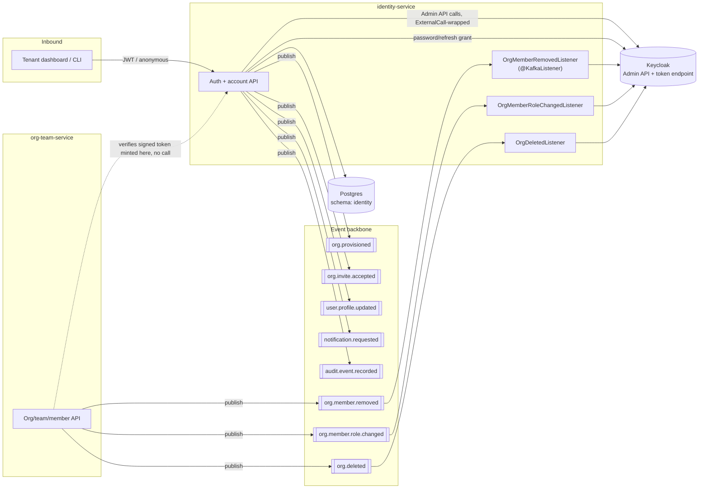
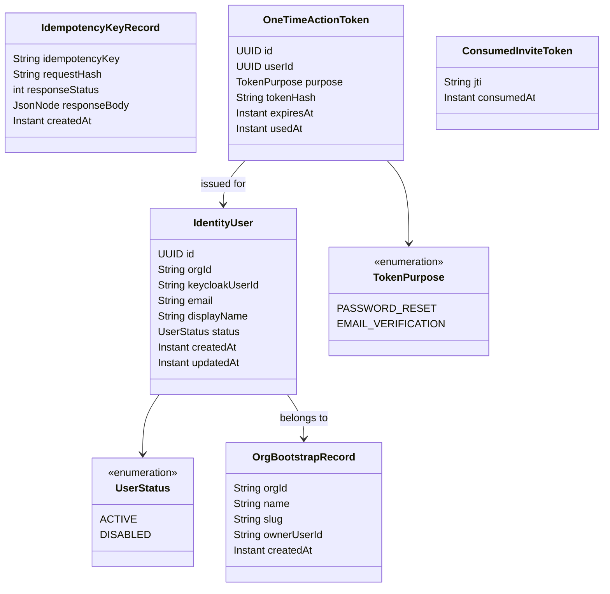
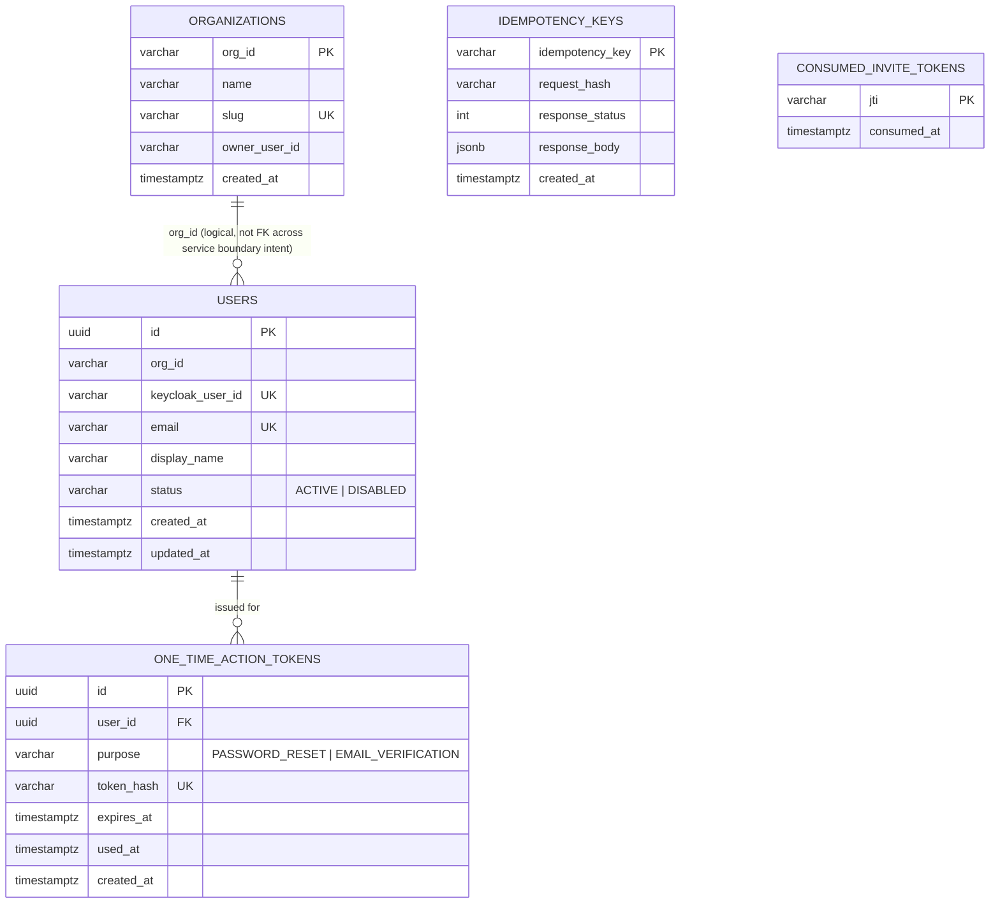
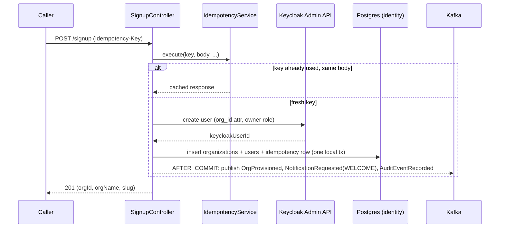
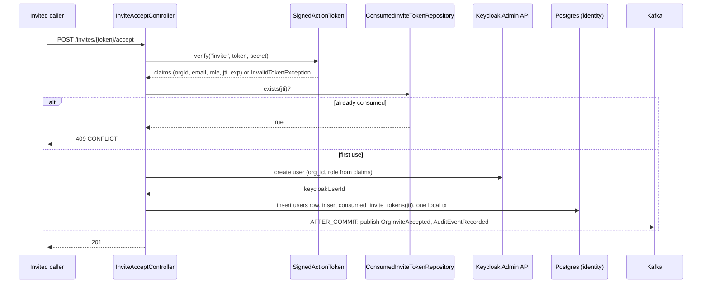
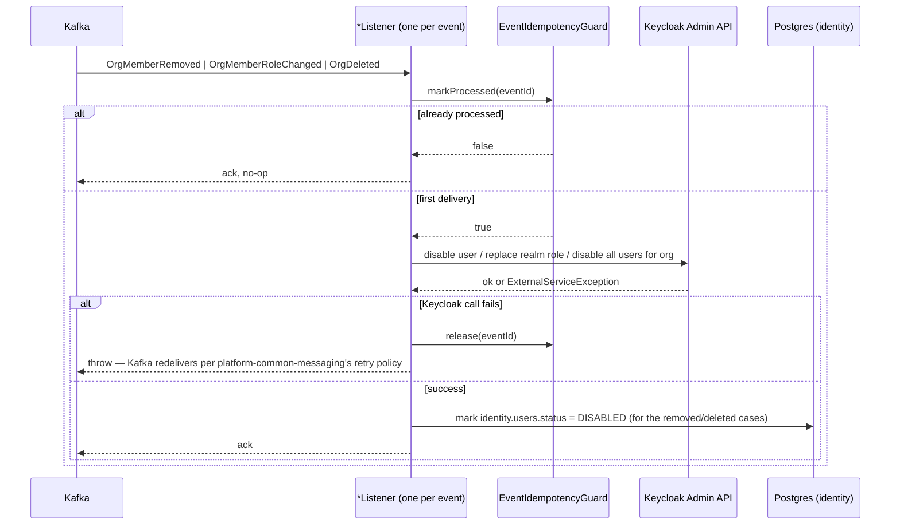
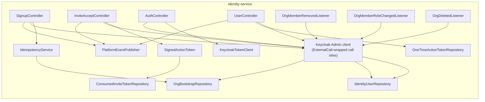

# identity-service — Architecture

Status: proposed (pre-implementation design). Extends the one-paragraph sketch in `PROJECT.md`
("`identity-service` wraps Keycloak. It issues and validates tokens for the dashboard and the API,
and provisions a tenant's identity when an organization signs up") into a full design, the same
way `docs/notification-service/ARCHITECTURE.md` extended notification-service's sketch. This
document and `docs/org-team-service/ARCHITECTURE.md` are written together and must be read
together — the two services share a hard boundary problem (below) that only has one coherent
answer across both. See **Relationship to existing planning docs** at the end before starting any
workflow file; this expands scope beyond `docs/workflows/ROADMAP.md` Phase 1d's original table the
same way ADR-0008 expanded notification-service's, and needs the same kind of ADR before Sprint 1.

## Contents

- [Purpose](#purpose)
- [The boundary problem this design solves](#the-boundary-problem-this-design-solves)
- [Position in the system](#position-in-the-system)
- [Design goals and non-goals](#design-goals-and-non-goals)
- [Domain model](#domain-model)
- [Data model](#data-model)
- [Signed action tokens: the sync-free handoff primitive](#signed-action-tokens-the-sync-free-handoff-primitive)
- [Event contracts](#event-contracts)
- [API](#api)
- [Processing pipelines](#processing-pipelines)
- [Distributed systems mechanisms](#distributed-systems-mechanisms)
- [Failure modes](#failure-modes)
- [Component view](#component-view)
- [Deployment and scaling view](#deployment-and-scaling-view)
- [Package layout and dependencies](#package-layout-and-dependencies)
- [Extension points](#extension-points)
- [Open questions / deferred](#open-questions--deferred)
- [Relationship to existing planning docs](#relationship-to-existing-planning-docs)

## Purpose

`identity-service` is the platform's only service with Keycloak Admin credentials and the only
service that ever writes a user's authentication state. Its job, precisely: **who can log in, and
which organization founded their account.** Everything about *what that person can do* once
they're in — teams, projects, membership beyond the founding owner, role changes — is
`org-team-service`'s job (`docs/org-team-service/ARCHITECTURE.md`). The two together answer "AuthN
here, AuthZ-shaped resource ownership there," a split chosen deliberately below rather than left
implicit.

Concretely, this service:

- Bootstraps a brand-new organization and its owner account (sign-up).
- Creates a new account for someone accepting an org's invite.
- Issues, refreshes, and revokes tokens; proxies password reset and email verification.
- Lets a user manage their own profile and active sessions.
- Keeps Keycloak's state (role assignment, account enabled/disabled) in sync with
  `org-team-service`'s membership decisions — via events, never a callback.

## The boundary problem this design solves

Two services need to cooperate on one user-facing action ("accept this invite and get an
account") without either calling the other synchronously (`PROJECT.md`: "no service makes a
blocking call to another — the only synchronous edges in the whole system are inbound ... and
calls to third parties"). Naming the problem precisely, because the rest of this document and
`org-team-service`'s exist to answer it:

- `org-team-service` owns *whether an invite is valid* (who invited whom, at what role, is it
  expired or already used) — that's membership data, its aggregate.
- `identity-service` owns *the only credential that can create a Keycloak user* — nothing else in
  the platform has that admin relationship, by design (checkpoint 1 of the identity-service
  workflow folder scopes exactly that credential to this service alone).

A synchronous call either direction would violate the platform's one hard rule and make invite
acceptance's latency and availability depend on two services instead of one. The answer —
detailed in [Signed action tokens](#signed-action-tokens-the-sync-free-handoff-primitive) — is
that `org-team-service` mints a **self-contained, signed token** carrying every claim
`identity-service` needs (org id, email, role, expiry) so `identity-service` can verify it and act
without ever asking `org-team-service` a question. Both sides of the handoff after that go back to
being ordinary async event publishes.

**A second, related decision this forces**: does one person's account belong to exactly one
organization, or can one login span several (a GitHub-style multi-org account)? ADR-0003 already
committed to a single `org_id` **user attribute** in Keycloak — one attribute, one value, so
today's Keycloak model already implies one org per account, not a choice this document invents.
This document keeps that: **one Keycloak account = one organization, permanently.** A person who
is genuinely part of two Pallet organizations (a contractor working for two clients, say) has two
separate Pallet accounts — almost certainly with two different email addresses, since Keycloak
(and this service's own `identity.users.email` unique index) enforce email uniqueness per realm.
This is the same tradeoff plenty of real single-tenant-per-account B2B products make (a work email
tied to one account, one company) rather than the heavier multi-tenant-membership model
GitHub/Slack/Vercel use, where a token's active org is chosen per-session rather than fixed at the
account level. The heavier model is strictly more capable and is the right call **if** Pallet ever
needs "one person, many orgs" as a real product requirement — it is not designed here, and
retrofitting it later means moving `org_id` off the Keycloak user attribute entirely and resolving
it at token-issuance time instead, which is a genuine breaking change to ADR-0003, not an additive
one. Flagged here so it's a conscious choice to revisit, not a limitation discovered by accident
later — see [Open questions](#open-questions--deferred).

## Position in the system



`identity-service` is both a producer and, for the first time in the repo, a **consumer that calls
an external third party from inside a `@KafkaListener`** — the three listeners on the right all
end in a Keycloak Admin call. That combination (consume an event, then make a resilience-wrapped
external call before the message is considered handled) is new; `notification-service`'s listener
already does the analogous thing for SMTP, so the pattern isn't unprecedented, but it's worth
stating plainly since `PROJECT.md`'s original sketch described this service as a producer only.

## Design goals and non-goals

**Goals**

- Sign-up and invite-acceptance are each one HTTP call from the caller's perspective, even though
  the richer org/membership state they trigger is built asynchronously by `org-team-service`.
- No service-to-service synchronous call, in either direction, ever — the signed-token pattern
  exists specifically so this holds even for the one workflow (invites) that looks like it needs
  one.
- Every mutating endpoint is safe to retry: sign-up via `Idempotency-Key`, invite-accept via a
  one-time-use token, password/email actions via single-use expiring tokens.
- Keycloak is the single source of truth for *authentication* (credentials, sessions, whether an
  account can log in). This service's own tables never duplicate that — they hold what Keycloak
  has no place for (the org bootstrap record, idempotency, one-time tokens) plus a **read-through**
  relationship to Keycloak for anything Keycloak already tracks (sessions), never a second copy
  that can drift.
- Keycloak's role assignment and account-enabled state track `org-team-service`'s membership
  decisions via consumed events — never left to drift because "nobody re-syncs it."
- Every external Keycloak call (Admin API or token endpoint) goes through `ExternalCall`, and a
  bad-credentials / bad-token response is distinguished from an infra failure at the call site, not
  left for the retry policy to misclassify.

**Non-goals (this design)**

- Owning organizations, teams, projects, or membership beyond the founding owner —
  `org-team-service`'s aggregate entirely (see [The boundary problem](#the-boundary-problem-this-design-solves)).
- Multi-org-per-account — see the callout above; a real, deliberate limitation, not an oversight.
- MFA, SSO/SAML, personal access tokens for CLI/service automation — real needs eventually
  (`git-integration-service`'s OAuth app and a future CLI both point this way), not designed here.
  See [Extension points](#extension-points).
- A generic "revoke this account" / GDPR-style purge flow — [Open questions](#open-questions--deferred).

## Domain model



**`OrgBootstrapRecord` is deliberately not called `Organization`.** It exists solely so this
service can (a) reject a taken slug at sign-up time with a local uniqueness check instead of a
round trip, and (b) know who to assign the `owner` Keycloak role to. It is a **write-once bootstrap
snapshot**, not a live-synced copy of the org — the moment `org-team-service` consumes
`org.provisioned` (below), *it* becomes the canonical, mutable place an org's name, settings, and
membership live. If an owner later renames their org through `org-team-service`, this record's
`name` column goes stale and nothing reads it again — it was only ever needed once, at sign-up.
Naming it differently from "Organization" is deliberate: a reader shouldn't mistake it for the
resource `org-team-service` owns.

`IdentityUser` is the local projection of a Keycloak user — the same "Keycloak owns credentials,
we keep a queryable local shadow of the rest" pattern established nowhere else in the repo yet but
consistent with `platform-common-security`'s existing assumption that `org_id`/roles live in the
token, not looked up per-request.

`ConsumedInviteToken` exists purely for replay protection: the signed invite token is
self-verifying (no DB lookup needed to know it's *valid*), but nothing stops the same valid token
being POSTed to the accept endpoint twice within its expiry window without a local record of
"this `jti` already fired."

## Data model

One Postgres schema, `identity` (shared cluster, schema-per-service, per ADR-0007).



Indexes beyond the primary/unique keys shown:

- `users(org_id)` — the one query this service runs per-org (disabling every user under a deleted
  org, [below](#processing-pipelines)).
- `one_time_action_tokens(expires_at)` — backs a cleanup sweep for expired, unused tokens; without
  it the table grows forever with dead rows nothing ever queries again after expiry.
- `consumed_invite_tokens(consumed_at)` — same purpose: a token's own `exp` claim bounds how long a
  row needs to exist here (see [Signed action tokens](#signed-action-tokens-the-sync-free-handoff-primitive));
  a `@Scheduled` sweep deletes rows past their embedded expiry so this table doesn't grow forever.

`token_hash` stores a SHA-256 digest of the one-time token, never the token itself — the same
"don't store the secret you'd need to leak to be dangerous" principle as a password. The token
handed to the user (in a password-reset/verification email link) is the only place the raw value
exists outside this table's write path.

**Why `ORGANIZATIONS`/`USERS` don't carry a real foreign key to anything in `org-team-service`**:
they can't — cross-schema foreign keys across two independently-owned schemas (let alone two
services that might, per `docs/adr/0007`, split to separate Postgres instances later) aren't a
real option. `org_id` is a plain string both services happen to agree on the meaning of, the same
relationship every other service (`notification-service` included) already has to `org_id`.

## Signed action tokens: the sync-free handoff primitive

This is the mechanism that makes [the boundary problem](#the-boundary-problem-this-design-solves)
solvable without a synchronous call. `org-team-service` mints a token; `identity-service` verifies
it using a secret both services are configured with — never a lookup against `org-team-service`'s
database.

```java
public final class SignedActionToken {

    public static String issue(String purpose, Map<String, String> claims, Duration ttl, String hmacSecret) {
        // JWS, HS256, via Nimbus (already on the classpath transitively through the
        // OAuth2 resource-server starter — no new dependency). Claims: sub-map above, plus
        // standard `jti` (random UUID, for replay tracking) and `exp` (now + ttl).
    }

    public static Map<String, String> verify(String purpose, String token, String hmacSecret) {
        // Verifies signature and exp; throws InvalidTokenException (a new AppException,
        // 400 INVALID_TOKEN) on a bad signature, expired token, or purpose mismatch.
        // Does NOT check single-use — that's the caller's job (ConsumedInviteToken), because
        // "used" is state, and a stateless verify has no state to check.
    }
}
```

A real signed JWT (HS256, Nimbus) rather than a hand-rolled format — reusing a library already on
the classpath and a well-understood, auditable token shape beats inventing one. The **shared HMAC
secret** (`pallet.invites.signing-key`, sourced from the same env var in both services'
`config-repo/*.yml`, never hardcoded per `SECURITY.md`) is the one piece of shared configuration
this whole design needs between two otherwise fully decoupled services — worth naming as a real,
if small, coupling: whoever rotates that secret has to roll it in both places, and a compromise of
either service's config leaks it. [Open questions](#open-questions--deferred) notes the harder,
asymmetric-signing alternative that removes the shared-secret coupling, deliberately not built
here — a symmetric secret between exactly two parties is proportionate for what this protects
(an invite's org/email/role claims, not a bearer credential with account access).

This primitive is scoped to invites only. Password reset and email verification are minted **and**
verified by this same service, so they use a simpler, cheaper mechanism — a random opaque token,
hashed and stored in `one_time_action_tokens` — since there's no cross-service verification problem
to solve for them.

## Event contracts

All of these are **new, proposed additions to `platform-common-events`** — none exist in `Topics`
today (confirmed: a search for `ORG_MEMBER` in `Topics.java` returns nothing). They're specified
here, alongside the design that needs them, so the contract and the two services' designs land
together — the same approach `notification-service/ARCHITECTURE.md` took for `audience`.

| Event | Topic | Published by | Consumed by | Payload |
|---|---|---|---|---|
| `OrgProvisioned` | `org.provisioned` | `identity-service` | `org-team-service` | `orgId, orgName, slug, ownerUserId, ownerEmail, ownerDisplayName` |
| `OrgInviteAccepted` | `org.invite.accepted` | `identity-service` | `org-team-service` | `orgId, inviteId, userId, email, displayName, role` |
| `UserProfileUpdated` | `user.profile.updated` | `identity-service` | `org-team-service` (keeps its member-profile projection fresh) | `orgId, userId, email, displayName` |
| `OrgMemberAdded` | `org.member.added` | `org-team-service` | `notification-service` (already expects this — ADR-0008) | `orgId, userId, email` — unchanged from what `notification-service` already assumes |
| `OrgMemberRemoved` | `org.member.removed` | `org-team-service` | `notification-service` (already expects this), **`identity-service`** (new consumer — disables the Keycloak account) | `orgId, userId, email` |
| `OrgMemberRoleChanged` | `org.member.role.changed` | `org-team-service` | `identity-service` (updates the Keycloak realm-role assignment) | `orgId, userId, previousRole, newRole` |
| `OrgDeleted` | `org.deleted` | `org-team-service` | `identity-service` (disables every account under the org, retires the bootstrap record) | `orgId, deletedByUserId` |

`identity-service` also publishes the two events already in the catalog: `NotificationRequested`
(the `WELCOME` type on sign-up, per the already-shipped `notification-service` template — see the
existing `identity-service` workflow checkpoint 4 for the exact mechanics) and `AuditEventRecorded`
(sign-up, login, and every action in the table above that changes an account's authentication
state — password reset completed, email verified, account disabled).

Why `identity-service` publishes `OrgMemberAdded` itself for the *owner* at sign-up was considered
and rejected: `org.member.added` is `org-team-service`'s fact about its own membership aggregate,
not identity-service's to assert. Identity-service publishes `OrgProvisioned`; `org-team-service`
is the one that turns that into a membership row *and* publishes `OrgMemberAdded` from it — one
producer per fact, no service publishing a fact about state it doesn't own.

## API

Every endpoint returns `ApiResponse<T>` / `PageResponse<T>` (`platform-common-api`), same as every
other service. Base path `/api/v1`.

### Account bootstrap (public, no bearer token)

| Method | Path | Idempotency | Notes |
|---|---|---|---|
| `POST` | `/signup` | `Idempotency-Key` header, required | Creates the Keycloak owner + `OrgBootstrapRecord`; publishes `OrgProvisioned`, `NotificationRequested` (`WELCOME`), `AuditEventRecorded`. Response includes `orgId`/`orgName`/`slug` so the dashboard's first screen doesn't need to wait on `org-team-service`'s async projection. |
| `POST` | `/invites/{token}/accept` | One-time-use `jti` (see `ConsumedInviteToken`), not a header | Verifies the signed token locally, creates a Keycloak user scoped to the token's `orgId`/`role`, publishes `OrgInviteAccepted`, `AuditEventRecorded`. A token whose `jti` is already consumed returns `409 CONFLICT` (not `200`) — replaying an accept is not safely idempotent the way sign-up is, because a second accept would try to create a second Keycloak user for an email that (by definition) now already has one. |

### Auth actions (public)

| Method | Path | Notes |
|---|---|---|
| `POST` | `/auth/login` | Password-grant proxy. Returns `401` (not a retried `ExternalServiceException`) for bad credentials — see `05-token-and-introspection.md`'s existing design for the exact mechanism. |
| `POST` | `/auth/refresh` | Refresh-grant proxy — exchanges a refresh token for a new access/refresh pair. Same bad-token-vs-infra-failure split as login. |
| `POST` | `/auth/logout` | Revokes the caller's current refresh token / Keycloak session (Keycloak's own revoke endpoint, `ExternalCall`-wrapped). |
| `POST` | `/auth/password/forgot` | Always returns `202`, whether or not the email exists — enumeration-safe by construction, the same reasoning `notification-service`'s recipient-scoping already applies. Issues a `PASSWORD_RESET` one-time token and a `NotificationRequested` (new type — see [Extension points](#extension-points)) only when the email *does* match a user; the caller can't tell the difference from the response. |
| `POST` | `/auth/password/reset` | Body: token + new password. Single-use, checked against `one_time_action_tokens.used_at`; a reused or expired token is `400 INVALID_TOKEN`. |
| `POST` | `/auth/email/resend-verification` | Same enumeration-safe `202` pattern as forgot-password. |
| `POST` | `/auth/email/verify` | Body: token. Marks the Keycloak user's `emailVerified` true via the Admin API. |

### Self-service account (authenticated, `platform-common-security` default filter chain)

| Method | Path | Notes |
|---|---|---|
| `GET` | `/users/me` | `sub`, `org_id`, and full composite realm-role set from the token — the `OrgContext`-exercising endpoint from the existing checkpoint 5 design. |
| `PATCH` | `/users/me` | Display name only (never email/password here — those have their own dedicated, more careful flows above). Publishes `UserProfileUpdated`. |
| `POST` | `/users/me/password` | Authenticated change-password: requires the *current* password (re-verified against Keycloak, not trusted from the token alone) before setting a new one. |
| `GET` | `/users/me/sessions` | Read-through to Keycloak's Admin API (`GET /admin/realms/pallet/users/{id}/sessions`) — no local session table, so this can never drift from what Keycloak actually has active. |
| `DELETE` | `/users/me/sessions/{sessionId}` | Revoke one session ("log out of that other device") — a specific Keycloak Admin session-delete call. |
| `DELETE` | `/users/me/sessions` | Revoke every session except the caller's current one. |

**No endpoint here reads or writes anything about teams, projects, or membership beyond the
account's own org/role** — that surface is entirely `org-team-service`'s. There is deliberately no
`GET /orgs/{orgId}` on this service: the only org data this service ever hands back is the inline
sign-up response, a write-once snapshot, not a browsable resource — browsing/editing an org is
`org-team-service`'s `GET /api/v1/orgs/{orgId}`.

## Processing pipelines

### Sign-up



The Keycloak-call-before-local-commit ordering, and the interim compensating-delete mitigation for
the resulting dual-write gap, are unchanged from the existing checkpoint 3 design
(`docs/workflows/identity-service/03-org-signup-and-provisioning.md`) — this document doesn't
re-litigate that, it's still the honest, named gap it was, and still checkpoint 6's decision to
resolve or accept.

### Invite acceptance



### Membership-lifecycle listeners (Keycloak sync)



Each listener uses the same `EventIdempotencyGuard` contract every other consumer in the repo
uses — a redelivered `OrgMemberRemoved` must not fail because the Keycloak user is already
disabled (Keycloak's disable-an-already-disabled-user call is itself idempotent, but the guard is
what makes the *whole* handler safe to re-run, including the local DB write).

## Distributed systems mechanisms

| Concern | Mechanism | Where |
|---|---|---|
| Cross-service handoff with no synchronous call | Self-contained signed token (HS256, shared secret) carrying every claim the verifier needs | `SignedActionToken`, minted by `org-team-service`, verified here |
| At-least-once → effectively-once (consumer side) | `EventIdempotencyGuard` on every `@KafkaListener`, same shared contract as `notification-service` | The three membership-lifecycle listeners |
| Replay protection for a stateless-verified token | Local `consumed_invite_tokens(jti)` row, checked after signature/expiry verification | Invite accept |
| Idempotent mutation (HTTP) | `Idempotency-Key` + request-hash comparison, `IdempotencyKeyReuseException` (`platform-common-exception`) on mismatch | Sign-up |
| Publish-after-commit | `@TransactionalEventListener(AFTER_COMMIT)` — never publish from inside the mutating transaction | Sign-up, invite-accept |
| No dual local-copy of Keycloak's own state | Sessions are read-through to the Admin API, never cached locally | `GET/DELETE /users/me/sessions` |
| Keeping an external system (Keycloak) in sync with another service's decisions | Consume the owning service's fact event, then make the Keycloak call — never a callback, never polling | `OrgMemberRemoved` / `OrgMemberRoleChanged` / `OrgDeleted` listeners |
| Fast, bounded retry per external call | `ExternalCall` around every Keycloak Admin/token call, named policies (`keycloak-admin`, `keycloak-token`) | `platform-common-resilience` |
| Don't retry a deterministic client error | Bad credentials / bad token thrown as an `AppException` *before* reaching `ExternalCall`'s retry logic | Login, refresh, token verification |
| Tracing | One trace per HTTP request; one trace per consumed event → Keycloak call | `platform-common-observability` |
| Multi-tenancy isolation | `org_id` on every row; `/users/me*` scoped to the token's own `sub`, never a path parameter | `identity` schema; `platform-common-security` |
| Consistency model | Eventual across the two services: `org.provisioned`'s consumer (`org-team-service`) may lag the sign-up response by up to normal consumer-group lag | Named explicitly in [Failure modes](#failure-modes), not hidden |

## Failure modes

| Scenario | Behavior |
|---|---|
| Keycloak unreachable during sign-up | `ExternalCall`'s `keycloak-admin` policy retries, then circuit-breaks; sign-up returns `502`-mapped `ExternalServiceException` — no local row is written (Keycloak call happens before the local transaction). |
| Local commit fails after Keycloak user already created | Named, not hidden — same compensating-delete mitigation as the existing checkpoint 3 design; the residual gap is checkpoint 6's decision. |
| Dashboard reads `org-team-service` immediately after a `201` from `/signup` | May briefly 404 or return a partial projection — `org.provisioned`'s consumer hasn't necessarily run yet. The dashboard should treat "org not found yet" right after a fresh sign-up as "still provisioning," not an error; the sign-up response itself carries enough (`orgId`/`orgName`/`slug`) to render an immediate first screen without needing `org-team-service` at all. |
| Invite token replayed after first successful accept | `409 CONFLICT` — `consumed_invite_tokens(jti)` already has a row. |
| Invite token expired | `400 INVALID_TOKEN` — `SignedActionToken.verify` checks `exp` before this service ever looks at a database. |
| Invite token's `orgId` no longer exists (org deleted between invite and accept) | Accept still succeeds at the Keycloak-user-creation level — this service has no way to know the org was deleted (no sync call to `org-team-service`) — but the resulting `OrgInviteAccepted` event's consumer in `org-team-service` finds no matching organization row and drops it, logging a metric. The new account exists with an `org_id` claim pointing nowhere. This is a real, if narrow, consequence of the no-sync-call design and is named here rather than assumed away; mitigated in practice by invite tokens having a short TTL and org deletion being a rare, deliberate owner action. |
| `OrgMemberRemoved` / `OrgMemberRoleChanged` / `OrgDeleted` arrives for an `orgId`/`userId` this service has no local row for | Logged and acknowledged as a no-op rather than treated as an error — a legitimate outcome if, e.g., `identity-service` and `org-team-service` are deployed at different times during a rollout. |
| A password-reset or email-verification token is used twice | Second use finds `used_at` already set → `400 INVALID_TOKEN`, same code path as expiry. |
| An account is disabled (removed from its only org) and the same email tries to sign up again | Keycloak's own email-uniqueness rejects it — surfaces as `409 CONFLICT`, "an account with this email already exists." No automatic reactivation; a genuinely different flow (account recovery) that isn't designed here — see [Open questions](#open-questions--deferred). |

## Component view



## Deployment and scaling view

Stateless HTTP + one Kafka consumer group (`identity-service`, three topics), same shape as
`notification-service`'s combined consumer/API deployable — one process type, scaled by instance
count. No partition-count constraint worth calling out separately: `org.member.*`/`org.deleted`
volume is orders of magnitude below `notification.requested`'s, so this service's consumer side is
never the throughput bottleneck the way it might eventually be for notification delivery.

## Package layout and dependencies

```
services/identity-service/
└── src/main/java/io/pallet/identity/
    ├── IdentityServiceApplication.java
    ├── signup/            SignupController, SignupService, OrgBootstrapRecord, OrgBootstrapRepository
    ├── invite/             InviteAcceptController, InviteAcceptService, ConsumedInviteTokenRepository
    ├── auth/               AuthController, KeycloakTokenClient, LoginRequest/TokenResponse DTOs
    ├── account/           UserController, IdentityUser (entity), IdentityUserRepository,
    │                     OneTimeActionTokenRepository, password-reset/email-verify services
    ├── keycloak/           KeycloakAdminConfiguration, the shared `Keycloak` admin bean
    ├── token/              SignedActionToken, InvalidTokenException
    ├── membership/         OrgMemberRemovedListener, OrgMemberRoleChangedListener, OrgDeletedListener
    ├── idempotency/        IdempotencyService, IdempotencyKeyRepository
    └── audit/               AuditPublisher
```

POM additions beyond the reactor-independent parent: `platform-common-api`, `-exception`,
`-events`, `-observability`, `-messaging`, `-resilience`, `-security`; `spring-boot-starter-webmvc`
+ `-validation`; `spring-boot-starter-data-jpa` + `postgresql` + `flyway-database-postgresql`;
`org.keycloak:keycloak-admin-client` (version pinned locally, matching the realm's Keycloak image
line); Nimbus JOSE for `SignedActionToken` comes transitively via the OAuth2 resource-server
starter already required for `platform-common-security` — no new dependency to add for it.

## Extension points

- **MFA** (TOTP): Keycloak already supports it natively per-realm; adding it here is mostly a
  `/auth/mfa/*` endpoint group proxying Keycloak's required-actions flow, not a new subsystem.
- **SSO/SAML** for an enterprise tenant: a per-org Keycloak identity-provider link — additive to
  the realm config, no change to this service's own data model.
- **Personal access tokens** for CLI/service automation: a new token type this service would mint
  and validate itself (not Keycloak-backed), needed once a CLI or `git-integration-service`'s own
  automation needs non-interactive auth. Not designed here — genuinely a different token lifecycle
  (long-lived, revocable, scoped) from anything above.
- **Account deletion / GDPR export**: the disable-on-removal behavior today is a soft, reversible
  state, not a purge. A real delete-my-account flow is a different, larger feature (data export,
  cascading deletes across every service that holds `userId`-keyed data) — out of scope here.
- **New `NotificationRequested` types this design needs but doesn't yet have templates for**:
  `PASSWORD_RESET`, `EMAIL_VERIFICATION` — flagged the same way `notification-service`'s own
  `WELCOME` template already exists; these two need new template files in `notification-service`
  before `/auth/password/forgot` and `/auth/email/resend-verification` can actually send anything.

## Open questions / deferred

- **Multi-org-per-account.** Named in detail above — the single biggest scope decision this
  document makes explicitly rather than by accident. Revisit if "one person, several orgs" becomes
  a real product requirement; the fix is moving `org_id` off the Keycloak user attribute and
  resolving it at token-issuance/session time instead, which is a breaking change to ADR-0003, not
  additive.
- **Shared HMAC secret between two services.** Proportionate for what it protects (invite claims,
  not a bearer credential) but is real coupling — an asymmetric scheme (`org-team-service` signs
  with a private key, `identity-service` verifies with the public one, no secret ever duplicated)
  removes it at the cost of key-management overhead. Not built now; worth a short ADR the day a
  third service needs to mint or verify one of these tokens, since that's the point a symmetric
  secret stops being proportionate.
- **Account recovery after disable.** An org that removes then re-adds the same person currently
  can't cleanly reuse their old, disabled account (Keycloak's email uniqueness blocks a fresh
  sign-up/invite for that email) and there's no reactivation endpoint. A real product needs one;
  not designed here because it depends on decisions ([Extension points](#extension-points)) about
  what "delete vs. disable" should mean long-term.
- **Rate limiting `/auth/login` and `/signup`.** Both are unauthenticated and exactly the shape of
  endpoint an abuse script targets. Deferred to the existing checkpoint 6 hardening review
  (`docs/workflows/identity-service/06-hardening.md`), which already names this as a decision to
  make deliberately rather than default into.

## Relationship to existing planning docs

`PROJECT.md`'s one-paragraph sketch and `docs/workflows/ROADMAP.md` Phase 1d's original six-row
table describe `identity-service` as issuing tokens and provisioning identity on sign-up — a
pure producer on the backbone. This document keeps that core but adds real scope ADR-0008-style:
invite acceptance, self-service account/session management, password reset and email
verification, and three new `@KafkaListener`s that make this service a consumer for the first
time, all driven by the boundary decision with `org-team-service` above. Before
`docs/workflows/identity-service/`'s checkpoints are rewritten against this design, this needs a
short ADR — the same rule `CONTRIBUTING.md` states and ADR-0008 already modeled — covering:

- The AuthN/AuthZ-shaped split between this service and `org-team-service` (who owns what).
- Signed action tokens as the sync-free cross-service handoff pattern, and the shared-secret
  tradeoff it accepts for now.
- Single-org-per-account as a deliberate v1 constraint, not an oversight.

The existing `docs/workflows/identity-service/01`–`06` files (written against the narrower Phase
1d table) will need meaningful revision once that ADR lands — noted for the next pass, not done in
this document, per the plan to write workflows after this architecture is settled.

`platform-common-events` needs the seven new event types in the
[Event contracts](#event-contracts) table added to `Topics` and given record types — a shared-module
change requiring its own review, same as `NotificationRequested`'s `audience` field was.
