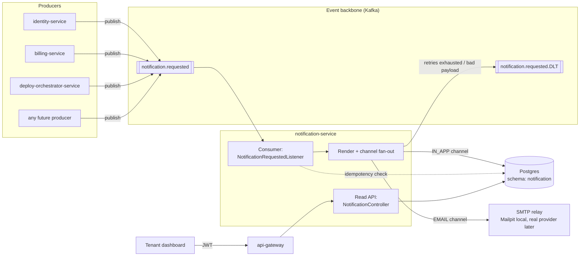
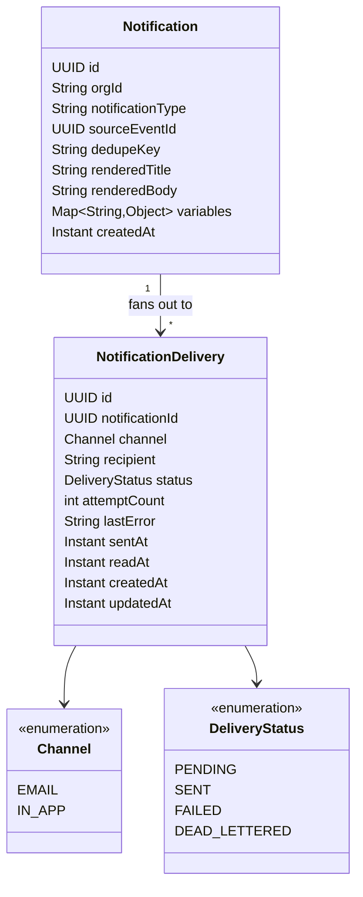
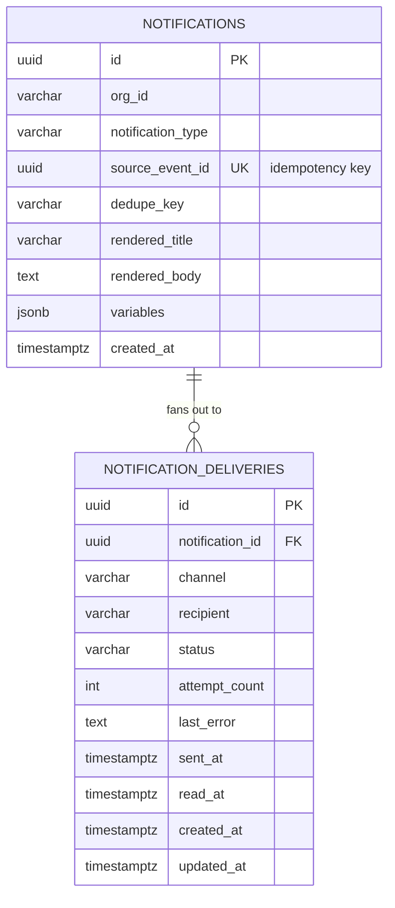
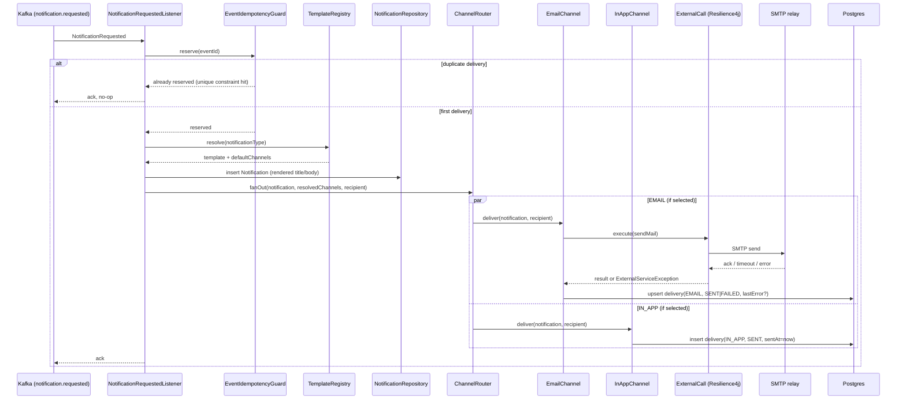
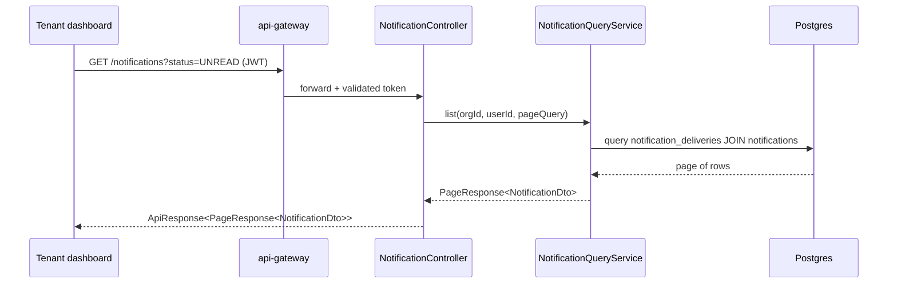
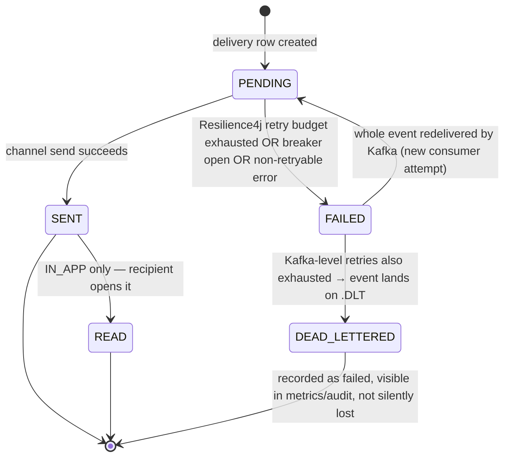
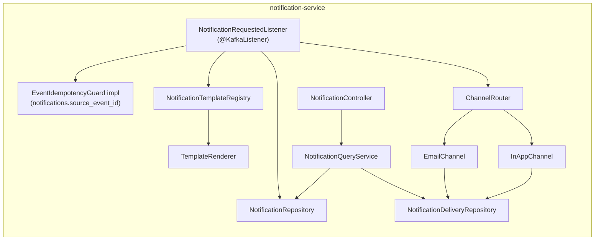
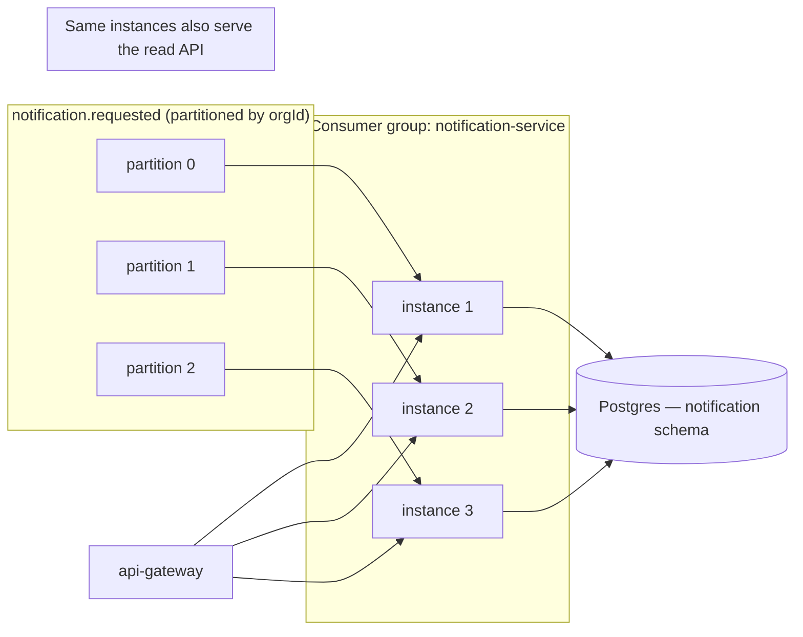

# notification-service — Architecture

Status: proposed (pre-implementation design). Extends the sketch in `PROJECT.md`'s
`notification-service` paragraph and `docs/workflows/ROADMAP.md` Phase 1c with a second channel
(in-app) and the read-side API that channel needs. See **Relationship to existing planning docs**
at the end before starting Sprint 1 — this doc adds scope that Phase 1c's table doesn't cover yet
and should get a short ADR when implementation starts, per `CONTRIBUTING.md`'s "a decision that
changes architecture gets an ADR in the same PR."

## Contents

- [Purpose](#purpose)
- [Position in the system](#position-in-the-system)
- [Design goals and non-goals](#design-goals-and-non-goals)
- [Domain model](#domain-model)
- [Data model](#data-model)
- [Inbound contract: `notification.requested`](#inbound-contract-notificationrequested)
- [Channel abstraction and the template registry](#channel-abstraction-and-the-template-registry)
- [Processing pipeline](#processing-pipeline)
- [Read API: in-app notifications](#read-api-in-app-notifications)
- [Distributed systems mechanisms](#distributed-systems-mechanisms)
- [Delivery state machine](#delivery-state-machine)
- [Failure modes](#failure-modes)
- [Component view](#component-view)
- [Deployment and scaling view](#deployment-and-scaling-view)
- [Package layout and dependencies](#package-layout-and-dependencies)
- [Extension points](#extension-points)
- [Open questions / deferred](#open-questions--deferred)
- [Relationship to existing planning docs](#relationship-to-existing-planning-docs)

## Purpose

`notification-service` is the first feature service and the reference event consumer every later
service copies (`PROJECT.md`). Its job: any service publishes one `notification.requested` event
when it wants a tenant told something; this service renders it and delivers it on whatever
channels that notification type is configured for, records what happened, and — for channels with
no external inbox of their own — lets the frontend fetch what it delivered.

Two channels ship in this foundation:

- **Email** — fire-and-forget delivery through an SMTP relay (Mailpit locally). Nothing to query
  back; success means the message left the building.
- **In-app** — there is no external inbox, so *delivery is persistence*. The row this service
  writes on delivery is the same row a `GET /api/v1/notifications` call returns later, which is
  why in-app is architected as a first-class channel now rather than bolted on when a dashboard
  needs it.

Everything else — Slack, tenant webhooks, SMS — plugs into the same `NotificationChannel`
abstraction later without touching the consumer, the idempotency guard, or the read API.

## Position in the system



Nothing points back into a producer. The only synchronous edges this service has are its own
inbound REST calls (dashboard → gateway → this service) and its own outbound SMTP call — both are
either behind auth or behind `platform-common-resilience`, per `PROJECT.md`'s "no service makes a
blocking call to another" rule. Producers never learn whether a notification actually sent;
that is this service's problem to solve (or expose via metrics/audit), not theirs to wait on.

## Design goals and non-goals

**Goals**

- Adding a notification type is a producer-side change (publish the event) plus one template file
  here — no schema change, no new topic, no new consumer.
- Adding a channel is a new `NotificationChannel` implementation plus a Spring bean — the
  consumer, idempotency guard, and read API are channel-agnostic.
- A redelivered event, or two logically-duplicate requests for the same fact, produce one
  notification per channel, not two.
- Every consume → render → send hop is one trace; sent/failed/retried/dead-lettered/read counters
  are exported from the first commit, not bolted on later.
- The service degrades gracefully under a slow or dead SMTP host: the consumer keeps making
  progress on other channels/messages instead of stalling.

**Non-goals (this foundation)**

- Real-time push (WebSocket/SSE) for in-app notifications — the read API is pull-based; see
  [Open questions](#open-questions--deferred).
- Per-user notification preferences / opt-out / digesting — the template registry decides
  channels for now, not a per-recipient setting.
- Org-wide broadcast (one event → every member of an org notified) — v1 is one delivery per
  explicit recipient. A broadcast either fans out at the producer (loop and publish N events) or
  waits for `org-team-service` to exist so this service can resolve membership itself.
- A schema registry or Avro/Protobuf — ADR-0006 keeps the wire format plain JSON.

## Domain model

Two concepts, deliberately kept apart because they answer different questions:

- **Notification** — the *content*: what was decided, rendered once from a template and a
  variable map. It answers "what happened and what does it say." Immutable after creation — a
  later template edit never rewrites history.
- **NotificationDelivery** — the *attempt*: one row per (notification, channel), answering "did it
  reach the recipient on this channel, and what's its state now." Email's delivery row is
  write-once (`SENT`/`FAILED`); in-app's delivery row is also the read-side record (`read_at`).

Splitting them is what lets one notification fan out to N channels without duplicating rendered
content N times, and lets the read API stay ignorant of anything email-specific.



## Data model

One Postgres schema, `notification` (shared cluster, schema-per-service, per ADR-0007), owned
exclusively by this service — no other service reads or writes it directly.



Indexes that matter from day one (Flyway, not an afterthought migration):

- `notifications(source_event_id)` **unique** — this *is* the event-idempotency guard (see below);
  a redelivery hits a constraint violation, which the guard treats as "already handled."
- `notifications(org_id, dedupe_key)` unique **partial** index (`WHERE dedupe_key IS NOT NULL`) —
  collapses logically-duplicate requests from two different producers.
- `notification_deliveries(notification_id, channel)` **unique** — one delivery row per channel
  per notification; fan-out is `INSERT ... ON CONFLICT DO NOTHING`, so a retried fan-out step
  never double-sends a channel that already succeeded.
- `notification_deliveries(recipient, channel, created_at DESC) WHERE channel = 'IN_APP'` — the
  index the read API's list query actually runs against.
- `notification_deliveries(recipient, channel) WHERE channel = 'IN_APP' AND read_at IS NULL` —
  backs the unread-count endpoint without a full table scan per request.

`recipient` is channel-appropriate: an email address for `EMAIL`, a user id (the token's `sub`)
for `IN_APP`. Storing it on the delivery row, not the notification row, is what lets one
notification address different identifiers per channel.

## Inbound contract: `notification.requested`

Already defined in `platform-common-events` (`NotificationRequested`) — this section is how this
service *interprets* the existing fields, not a proposed contract change:

```java
public record NotificationRequested(
        UUID eventId, String eventType, String orgId, Instant occurredAt,
        String notificationType, String recipient, String channel,
        String dedupeKey, Map<String, Object> variables) implements PlatformEvent { ... }
```

- `channel` becomes an **override, not a requirement**. If the producer sets it, delivery is
  restricted to that one channel. If it's `null`, the template registry's `defaultChannels` for
  that `notificationType` decide — most notification types will declare both `EMAIL` and
  `IN_APP` there rather than every producer having to know the full channel list. This is additive
  interpretation of an existing nullable field, not a contract break.
- `recipient` is required and must already be the right shape for whichever channel(s) actually
  get used — the producer picking an email address for a notification type that also fans out to
  `IN_APP` is a template-authoring bug the registry should catch at startup (see below), not a
  runtime failure to design around.
- `variables` stays the loose `Map<String, Object>` per ADR-0006; unknown keys are ignored by the
  renderer the same way unknown JSON fields are ignored by the deserializer.

## Channel abstraction and the template registry

```java
public interface NotificationChannel {
    Channel type();
    void deliver(RenderedNotification notification, String recipient) throws ChannelDeliveryException;
}
```

`EmailChannel` and `InAppChannel` are the two Spring beans registered at startup; `ChannelRouter`
looks them up by `Channel` enum, so adding Slack later is "implement the interface, add the
`@Component`" with zero changes to the consumer or the router.

```java
public record NotificationTemplate(
        String notificationType,
        Set<Channel> defaultChannels,
        String subjectTemplate,   // used by EMAIL
        String bodyTemplate) {}    // used by both EMAIL and IN_APP (title/body derived from it)
```

`NotificationTemplateRegistry` loads these from template files keyed by `notificationType`
(classpath resources, one file per type — same "one new file, not a new consumer" property
`PROJECT.md` already commits to) and fails service startup if a producer-declared
`notificationType` from the event catalog has no matching template. Failing loud at boot beats
failing quiet on a redelivered message a producer already sent.

## Processing pipeline



If the listener throws (a channel that must not swallow its own failure — see
[Failure modes](#failure-modes) for which ones do), `platform-common-messaging`'s consumer factory
takes over: exponential-backoff redelivery, then `DeadLetterPublishingRecoverer` to
`notification.requested.DLT`. Nothing in this service hand-rolls retry or DLT logic — that
plumbing is shared, per `docs/workflows/platform-common/05-messaging.md`.

## Read API: in-app notifications

```
GET   /api/v1/notifications?status=UNREAD&page=&size=&sort=
GET   /api/v1/notifications/{deliveryId}
PATCH /api/v1/notifications/{deliveryId}/read
POST  /api/v1/notifications/read-all
GET   /api/v1/notifications/unread-count
```

- Scoped to `IN_APP` deliveries only — email has nothing to list.
- Authenticated via `platform-common-security`; `recipient` on the query is the caller's own `sub`
  claim, never a path/query parameter a client sets — a user must not be able to page through
  another user's notifications by changing an id. `org_id` on the token additionally scopes the
  underlying `Notification` row, so cross-tenant leakage needs two independent claim mismatches,
  not one.
- Responses use `PageResponse<NotificationDto>` wrapped in `ApiResponse<T>`
  (`platform-common-api`) like every other Pallet endpoint; list input is a `PageQuery`.
- `PATCH .../read` is idempotent — marking an already-read notification read again is a 200, not
  a 409; `read_at` only ever moves from `null` to a timestamp, never back.



## Distributed systems mechanisms

| Concern | Mechanism | Where |
|---|---|---|
| At-least-once → effectively-once | Unique constraint on `notifications.source_event_id`; insert failure = "already handled" | `EventIdempotencyGuard` impl backed by the `notifications` table (overrides the default Redis guard, same pattern `05-messaging.md` describes for the delivery log) |
| Logical dedupe (two producers, one fact) | Partial unique index on `(org_id, dedupe_key)` | `notifications` table |
| Per-channel fan-out idempotency | Unique `(notification_id, channel)`, `INSERT ... ON CONFLICT DO NOTHING` | `notification_deliveries` |
| Ordering | Kafka partition key = `orgId` (already set by `PlatformEventPublisher`) — one tenant's notifications stay ordered; no cross-tenant ordering guarantee needed | Kafka + `platform-common-messaging` |
| Backpressure / horizontal scale | Stateless consumer, scales by adding instances up to the partition count of `notification.requested` | Consumer group, `platform-common-messaging` |
| Fast, bounded retry per external call | Retry + circuit breaker + time limiter around each SMTP send | `ExternalCall` (`platform-common-resilience`) wrapping `EmailChannel` |
| Slow-consumer isolation | A tripped email circuit breaker fails fast instead of blocking the poll loop; in-app deliveries for the same batch are unaffected since they don't share the breaker | Per-channel `ExternalCall` instances, not one shared breaker |
| Redelivery + poison-message handling | Exponential backoff redelivery, then `DeadLetterPublishingRecoverer` → `notification.requested.DLT` | `platform-common-messaging` |
| Tracing | One trace spans consume → render → fan-out → send, and separately, one span per inbound read-API call | `platform-common-observability` (`@Monitored`, correlation interceptor) |
| Metrics | Counters: `notifications.sent`, `.failed`, `.retried`, `.dead_lettered`, `.read`; histogram: send latency by channel; gauge: breaker state | Micrometer via `platform-common-observability` + `-resilience` |
| Multi-tenancy isolation | `org_id` on every row; read API additionally scopes by `sub` (recipient) | Postgres schema `notification`; `platform-common-security` |
| Consistency model | Eventual: a producer's event and a delivered notification are never in the same transaction (no dual-write across services) — the producer doesn't block on delivery, and delivery lag is bounded by consumer lag, not by this service's own logic | Inherent to the event-driven design; see `PROJECT.md`'s reliable-publishing open question for the producer side of this |

## Delivery state machine

Two independent retry rings apply before a delivery reaches a terminal state: Resilience4j's
retry (fast, in-process, a handful of attempts within one consumer invocation) and Kafka's
consumer-level redelivery (slower, whole-message, backs off across multiple poll cycles). A
delivery only reaches `DEAD_LETTERED` after both are exhausted.



## Failure modes

| Scenario | Behavior |
|---|---|
| SMTP host down / slow | Circuit breaker opens after the configured failure threshold; further `EMAIL` deliveries fail fast (`FAILED`) instead of blocking the consumer thread; breaker state is a Prometheus gauge so it's visible before it becomes an incident |
| Malformed / undeserializable event | `ErrorHandlingDeserializer` routes straight to `notification.requested.DLT` — never reaches the listener |
| Unknown `notificationType` (no template) | Startup-time validation should have caught this for any type in the event catalog; if it still happens (a producer bug shipped ahead of its template), the listener throws a non-retryable exception — Kafka redelivery would just repeat the same failure, so this should skip straight to DLT rather than burn the full backoff schedule (configure as a non-retryable exception type in the consumer factory, per `06-resilience.md`'s exception classification) |
| One channel fails, another in the same fan-out succeeds | Independent delivery rows — `IN_APP` succeeding while `EMAIL` fails (or vice versa) is a normal, expected, partially-successful outcome, not a transaction to roll back |
| Redelivered event after a successful first pass | `EventIdempotencyGuard` short-circuits before any channel runs — zero duplicate emails, zero duplicate in-app rows |
| Reader marks an already-read notification as read again | No-op, 200 — `read_at` is monotonic |
| Recipient claim on the token doesn't match the delivery's `recipient` | 404, not 403 — don't confirm to a caller that a notification exists for someone else |

## Component view



## Deployment and scaling view



The consumer and the read API live in one deployable in v1 — no reason yet to split them, and
splitting later (a dedicated read-replica-backed query service) is cheap precisely because
`NotificationQueryService` only talks to the repositories, never to the Kafka listener. Scale by
adding instances up to the partition count of `notification.requested`; beyond that, add
partitions (a one-time operational step, not a code change, since the key is already `orgId`).

## Package layout and dependencies

```
services/notification-service/
└── src/main/java/io/pallet/notification/
    ├── NotificationServiceApplication.java
    ├── consumer/        NotificationRequestedListener
    ├── idempotency/      NotificationEventIdempotencyGuard
    ├── template/         NotificationTemplate, NotificationTemplateRegistry, TemplateRenderer
    ├── channel/          NotificationChannel, EmailChannel, InAppChannel, ChannelRouter
    ├── domain/           Notification, NotificationDelivery, Channel, DeliveryStatus (JPA entities)
    ├── repository/       NotificationRepository, NotificationDeliveryRepository
    ├── api/               NotificationController, NotificationQueryService, NotificationDto
    └── config/           NotificationServiceProperties
```

POM adds, beyond the reactor parent: `platform-common-api`, `-exception`, `-events`,
`-messaging`, `-observability`, `-resilience`, `-security` (read API auth);
`spring-boot-starter-data-jpa` + `postgresql` + `flyway-core` for persistence;
`spring-boot-starter-mail` for the `EmailChannel`'s `JavaMailSender`;
`spring-boot-starter-webmvc` + `-validation` for the read API. Config:
`config-repo/notification-service.yml` (SMTP block from Phase 1b, Postgres URL, template
directory) alongside the shared `config-repo/application.yml`.

Testing follows `CONTRIBUTING.md`: `*IntegrationTest` classes use Testcontainers for Kafka and
Postgres. There's no `testcontainers-` module for an SMTP relay — use GreenMail (in-process fake
SMTP) to assert rendered email content in `*IntegrationTest`s, and reserve real Mailpit for the
manual, docker-compose-driven verification step ("publish an event, see the email land in the
Mailpit UI at `:8025`").

## Extension points

Adding **Slack** later: implement `NotificationChannel` with `type() == SLACK`, wrap its HTTP
call in `ExternalCall`, register the bean, add `SLACK` to whichever templates' `defaultChannels`
should include it. No change to the listener, the idempotency guard, the DTOs, or the read API.

Adding **tenant webhooks**: same shape, plus a per-org webhook URL lookup this service doesn't
own yet (likely `org-team-service`, once it exists) — the channel implementation is where that
lookup would go, not a fork in the consumer.

Adding **notification preferences** (a user muting a type or channel): a lookup the
`ChannelRouter` consults before fan-out, sitting between "template says these channels" and
"actually deliver" — additive, doesn't change the delivery/read data model.

## Open questions / deferred

- **Real-time push for in-app.** The read API is pull/poll-based in this foundation. A live
  unread-count badge either polls `GET .../unread-count` on an interval or, later, gets a
  WebSocket/SSE push — the same pattern `PROJECT.md`'s log-service tail already establishes
  (JWT-checked live stream scoped to the caller). Not built now; the data model doesn't block it.
- **Org-wide broadcast.** Deferred until there's a membership source to resolve against
  (`org-team-service`); v1 requires one explicit recipient per delivery.
- **Notification retention / archival.** No TTL or archival job in this foundation — `read_at`
  distinguishes read from unread, nothing deletes old rows yet. Worth revisiting alongside
  `usage-metering-service`'s per-org retention-as-a-plan-attribute pattern if in-app volume grows.
- **Rate limiting per org.** Not in this foundation; a noisy producer can currently flood one
  tenant's in-app inbox. A `Bucket4j`/Resilience4j `RateLimiter` in front of the read API, or a
  per-org cap in the consumer, is a natural Phase-1-hardening addition once real usage shows
  whether it's needed.

## Relationship to existing planning docs

`docs/workflows/ROADMAP.md` Phase 1c and `PROJECT.md`'s `notification-service` paragraph describe
email-only delivery with a `delivery_log` table that "doubles as the idempotency record." This
document folds that idea into the two-table model above (`notifications` +
`notification_deliveries`): the idempotency check still lives on a unique-constraint insert, just
against `notifications.source_event_id` instead of a table named `delivery_log`, and the same
table now also carries the fan-out and read-state that in-app needs. The event contract
(`NotificationRequested`) doesn't change — `channel` is reinterpreted as an optional override
rather than a required field, which was already legal (it's a plain nullable `String`).

Before Sprint 1 of `docs/workflows/notification-service/` starts, this expansion in scope (a
second channel, two new REST endpoints groups, `platform-common-security` as a new dependency for
this service) should get a short ADR, per `CONTRIBUTING.md`'s rule that an architecture-changing
decision ships an ADR in the same PR — this file is the design; the ADR is the one-page record of
*why* in-app joined the foundation instead of arriving as a later phase.
