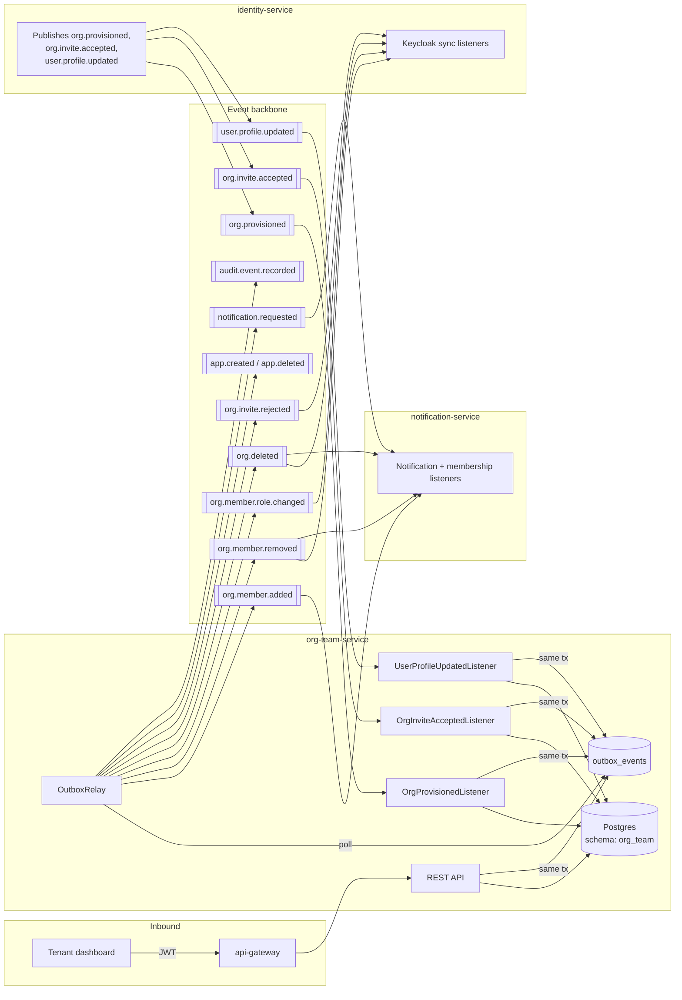
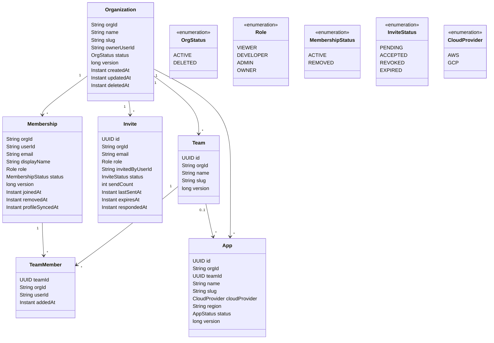
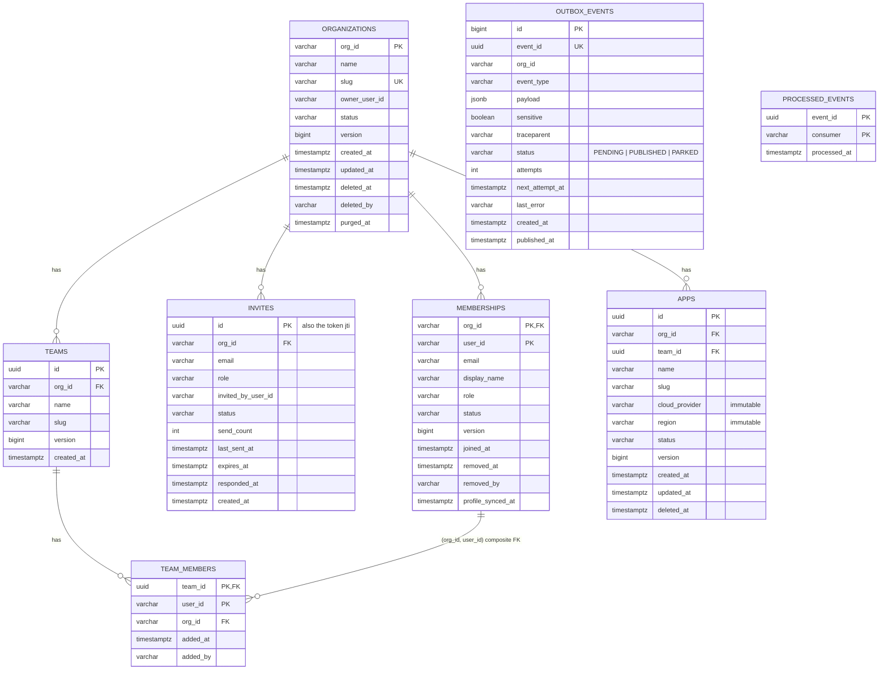
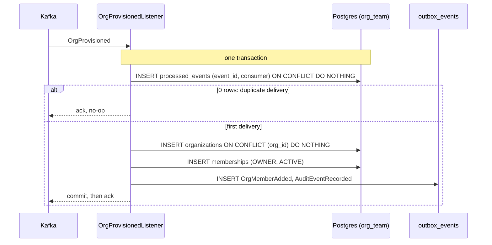
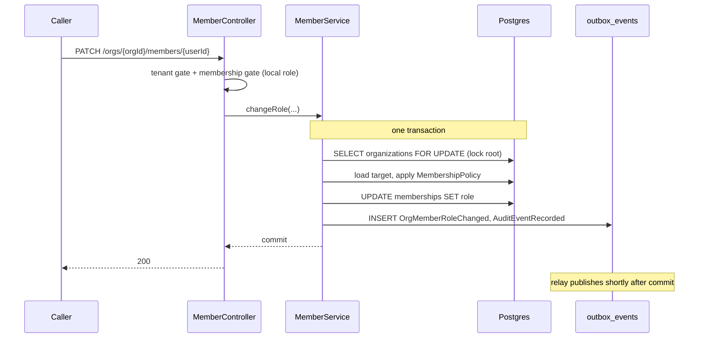
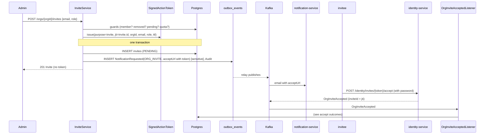
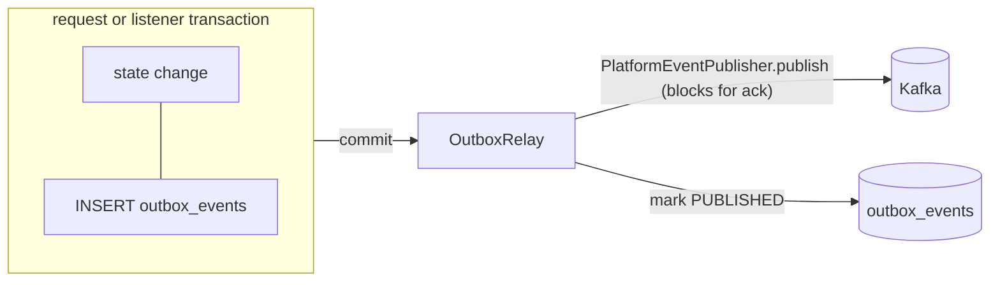
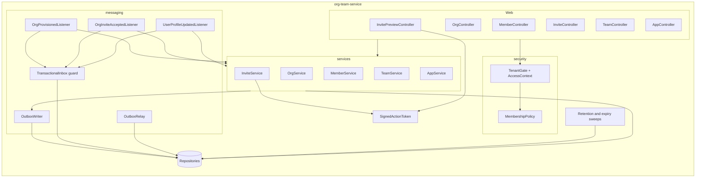

# org-team-service — Architecture

Status: accepted design, pre-implementation. Supersedes the first, proposed pass of this document.
The decisions that changed between the two passes (transactional outbox and inbox, authorization
against the local membership row instead of the token's roles, the `OrgInviteRejected`
compensation event) are recorded in
[ADR-0016](../adr/0016-org-team-service-production-design.md); read that first if you are
comparing versions.

`PROJECT.md` describes this service in one paragraph: it "owns organizations, teams, projects, and
membership, and maps Keycloak roles to what a user can actually do inside a given org. It also
stores which cloud provider and region an app is deployed to." This document is the full design.
**Read `docs/identity-service/ARCHITECTURE.md` and
[ADR-0011](../adr/0011-identity-org-team-service-boundary.md) first**: the two services share one
boundary decision (identity-service owns authentication and the only Keycloak Admin credential;
this service owns everything about organizational structure and membership) and this document
assumes it rather than re-deriving it.

## Contents

- [Purpose](#purpose)
- [Position in the system](#position-in-the-system)
- [Design goals and non-goals](#design-goals-and-non-goals)
- [Domain model](#domain-model)
- [Data model](#data-model)
- [Event contracts](#event-contracts)
- [API](#api)
- [Authorization model](#authorization-model)
- [Processing pipelines](#processing-pipelines)
- [Reliable messaging: outbox and inbox](#reliable-messaging-outbox-and-inbox)
- [Distributed systems mechanisms](#distributed-systems-mechanisms)
- [Consistency and failure modes](#consistency-and-failure-modes)
- [Security and threat model](#security-and-threat-model)
- [Observability and operations](#observability-and-operations)
- [Component view](#component-view)
- [Deployment and scaling view](#deployment-and-scaling-view)
- [Package layout and dependencies](#package-layout-and-dependencies)
- [Configuration](#configuration)
- [Extension points](#extension-points)
- [Open questions / deferred](#open-questions--deferred)
- [Relationship to existing planning docs](#relationship-to-existing-planning-docs)

## Purpose

`org-team-service` answers "what does this organization look like, and who is in it": the
organization's display data, its teams, its apps (including the cloud-provider and region choice
`PROJECT.md` calls out), and every membership beyond the founding owner (invites, roles, removals,
ownership transfer, leaving).

It holds **no Keycloak Admin credential**, by design. Every action here that needs Keycloak state
to change (a role reflected in the token, an account disabled) happens through event
choreography: this service commits a fact and publishes it, and `identity-service` reacts. That
makes the reliability of the publish path a security property, not just a convenience: a lost
`OrgMemberRemoved` leaves a removed person's account enabled. The
[outbox](#reliable-messaging-outbox-and-inbox) exists for that reason.

It is also the service every later consumer of "who is in this org" and "does this app belong to
this org" builds against (`scheduler-service` resolving an app's cloud provider,
`deploy-orchestrator-service` checking an app exists, `audit-log-service` correlating actions to
teams). None of those exist yet; the data model and event contracts are shaped so they arrive
without changing them.

## Position in the system



Three inbound listeners build this service's entire view of "which organizations and users
exist". It never queries `identity-service` for that; the no-synchronous-call rule applies in both
directions. Its own mutating API is the source of everything downstream of the founding owner.
Every state change and the events describing it are written in **one local transaction**; a relay
moves the events to Kafka afterwards.

## Design goals and non-goals

**Goals**

- **Single source of truth** for organization display data, teams, memberships, and apps. No
  other service keeps a mutable copy; the ones that keep a read projection (notification-service's
  `org_members`) do so from this service's events.
- **No state change without its event, no event without its state change.** Achieved with a
  transactional outbox, not with best-effort publishing after commit.
- **A removed or demoted member loses access to this service immediately**, not after their access
  token expires, because authorization reads the local membership row rather than the token's
  role claims ([Authorization model](#authorization-model)).
- **No synchronous call to any other Pallet service**, and no call to Keycloak at all.
- **Inviting never blocks on `identity-service`.** The token is minted locally; account creation
  happens entirely on the other side, asynchronously.
- **Invariants enforced once, centrally, and again in the database**: "an org always has exactly
  one owner", "an app's cloud provider and region never change", "a team member is a member of the
  team's org". Application checks give good error messages; database constraints make a bug
  unable to violate them.
- **Every consumer is effectively-once**: the idempotency record commits atomically with the
  effect it guards (inbox), so a crash can neither lose nor repeat an event's effect.
- **Every mutating endpoint is safe to retry**: by natural key (unique slug, unique pending invite)
  or by an explicit conflict response, never by silently double-applying.
- **Bounded everything**: page sizes, pending invites per org, teams/apps per org, outbox batch
  size, retry counts. No unbounded query or unbounded fan-out from a single request.

**Non-goals (this design)**

- Anything requiring a Keycloak Admin call. If a future requirement genuinely needs it, that is a
  boundary decision to reopen explicitly, not a dependency to add quietly.
- Multi-org-per-account (ADR-0011). A `userId` belongs to exactly one `org_id`.
- Reactivating a removed member's account, or moving an account between orgs (account recovery is
  an `identity-service` open question).
- Billing, plans, and quota tiers. This service enforces flat, config-driven safety limits;
  plan-based limits are `billing-service`'s later concern.
- Fine-grained permissions (custom roles, per-resource ACLs). Four fixed roles.
- Real-time collaboration features. CRUD plus events is enough.

## Domain model



Five aggregates, kept separate rather than nested, because each answers a different question and
has its own lifecycle and its own consistency boundary:

- **Organization**: does this tenant exist, what is it called, who owns it. It is also the **lock
  root** for every membership-affecting operation (see [Membership change](#membership-change-role-change-removal-transfer)).
- **Membership**: who is in it and at what role. The row that authorization reads and that
  `notification-service`'s broadcast projection mirrors.
- **Invite**: who has been asked but has not joined. A different lifecycle (`REVOKED`, `EXPIRED`,
  resend counters) and no `userId` yet, which is why it is not a `PENDING` membership (a nullable
  `userId` and "is this a real member" conditionals everywhere the table is queried).
- **Team**: a grouping within an org, orthogonal to role.
- **App**: the thing that eventually gets deployed.

**Roles** are totally ordered `VIEWER < DEVELOPER < ADMIN < OWNER`; "ADMIN+" means "rank at least
ADMIN". `Role` carries `keycloakName()` (`viewer`, `developer`, `admin`, `owner`), the realm-role
name. **Every event and token claim uses the lowercase Keycloak name**, because
`identity-service` passes it straight to `roles().get(name)`; the Java enum's `OWNER` never
crosses a service boundary.

**One owner, always.** `organizations.owner_user_id` and exactly one `ACTIVE` membership with
`role = OWNER` are kept equal by construction and by a partial unique index. Ownership changes only
through transfer.

## Data model

One Postgres schema, `org_team` (shared cluster, schema-per-service, ADR-0007). Flyway is the only
schema authority; Hibernate is `validate`-only.



Constraints and indexes worth calling out (the full DDL is in
[`workflows/org-team-service/02-service-scaffold.md`](../workflows/org-team-service/02-service-scaffold.md)):

- `organizations.slug` **unique across all statuses**: a deleted org's slug is never reissued, so a
  later tenant cannot inherit a name (and eventually a hostname) that belonged to someone else.
  Same DNS-1123 label rule `identity-service` sign-up validates. Never updated after insert.
- `memberships(org_id, user_id)` primary key: one row per user per org (single-org accounts).
- `memberships(org_id) WHERE role = 'OWNER' AND status = 'ACTIVE'` **unique partial**: the
  database refuses a second active owner, whatever the application does.
- `memberships(org_id, lower(email)) WHERE status = 'ACTIVE'` unique partial: an email is one
  active member per org, and backs the "already a member" invite check.
- `invites(org_id, lower(email)) WHERE status = 'PENDING'` unique partial: at most one live invite
  per email per org; the concurrent-create race resolves to a `409`, not two live tokens.
- `invites(expires_at) WHERE status = 'PENDING'`: backs the expiry sweep.
- `invites.id` **is** the token's `jti` and the `inviteId` in `OrgInviteAccepted`. One identifier,
  one meaning, no second unique column to keep in step.
- `team_members` carries **composite foreign keys**: `(org_id, team_id) → teams(org_id, id)` and
  `(org_id, user_id) → memberships(org_id, user_id)`. A team can never contain a user from another
  org, enforced by the database. (The first pass of this document called that inexpressible; it is
  not, given `teams` has a unique `(org_id, id)`.)
- `apps(org_id, team_id) → teams(org_id, id) ON DELETE SET NULL (team_id)` (Postgres 15+; the local
  stack runs 17): deleting a team detaches its apps, and an app can never point at another org's
  team.
- `apps(org_id, slug) WHERE status = 'ACTIVE'` unique partial: names are unique per org among live
  apps.
- `apps.cloud_provider` and `apps.region` are guarded by a `BEFORE UPDATE` trigger that raises if
  either changes. The API has no field for them either; the trigger is the backstop for a future
  code path that forgets.
- `outbox_events(id) WHERE status = 'PENDING'` and `(org_id, id) WHERE status <> 'PUBLISHED'`: the relay's scan and its per-org "is anything ahead of this row blocked" check.
- `processed_events(processed_at)`: backs the inbox retention sweep.
- Every tenant table has `org_id` and every repository method on one takes it as a parameter
  ([Security](#security-and-threat-model)).

**`email` and `display_name` on `memberships` are a projection**, not the source. There is no users
table here; that data lives in `identity-service`, to which this service has no synchronous
access. They arrive with `OrgProvisioned`/`OrgInviteAccepted` and are kept current by
`UserProfileUpdated`, the same local-projection pattern `notification-service`'s `org_members`
established (ADR-0008).

## Event contracts

### Consumed

Payloads are the records already in `platform-common-events`
(`OrgProvisioned`, `OrgInviteAccepted`, `UserProfileUpdated`); the topic and field lists are in
`docs/identity-service/ARCHITECTURE.md` §Event contracts.

| Event | Effect here |
|---|---|
| `OrgProvisioned` | Insert `organizations` (`ACTIVE`) and the owner's `memberships` row (`OWNER`, `ACTIVE`); emit `OrgMemberAdded`. Natural-key idempotent (`org_id` primary key) on top of the inbox. |
| `OrgInviteAccepted` | Resolve by `inviteId` (= `invites.id`). Accepted and org active: mark `ACCEPTED`, insert membership with **the invite row's role**, emit `OrgMemberAdded`. Anything else (revoked, expired, unknown, org deleted): emit `OrgInviteRejected` so `identity-service` disables the orphan account. See [the accept outcomes](#invite-acceptance). |
| `UserProfileUpdated` | Update the membership's `display_name`/`email` if the event is newer than `profile_synced_at`. If no membership exists yet, **retry** (the accept event may be lagging on a different topic), then dead-letter. |

### Published

Every event is appended to the outbox in the same transaction as its state change; nothing is ever
published inline from a request thread.

| Event | Topic | Trigger | Payload | Known consumers |
|---|---|---|---|---|
| `OrgMemberAdded` | `org.member.added` | Owner provisioned; invite accepted | `orgId, userId, email` (unchanged from what ADR-0008 assumed) | notification-service |
| `OrgMemberRemoved` | `org.member.removed` | Member removed or left | `orgId, userId, email` | identity-service (disable account), notification-service |
| `OrgMemberRoleChanged` | `org.member.role.changed` | Role change; both halves of an ownership transfer | `orgId, userId, previousRole, newRole` (lowercase Keycloak names) | identity-service |
| `OrgDeleted` | `org.deleted` | Org deleted | `orgId, deletedByUserId` | identity-service, notification-service |
| `OrgInviteRejected` | `org.invite.rejected` | Accept event for an invite that can no longer be honoured | `orgId, inviteId, userId, email, reason` (`REVOKED`\|`EXPIRED`\|`UNKNOWN_INVITE`\|`ORG_DELETED`) | identity-service (disable the account created for it) |
| `AppCreated` | `app.created` | App created | `orgId, appId, slug, teamId, cloudProvider, region, createdByUserId` | none yet (reserved) |
| `AppDeleted` | `app.deleted` | App deleted, or org deleted | `orgId, appId, slug, deletedByUserId` | none yet (reserved) |
| `NotificationRequested` | `notification.requested` | Invite created or resent (`ORG_INVITE`) | Existing contract; `variables = {orgName, inviterName, role, acceptUrl}`, `dedupeKey = "invite:{id}:{sendCount}"` | notification-service |
| `AuditEventRecorded` | `audit.event.recorded` | Every state change in the [API](#api) | Existing contract | audit-log-service (future) |

`OrgMemberAdded`, `OrgInviteRejected`, `AppCreated`, `AppDeleted` are **new** and need adding to
`platform-common-events` and its `Topics` catalog (checkpoint 01). `OrgMemberRemoved`,
`OrgMemberRoleChanged`, `OrgDeleted` already exist there.

Invites deliberately reuse `notification.requested` rather than adding an `org.invite.created`
topic: the only consumer of "someone was invited" is "send them an email", which that topic
already carries.

**Ordering.** The producer keys every record by `orgId` (`PlatformEventPublisher` does), so all
events for one org are totally ordered within a partition. The relay preserves the outbox's
insertion order per org. Ordering across topics is **not** guaranteed and no consumer may depend on
it; where a dependency exists (profile update before accept) the consumer retries instead
([Consistency](#consistency-and-failure-modes)).

**Schema evolution** (ADR-0006, plain JSON): fields are only ever added, never repurposed or
removed; consumers ignore unknown fields.

## API

Base path `/api/v1/org-team` (ADR-0010's version prefix plus ADR-0013's per-service namespace). In
the tables below, paths omit that base. Every response is `ApiResponse<T>`, lists are
`PageResponse<T>` inside it, errors are `ErrorResponse` via `GlobalExceptionHandler`. Roles in the
"Requires" column are the caller's **local membership role**
([Authorization model](#authorization-model)), never a token claim. `{orgId}` must equal the token's
`org_id` or the request is a `404`.

Conventions:

- **Pagination**: `page`, `size` (default 20, max 100), `sort=field,dir` restricted to a
  per-endpoint whitelist (`PageQuery` accepts any property; an unlisted one is a `400`, never an
  ORM error). Every list has a deterministic default sort with a unique tiebreaker.
- **PATCH** is a partial update of the listed fields only; unknown fields are rejected (`400`),
  which is what keeps `cloudProvider`/`region`/`slug`/`role` from ever being mass-assigned.
- **Concurrency**: mutations on an aggregate use optimistic locking (`version`); a lost race is
  `409 CONCURRENT_MODIFICATION` (already mapped by `PersistenceExceptionHandler`) and safe to
  retry. Membership-affecting mutations additionally serialize on the org row.
- **Retry safety**: creates conflict on their natural key with `409` rather than duplicating; the
  response names the existing resource's id where that is useful.

### Organizations

| Method | Path | Requires | Notes |
|---|---|---|---|
| `GET` | `/orgs/{orgId}` | any member | Name, slug, status, `ownerUserId`, live `COUNT` of members/teams/apps. |
| `PATCH` | `/orgs/{orgId}` | ADMIN+ | `name` only. Never `slug`, never `ownerUserId`. |
| `DELETE` | `/orgs/{orgId}` | OWNER | Requires header `X-Confirm-Slug: <slug>` and a [recent authentication](#authorization-model). Soft delete; see [org deletion](#org-deletion). `204`. |

### Members

| Method | Path | Requires | Notes |
|---|---|---|---|
| `GET` | `/orgs/{orgId}/members` | any member | `ACTIVE` only by default; `?status=REMOVED` for ADMIN+. Sort whitelist: `displayName`, `joinedAt`, `role`. Filter: `role`, `q` (prefix on email/name). |
| `GET` | `/orgs/{orgId}/members/me` | any member | The caller's own row (role included), so a dashboard needs no token-claim parsing. |
| `GET` | `/orgs/{orgId}/members/{userId}` | any member | |
| `PATCH` | `/orgs/{orgId}/members/{userId}` | OWNER | Body `{role}` ∈ `ADMIN`\|`DEVELOPER`\|`VIEWER`. Cannot target the owner or set `OWNER` (use transfer). Emits `OrgMemberRoleChanged`. No-op change is `200` with no event. |
| `DELETE` | `/orgs/{orgId}/members/{userId}` | OWNER: anyone but self. ADMIN: `DEVELOPER`/`VIEWER` only. Any member: self. | The owner cannot be removed or leave; transfer first. Emits `OrgMemberRemoved`; deletes their `team_members` rows. `204`. Removing an already-removed member is `404`. |
| `POST` | `/orgs/{orgId}/members/{userId}/transfer-ownership` | OWNER | Recent authentication required. Target must be an `ACTIVE` member. One transaction; emits two `OrgMemberRoleChanged` (target→`owner` first, then caller→`admin`). |

### Invites

| Method | Path | Requires | Notes |
|---|---|---|---|
| `POST` | `/orgs/{orgId}/invites` | ADMIN+ | Body `{email, role}`. OWNER may grant `ADMIN`/`DEVELOPER`/`VIEWER`; ADMIN only `DEVELOPER`/`VIEWER`; never `OWNER`. `201` with the `Invite` (never the token). `409` for: already an active member, previously removed, a pending invite exists, pending-invite quota reached. |
| `GET` | `/orgs/{orgId}/invites` | ADMIN+ | Filter `status`; expiry is evaluated at read time (`PENDING` with `expiresAt` in the past reads as `EXPIRED`), so correctness never depends on the sweep. |
| `POST` | `/orgs/{orgId}/invites/{inviteId}/resend` | ADMIN+ | `PENDING` only. Re-mints a token for the **same** `jti` with a fresh expiry and re-sends. Cooldown between sends and a max send count; `409`/`429` otherwise. |
| `DELETE` | `/orgs/{orgId}/invites/{inviteId}` | ADMIN+ | `PENDING` → `REVOKED`. `204`. Advisory, not absolute: see [invite acceptance](#invite-acceptance). |
| `GET` | `/invites/{token}` | **public** | Preview for the accept page. Verifies the signature and expiry **before** touching the database. Returns `{orgName, role, inviterName, maskedEmail, expiresAt}`; `400 INVALID_TOKEN` for a bad/expired token, `410 INVITE_NO_LONGER_VALID` when the row is revoked/accepted/expired. Needs a gateway `public-paths` entry. |

### Teams

| Method | Path | Requires |
|---|---|---|
| `POST` | `/orgs/{orgId}/teams` | ADMIN+ |
| `GET` | `/orgs/{orgId}/teams` | any member |
| `GET` | `/orgs/{orgId}/teams/{teamId}` | any member |
| `PATCH` | `/orgs/{orgId}/teams/{teamId}` | ADMIN+ |
| `DELETE` | `/orgs/{orgId}/teams/{teamId}` | ADMIN+ (detaches its apps; deletes its `team_members`) |
| `GET` | `/orgs/{orgId}/teams/{teamId}/members` | any member |
| `POST` | `/orgs/{orgId}/teams/{teamId}/members` | ADMIN+, body `{userId}`, must be an `ACTIVE` org member (team assignment, not invitation); already-in-team is `409` |
| `DELETE` | `/orgs/{orgId}/teams/{teamId}/members/{userId}` | ADMIN+ |

### Apps

| Method | Path | Requires | Notes |
|---|---|---|---|
| `POST` | `/orgs/{orgId}/apps` | DEVELOPER+ | `{name, slug?, cloudProvider, region, teamId?}`. `region` must be on the configured allow-list for the provider. Set once, never changed. Emits `AppCreated`. |
| `GET` | `/orgs/{orgId}/apps` | any member | Filter `teamId`, `cloudProvider`. |
| `GET` | `/orgs/{orgId}/apps/{appId}` | any member | |
| `PATCH` | `/orgs/{orgId}/apps/{appId}` | DEVELOPER+ | `name`, `teamId` only. The request DTO has no provider/region field. |
| `DELETE` | `/orgs/{orgId}/apps/{appId}` | ADMIN+ | Soft delete; emits `AppDeleted`. `204`. |

### Error catalog

All extend `AppException` and are rendered by the shared handler; none needs an `@ExceptionHandler`.

| Code | Status | When |
|---|---|---|
| `ORG_NOT_FOUND` | 404 | Path `orgId` differs from the token's, or the org is unknown/deleted. One answer for both, so existence is not leaked. |
| `NOT_A_MEMBER` | 403 | Caller's membership is missing or `REMOVED`. |
| `INSUFFICIENT_ROLE` | 403 | Caller's local role is below the endpoint's requirement. |
| `REAUTHENTICATION_REQUIRED` | 403 | Sensitive operation with a stale `auth_time`. |
| `LAST_OWNER` | 409 | An operation would leave the org without its owner. |
| `INVALID_ROLE_TRANSITION` | 409 | Targeting the owner, or setting `OWNER` outside transfer. |
| `ALREADY_A_MEMBER` / `MEMBER_PREVIOUSLY_REMOVED` / `INVITE_ALREADY_PENDING` / `QUOTA_EXCEEDED` | 409 | Invite creation guards. |
| `INVITE_NO_LONGER_VALID` | 410 | Preview of a non-pending invite. |
| `INVALID_TOKEN` | 400 | Bad signature, expired, wrong purpose. |
| `CONCURRENT_MODIFICATION` | 409 | Optimistic-lock loss. |
| `MEMBER_NOT_FOUND`, `TEAM_NOT_FOUND`, `APP_NOT_FOUND`, `INVITE_NOT_FOUND` | 404 | Scoped to the caller's org. |
| `SLUG_TAKEN` | 409 | Team or app slug already in use. |
| `INVALID_REGION` | 400 | Region not on the provider's allow-list. |

## Authorization model

Two gates on every `/orgs/{orgId}/...` request, both local and neither a network call:

1. **Tenant gate.** `OrgContext.requireOrgId()` must equal the path `orgId`. If not, `404
   ORG_NOT_FOUND`. This is what stops a caller in org A probing org B's ids (IDOR); it also means
   a valid token can never address any org but its own.
2. **Membership gate.** One primary-key read of `(org_id, user_id = token.sub)` joined to the
   org's status returns the caller's **current local role**, their membership status, and whether
   the org is live. A missing or `REMOVED` membership is `403 NOT_A_MEMBER`; a deleted org is
   `404`. The endpoint's requirement (`@PreAuthorize("@access.atLeast(#orgId, 'ADMIN')")`, backed
   by a request-scoped `AccessContext`) is then checked against **that role**.

**The token's `realm_access.roles` are not used for this service's decisions.** This reverses the
first pass of this document, which read roles from the token and accepted a staleness window of up
to the 900-second access-token lifetime. That was a poor trade *for this service specifically*:
it is the system of record for roles, so a demoted admin could keep administering, and a removed
member keep reading, for up to fifteen minutes, against data this service owns and can check for
the price of one indexed read. Reading the local row closes the window for everything served here.
Token roles remain authoritative for *other* services (which have no local row), and the
membership-sync listeners in `identity-service` are what eventually bring the token into line. A
metric (`orgteam.authz.token_role_drift`) counts requests where the token's highest role differs
from the local role, which makes propagation lag visible instead of silent.

Cost: one extra PK lookup per request against a small hot table. It is not cached; a cache would
reintroduce the staleness this exists to remove.

**Rules the endpoints enforce beyond the role floor** (centralized in `MembershipPolicy`, unit
tested as a table):

| Actor | May grant / remove | May not |
|---|---|---|
| OWNER | Invite any role except `OWNER`; change any non-owner's role; remove anyone but self | Leave, be demoted, or be removed without transferring first |
| ADMIN | Invite `DEVELOPER`/`VIEWER`; remove `DEVELOPER`/`VIEWER` | Touch another `ADMIN` or the owner; change any role |
| DEVELOPER / VIEWER | Remove themselves | Anything on members/invites |

An `ADMIN` cannot mint or remove another `ADMIN`: role assignment is an owner power, which keeps a
single compromised admin account from entrenching itself.

**Recent authentication.** `DELETE /orgs/{orgId}` and `transfer-ownership` require the token's
`auth_time` to be within `pallet.orgteam.security.recent-auth-window` (default 10 minutes), else
`403 REAUTHENTICATION_REQUIRED` and the dashboard re-prompts for a password. `auth_time` is already
mapped into tokens by the realm. A stolen, still-valid access token cannot delete the org.

**Session revocation** (ADR-0015) applies unchanged: `platform-common-security` validates every
token against the `RevokedSessionRegistry`. This service therefore depends on `spring-data-redis`,
because without it the Redis-backed registry never activates and the in-memory fallback cannot see
a revocation another instance wrote. ADR-0015 names exactly this gap.

**Public surface** is one endpoint, `GET /invites/{token}`, plus actuator probes.

## Processing pipelines

### Owner provisioning (consuming `OrgProvisioned`)



### Membership change (role change, removal, transfer)



### Invite lifecycle



### Invite acceptance

The invited person's account exists in Keycloak the moment `identity-service` accepts, before this
service hears about it. This service cannot stop that (no synchronous call, by design); it decides,
on receiving the event, whether the account is honoured or repudiated:

| State when `OrgInviteAccepted` is processed | Outcome |
|---|---|
| Invite `PENDING`, org `ACTIVE` | `ACCEPTED`; insert membership with the **invite row's** role (not the event's); emit `OrgMemberAdded`. |
| Invite `PENDING` but `expires_at` passed | Judged on the event's `occurredAt`, not processing time: accepted if `occurredAt ≤ expires_at + grace`, so consumer lag never rejects a legitimate accept. Otherwise treated as expired. |
| Invite already `ACCEPTED` | No-op (a redelivery under a different event id cannot occur; identity's `jti` replay guard prevents a second account). |
| Invite `REVOKED` / `EXPIRED` / unknown, or org `DELETED` | **Reject**: no membership; emit `OrgInviteRejected{reason}`; identity-service disables the account it just created. |
| A membership for that `userId` already exists | No-op. |

The first pass of this document dropped the rejected cases and accepted the consequence: a live
Keycloak account carrying an `org_id` and a role for an org that had refused it. That is a
tenant-isolation hole for every *other* service, which trusts the token, not this service's
tables. `OrgInviteRejected` closes it by choreography, still asynchronously. The remaining window
is the delay between the accept and the rejection being applied, bounded by outbox + consumer
latency (seconds), and this service's own API denies the account throughout (no membership row).
Revocation is therefore **bounded-advisory**: it cannot prevent the account being *created*, but it
reliably causes it to be *disabled*.

### Org deletion

One transaction, org row locked: `organizations.status = DELETED` (`deleted_at`, `deleted_by`);
every `ACTIVE` membership → `REMOVED`; every `PENDING` invite → `REVOKED`; every `team_members`
row deleted; every `ACTIVE` app → `DELETED`. Outbox: one `AppDeleted` per app (bounded by the
per-org app quota), then `OrgDeleted` last, plus audit. No per-member `OrgMemberRemoved`:
`identity-service` disables every account under the org from `OrgDeleted` alone, and fanning out N
member events would only be noise. After commit, every path under the org is `404`. A retention job
later purges the PII (see [Retention](#retention-and-purge)).

## Reliable messaging: outbox and inbox

This is the piece that turns "publish after commit" (a dual write that can lose the event) into a
guarantee.

### Outbox (publishing)



- Writers call `OutboxWriter.append(PlatformEvent)`; it serializes the record with its stable
  `eventId` into `outbox_events` **inside the caller's transaction**. If the transaction rolls
  back, the event never existed. If it commits, the event is durable.
- `OutboxRelay` is a `@Scheduled` poller (`pallet.orgteam.outbox.poll-interval`, default 250 ms).
  It holds a Postgres **session advisory lock** (`pg_try_advisory_lock`), so exactly one instance
  relays at a time and no event is reordered by two relays racing. Standby instances poll the lock
  and take over within one interval if the holder dies (the lock is released with its session).
- Each cycle reads a bounded batch (`batch-size`, default 100) in `id` order and publishes each
  row through `PlatformEventPublisher` (idempotent producer, `acks=all`, keyed by `orgId`),
  marking it `PUBLISHED` on ack.
- **Ordering.** A failed row stops **that org's** remaining rows in the batch (so a later event
  for the org is never published ahead of an earlier one) while other orgs continue: one org's
  poison row does not stall the platform. After `max-attempts` the row is `PARKED` and the org's
  later rows stay queued behind it, deliberately: publishing them would reorder that org's history.
  Parked rows raise an alert; an operator fixes and re-queues (a runbook step, checkpoint 14).
- **Delivery is at-least-once**: a crash between ack and `PUBLISHED` republishes the same
  `eventId`. Every consumer is idempotent on `eventId` ([inbox](#inbox-consuming)).
- **Sensitive payloads.** The invite's `NotificationRequested` carries a bearer capability (the raw
  token in `acceptUrl`). Rows flagged `sensitive` have `payload` nulled on publish, so the token
  lives in Postgres only for the seconds before delivery. It still transits `notification.requested`
  until that topic's retention expires; that residual risk is bounded by the token's TTL and
  single-use, and named in [Security](#security-and-threat-model).
- **Retention.** `PUBLISHED` rows are deleted after `outbox.retention` (default 7 days).
- **Debezium later.** `OutboxWriter` is the only seam writers know. Replacing the poller with a
  Debezium outbox connector (`docs/PROJECT.md`'s other option) changes the relay, not one writer.

The relay is service-local, not a `platform-common` module: no second service needs it yet
(`AGENTS.md`: no new shared module ahead of the feature that needs it). It is written to extract
cleanly when `billing-service` or another does.

### Inbox (consuming)

Listeners are `@Transactional`, and the first statement calls `TransactionalInbox.firstDelivery(consumer,
eventId)`, which inserts `(event_id, consumer)` into `processed_events` with `ON CONFLICT DO NOTHING`.
Zero rows means "already handled": acknowledge and stop. One row means proceed. The claim and every
effect commit or roll back **together**, so a crash can neither lose an event's effect (claim
without effect) nor repeat it (effect without claim). The inbox is `MANDATORY`-propagation, so
calling it outside a transaction fails loudly. This service does **not** use the messaging module's
Redis `EventIdempotencyGuard` (a build-time architecture test forbids referencing it): Redis marks
*before* the effect, so a crash between mark and commit drops the event permanently, which is
acceptable for an email and not for a membership row. `processed_events` is swept after
`inbox.retention` (default 14 days, above Kafka's retention so a redelivery always finds its claim).

Listeners run on `platform-common-messaging`'s container factory, so retry with backoff and
dead-lettering to `<topic>.DLT` are inherited, not rewritten. A non-retryable failure (a malformed
payload) goes straight to the DLT.

## Distributed systems mechanisms

| Concern | Mechanism | Where |
|---|---|---|
| Atomic state change + event | Transactional outbox, poller relay, advisory-lock single relay | Every mutation and listener |
| Effectively-once consumption | Transactional inbox (`processed_events` claimed in the effect's transaction) | The three listeners |
| At-least-once publication tolerated downstream | Stable `eventId` stored in the outbox; consumers dedupe on it | Relay, all consumers |
| Per-org ordering | Kafka key = `orgId`; relay preserves per-org insertion order and blocks an org behind its own failed row | Relay |
| Sync-free cross-service handoff | Signed HS256 token minted here, verified without a call in `identity-service` | Invites |
| Compensation without a synchronous call | `OrgInviteRejected` makes `identity-service` undo the account it created | Invite acceptance |
| Serialized membership changes | `SELECT … FOR UPDATE` on the org row (lock root) plus optimistic `version` on aggregates | Members, transfer, delete |
| Invariants twice | Application policy for messages; partial unique indexes, composite FKs, trigger for correctness | One owner, immutable provider/region, tenant-consistent team members |
| Stateless-token staleness eliminated locally | Authorization reads the local membership row | Every endpoint |
| Bounded staleness accepted elsewhere | Token roles reach other services within `accessTokenLifespan` of the sync completing | ADR-0003 |
| Multi-tenant isolation | Tenant gate + `org_id` on every row/repository method + composite FKs | All |
| Bounded work | Page cap, per-org quotas, batch sizes, retry ceilings | All |
| Time-driven state | Expiry evaluated at read time; sweep only tidies | Invites |
| Observability | One trace per request and per consumed event, the outbox hop included; RED metrics plus outbox lag | [Operations](#observability-and-operations) |

## Consistency and failure modes

Consistency model: **strongly consistent within this service** (one Postgres, one transaction per
operation); **eventually consistent with every other service**, in both directions, with the lag
bounded by outbox poll interval plus consumer-group lag (sub-second to seconds in normal
operation) and made observable rather than assumed.

| Scenario | Behavior |
|---|---|
| Postgres unavailable | Requests fail `503` via the existing persistence mapping; the relay cannot poll and consumers retry then dead-letter; nothing is acknowledged that was not committed. |
| Kafka unavailable | Requests **still succeed** (they only write the outbox); the outbox backs up, `orgteam.outbox.oldest_pending_age` climbs and alerts; the relay drains it on recovery, in order. |
| Crash after commit, before relay | The row is in the outbox; the relay publishes it after restart. Nothing lost. |
| Crash after Kafka ack, before `PUBLISHED` | Republished with the same `eventId`; consumers dedupe. |
| Relay instance dies holding the lock | Session ends, lock releases, a standby takes over within one poll interval. |
| Poison outbox row | Retried to `max-attempts`, then `PARKED`; its org's later events wait behind it; other orgs unaffected; alert on parked count > 0. |
| Consumer crash mid-handler | Transaction rolls back including the inbox claim; redelivery reprocesses. |
| Duplicate `OrgProvisioned` | Inbox claim fails, and `org_id` is a primary key. No-op. |
| `UserProfileUpdated` arrives before its membership exists | Retryable error: backoff retries (the accept event is usually seconds behind), then the DLT. `profile_synced_at` makes a late, older update a no-op. |
| A caller reads an org before `OrgProvisioned` is consumed | `404 ORG_NOT_FOUND`. The dashboard renders the post-sign-up screen from `identity-service`'s sign-up response and retries here rather than treating it as an error. |
| Newly invited member's first request before `OrgInviteAccepted` is consumed | `403 NOT_A_MEMBER` for the same brief window; the client retries. |
| Invite revoked, then accepted anyway | Account created, then disabled via `OrgInviteRejected`; this service never grants membership. |
| Two concurrent invites for one email | Partial unique index: one wins, one `409`. |
| Two concurrent role changes / a demote racing a transfer | Serialized by the org row lock; the second sees the first's result and is re-validated (`LAST_OWNER`/`INVALID_ROLE_TRANSITION` as applicable). |
| Removing the owner, demoting the owner, transferring to a non-member | Rejected before any event exists. |
| `OrgMemberRemoved` published but `identity-service` is down | Kafka retains it; the account is disabled when the consumer returns. Meanwhile this service already denies the person (local check); other services honour their token until it expires or its session is revoked. |
| Someone invited whose email already has a Pallet account elsewhere | Accept fails at `identity-service` with `409` (email uniqueness); nothing here changes. The invite stays `PENDING` until it expires or is revoked. |
| App deleted while a future deploy is running | Not handled here; `AppDeleted` exists for the consumer that will. Deletion always succeeds locally. |
| Clock skew between instances | Expiry compares database time (`now()`), not JVM time, for stored deadlines. |
| Deployment with old and new versions running | Migrations are expand/contract; a new column is nullable or defaulted first, then used, then constrained. Event changes are additive. |

## Security and threat model

| Threat | Mitigation |
|---|---|
| Caller reads/writes another org's data (IDOR) | Tenant gate (`404` when path org ≠ token org); every repository method takes `orgId`; composite FKs; an ArchUnit test fails the build on a tenant-table repository method without an `orgId` parameter. |
| Privilege escalation (admin grants themselves owner) | Role matrix in `MembershipPolicy`; `OWNER` never assignable outside transfer; ADMIN cannot touch ADMIN/OWNER; DB unique-owner index. |
| Stale token keeps working after removal/demotion | Authorization on the local row; ADR-0015 revocation for session-level kills; identity sync for other services. |
| Stolen access token used for destructive action | `auth_time` recency on org delete and ownership transfer; `X-Confirm-Slug` on delete. |
| Invite token forged | HMAC-SHA256 with a ≥32-byte key, verified before any DB read; startup fails on a weak key. |
| Invite token leaks | Never returned by the REST API; only in the outbound notification; nulled in Postgres on publish; short TTL; single-use at identity's replay guard; invite revoke → `OrgInviteRejected` compensation. Residual: the token sits in `notification.requested` until retention. |
| Invite as an email-spam vector | Per-org pending-invite quota, resend cooldown and cap, ADMIN+ only, gateway rate limit on top. |
| Enumeration via public preview | Bad tokens are indistinguishable (`INVALID_TOKEN`); a valid token is by definition held by its owner; masked email in the response. |
| Public endpoint DoS | HMAC check before any DB access; gateway per-IP rate limit; no unbounded work per request. **No service-local limiter**, by measurement: `SecurityHardeningIntegrationTest.aBurstOfForgedPreviewTokensRunsNoSql` sends a burst of forged tokens and asserts the burst prepares zero SQL statements, so an attacker can only burn CPU, which the gateway's per-IP limit already bounds. Revisit if the preview ever reads before it verifies. |
| Mass assignment | PATCH DTOs are explicit and reject unknown properties; provider/region/slug/role/owner are not on any update DTO. |
| Injection | JPA parameterized queries only; sort fields whitelisted. |
| Secrets in logs | The invite token path segment is redacted in access logs and span attributes; PII (email) logged only at DEBUG and never for the public endpoint; `sensitive` outbox payloads never logged. |
| Replay of a consumed event | Inbox. |
| Poisoned event from the bus | Payload validated (required fields, role enum, id formats) before any effect; malformed goes to the DLT, never half-applied. |
| Key compromise / rotation | Symmetric key shared with `identity-service` (ADR-0011). Rotation needs a dual-key verify window on the identity side; see [Open questions](#open-questions--deferred). TTL bounds the exposure of tokens minted under an old key. |
| CSRF | Not applicable: bearer-token API, no cookies, CSRF disabled as in every other service. |

PII held: member and invitee emails and display names. Purged on the [retention schedule](#retention-and-purge); never copied to logs or metrics labels.

## Observability and operations

**Metrics** (Micrometer → Prometheus, `orgteam.*`): `outbox.pending`, `outbox.oldest_pending_age_seconds`,
`outbox.parked`, `outbox.published`, `outbox.publish_failures`; `inbox.duplicates`; per-listener
`events.processed`/`events.dropped{reason}`/`events.failed`; `invites.{created,resent,revoked,accepted,rejected,expired}`;
`members.{added,removed,role_changed}`; `authz.denied{reason}`, `authz.token_role_drift`;
`apps.created`, `orgs.deleted`. Standard HTTP RED metrics come from `platform-common-observability`.

**Tracing**: one trace per HTTP request; one per consumed event; the relay's publish is its own
span linked to the originating request through the stored `traceparent` (stored on the outbox row
so the request → outbox → Kafka → consumer path reads as one causal chain in Jaeger).

**Logging**: structured, correlation id and `orgId`/`userId` in MDC; no bodies, no tokens.

**Alerts** (the set worth paging on):

| Alert | Condition | Meaning |
|---|---|---|
| Outbox stalled | `oldest_pending_age > 60s` warn, `> 300s` page | Events not reaching Kafka: access revocations are delayed. |
| Outbox parked | `parked > 0` | A poison event is holding an org's history; needs an operator. |
| DLT non-empty | any of the three consumer DLTs has messages | An inbound event failed all retries. |
| Consumer lag | lag > threshold for N minutes | Memberships are stale. |
| Token role drift sustained | `authz.token_role_drift` rate high | Identity sync is behind or broken. |
| Invite rejections | any `OrgInviteRejected` | Someone accepted a revoked/expired invite; investigate abuse or a UX gap. |
| 5xx rate / p99 | SLO burn | Ordinary service health. |

**SLOs** (targets, revisit with real traffic): API availability 99.9%; reads p99 < 300 ms and
writes p99 < 500 ms at the service; **event publication lag p99 < 2 s** (commit → on Kafka).

**Health**: liveness is process-only. Readiness requires Postgres and a Kafka producer metadata
check; it does **not** depend on outbox lag (a lagging outbox must alert, not restart the pod).

**Runbooks** (checkpoint 14 writes them): re-queue a parked outbox row; replay a DLT message;
verify identity has applied a removal; rotate the invite signing key.

### Retention and purge

| Data | Retention | Mechanism |
|---|---|---|
| `outbox_events` `PUBLISHED` | 7 days | sweep |
| `processed_events` | 14 days | sweep |
| Terminal invites (`ACCEPTED`/`REVOKED`/`EXPIRED`) | 90 days | sweep (email is PII) |
| `REMOVED` memberships | 365 days (kept that long so "previously removed" stays detectable) | sweep |
| Deleted org's memberships/invites/teams/apps | 30 days after `deleted_at` | purge job hard-deletes the rows, keeps the tombstone (`org_id`, `slug`, `status`, `purged_at`) so the slug stays reserved |

All windows are `pallet.orgteam.retention.*`. Sweeps are batched and idempotent, run under the same
advisory-lock discipline so multiple replicas do not duplicate work, and report their deletes as
metrics. Audit history is `audit-log-service`'s concern, not this service's tables.

## Component view



## Deployment and scaling view

One deployable, stateless HTTP plus one Kafka consumer group (`org-team-service`, three topics)
plus the relay and sweeps, all in the same process. Scale by instance count:

- **HTTP and consumers** scale horizontally. Topic partition count bounds consumer parallelism;
  the org-keyed traffic here is low-volume, so a small partition count and `concurrency` of 1–3 per
  instance is ample, and per-org ordering is preserved by the key.
- **The relay is single-active** by advisory lock. Its throughput is one instance's poll loop,
  thousands of events per second at batch 100 / 250 ms, orders of magnitude above this service's
  write rate. If that ever binds, shard the lock by `hash(org_id) % N`; ordering only needs per-org.
- **Postgres** is the shared-cluster schema `org_team` locally (ADR-0007); deployed, a managed
  instance is the expected home, an ADR-0007 follow-up. Connection pool sized to instances × threads.
- **Graceful shutdown**: stop consuming, stop the relay (release the lock), drain in-flight
  requests, then close the pool. Kubernetes `terminationGracePeriodSeconds` ≥ the longest request
  timeout plus one relay batch.
- **Replicas ≥ 2** in any real environment (the relay standby is free); rolling updates are safe
  because migrations are expand/contract and events are additive.
- **Port** `8084` locally (`8081` notification, `8082` identity, `8083` gateway).
- **Capacity sketch**: order of 10⁴–10⁵ orgs, 10⁵–10⁶ memberships, a few hundred thousand events a
  day at the outside. Every hot query is a primary-key or covered-index lookup; the largest scans
  (list members/invites) are paginated and index-backed; org counts are live `COUNT(*)` on indexed
  columns and get denormalized only if they show up as hot.

## Package layout and dependencies

```
services/org-team-service/
└── src/main/java/io/pallet/orgteam/
    ├── OrgTeamServiceApplication.java
    ├── config/        OrgTeamProperties (@ConfigurationProperties pallet.orgteam.*), Clock bean
    ├── security/      TenantGate, AccessContext, AccessEvaluator (@access), MembershipPolicy,
    │                  RecentAuthentication, SecurityConfiguration (public-paths)
    ├── org/           OrgController, OrgService, Organization, OrganizationRepository,
    │                  OrgProvisionedListener, OrgDeletionService
    ├── member/        MemberController, MemberService, Membership, MembershipRepository,
    │                  Role, UserProfileUpdatedListener
    ├── invite/        InviteController, InvitePreviewController, InviteService, Invite,
    │                  InviteRepository, OrgInviteAcceptedListener, InviteExpirySweep
    ├── team/          TeamController, TeamService, Team, TeamMember, repositories
    ├── app/           AppController, AppService, App, AppRepository, RegionCatalog
    ├── token/         SignedActionToken (issue + verify), InvalidTokenException
    ├── outbox/        OutboxWriter, OutboxEvent, OutboxRepository, OutboxRelay,
    │                  EventTypeRegistry, OutboxMetrics
    ├── inbox/         ProcessedEvent, TransactionalInbox
    └── retention/     RetentionSweeps, OrgPurgeJob
```

POM (independent project per `CONTRIBUTING.md`/`PACKAGES.md`: own wrapper, parented directly on
`spring-boot-starter-parent`, `platform-common-*` as pinned published dependencies):
`platform-common-api`, `-exception`, `-events`, `-observability`, `-messaging`, `-security`,
`-openapi`; `spring-boot-starter-webmvc`, `-validation`, `-data-jpa`, `-data-redis` (for ADR-0015),
`-actuator`; `postgresql`; `flyway-database-postgresql`; test: `platform-common-test`, Testcontainers
Postgres/Kafka/Redis, ArchUnit.
**No `platform-common-resilience`**: no external/third-party call exists here. The relay's Kafka
publish goes through `PlatformEventPublisher`, which already wraps the send. Add it the day a real
external call appears.

## Configuration

`pallet.orgteam.*`, bound by one `@ConfigurationProperties` record, served from
`config-repo/org-team-service.yml`, every secret an environment variable.

| Key | Default | Purpose |
|---|---|---|
| `pallet.invites.signing-key` | `${PALLET_INVITES_SIGNING_KEY}` | HMAC secret shared with identity-service. ≥32 bytes or startup fails. |
| `pallet.orgteam.invites.ttl` | `PT72H` | Token lifetime. |
| `pallet.orgteam.invites.max-pending-per-org` | `50` | Spam/abuse cap. |
| `pallet.orgteam.invites.resend-cooldown` / `max-sends` | `PT5M` / `4` | Resend limits. |
| `pallet.orgteam.invites.accept-grace` | `PT2M` | Clock/lag grace for expiry on accept. |
| `pallet.orgteam.invites.accept-url-template` | `${DASHBOARD_BASE_URL}/invites/{token}` | Link in the email. |
| `pallet.orgteam.limits.max-teams-per-org` / `max-apps-per-org` | `100` / `200` | Flat safety limits. |
| `pallet.orgteam.apps.regions.aws` / `.gcp` | provider lists | Region allow-lists. |
| `pallet.orgteam.security.recent-auth-window` | `PT10M` | Sensitive-operation recency. |
| `pallet.orgteam.outbox.poll-interval` / `batch-size` / `max-attempts` / `retention` | `PT0.25S` / `100` / `10` / `P7D` | Relay. |
| `pallet.orgteam.inbox.retention` | `P14D` | Inbox sweep. |
| `pallet.orgteam.retention.*` | see [Retention](#retention-and-purge) | Sweeps. |
| `spring.datasource.*`, `spring.kafka.*`, `spring.data.redis.*` | env-backed | Infrastructure. |

## Extension points

- **`app.created` / `app.deleted`** consumed by `scheduler-service` and `deploy-orchestrator-service`:
  reserved topics with no consumer yet, the same seam-before-consumer pattern as `org.member.*` was
  for this service.
- **Debezium outbox** replacing the poller: swap the relay, keep `OutboxWriter`.
- **Extracting the outbox** into a `platform-common` module when a second service needs it.
- **Row-level security** in Postgres (`SET LOCAL app.org_id` per transaction) as defense in depth
  under the application-level tenant checks, if a compliance requirement asks for it.
- **Finer-grained roles**: `Role` stops being an enum and the policy becomes a real engine; a
  significant redesign, not sketched, since nothing needs it.
- **Org settings** (billing contact, branding, notification preferences): a sibling
  `GET/PATCH /orgs/{orgId}/settings`, without touching the `Organization` aggregate.
- **Asymmetric invite signing** removing the shared secret, once a third service needs to mint or
  verify (ADR-0011).
- **Plan-based quotas**: the flat config limits become a projection of `billing-service` events.

## Open questions / deferred

- **Invite-signing key rotation.** Needs `identity-service` to verify against a current and a
  previous key during a window (`kid` header). Not built; the 72-hour TTL bounds exposure until it is.
- **Reactivating a removed member / account recovery.** A removed member's email stays bound to a
  disabled Keycloak account, so re-inviting them fails at accept. v1 rejects the re-invite up front
  (`MEMBER_PREVIOUSLY_REMOVED`). Solving it is an `identity-service` flow, not a change here.
- **Slug quarantine for deleted apps.** Deleted apps free their slug immediately. Once networking
  ties a hostname to a slug, a quarantine period may be needed to prevent takeover; decide with the
  networking design.
- **Counts on `GET /orgs/{orgId}`** are live `COUNT(*)`. Denormalize only if measured hot.
- **Whether `OrgUpdated` is worth an event** (a rename): today only audit is emitted, since no
  consumer needs it. `identity-service`'s bootstrap slug/name snapshot never changes name.
- **Outbox extraction timing** (see extension points).

## Relationship to existing planning docs

`PROJECT.md`'s paragraph and the ADRs listed at the top are the parents of this document.
[ADR-0016](../adr/0016-org-team-service-production-design.md) records the four decisions that
depart from the first draft and from the "accepted, no outbox" position `identity-service` took
in its checkpoint 12 (which still stands for that service: it has a compensating action, this one
does not). The build plan is
[`docs/workflows/org-team-service/`](../workflows/org-team-service/00-README.md), sequenced in
[`docs/workflows/ROADMAP.md`](../workflows/ROADMAP.md) Phase 2.

Two things elsewhere need to follow this document, both scheduled as checkpoint 16 rather than
left implicit:

- `notification-service` needs the `ORG_INVITE` template and its `OrgMembershipEventListener`
  (ADR-0008 reserved the seam but never built the listener; the code confirms it is absent).
- `identity-service` needs an `OrgInviteRejectedListener`, the same shape as its existing
  `OrgMemberRemovedListener`.
