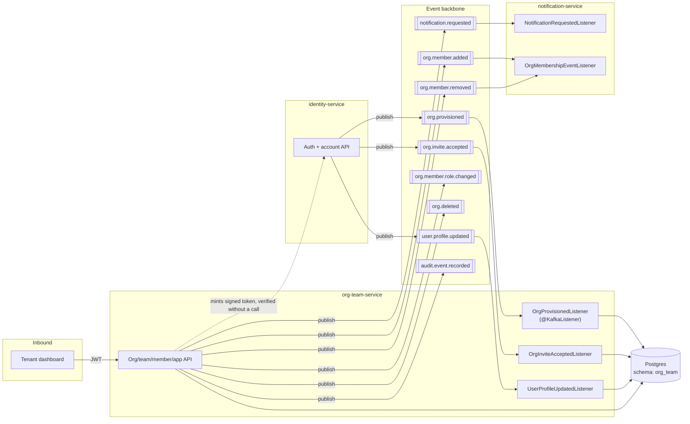
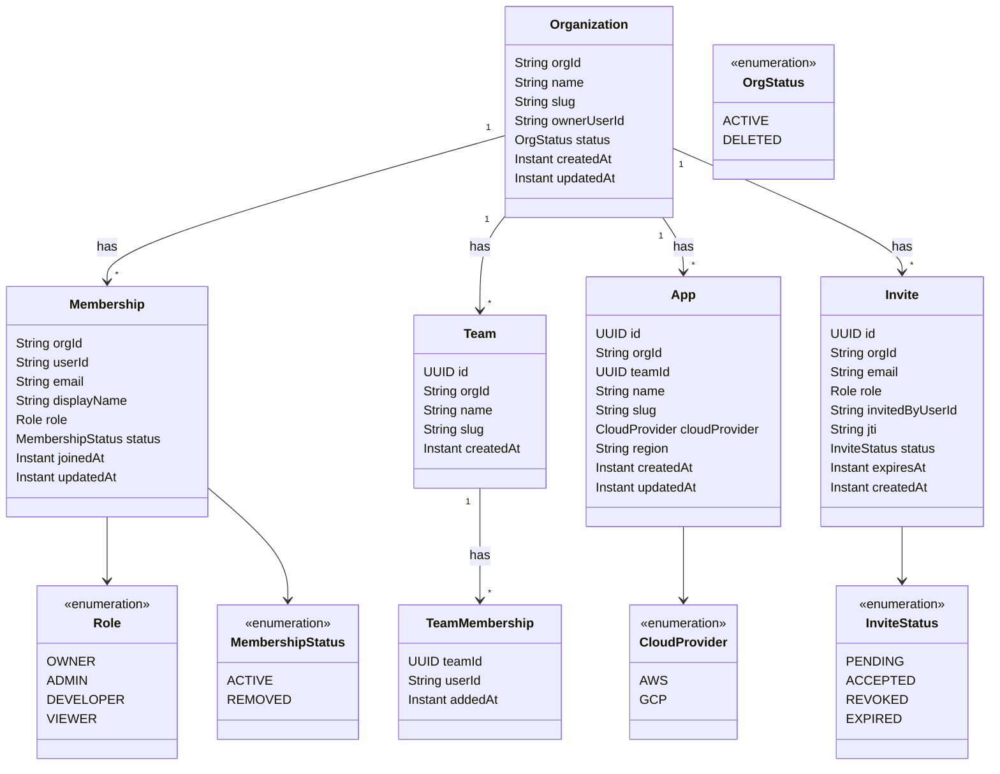
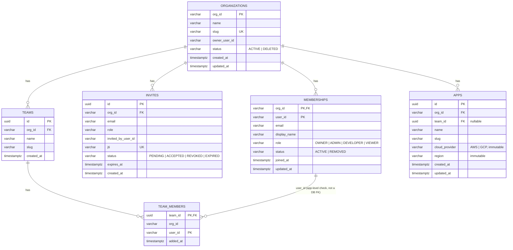
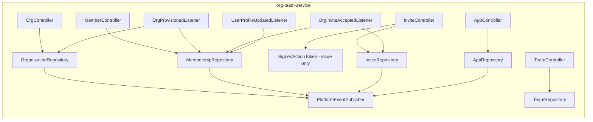

# org-team-service — Architecture

Status: proposed (pre-implementation design). Extends `PROJECT.md`'s one-paragraph sketch
("`org-team-service` owns organizations, teams, projects, and membership, and maps Keycloak roles
... to what a user can actually do inside a given org. It also stores which cloud provider and
region an app is deployed to") into a full design. **Read `docs/identity-service/ARCHITECTURE.md`
first** — the two documents share one boundary decision (identity-service owns authentication and
the only Keycloak Admin credential; this service owns everything about organizational structure
and membership) and this document assumes that split rather than re-deriving it.

## Contents

- [Purpose](#purpose)
- [Position in the system](#position-in-the-system)
- [Design goals and non-goals](#design-goals-and-non-goals)
- [Domain model](#domain-model)
- [Data model](#data-model)
- [Event contracts](#event-contracts)
- [API](#api)
- [Processing pipelines](#processing-pipelines)
- [Authorization model](#authorization-model)
- [Distributed systems mechanisms](#distributed-systems-mechanisms)
- [Failure modes](#failure-modes)
- [Component view](#component-view)
- [Deployment and scaling view](#deployment-and-scaling-view)
- [Package layout and dependencies](#package-layout-and-dependencies)
- [Extension points](#extension-points)
- [Open questions / deferred](#open-questions--deferred)
- [Relationship to existing planning docs](#relationship-to-existing-planning-docs)

## Purpose

`org-team-service` owns the answer to "what does this organization look like, and who's in it":
the organization's display name and settings, its teams, its apps (the cloud-provider/region
choice `PROJECT.md` calls out specifically), and every membership beyond the founding owner
(invites, roles, removals, ownership transfer). It has **no Keycloak Admin credential** — by
design, that access is scoped to `identity-service` alone
(`docs/identity-service/ARCHITECTURE.md`'s "The boundary problem"). Every action here that needs
Keycloak state to change (a new member's account created, a role reflected in the token, an
account disabled) happens through the same event-choreography pattern established there: publish
a fact, let identity-service react to it.

This is also the service every other future consumer of "who's in this org" and "does this app
belong to this org" is expected to build against — `scheduler-service` resolving an app's cloud
provider, `deploy-orchestrator-service` checking an app exists, `audit-log-service` correlating
actions to teams. None of those integrations are built yet; this document's job is to make sure
the data model and event contracts don't need to change shape when they arrive.

## Position in the system



Three inbound listeners build this service's entire view of "which organizations and users
exist" — it never queries `identity-service` for that, the same no-synchronous-call rule applies
symmetrically. Its own mutating API is the source of everything downstream of the founding owner:
teams, additional members, apps.

## Design goals and non-goals

**Goals**

- This service is the **single source of truth** for organization display data, teams,
  memberships beyond the founding owner, and apps — no other service duplicates a mutable copy of
  any of it.
- Every membership change that Keycloak needs to know about (a new member exists, a role changed,
  a member/org was removed) is a published fact, never a call this service makes to
  `identity-service`.
- Inviting someone never blocks on `identity-service` being reachable — an invite token is
  minted and stored locally; verification and Keycloak account creation happen entirely inside
  `identity-service`, asynchronously from this service's perspective.
- An app's cloud-provider/region choice, once set at creation, is immutable —
  `scheduler-service`'s eventual cluster resolution can trust it never moves under a running
  deployment.
- A business rule that must hold regardless of caller — "an org always has at least one owner" —
  is enforced here, once, not left to every caller to remember.

**Non-goals (this design)**

- Anything requiring a Keycloak Admin call — this service never gets that credential. If a future
  requirement genuinely needs it, that's a boundary decision to revisit explicitly, not a
  dependency to add quietly.
- Multi-org-per-account — inherited from `identity-service`'s design; a `userId` in this schema
  belongs to exactly one `org_id` for as long as that constraint holds there.
- Billing/plan enforcement (`billing-service`'s eventual concern) — this service stores an org's
  identity and structure, not its subscription state.
- Real-time collaboration features (live presence, activity feed) — plain CRUD + events is enough
  for what's asked here.

## Domain model



Five aggregates, deliberately kept separate rather than nested, because each answers a different
question and each has its own lifecycle: **Organization** (does this tenant exist, what's it
called), **Membership** (who's in it and at what role — the read-model `notification-service`'s
broadcast already depends on), **Invite** (who's been asked to join but hasn't yet — a
time-bounded, revocable, distinct lifecycle from Membership), **Team** (a grouping *within* an
org, orthogonal to role), **App** (the thing that eventually gets deployed, whose cloud/region
choice other future services key off).

**Why `Invite` isn't just a `Membership` row in a `PENDING` state**: an invite has fields
(`invitedByUserId`, `jti`, `expiresAt`) and a lifecycle (`REVOKED`, `EXPIRED`) that have no meaning
for an actual member, and — critically — an invite's `userId` doesn't exist yet (the invited
person has no account until they accept). Modeling them as the same table would mean a nullable
`userId` and a pile of "is this a real member or a pending invite" conditionals everywhere the
table is queried. Two tables, one clean handoff (`Invite` → consumed → `Membership` row created)
is simpler.

## Data model

One Postgres schema, `org_team` (shared cluster, schema-per-service, per ADR-0007).



Indexes and constraints worth calling out:

- `organizations.slug` **unique** — same DNS-1123-label constraint `identity-service`'s sign-up
  validates, since this is the row that becomes the org's long-term canonical name/slug (the
  `identity-service` bootstrap record's slug is a write-once snapshot of the same value at
  creation time; this is the one that can actually change, subject to whatever re-slugging policy
  a later `PATCH /orgs/{orgId}` decides — not designed further here).
- `memberships(org_id, user_id)` **primary key** — one row per user per org, consistent with the
  single-org-per-account constraint this whole design accepts from `identity-service`.
- `invites.jti` **unique** — this is the claim embedded in the signed token
  (`docs/identity-service/ARCHITECTURE.md`'s `SignedActionToken`); the uniqueness constraint here
  is what makes `POST /orgs/{orgId}/invites` safe to call twice for the same email without minting
  two live, independently-acceptable tokens for the same pending invite (the second call finds the
  existing `PENDING` row for that `(org_id, email)` pair and either 409s or re-issues, a decision
  left to the workflow file, not fixed here).
- `invites(org_id, email)` unique **partial** index `WHERE status = 'PENDING'` — at most one live
  invite per email per org at a time.
- `invites(expires_at) WHERE status = 'PENDING'` — backs a sweep that flips stale invites to
  `EXPIRED`, so a listing never has to compute "is this actually still valid" at read time.
- `team_members(team_id, org_id, user_id)` carries `org_id` redundantly (not just `team_id,
  user_id`) so the *application layer* can cheaply assert "this user's membership is in the same
  org as this team" before insert — enforced in code, not as a cross-table DB constraint, since a
  composite foreign key into `memberships(org_id, user_id)` from a table keyed by `(team_id,
  user_id)` isn't expressible cleanly in a single FK. Noted as an app-level invariant rather than a
  DB one deliberately, not an oversight.
- `apps(org_id, slug)` unique — app names are unique per org, not globally.
- `apps.cloud_provider` / `apps.region` are **never updated** after insert — enforced at the
  service layer (the `PATCH /apps/{appId}` handler simply doesn't accept those fields), matching
  `PROJECT.md`'s "a choice made once at app creation."

**Why `MEMBERSHIPS` denormalizes `email`/`display_name` rather than joining to a users table**:
there is no users table here — that data lives in `identity-service`, which this service has no
synchronous access to. `email`/`display_name` arrive via the `OrgProvisioned` and
`OrgInviteAccepted` events and are kept current by consuming `UserProfileUpdated` — the same
CQRS-style local-projection pattern `notification-service`'s `org_members` table already
established for exactly this reason (ADR-0008).

## Event contracts

Consumed (all specified in `docs/identity-service/ARCHITECTURE.md`'s
[Event contracts](../identity-service/ARCHITECTURE.md#event-contracts) table — repeated here from
this service's side for completeness):

| Event | Effect here |
|---|---|
| `OrgProvisioned` | Insert `organizations` row; insert `memberships` row for the owner (`role = OWNER`, `status = ACTIVE`); publish `OrgMemberAdded` from the result. |
| `OrgInviteAccepted` | Look up the `invites` row by `inviteId`; if `PENDING`, mark `ACCEPTED`, insert a `memberships` row using the invite's `role`, publish `OrgMemberAdded`. If the invite is missing or already terminal (accepted/revoked/expired), log and drop — the token's own `identity-service`-side validation already prevented a *second* account from being created for it; this side effect being unreachable is the narrow, named consequence of the no-sync-call design ([Failure modes](#failure-modes)). |
| `UserProfileUpdated` | Update the matching `memberships` row's `email`/`display_name` — keeps this service's denormalized copy from drifting. |

Published (new types, added to `platform-common-events` alongside the ones
`docs/identity-service/ARCHITECTURE.md` already specifies):

| Event | Topic | Trigger | Payload |
|---|---|---|---|
| `OrgMemberAdded` | `org.member.added` | Owner provisioned, or an invite accepted | `orgId, userId, email` — **unchanged from what `notification-service` already expects** (ADR-0008) |
| `OrgMemberRemoved` | `org.member.removed` | `DELETE /orgs/{orgId}/members/{userId}` | `orgId, userId, email` — unchanged from `notification-service`'s expectation |
| `OrgMemberRoleChanged` | `org.member.role.changed` | `PATCH /orgs/{orgId}/members/{userId}` | `orgId, userId, previousRole, newRole` |
| `OrgDeleted` | `org.deleted` | `DELETE /orgs/{orgId}` | `orgId, deletedByUserId` |

This service also publishes `NotificationRequested` directly (reusing the existing
`platform-common-events` contract, no new topic) when an invite is created — `notificationType:
ORG_INVITE` (a new template `notification-service` needs, same "flagged here, built there"
pattern as `WELCOME`), `recipient` = the invited email, `variables` = `{orgName, inviterName,
acceptUrl}`. This was deliberately chosen over a dedicated `org.invite.created` topic: the only
consumer of "someone was invited" is "send them an email," which `notification.requested` already
exists to carry — a second topic with exactly one consumer that already has a general-purpose
channel would be duplication, not a new capability.

`AuditEventRecorded` is published for every mutating action in the [API](#api) table below that
changes organizational state (member added/removed/role-changed, org renamed/deleted, team/app
created/deleted).

## API

Base path `/api/v1`. Every list endpoint returns `PageResponse<T>` wrapped in `ApiResponse<T>`.
Every endpoint requires an authenticated token; role checks are `@PreAuthorize` against the
realm-role authorities `platform-common-security`'s converter already produces (see
[Authorization model](#authorization-model)).

### Organizations

| Method | Path | Role required | Notes |
|---|---|---|---|
| `GET` | `/orgs/{orgId}` | any member | Name, slug, status, member/team/app counts. |
| `PATCH` | `/orgs/{orgId}` | `ADMIN`+ | Name and settings only — never `slug` (would break every existing invite/app URL keyed by it) and never `ownerUserId` (see ownership transfer, below). |
| `DELETE` | `/orgs/{orgId}` | `OWNER` | Soft-deletes (`status = DELETED`), cascades membership/team/app rows to a terminal state, publishes `OrgDeleted`. |

### Members

| Method | Path | Role required | Notes |
|---|---|---|---|
| `GET` | `/orgs/{orgId}/members` | any member | Paginated. |
| `GET` | `/orgs/{orgId}/members/{userId}` | any member | |
| `PATCH` | `/orgs/{orgId}/members/{userId}` | `OWNER` | Role change. Rejects (`409`) an attempt to change the sole `OWNER`'s own role away from `OWNER` — an org must always have one. Publishes `OrgMemberRoleChanged`. |
| `DELETE` | `/orgs/{orgId}/members/{userId}` | `OWNER` or `ADMIN` (never targeting the `OWNER`) | Marks `REMOVED`, publishes `OrgMemberRemoved`. |
| `POST` | `/orgs/{orgId}/members/{userId}/transfer-ownership` | `OWNER` | Atomically: caller's role becomes `ADMIN`, target's becomes `OWNER`. Two `OrgMemberRoleChanged` events, one local transaction. |

### Invites

| Method | Path | Role required | Notes |
|---|---|---|---|
| `POST` | `/orgs/{orgId}/invites` | `OWNER` or `ADMIN` | Body: `email`, `role`. Mints the signed token (`jti`, `orgId`, `email`, `role`, short TTL — days, not minutes), stores the `Invite` row, publishes `NotificationRequested` (`ORG_INVITE`). `409` if a `PENDING` invite already exists for that email. |
| `GET` | `/orgs/{orgId}/invites` | `OWNER` or `ADMIN` | Pending/expired/revoked, paginated. |
| `DELETE` | `/orgs/{orgId}/invites/{inviteId}` | `OWNER` or `ADMIN` | Marks `REVOKED`. Doesn't invalidate an already-signed token's cryptographic validity (it's stateless) — `identity-service`'s accept flow can't know it was revoked either, since that would need a sync call. The real backstop is the token's short TTL; revoke is "stop showing it as pending and stop reminding," not "guarantee it can never be accepted" — named honestly rather than oversold. |
| `GET` | `/invites/{token}` | none (public) | Decodes (doesn't need to cryptographically verify — this is a preview, not the accept action) enough of the token to show "you've been invited to join Acme as Developer" before the dashboard sends the caller to `identity-service`'s accept endpoint. |

### Teams

| Method | Path | Role required |
|---|---|---|
| `POST` | `/orgs/{orgId}/teams` | `ADMIN`+ |
| `GET` | `/orgs/{orgId}/teams` | any member |
| `GET` | `/orgs/{orgId}/teams/{teamId}` | any member |
| `PATCH` | `/orgs/{orgId}/teams/{teamId}` | `ADMIN`+ |
| `DELETE` | `/orgs/{orgId}/teams/{teamId}` | `ADMIN`+ |
| `GET` | `/orgs/{orgId}/teams/{teamId}/members` | any member |
| `POST` | `/orgs/{orgId}/teams/{teamId}/members` | `ADMIN`+ | Body: `userId` — must already be an `ACTIVE` org member; this is team assignment, not org invitation. |
| `DELETE` | `/orgs/{orgId}/teams/{teamId}/members/{userId}` | `ADMIN`+ |

### Apps

| Method | Path | Role required | Notes |
|---|---|---|---|
| `POST` | `/orgs/{orgId}/apps` | `DEVELOPER`+ | Body: `name`, `cloudProvider`, `region`, optional `teamId`. `cloudProvider`/`region` are set once, here, and never again. |
| `GET` | `/orgs/{orgId}/apps` | any member | |
| `GET` | `/orgs/{orgId}/apps/{appId}` | any member | |
| `PATCH` | `/orgs/{orgId}/apps/{appId}` | `DEVELOPER`+ | Name, team reassignment only — the handler doesn't accept `cloudProvider`/`region` fields at all, so there's no code path that could mutate them, not just a validation check that might be bypassed. |
| `DELETE` | `/orgs/{orgId}/apps/{appId}` | `ADMIN`+ | Removes the registry row; publishes `app.deleted` (a new topic, consumed by nothing yet — `deploy-orchestrator-service`/`scheduler-service` don't exist. Reserved the same way `org.member.added`/`removed` were reserved for this service before it existed — see [Extension points](#extension-points)). |

## Processing pipelines

### Owner provisioning (consuming `OrgProvisioned`)

```mermaid
sequenceDiagram
    participant K as Kafka
    participant L as OrgProvisionedListener
    participant G as EventIdempotencyGuard
    participant DB as Postgres (org_team)
    participant Pub as PlatformEventPublisher

    K->>L: OrgProvisioned
    L->>G: markProcessed(eventId)
    alt already processed
        G-->>L: false
        L-->>K: ack, no-op
    else first delivery
        G-->>L: true
        L->>DB: insert organizations; insert memberships(role=OWNER)
        L-->>Pub: AFTER_COMMIT: publish OrgMemberAdded
        L-->>K: ack
    end
```

### Invite lifecycle

```mermaid
sequenceDiagram
    participant Owner as Owner/Admin (caller)
    participant Ctl as InviteController
    participant Tok as SignedActionToken (mint)
    participant DB as Postgres (org_team)
    participant Pub as PlatformEventPublisher
    participant K as Kafka
    participant L as OrgInviteAcceptedListener

    Owner->>Ctl: POST /orgs/{orgId}/invites
    Ctl->>Tok: issue("invite", claims, ttl, sharedSecret)
    Tok-->>Ctl: signed token
    Ctl->>DB: insert invites(PENDING, jti)
    Ctl-->>Pub: AFTER_COMMIT: publish NotificationRequested(ORG_INVITE)
    Ctl-->>Owner: 201 (invite id — not the raw token; the token only ever leaves this service inside the notification email identity-service's WELCOME-style flow doesn't need to see)

    Note over Owner,L: ... time passes, invitee clicks the emailed link, calls identity-service's accept endpoint ...

    K->>L: OrgInviteAccepted
    L->>DB: find invites by inviteId; mark ACCEPTED; insert memberships
    L-->>Pub: AFTER_COMMIT: publish OrgMemberAdded
```

**Where the raw token lives**: minted here, embedded in the accept URL that goes out via
`notification.requested`'s `variables.acceptUrl`, rendered by `notification-service`'s template —
this service never hands the raw token back over its own REST API (`201`'s body carries the
`Invite`'s id for listing/revocation purposes, not the secret). The only two places the raw,
unsigned-for-transport token value exists are this service's outbound event payload and
`identity-service`'s accept-endpoint input.

## Authorization model

Every endpoint's role check reads directly off the token's `realm_access.roles` — the composite
chain `docs/workflows/identity-service/01-keycloak-realm.md` already establishes (`owner ⊇ admin ⊇
developer ⊇ viewer`) via `hasAnyRole(...)`/`hasRole(...)` checks, exactly the mechanism
`platform-common-security`'s `PalletResourceServerAutoConfiguration` was built for. **This service
makes no separate authorization call to anywhere** — the roles are already in the token by the
time a request reaches here, which is the entire point of ADR-0003 putting them there. Role
*changes* (this service's own `PATCH /members/{userId}`) take effect the next time the affected
user gets a fresh token (login or refresh) — there is a real, bounded staleness window where a
just-demoted user's *existing* access token still carries the old role until it expires
(`accessTokenLifespan`, 900s per the realm config) or they refresh. This is a standard, accepted
tradeoff of stateless JWT authorization (the alternative — a token-revocation list checked on
every request — reintroduces exactly the per-request synchronous dependency the whole platform is
built to avoid) and is named here rather than silently assumed fixed.

## Distributed systems mechanisms

| Concern | Mechanism | Where |
|---|---|---|
| Cross-service handoff with no synchronous call | Mint a signed token here, verified without a call in `identity-service` | Invites |
| At-least-once → effectively-once (consumer side) | `EventIdempotencyGuard` on every listener | `OrgProvisioned`/`OrgInviteAccepted`/`UserProfileUpdated` listeners |
| Eventually-consistent local read-model for cross-service data | `memberships.email`/`display_name` sourced from consumed events, never queried live from `identity-service` | Same pattern `notification-service`'s `org_members` already uses |
| Publish-after-commit | `@TransactionalEventListener(AFTER_COMMIT)` | Every mutating endpoint and listener that also publishes |
| One invariant enforced centrally rather than per-caller | "An org always has ≥1 owner" checked in the role-change and removal handlers, not left to the caller | `PATCH`/`DELETE /members/{userId}` |
| Immutability where a downstream system needs to trust a value never moves | `cloudProvider`/`region` accepted only at creation; the update handler's DTO doesn't have the fields | Apps |
| Stateless authorization, bounded staleness accepted explicitly | Role checks read the token only, never a live lookup; staleness bounded by `accessTokenLifespan` | [Authorization model](#authorization-model) |
| Tracing | One trace per HTTP request; one per consumed event | `platform-common-observability` |
| Multi-tenancy isolation | `org_id` on every row; every path is `/orgs/{orgId}/...`, checked against the token's own `org_id` claim, never trusted from the path alone | `platform-common-security`'s `OrgContext` |
| Consistency model | Eventual with `identity-service` in both directions: an owner's `OrgProvisioned` fact may lag their sign-up response; a revoked invite may still be acceptable until its token's TTL lapses | Named in [Failure modes](#failure-modes), not hidden |

## Failure modes

| Scenario | Behavior |
|---|---|
| `OrgProvisioned` arrives before this service has ever seen the org (normal case, always true on org creation) | Handled — this is simply the first event, not a special case; the listener inserts fresh rows. |
| A caller hits `GET /orgs/{orgId}` before `OrgProvisioned` has been consumed | `404` — the dashboard's post-sign-up screen should render from `identity-service`'s own inline sign-up response instead, per that document's Failure modes entry, and poll or retry here rather than treat this as a hard error. |
| `OrgInviteAccepted` arrives for an invite that was already `REVOKED` before acceptance | Logged and dropped — a real account now exists in `identity-service` with no corresponding membership here. Same narrow, named consequence as identity-service's "org deleted between invite and accept" case; both stem from the same design tradeoff and are two faces of one accepted risk, not two separate bugs. |
| Attempt to demote or remove the sole `OWNER` | `409 CONFLICT` — checked here, before any event is published, so Keycloak's role assignment is never asked to do something that would leave the org without an owner. |
| `DELETE /orgs/{orgId}` by a non-owner | `403` — enforced by `@PreAuthorize`. |
| Two concurrent `POST /orgs/{orgId}/invites` for the same email | The second hits the partial unique index (`(org_id, email) WHERE status = 'PENDING'`) and returns `409` rather than silently minting a second live token for the same invite. |
| An app's `DELETE` is called while `deploy-orchestrator-service` (future) has running deployments for it | Not handled here — this service only owns the registry row. The `app.deleted` event exists precisely so a future consumer can refuse or clean up; until one exists, deletion always succeeds at this service's own level, which is the correct, honest behavior for "the seam is real, the upstream consumer isn't built yet" — same framing `notification-service`'s `ORG` broadcast used for `org-team-service` itself before this document existed. |
| Token TTL vs. revoke race: an invite is revoked one second before the invitee's accept call lands | Accept still succeeds (the token is still cryptographically valid and unexpired) — [Authorization model](#authorization-model)'s note on stateless verification's bounded imprecision applies here too. Mitigated by keeping invite TTLs short, not eliminated. |

## Component view



## Deployment and scaling view

Stateless HTTP + one Kafka consumer group (`org-team-service`, three topics). Same shape as
`identity-service` and `notification-service`: one deployable, scaled by instance count, no
partition-count pressure at this event volume (org/membership changes are orders of magnitude
rarer than notification delivery).

## Package layout and dependencies

```
services/org-team-service/
└── src/main/java/io/pallet/orgteam/
    ├── OrgTeamServiceApplication.java
    ├── org/                OrgController, Organization (entity), OrganizationRepository, OrgProvisionedListener
    ├── member/              MemberController, Membership (entity), MembershipRepository, UserProfileUpdatedListener
    ├── invite/               InviteController, Invite (entity), InviteRepository, OrgInviteAcceptedListener
    ├── team/                 TeamController, Team, TeamMembership, TeamRepository
    ├── app/                  AppController, App (entity), AppRepository
    └── token/                 SignedActionToken (issue-only usage here — verify lives in identity-service)
```

POM additions beyond the reactor-independent parent: `platform-common-api`, `-exception`,
`-events`, `-observability`, `-messaging`, `-security`; `spring-boot-starter-webmvc` +
`-validation`; `spring-boot-starter-data-jpa` + `postgresql` + `flyway-database-postgresql`.
**No `platform-common-resilience`** — this service makes no external/third-party calls in this
design (its only "external" relationship, the signed-token handoff, needs no network call at
all); add it the day a real external call shows up (a cloud provider API, eventually), not before.

## Extension points

- **`app.deleted` / `app.created` consumed by `deploy-orchestrator-service` and
  `scheduler-service`**: reserved topics, no consumer yet — same seam-before-producer pattern this
  whole design already uses twice (invites needing identity-service, broadcast needing this
  service from notification-service's side).
- **Role beyond the fixed four**: if a finer-grained permission model is ever needed (custom
  per-team roles, resource-level ACLs), `Role` stops being an enum and this service's
  authorization model grows a real policy engine — a significant redesign, not sketched further
  here since nothing today needs it.
- **Org settings as a real resource** (billing contact, notification preferences, branding): folded
  into `PATCH /orgs/{orgId}` today as a settings blob; if it grows complex enough to need its own
  validation/versioning, it becomes a sibling `GET/PATCH /orgs/{orgId}/settings` endpoint without
  touching the `Organization` aggregate itself.
- **Asymmetric invite-token signing**, removing the shared-secret coupling with `identity-service`
  — see that document's own Open questions; this service would switch `SignedActionToken.issue` to
  a private-key sign with no other change to this design.

## Open questions / deferred

- **Invite token revocation is advisory, not absolute** — named plainly in [Invites](#invites) and
  [Failure modes](#failure-modes). Closing this gap for real means either a short-lived token plus
  a fast-expiring cache identity-service checks (reintroducing a shared-state dependency between
  the two services) or accepting the current tradeoff permanently. Worth revisiting only if a real
  incident (a revoked invite still being accepted) actually happens.
- **`invites` growing unboundedly with `EXPIRED`/`REVOKED` rows** — no retention policy specified
  here, unlike `notification-service`'s deliberate "retain everything" decision for its own data;
  this table is operational bookkeeping, not a tenant's record, so a TTL/cleanup job is more
  clearly appropriate here than it was there — sized and built when it's actually needed, not now.
- **Whether `GET /orgs/{orgId}` should expose member/team/app *counts* computed live (a query) or
  maintained as denormalized counters** — a performance decision that depends on real usage
  patterns this design can't predict yet; start with a live `COUNT(*)` query, revisit if it shows
  up as a hot path.

## Relationship to existing planning docs

`PROJECT.md`'s sketch and `docs/workflows/ROADMAP.md` (which doesn't yet have an org-team-service
table at all — Phase 1d's table covers only Keycloak and `identity-service`; `org-team-service`
opens Phase 2) describe this service in one paragraph with no detail on the identity-service
boundary, the invite mechanism, or the event contracts above. This document — together with
`docs/identity-service/ARCHITECTURE.md` — is the first real design pass and should get a shared
ADR before either service's workflow files are written, covering the same three points that
document's own closing section names (the AuthN/AuthZ split, signed action tokens, single-org-per-
account) plus this service's own additions:

- `platform-common-events` needs `OrgMemberRoleChanged` and `OrgDeleted` added to `Topics`
  (`OrgMemberAdded`/`OrgMemberRemoved` were already conceptually reserved by ADR-0008; this
  document is what finally defines their exact payload, confirmed unchanged from what
  `notification-service` already assumes).
- `notification-service` needs a new `ORG_INVITE` template — flagged the same way `WELCOME`
  already exists and `PASSWORD_RESET`/`EMAIL_VERIFICATION` are flagged in
  `docs/identity-service/ARCHITECTURE.md`.
- `docs/workflows/ROADMAP.md` needs an actual Phase-2 (or pulled-forward Phase-1d) table for this
  service once workflow files are written, the same way ADR-0008 required updating Phase 1c's
  table for notification-service's expanded scope.
